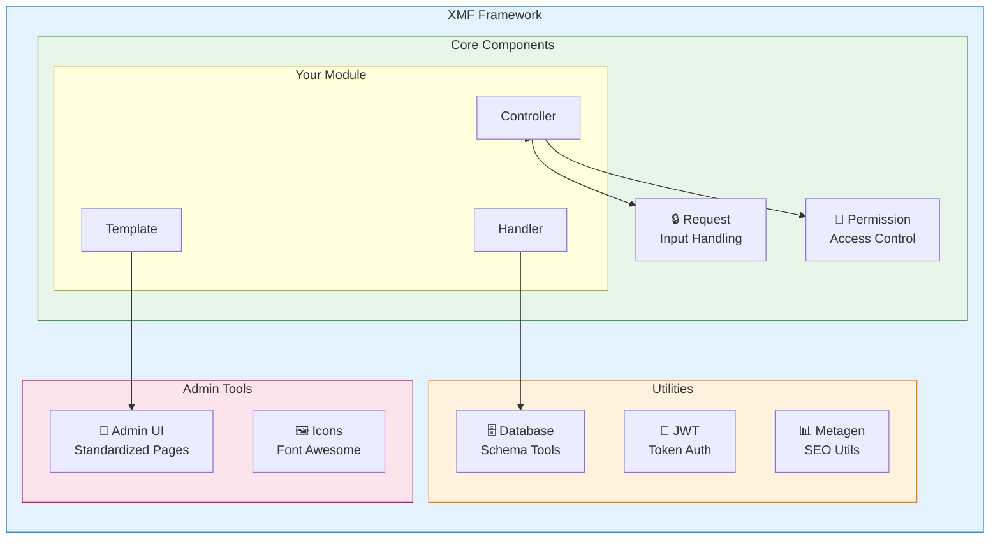
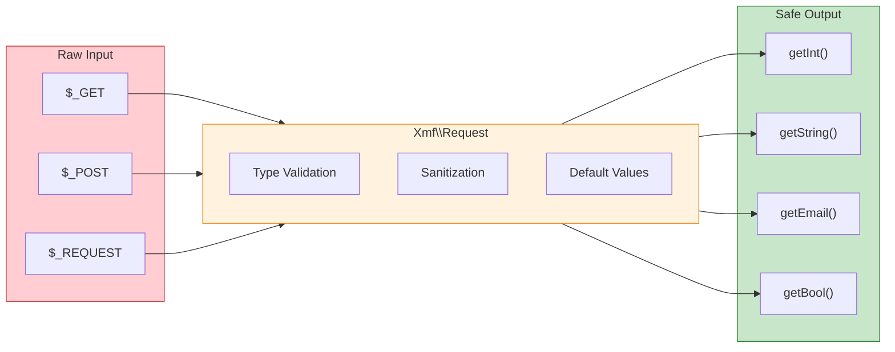

<span class="version-badge version-25x">2.5.x ✅</span> <span class="version-badge version-40x">4.0.x ✅</span>

:::tip[Die Brücke zu modernem XOOPS]
XMF funktioniert in **sowohl XOOPS 2.5.x als auch XOOPS 4.0.x**. Es ist die empfohlene Methode, um Ihre Module heute zu modernisieren und sich auf XOOPS 4.0 vorzubereiten. XMF bietet PSR-4-Autoloading, Namespaces und Helfer, die den Übergang erleichtern.
:::

Das **XOOPS Module Framework (XMF)** ist eine leistungsstarke Bibliothek, die entwickelt wurde, um die XOOPS-Modulentwicklung zu vereinfachen und zu standardisieren. XMF bietet moderne PHP-Praktiken, einschließlich Namespaces, Autoloading und umfassend Helfer-Klassen, die Boilerplate-Code reduzieren und die Wartbarkeit verbessern.

## Was ist XMF?

XMF ist eine Sammlung von Klassen und Dienstprogrammen, die Folgendes bereitstellen:

- **Moderne PHP-Unterstützung** - Volle Namespace-Unterstützung mit PSR-4-Autoloading
- **Request-Verarbeitung** - Sichere Input-Validierung und Bereinigung
- **Modul-Helfer** - Vereinfachter Zugriff auf Modulkonfigurationen und Objekte
- **Berechtigungssystem** - Benutzerfreundliche Berechtigungsverwaltung
- **Datenbankdienstprogramme** - Schema-Migrations- und Tabellenverwaltungstools
- **JWT-Unterstützung** - JSON Web Token-Implementierung für sichere Authentifizierung
- **Metadaten-Generierung** - SEO- und Content-Extraktionsdienstprogramme
- **Admin-Schnittstelle** - Standardisierte Modul-Admin-Seiten

### XMF Component Overview



## Wichtigste Funktionen

### Namespaces und Autoloading

Alle XMF-Klassen befinden sich im `Xmf`-Namespace. Klassen werden automatisch geladen, wenn sie referenziert werden - keine manuellen Includes erforderlich.

```php
use Xmf\Request;
use Xmf\Module\Helper;

// Classes load automatically when used
$input = Request::getString('input', '');
$helper = Helper::getHelper('mymodule');
```

### Sichere Request-Verarbeitung

Die [Request-Klasse](../05-XMF-Framework/Basics/XMF-Request.md) bietet typensicheren Zugriff auf HTTP-Request-Daten mit integrierter Bereinigung:



```php
use Xmf\Request;

$id = Request::getInt('id', 0);
$name = Request::getString('name', '');
$email = Request::getEmail('email', '');
```

### Modul-Helper-System

Der [Modul-Helper](../05-XMF-Framework/Basics/XMF-Module-Helper.md) bietet praktischen Zugriff auf modulbezogene Funktionalität:

```php
$helper = \Xmf\Module\Helper::getHelper('mymodule');

// Access module configuration
$configValue = $helper->getConfig('setting_name', 'default');

// Get module object
$module = $helper->getModule();

// Access handlers
$handler = $helper->getHandler('items');
```

### Berechtigungsverwaltung

Der [Permission-Helper](../05-XMF-Framework/Recipes/Permission-Helper.md) vereinfacht die XOOPS-Berechtigungsverwaltung:

```php
$permHelper = new \Xmf\Module\Helper\Permission();

// Check user permission
if ($permHelper->checkPermission('view', $itemId)) {
    // User has permission
}
```

## Dokumentationsstruktur

### Grundlagen

- [Erste Schritte mit XMF](../05-XMF-Framework/Basics/Getting-Started-with-XMF.md) - Installation und grundlegende Verwendung
- [XMF-Request](../05-XMF-Framework/Basics/XMF-Request.md) - Request-Verarbeitung und Input-Validierung
- [XMF-Module-Helper](../05-XMF-Framework/Basics/XMF-Module-Helper.md) - Verwendung der Modul-Helper-Klasse

### Rezepte

- [Permission-Helper](../05-XMF-Framework/Recipes/Permission-Helper.md) - Arbeiten mit Berechtigungen
- [Module-Admin-Pages](../05-XMF-Framework/Recipes/Module-Admin-Pages.md) - Erstellung standardisierter Admin-Schnittstellen

### Referenz

- [JWT](../05-XMF-Framework/Reference/JWT.md) - JSON Web Token-Implementierung
- [Database](../05-XMF-Framework/Reference/Database.md) - Datenbank-Dienstprogramme und Schema-Verwaltung
- [Metagen](Reference/Metagen.md) - Metadaten- und SEO-Dienstprogramme

## Anforderungen

- XOOPS 2.5.8 oder später
- PHP 7.2 oder später (PHP 8.x empfohlen)

## Installation

XMF ist in XOOPS 2.5.8 und späteren Versionen enthalten. Für frühere Versionen oder manuelle Installation:

1. Laden Sie das XMF-Paket aus dem XOOPS-Repository herunter
2. Extrahieren Sie es in Ihr XOOPS-Verzeichnis `/class/xmf/`
3. Der Autoloader kümmert sich um das Laden der Klassen automatisch

## Quick Start Beispiel

Here is a complete example showing common XMF usage patterns:

```php
<?php
use Xmf\Request;
use Xmf\Module\Helper;
use Xmf\Module\Helper\Permission;

// Get module helper
$helper = Helper::getHelper('mymodule');

// Get configuration values
$itemsPerPage = $helper->getConfig('items_per_page', 10);

// Handle request input
$op = Request::getCmd('op', 'list');
$id = Request::getInt('id', 0);

// Check permissions
$permHelper = new Permission();
if (!$permHelper->checkPermission('view', $id)) {
    redirect_header('index.php', 3, 'Access denied');
}

// Process based on operation
switch ($op) {
    case 'view':
        $handler = $helper->getHandler('items');
        $item = $handler->get($id);
        // ... display item
        break;
    case 'list':
    default:
        // ... list items
        break;
}
```

## Ressourcen

- [XMF GitHub-Repository](https://github.com/XOOPS/XMF)
- [XOOPS-Projektwebseite](https://xoops.org)

---

#xmf #xoops #framework #php #module-development
