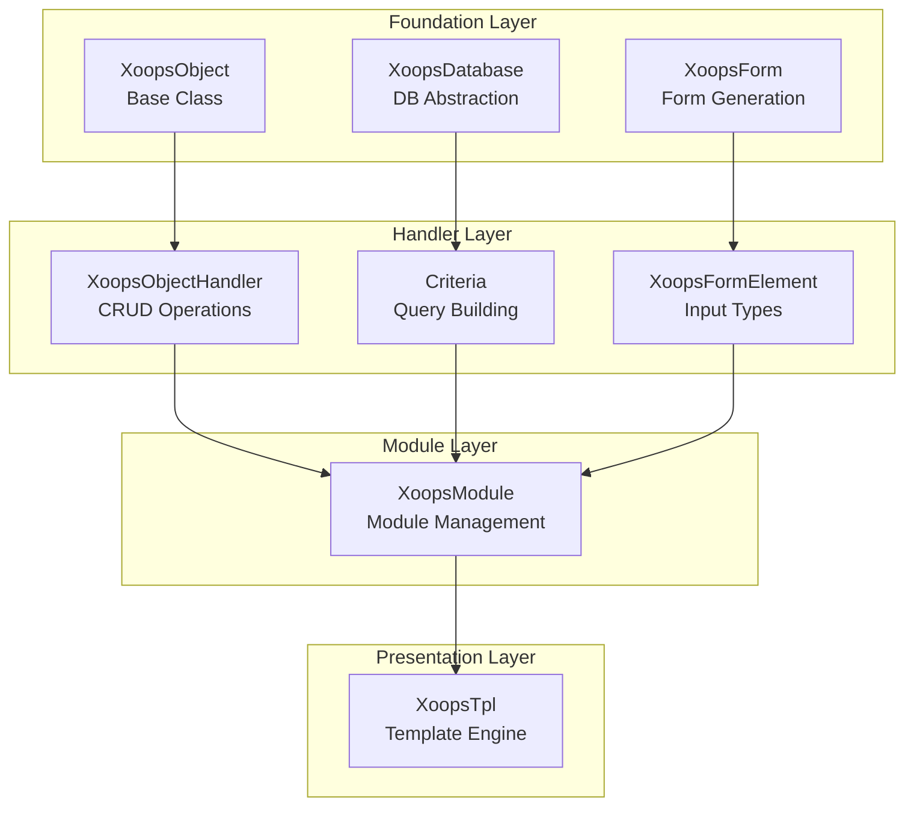
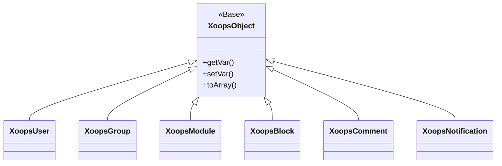
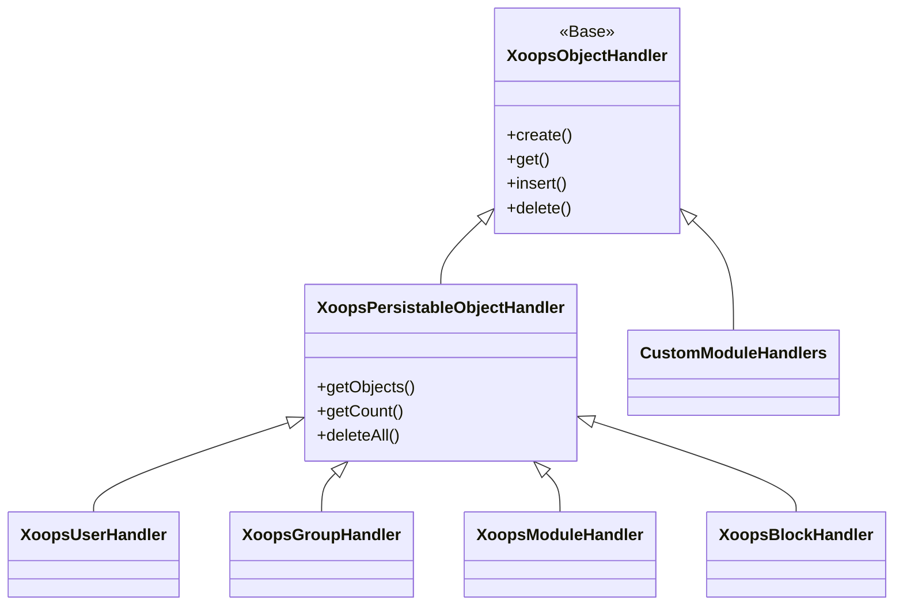
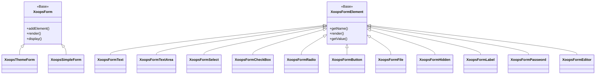

Velkommen til den omfattende XOOPS API referencedokumentation. Dette afsnit indeholder detaljeret dokumentation for alle kerneklasser, metoder og systemer, der udgør XOOPS Content Management System.

## Oversigt

XOOPS API er organiseret i flere store undersystemer, der hver især er ansvarlige for et specifikt aspekt af CMS-funktionaliteten. Det er vigtigt at forstå disse API'er for at udvikle moduler, temaer og udvidelser til XOOPS.

## API sektioner

### Kerneklasser

Fundamentklasserne, som alle andre XOOPS-komponenter bygger på.

| Dokumentation | Beskrivelse |
|-------------|-------------|
| XoopsObject | Basisklasse for alle dataobjekter i XOOPS |
| XoopsObjectHandler | Håndtermønster for CRUD-operationer |

### Databaselag

Databaseabstraktion og forespørgselsbygningsværktøjer.

| Dokumentation | Beskrivelse |
|-------------|-------------|
| XoopsDatabase | Databaseabstraktionslag |
| Kriteriesystem | Forespørgselskriterier og -betingelser |
| QueryBuilder | Moderne flydende forespørgsel bygning |

### Formularsystem

HTML formulargenerering og validering.

| Dokumentation | Beskrivelse |
|-------------|-------------|
| XoopsForm | Formbeholder og gengivelse |
| Formelementer | Alle tilgængelige formularelementtyper |

### Kernelklasser

Kernesystemkomponenter og -tjenester.

| Dokumentation | Beskrivelse |
|-------------|-------------|
| Kernelklasser | Systemkerne og kernekomponenter |

### Modulsystem

Modulstyring og livscyklus.

| Dokumentation | Beskrivelse |
|-------------|-------------|
| Modulsystem | Modulindlæsning, installation og styring |

### Skabelonsystem

Smart skabelonintegration.

| Dokumentation | Beskrivelse |
|-------------|-------------|
| Skabelonsystem | Smart integration og skabelonstyring |

### Brugersystem

Brugerstyring og autentificering.

| Dokumentation | Beskrivelse |
|-------------|-------------|
| Brugersystem | Brugerkonti, grupper og tilladelser |

## Arkitekturoversigt



## Klassehierarki

### Objektmodel



### Håndtermodel



### Formmodel



## Designmønstre

XOOPS API implementerer flere velkendte designmønstre:

### Singleton mønster
Bruges til globale tjenester som databaseforbindelser og containerforekomster.

```php
$db = XoopsDatabase::getInstance();
$container = XoopsContainer::getInstance();
```

### Fabriksmønster
Objektbehandlere opretter domæneobjekter konsekvent.

```php
$handler = xoops_getHandler('user');
$user = $handler->create();
```

### sammensat mønster
Formularer indeholder flere formularelementer; kriterier kan indeholde indlejrede kriterier.

```php
$criteria = new CriteriaCompo();
$criteria->add(new Criteria('status', 1));
$criteria->add(new CriteriaCompo(...)); // Nested
```

### Observer-mønster
Eventsystemet tillader løs kobling mellem moduler.

```php
$dispatcher->addListener('module.news.article_published', $callback);
```

## Eksempler på hurtig start

### Oprettelse og lagring af et objekt

```php
// Get the handler
$handler = xoops_getHandler('user');

// Create a new object
$user = $handler->create();
$user->setVar('uname', 'newuser');
$user->setVar('email', 'user@example.com');

// Save to database
$handler->insert($user);
```

### Forespørgsel med kriterier

```php
// Build criteria
$criteria = new CriteriaCompo();
$criteria->add(new Criteria('level', 0, '>'));
$criteria->setSort('uname');
$criteria->setOrder('ASC');
$criteria->setLimit(10);

// Get objects
$handler = xoops_getHandler('user');
$users = $handler->getObjects($criteria);
```

### Oprettelse af en formular

```php
$form = new XoopsThemeForm('User Profile', 'userform', 'save.php', 'post', true);
$form->addElement(new XoopsFormText('Username', 'uname', 50, 255, $user->getVar('uname')));
$form->addElement(new XoopsFormTextArea('Bio', 'bio', $user->getVar('bio')));
$form->addElement(new XoopsFormButton('', 'submit', _SUBMIT, 'submit'));
echo $form->render();
```

## API Konventioner

### Navnekonventioner

| Skriv | Konvention | Eksempel |
|------|--------|--------|
| Klasser | PascalCase | `XoopsUser`, `CriteriaCompo` |
| Metoder | camelCase | `getVar()`, `setVar()` |
| Ejendomme | camelCase (beskyttet) | `$_vars`, `$_handler` |
| Konstanter | UPPER_SNAKE_CASE | `XOBJ_DTYPE_INT` |
| Databasetabeller | slangekasse | `users`, `groups_users_link` |

### Datatyper

XOOPS definerer standarddatatyper for objektvariable:| Konstant | Skriv | Beskrivelse |
|--------|------|------------|
| `XOBJ_DTYPE_TXTBOX` | String | Tekstinput (saneret) |
| `XOBJ_DTYPE_TXTAREA` | String | Tekstområdeindhold |
| `XOBJ_DTYPE_INT` | Heltal | Numeriske værdier |
| `XOBJ_DTYPE_URL` | String | URL validering |
| `XOBJ_DTYPE_EMAIL` | String | E-mail validering |
| `XOBJ_DTYPE_ARRAY` | Array | Serialiserede arrays |
| `XOBJ_DTYPE_OTHER` | Blandet | Brugerdefineret håndtering |
| `XOBJ_DTYPE_SOURCE` | String | Kildekode (minimal desinficering) |
| `XOBJ_DTYPE_STIME` | Heltal | Kort tidsstempel |
| `XOBJ_DTYPE_MTIME` | Heltal | Mellem tidsstempel |
| `XOBJ_DTYPE_LTIME` | Heltal | Langt tidsstempel |

## Godkendelsesmetoder

API understøtter flere godkendelsesmetoder:

### API nøglegodkendelse
```
X-API-Key: your-api-key
```

### OAuth-bærer-token
```
Authorization: Bearer your-oauth-token
```

### Sessionsbaseret godkendelse
Bruger eksisterende XOOPS-session, når du er logget ind.

## REST API Slutpunkter

Når REST API er aktiveret:

| Slutpunkt | Metode | Beskrivelse |
|--------|--------|------------|
| `/api.php/rest/users` | GET | Liste over brugere |
| `/api.php/rest/users/{id}` | GET | Hent bruger efter ID |
| `/api.php/rest/users` | POST | Opret bruger |
| `/api.php/rest/users/{id}` | PUT | Opdater bruger |
| `/api.php/rest/users/{id}` | DELETE | Slet bruger |
| `/api.php/rest/modules` | GET | Liste over moduler |

## Relateret dokumentation

- Moduludviklingsvejledning
- Guide til temaudvikling
- Systemkonfiguration
- Bedste praksis for sikkerhed

## Versionshistorik

| Version | Ændringer |
|--------|--------|
| 2.5.11 | Aktuel stabil udgivelse |
| 2.5.10 | Tilføjet GraphQL API support |
| 2.5.9 | Forbedret kriteriesystem |
| 2.5.8 | PSR-4 autoloading support |

---

*Denne dokumentation er en del af XOOPS Knowledge Base. Besøg [XOOPS GitHub-lageret](https://github.com/XOOPS) for at få de seneste opdateringer.*
