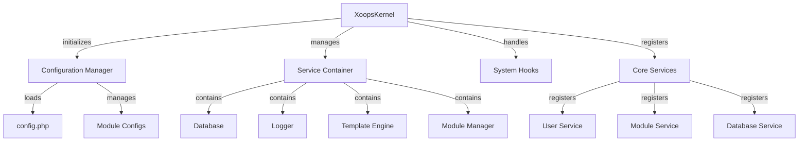

XOOPS-kernen giver den grundlæggende ramme for bootstrapping af systemet, styring af konfigurationer, håndtering af systemhændelser og levering af kerneværktøjer. Disse klasser udgør rygraden i XOOPS-applikationen.

## Systemarkitektur



## XoopsKernel klasse

Hovedkerneklassen, der initialiserer og administrerer XOOPS-systemet.

### Klasseoversigt

```php
namespace Xoops;

class XoopsKernel
{
    private static ?XoopsKernel $instance = null;
    protected ServiceContainer $services;
    protected ConfigurationManager $config;
    protected array $modules = [];
    protected bool $isLoaded = false;
}
```

### Konstruktør

```php
private function __construct()
```

Privat konstruktør håndhæver singleton-mønster.

### getInstance

Henter singleton-kerneinstansen.

```php
public static function getInstance(): XoopsKernel
```

**Returnerer:** `XoopsKernel` - Singleton-kerneinstansen

**Eksempel:**
```php
$kernel = XoopsKernel::getInstance();
```

### Bootproces

Kernen boot processen følger disse trin:

1. **Initialisering** - Indstil fejlbehandlere, definer konstanter
2. **Konfiguration** - Indlæs konfigurationsfiler
3. **Tjenesteregistrering** - Registrer kerneydelser
4. **Moduledetektion** - Scan og identificer aktive moduler
5. **Databaseinitialisering** - Opret forbindelse til databasen
6. **Oprydning** - Forbered dig på håndtering af anmodninger

```php
public function boot(): void
```

**Eksempel:**
```php
$kernel = XoopsKernel::getInstance();
$kernel->boot();
```

### Tjenestebeholdermetoder

#### registerService

Registrerer en service i servicecontaineren.

```php
public function registerService(
    string $name,
    callable|object $definition
): void
```

**Parametre:**

| Parameter | Skriv | Beskrivelse |
|-----------|------|------------|
| `$name` | streng | Tjeneste-id |
| `$definition` | callable\|objekt | Servicefabrik eller instans |

**Eksempel:**
```php
$kernel->registerService('custom.handler', function($c) {
    return new CustomHandler();
});
```

#### getService

Henter en registreret tjeneste.

```php
public function getService(string $name): mixed
```

**Parametre:**

| Parameter | Skriv | Beskrivelse |
|-----------|------|------------|
| `$name` | streng | Tjeneste-id |

**Returneringer:** `mixed` - Den ønskede tjeneste

**Eksempel:**
```php
$database = $kernel->getService('database');
$logger = $kernel->getService('logger');
```

#### hasService

Tjek om en tjeneste er registreret.

```php
public function hasService(string $name): bool
```

**Eksempel:**
```php
if ($kernel->hasService('cache')) {
    $cache = $kernel->getService('cache');
}
```

## Configuration Manager

Administrerer applikationskonfiguration og modulindstillinger.

### Klasseoversigt

```php
namespace Xoops\Core;

class ConfigurationManager
{
    protected array $config = [];
    protected array $defaults = [];
    protected string $configPath;
}
```

### Metoder

#### indlæs

Indlæser konfiguration fra fil eller array.

```php
public function load(string|array $source): void
```

**Parametre:**

| Parameter | Skriv | Beskrivelse |
|-----------|------|------------|
| `$source` | streng\|array | Konfigurationsfilsti eller array |

**Eksempel:**
```php
$config = $kernel->getService('config');
$config->load(XOOPS_ROOT_PATH . '/include/config.php');
$config->load(['sitename' => 'My Site', 'admin_email' => 'admin@example.com']);
```

#### få

Henter en konfigurationsværdi.

```php
public function get(string $key, mixed $default = null): mixed
```

**Parametre:**

| Parameter | Skriv | Beskrivelse |
|-----------|------|------------|
| `$key` | streng | Konfigurationsnøgle (punktnotation) |
| `$default` | blandet | Standardværdi, hvis den ikke findes |

**Returneringer:** `mixed` - Konfigurationsværdi

**Eksempel:**
```php
$siteName = $config->get('sitename');
$adminEmail = $config->get('admin.email', 'admin@example.com');
```

#### indstillet

Indstiller en konfigurationsværdi.

```php
public function set(string $key, mixed $value): void
```

**Parametre:**

| Parameter | Skriv | Beskrivelse |
|-----------|------|------------|
| `$key` | streng | Konfigurationsnøgle |
| `$value` | blandet | Konfigurationsværdi |

**Eksempel:**
```php
$config->set('sitename', 'New Site Name');
$config->set('features.cache_enabled', true);
```

#### getModuleConfig

Får konfiguration til et specifikt modul.

```php
public function getModuleConfig(
    string $moduleName
): array
```

**Parametre:**

| Parameter | Skriv | Beskrivelse |
|-----------|------|------------|
| `$moduleName` | streng | Modulkatalognavn |

**Returneringer:** `array` - Modulkonfigurationsarray

**Eksempel:**
```php
$publisherConfig = $config->getModuleConfig('publisher');
```

## Systemkroge

Systemhooks tillader moduler og plugins at udføre kode på bestemte punkter i applikationens livscyklus.

### HookManager klasse

```php
namespace Xoops\Core;

class HookManager
{
    protected array $hooks = [];
    protected array $listeners = [];
}
```

### Metoder

#### addHook

Registrerer et krogpunkt.

```php
public function addHook(string $name): void
```

**Parametre:**

| Parameter | Skriv | Beskrivelse |
|-----------|------|------------|
| `$name` | streng | Krog identifikator |

**Eksempel:**
```php
$hooks = $kernel->getService('hooks');
$hooks->addHook('system.startup');
$hooks->addHook('user.login');
$hooks->addHook('module.install');
```

#### lyt

Fastgør en lytter til en krog.

```php
public function listen(
    string $hookName,
    callable $callback,
    int $priority = 10
): void
```

**Parametre:**

| Parameter | Skriv | Beskrivelse |
|-----------|------|------------|
| `$hookName` | streng | Krog identifikator |
| `$callback` | opkaldbar | Funktion til at udføre |
| `$priority` | int | Udførelsesprioritet (højere kørsler først) |

**Eksempel:**
```php
$hooks->listen('user.login', function($user) {
    error_log('User ' . $user->uname . ' logged in');
}, 10);

$hooks->listen('module.install', function($module) {
    // Custom module installation logic
    echo "Installing " . $module->getName();
}, 5);
```

#### trigger

Henretter alle lyttere for en hook.

```php
public function trigger(
    string $hookName,
    mixed $arguments = null
): array
```

**Parametre:**| Parameter | Skriv | Beskrivelse |
|-----------|------|------------|
| `$hookName` | streng | Krog identifikator |
| `$arguments` | blandet | Data, der skal videregives til lyttere |

**Returneringer:** `array` - Resultater fra alle lyttere

**Eksempel:**
```php
$results = $hooks->trigger('system.startup');
$results = $hooks->trigger('user.created', $newUser);
```

## Oversigt over kernetjenester

Kernen registrerer flere kernetjenester under opstart:

| Service | Klasse | Formål |
|--------|--------|--------|
| `database` | XoopsDatabase | Databaseabstraktionslag |
| `config` | ConfigurationManager | Konfigurationsstyring |
| `logger` | Logger | Ansøgningslogning |
| `template` | XoopsTpl | Skabelonmotor |
| `user` | UserManager | Brugeradministrationstjeneste |
| `module` | ModuleManager | Modulstyring |
| `cache` | CacheManager | Cachinglag |
| `hooks` | HookManager | System event hooks |

## Komplet brugseksempel

```php
<?php
/**
 * Custom module boot process utilizing kernel
 */

// Get kernel instance
$kernel = XoopsKernel::getInstance();

// Boot the system
$kernel->boot();

// Get services
$config = $kernel->getService('config');
$database = $kernel->getService('database');
$logger = $kernel->getService('logger');
$hooks = $kernel->getService('hooks');

// Access configuration
$siteName = $config->get('sitename');
$adminEmail = $config->get('admin.email');

// Register module-specific hooks
$hooks->listen('user.login', function($user) {
    // Log user login
    $logger->info('User login: ' . $user->uname);

    // Track in database
    $database->query(
        'INSERT INTO ' . $database->prefix('event_log') .
        ' (type, user_id, message, timestamp) VALUES (?, ?, ?, ?)',
        ['login', $user->uid(), 'User login', time()]
    );
});

$hooks->listen('module.install', function($module) {
    $logger->info('Module installed: ' . $module->getName());
});

// Trigger hooks
$hooks->trigger('system.startup');

// Use database service
$result = $database->query(
    'SELECT * FROM ' . $database->prefix('users') .
    ' LIMIT 10'
);

while ($row = $database->fetchArray($result)) {
    echo "User: " . htmlspecialchars($row['uname']) . "\n";
}

// Register custom service
$kernel->registerService('custom.repository', function($c) {
    return new CustomRepository($c->getService('database'));
});

// Later access custom service
$repo = $kernel->getService('custom.repository');
```

## Kernekonstanter

Kernen definerer flere vigtige konstanter under opstart:

```php
// System paths
define('XOOPS_ROOT_PATH', '/var/www/xoops');
define('XOOPS_HTDOCS_PATH', XOOPS_ROOT_PATH . '/htdocs');
define('XOOPS_MODULES_PATH', XOOPS_ROOT_PATH . '/htdocs/modules');
define('XOOPS_THEMES_PATH', XOOPS_ROOT_PATH . '/htdocs/themes');

// Web paths
define('XOOPS_URL', 'http://example.com');
define('XOOPS_HTDOCS_URL', XOOPS_URL . '/htdocs');

// Database
define('XOOPS_DB_PREFIX', 'xoops_');
```

## Fejlhåndtering

Kernen opsætter fejlbehandlere under opstart:

```php
// Set custom error handler
set_error_handler(function($errno, $errstr, $errfile, $errline) {
    $kernel->getService('logger')->error(
        "Error: $errstr in $errfile:$errline"
    );
});

// Set exception handler
set_exception_handler(function($exception) {
    $kernel->getService('logger')->critical(
        "Exception: " . $exception->getMessage()
    );
});
```

## Bedste praksis

1. **Enkeltstart** - Ring kun til `boot()` én gang under opstart af programmet
2. **Brug Service Container** - Registrer og hent tjenester gennem kernen
3. **Håndter kroge tidligt** - Registrer hooklyttere, før du udløser dem
4. **Log vigtige begivenheder** - Brug loggertjenesten til fejlretning
5. **Cachekonfiguration** - Indlæs konfiguration én gang og genbrug
6. **Fejlhåndtering** - Opsæt altid fejlbehandlere, før du behandler anmodninger

## Relateret dokumentation

- ../Module/Module-System - Modulsystem og livscyklus
- ../Template/Template-System - Integration af skabelonmotor
- ../User/User-System - Brugergodkendelse og administration
- ../Database/XoopsDatabase - Databaselag

---

*Se også: [XOOPS Kernel Source](https://github.com/XOOPS/XoopsCore27/tree/master/htdocs/class)*
