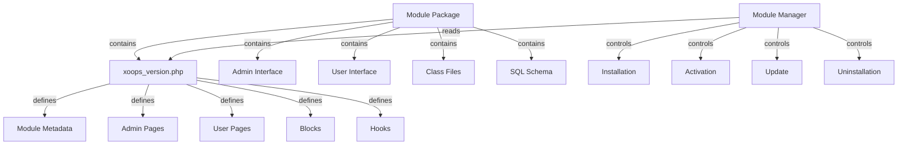

XOOPS modulsystemet giver en komplet ramme til udvikling, installation, styring og udvidelse af modulfunktionalitet. Moduler er selvstændige pakker, der udvider XOOPS med yderligere funktioner og muligheder.

## Modularkitektur



## Modulstruktur

Standard XOOPS modulbiblioteksstruktur:

```
mymodule/
├── xoops_version.php          # Module manifest and configuration
├── admin.php                  # Admin main page
├── index.php                  # User main page
├── admin/                     # Admin pages directory
│   ├── main.php
│   ├── manage.php
│   └── settings.php
├── class/                     # Module classes
│   ├── Handler/
│   │   ├── ItemHandler.php
│   │   └── CategoryHandler.php
│   └── Objects/
│       ├── Item.php
│       └── Category.php
├── sql/                       # Database schemas
│   ├── mysql.sql
│   └── postgres.sql
├── include/                   # Include files
│   ├── common.inc.php
│   └── functions.php
├── templates/                 # Module templates
│   ├── admin/
│   │   └── main.tpl
│   └── user/
│       ├── index.tpl
│       └── item.tpl
├── blocks/                    # Module blocks
│   └── blocks.php
├── tests/                     # Unit tests
├── language/                  # Language files
│   ├── english/
│   │   └── main.php
│   └── spanish/
│       └── main.php
└── docs/                      # Documentation
```

## XoopsModule klasse

Klassen XoopsModule repræsenterer et installeret XOOPS-modul.

### Klasseoversigt

```php
namespace Xoops\Core\Module;

class XoopsModule extends XoopsObject
{
    protected int $moduleid = 0;
    protected string $name = '';
    protected string $dirname = '';
    protected string $version = '';
    protected string $description = '';
    protected array $config = [];
    protected array $blocks = [];
    protected array $adminPages = [];
    protected array $userPages = [];
}
```

### Egenskaber

| Ejendom | Skriv | Beskrivelse |
|--------|------|------------|
| `$moduleid` | int | Unikt modul-id |
| `$name` | streng | Modulets visningsnavn |
| `$dirname` | streng | Modulkatalognavn |
| `$version` | streng | Nuværende modulversion |
| `$description` | streng | Modulbeskrivelse |
| `$config` | række | Modulkonfiguration |
| `$blocks` | række | Modulblokke |
| `$adminPages` | række | Admin panel sider |
| `$userPages` | række | Brugervendte sider |

### Konstruktør

```php
public function __construct()
```

Opretter en ny modulinstans og initialiserer variabler.

### Kernemetoder

#### getName

Henter modulets visningsnavn.

```php
public function getName(): string
```

**Returneringer:** `string` - Modulets visningsnavn

**Eksempel:**
```php
$module = new XoopsModule();
$module->setVar('name', 'Publisher');
echo $module->getName(); // "Publisher"
```

#### getDirname

Henter modulets biblioteksnavn.

```php
public function getDirname(): string
```

**Returneringer:** `string` - Modulbiblioteksnavn

**Eksempel:**
```php
echo $module->getDirname(); // "publisher"
```

#### getVersion

Henter den aktuelle modulversion.

```php
public function getVersion(): string
```

**Returneringer:** `string` - Versionsstreng

**Eksempel:**
```php
echo $module->getVersion(); // "2.1.0"
```

#### getDescription

Får modulbeskrivelsen.

```php
public function getDescription(): string
```

**Returneringer:** `string` - Modulbeskrivelse

**Eksempel:**
```php
$desc = $module->getDescription();
```

#### getConfig

Henter modulkonfiguration.

```php
public function getConfig(string $key = null): mixed
```

**Parametre:**

| Parameter | Skriv | Beskrivelse |
|-----------|------|------------|
| `$key` | streng | Konfigurationsnøgle (nul for alle) |

**Returneringer:** `mixed` - Konfigurationsværdi eller matrix

**Eksempel:**
```php
$config = $module->getConfig();
$itemsPerPage = $module->getConfig('items_per_page');
```

#### setConfig

Indstiller modulkonfiguration.

```php
public function setConfig(string $key, mixed $value): void
```

**Parametre:**

| Parameter | Skriv | Beskrivelse |
|-----------|------|------------|
| `$key` | streng | Konfigurationsnøgle |
| `$value` | blandet | Konfigurationsværdi |

**Eksempel:**
```php
$module->setConfig('items_per_page', 20);
$module->setConfig('enable_cache', true);
```

#### getPath

Henter den fulde filsystemsti til modulet.

```php
public function getPath(): string
```

**Returneringer:** `string` - Absolut modulbibliotekssti

**Eksempel:**
```php
$path = $module->getPath(); // "/var/www/xoops/modules/publisher"
$classPath = $module->getPath() . '/class';
```

#### getUrl

Henter URL til modulet.

```php
public function getUrl(): string
```

**Returneringer:** `string` - Modul URL

**Eksempel:**
```php
$url = $module->getUrl(); // "http://example.com/modules/publisher"
```

## Modulinstallationsproces

### xoops_module_install Funktion

Modulinstallationsfunktionen defineret i `xoops_version.php`:

```php
function xoops_module_install_modulename($module)
{
    // $module is an XoopsModule instance

    // Create database tables
    // Initialize default configuration
    // Create default folders
    // Set up file permissions

    return true; // Success
}
```

**Parametre:**

| Parameter | Skriv | Beskrivelse |
|-----------|------|------------|
| `$module` | XoopsModule | Modulet, der installeres |

**Returneringer:** `bool` - Sand ved succes, falsk ved fiasko

**Eksempel:**
```php
function xoops_module_install_publisher($module)
{
    // Get module path
    $modulePath = $module->getPath();

    // Create uploads directory
    $uploadsPath = XOOPS_ROOT_PATH . '/uploads/publisher';
    if (!is_dir($uploadsPath)) {
        mkdir($uploadsPath, 0755, true);
    }

    // Get database connection
    global $xoopsDB;

    // Execute SQL installation script
    $sqlFile = $modulePath . '/sql/mysql.sql';
    if (file_exists($sqlFile)) {
        $sqlQueries = file_get_contents($sqlFile);
        // Execute queries (simplified)
        $xoopsDB->queryFromFile($sqlFile);
    }

    // Set default configuration
    $module->setConfig('items_per_page', 10);
    $module->setConfig('enable_comments', true);

    return true;
}
```

### xoops_module_uninstall funktion

Funktionen til afinstallation af modul:

```php
function xoops_module_uninstall_modulename($module)
{
    // Drop database tables
    // Remove uploaded files
    // Clean up configuration

    return true;
}
```

**Eksempel:**
```php
function xoops_module_uninstall_publisher($module)
{
    global $xoopsDB;

    // Drop tables
    $tables = ['publisher_items', 'publisher_categories', 'publisher_comments'];
    foreach ($tables as $table) {
        $xoopsDB->query('DROP TABLE IF EXISTS ' . $xoopsDB->prefix($table));
    }

    // Remove upload folder
    $uploadsPath = XOOPS_ROOT_PATH . '/uploads/publisher';
    if (is_dir($uploadsPath)) {
        // Recursive directory deletion
        $this->recursiveRemoveDir($uploadsPath);
    }

    return true;
}
```

## Modulkroge

Modulkroge tillader moduler at integrere med andre moduler og systemet.

### Krogerklæring

I `xoops_version.php`:

```php
$modversion['hooks'] = [
    'system.page.footer' => [
        'function' => 'publisher_page_footer'
    ],
    'user.profile.view' => [
        'function' => 'publisher_user_articles'
    ],
];
```

### Krogimplementering

```php
// In a module file (e.g., include/hooks.php)

function publisher_page_footer()
{
    // Return HTML for footer
    return '<div class="publisher-footer">Publisher Footer Content</div>';
}

function publisher_user_articles($user_id)
{
    global $xoopsDB;

    // Get user's articles
    $result = $xoopsDB->query(
        'SELECT * FROM ' . $xoopsDB->prefix('publisher_articles') .
        ' WHERE author_id = ? ORDER BY published DESC LIMIT 5',
        [$user_id]
    );

    $articles = [];
    while ($row = $xoopsDB->fetchAssoc($result)) {
        $articles[] = $row;
    }

    return $articles;
}
```

### Tilgængelige systemkroge

| Krog | Parametre | Beskrivelse |
|------|--------|--------|
| `system.page.header` | Ingen | Sidehovedoutput |
| `system.page.footer` | Ingen | Sidefod output |
| `user.login.success` | $user objekt | Efter brugerlogin |
| `user.logout` | $user objekt | Efter brugerlog ud |
| `user.profile.view` | $user_id | Viser brugerprofil |
| `module.install` | $module objekt | Modul installation |
| `module.uninstall` | $module objekt | Afinstallation af modul |

## Modul Manager Service

Tjenesten ModuleManager håndterer moduloperationer.

### Metoder

#### getModule

Henter et modul ved navn.

```php
public function getModule(string $dirname): ?XoopsModule
```

**Parametre:**| Parameter | Skriv | Beskrivelse |
|-----------|------|------------|
| `$dirname` | streng | Modulkatalognavn |

**Returneringer:** `?XoopsModule` - Modulforekomst eller null

**Eksempel:**
```php
$moduleManager = $kernel->getService('module');
$publisher = $moduleManager->getModule('publisher');
if ($publisher) {
    echo $publisher->getName();
}
```

#### getAllModules

Henter alle installerede moduler.

```php
public function getAllModules(bool $activeOnly = true): array
```

**Parametre:**

| Parameter | Skriv | Beskrivelse |
|-----------|------|------------|
| `$activeOnly` | bool | Returner kun aktive moduler |

**Returneringer:** `array` - Array af XoopsModule objekter

**Eksempel:**
```php
$activeModules = $moduleManager->getAllModules(true);
foreach ($activeModules as $module) {
    echo $module->getName() . " - " . $module->getVersion() . "\n";
}
```

#### er ModulActive

Kontrollerer om et modul er aktivt.

```php
public function isModuleActive(string $dirname): bool
```

**Eksempel:**
```php
if ($moduleManager->isModuleActive('publisher')) {
    // Publisher module is active
}
```

#### aktivér modul

Aktiverer et modul.

```php
public function activateModule(string $dirname): bool
```

**Eksempel:**
```php
if ($moduleManager->activateModule('publisher')) {
    echo "Publisher activated";
}
```

#### deaktiver modul

Deaktiverer et modul.

```php
public function deactivateModule(string $dirname): bool
```

**Eksempel:**
```php
if ($moduleManager->deactivateModule('publisher')) {
    echo "Publisher deactivated";
}
```

## Modulkonfiguration (xoops_version.php)

Eksempel på komplet modulmanifest:

```php
<?php
/**
 * Module manifest for Publisher
 */

$modversion = [
    'name' => 'Publisher',
    'version' => '2.1.0',
    'description' => 'Professional content publishing module',
    'author' => 'XOOPS Community',
    'credits' => 'Based on original work by...',
    'license' => 'GPL v2',
    'official' => 1,
    'image' => 'images/logo.png',
    'dirname' => 'publisher',
    'onInstall' => 'xoops_module_install_publisher',
    'onUpdate' => 'xoops_module_update_publisher',
    'onUninstall' => 'xoops_module_uninstall_publisher',

    // Admin pages
    'hasAdmin' => 1,
    'adminindex' => 'admin/main.php',
    'adminmenu' => [
        [
            'title' => 'Dashboard',
            'link' => 'admin/main.php',
            'icon' => 'dashboard.png'
        ],
        [
            'title' => 'Manage Items',
            'link' => 'admin/items.php',
            'icon' => 'items.png'
        ],
        [
            'title' => 'Settings',
            'link' => 'admin/settings.php',
            'icon' => 'settings.png'
        ]
    ],

    // User pages
    'hasMain' => 1,
    'main_file' => 'index.php',

    // Blocks
    'blocks' => [
        [
            'file' => 'blocks/recent.php',
            'name' => 'Recent Articles',
            'description' => 'Display recent published articles',
            'show_func' => 'publisher_recent_show',
            'edit_func' => 'publisher_recent_edit',
            'options' => '5|0|0',
            'template' => 'publisher_block_recent.tpl'
        ],
        [
            'file' => 'blocks/featured.php',
            'name' => 'Featured Articles',
            'description' => 'Display featured articles',
            'show_func' => 'publisher_featured_show',
            'edit_func' => 'publisher_featured_edit'
        ]
    ],

    // Module hooks
    'hooks' => [
        'system.page.footer' => [
            'function' => 'publisher_page_footer'
        ],
        'user.profile.view' => [
            'function' => 'publisher_user_articles'
        ]
    ],

    // Configuration items
    'config' => [
        [
            'name' => 'items_per_page',
            'title' => '_MI_PUBLISHER_ITEMS_PER_PAGE',
            'description' => '_MI_PUBLISHER_ITEMS_PER_PAGE_DESC',
            'formtype' => 'text',
            'valuetype' => 'int',
            'default' => '10'
        ],
        [
            'name' => 'enable_comments',
            'title' => '_MI_PUBLISHER_ENABLE_COMMENTS',
            'description' => '_MI_PUBLISHER_ENABLE_COMMENTS_DESC',
            'formtype' => 'yesno',
            'valuetype' => 'int',
            'default' => '1'
        ]
    ]
];

function xoops_module_install_publisher($module)
{
    // Installation logic
    return true;
}

function xoops_module_update_publisher($module)
{
    // Update logic
    return true;
}

function xoops_module_uninstall_publisher($module)
{
    // Uninstallation logic
    return true;
}
```

## Bedste praksis

1. **Navneområde dine klasser** - Brug modulspecifikke navnerum for at undgå konflikter

2. **Brug handlere** - Brug altid handlerklasser til databaseoperationer

3. **Internationaliser indhold** - Brug sprogkonstanter for alle brugervendte strenge

4. **Opret installationsscripts** - Angiv SQL-skemaer til databasetabeller

5. **Dokumentkroge** - Dokumentér tydeligt, hvilke kroge dit modul leverer

6. **Version dit modul** - Forøg versionsnumre med udgivelser

7. **Testinstallation** - Test installations-/afinstallationsprocesserne grundigt

8. **Håndtertilladelser** - Tjek brugertilladelser, før du tillader handlinger

## Komplet moduleksempel

```php
<?php
/**
 * Custom Article Module Main Page
 */

include __DIR__ . '/include/common.inc.php';

// Get module instance
$module = xoops_getModuleByDirname('mymodule');

// Check if module is active
if (!$module) {
    die('Module not found');
}

// Get module configuration
$itemsPerPage = $module->getConfig('items_per_page');

// Get item handler
$itemHandler = xoops_getModuleHandler('item', 'mymodule');

// Fetch items with pagination
$criteria = new CriteriaCompo();
$criteria->add(new Criteria('status', 1));
$items = $itemHandler->getObjects($criteria, $itemsPerPage);

// Prepare template
$xoopsTpl->assign('items', $items);
$xoopsTpl->assign('module_name', $module->getName());
$xoopsTpl->display($module->getPath() . '/templates/user/index.tpl');
```

## Relateret dokumentation

- ../Kernel/Kernel-Classes - Kernelinitialisering og kernetjenester
- ../Template/Template-System - Modulskabeloner og temaintegration
- ../Database/QueryBuilder - Opbygning af databaseforespørgsler
- ../Core/XoopsObject - Basisobjektklasse

---

*Se også: [XOOPS moduludviklingsvejledning](https://github.com/XOOPS/XoopsCore27/wiki/Module-Development)*
