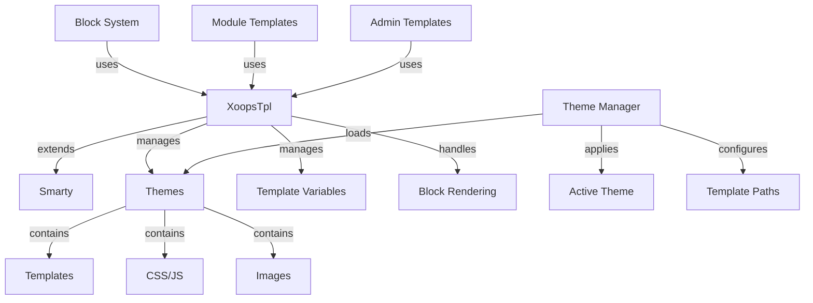

XOOPS skabelonsystemet er bygget på den kraftfulde Smarty-skabelonmotor, der giver en fleksibel og udvidelsesbar måde at adskille præsentationslogik fra forretningslogik. Den administrerer temaer, skabelongengivelse, variabel tildeling og dynamisk indholdsgenerering.

## Skabelonarkitektur



## XoopsTpl klasse

Hovedskabelonmotorklassen, der udvider Smarty.

### Klasseoversigt

```php
namespace Xoops\Core;

class XoopsTpl extends Smarty
{
    protected array $vars = [];
    protected string $currentTheme = '';
    protected array $blocks = [];
    protected bool $isAdmin = false;
}
```

### Udvider Smarty

```php
use Xoops\Core\XoopsTpl;

class XoopsTpl extends Smarty
{
    private static ?XoopsTpl $instance = null;

    private function __construct()
    {
        parent::__construct();
        $this->configureDirectories();
        $this->registerPlugins();
    }

    public static function getInstance(): XoopsTpl
    {
        if (!isset(self::$instance)) {
            self::$instance = new self();
        }
        return self::$instance;
    }
}
```

### Kernemetoder

#### getInstance

Henter singleton-skabelonforekomsten.

```php
public static function getInstance(): XoopsTpl
```

**Returneringer:** `XoopsTpl` - Singleton-instans

**Eksempel:**
```php
$xoopsTpl = XoopsTpl::getInstance();
```

#### tildele

Tildeler en variabel til skabelonen.

```php
public function assign(
    string|array $tplVar,
    mixed $value = null
): void
```

**Parametre:**

| Parameter | Skriv | Beskrivelse |
|-----------|------|------------|
| `$tplVar` | streng\|array | Variabelnavn eller associativ matrix |
| `$value` | blandet | Variabel værdi |

**Eksempel:**
```php
$xoopsTpl->assign('page_title', 'Welcome');
$xoopsTpl->assign('user_name', 'John Doe');

// Multiple assignments
$xoopsTpl->assign([
    'items' => $items,
    'total_count' => count($items),
    'show_pagination' => true
]);
```

#### tilføjTildel

Føjer værdier til skabelonarrayvariabler.

```php
public function appendAssign(
    string $tplVar,
    mixed $value
): void
```

**Parametre:**

| Parameter | Skriv | Beskrivelse |
|-----------|------|------------|
| `$tplVar` | streng | Variabelnavn |
| `$value` | blandet | Værdi at tilføje |

**Eksempel:**
```php
$xoopsTpl->assign('breadcrumbs', ['Home']);
$xoopsTpl->appendAssign('breadcrumbs', 'Blog');
$xoopsTpl->appendAssign('breadcrumbs', 'Posts');
// breadcrumbs = ['Home', 'Blog', 'Posts']
```

#### getAssignedVars

Henter alle tildelte skabelonvariabler.

```php
public function getAssignedVars(): array
```

**Returneringer:** `array` - Tildelte variable

**Eksempel:**
```php
$vars = $xoopsTpl->getAssignedVars();
foreach ($vars as $name => $value) {
    echo "$name = " . var_export($value, true) . "\n";
}
```

#### display

Gengiver en skabelon og udlæser til browser.

```php
public function display(
    string $resource,
    string|array $cache_id = null,
    string $compile_id = null,
    object $parent = null
): void
```

**Parametre:**

| Parameter | Skriv | Beskrivelse |
|-----------|------|------------|
| `$resource` | streng | Skabelonfilsti |
| `$cache_id` | streng\|array | Cache-id |
| `$compile_id` | streng | Kompiler identifikator |
| `$parent` | objekt | Overordnet skabelonobjekt |

**Eksempel:**
```php
$xoopsTpl->assign('page_title', 'Home');
$xoopsTpl->display('user:index.tpl');

// With absolute path
$xoopsTpl->display(XOOPS_ROOT_PATH . '/templates/user/index.tpl');
```

#### hente

Gengiver en skabelon og returnerer som streng.

```php
public function fetch(
    string $resource,
    string|array $cache_id = null,
    string $compile_id = null,
    object $parent = null
): string
```

**Returneringer:** `string` - Gengivet skabelonindhold

**Eksempel:**
```php
$xoopsTpl->assign('message', 'Hello World');
$html = $xoopsTpl->fetch('user:message.tpl');
echo $html;

// Use for email templates
$emailContent = $xoopsTpl->fetch('mail:notification.tpl');
mail($to, $subject, $emailContent);
```

#### loadTheme

Indlæser et bestemt tema.

```php
public function loadTheme(string $themeName): bool
```

**Parametre:**

| Parameter | Skriv | Beskrivelse |
|-----------|------|------------|
| `$themeName` | streng | Temamappenavn |

**Returneringer:** `bool` - Sand på succes

**Eksempel:**
```php
if ($xoopsTpl->loadTheme('bluemoon')) {
    echo "Theme loaded successfully";
}
```

#### getCurrentTheme

Henter navnet på det aktuelt aktive tema.

```php
public function getCurrentTheme(): string
```

**Returneringer:** `string` - Temanavn

**Eksempel:**
```php
$currentTheme = $xoopsTpl->getCurrentTheme();
echo "Active theme: $currentTheme";
```

#### setOutputFilter

Tilføjer et outputfilter til at behandle skabelonoutput.

```php
public function setOutputFilter(string $function): void
```

**Parametre:**

| Parameter | Skriv | Beskrivelse |
|-----------|------|------------|
| `$function` | streng | Filterfunktionsnavn |

**Eksempel:**
```php
// Remove whitespace from output
$xoopsTpl->setOutputFilter('trim');

// Custom filter
function my_output_filter($output) {
    // Minify HTML
    $output = preg_replace('/\s+/', ' ', $output);
    return trim($output);
}
$xoopsTpl->setOutputFilter('my_output_filter');
```

#### registerPlugin

Registrerer et brugerdefineret Smarty-plugin.

```php
public function registerPlugin(
    string $type,
    string $name,
    callable $callback
): void
```

**Parametre:**

| Parameter | Skriv | Beskrivelse |
|-----------|------|------------|
| `$type` | streng | Plugin-type (modifikator, blok, funktion) |
| `$name` | streng | Plugin navn |
| `$callback` | opkaldbar | Tilbagekaldsfunktion |

**Eksempel:**
```php
// Register custom modifier
$xoopsTpl->registerPlugin('modifier', 'markdown', function($text) {
    return markdown_parse($text);
});

// Use in template: {$content|markdown}

// Register custom block tag
$xoopsTpl->registerPlugin('block', 'permission', function($params, $content, $smarty, &$repeat) {
    if ($repeat) return;

    // Check permission
    if (has_permission($params['name'])) {
        return $content;
    }
    return '';
});

// Use in template: {permission name="admin"}...{/permission}
```

## Temasystem

### Temastruktur

Standard XOOPS tema mappestruktur:

```
bluemoon/
├── style.css              # Main stylesheet
├── admin.css              # Admin stylesheet
├── theme.html             # Main page template
├── admin.html             # Admin page template
├── blocks/                # Block templates
│   ├── block_left.tpl
│   └── block_right.tpl
├── modules/               # Module templates
│   ├── publisher/
│   │   ├── index.tpl
│   │   └── item.tpl
│   └── news/
│       └── index.tpl
├── images/                # Theme images
│   ├── logo.png
│   └── banner.png
├── js/                    # Theme JavaScript
│   └── script.js
└── readme.txt             # Theme documentation
```

### Theme Manager Class

```php
namespace Xoops\Core\Theme;

class ThemeManager
{
    protected array $themes = [];
    protected string $activeTheme = '';
    protected string $themeDirectory = '';

    public function getActiveTheme(): string {}
    public function setActiveTheme(string $theme): bool {}
    public function getThemeList(): array {}
    public function themeExists(string $name): bool {}
}
```

## Skabelonvariabler

### Globale standardvariabler

XOOPS tildeler automatisk flere globale skabelonvariabler:

| Variabel | Skriv | Beskrivelse |
|--------|------|------------|
| `$xoops_url` | streng | XOOPS installation URL |
| `$xoops_user` | XoopsUser\|null | Aktuelt brugerobjekt |
| `$xoops_uname` | streng | Nuværende brugernavn |
| `$xoops_isadmin` | bool | Bruger er admin |
| `$xoops_banner` | streng | Banner HTML |
| `$xoops_notification` | streng | Notifikationsopmærkning |
| `$xoops_version` | streng | XOOPS version |

### Blokspecifikke variabler

Ved gengivelse af blokke:

| Variabel | Skriv | Beskrivelse |
|--------|------|------------|
| `$block` | række | Bloker information |
| `$block.title` | streng | Blok titel |
| `$block.content` | streng | Bloker indhold |
| `$block.id` | int | Bloker ID |
| `$block.module` | streng | Modulnavn |

### ModulskabelonvariablerModuler tildeler typisk:

| Variabel | Skriv | Beskrivelse |
|--------|------|------------|
| `$module_name` | streng | Modulets visningsnavn |
| `$module_dir` | streng | Modulkatalog |
| `$xoops_module_header` | streng | Modul CSS/JS |

## Smarty-konfiguration

### Almindelige Smarty-modifikatorer

| Modifikator | Beskrivelse | Eksempel |
|--------|-------------|--------|
| `capitalize` | Sæt stort første bogstav | `{$title\|capitalize}` |
| `count_characters` | Antal tegn | `{$text\|count_characters}` |
| `date_format` | Formater tidsstempel | `{$timestamp\|date_format:'%Y-%m-%d'}` |
| `escape` | Undslip særlige tegn | `{$html\|escape:'html'}` |
| `nl2br` | Konverter nye linjer til `<br>` | `{$text\|nl2br}` |
| `strip_tags` | Fjern HTML tags | `{$content\|strip_tags}` |
| `truncate` | Begræns strenglængde | `{$text\|truncate:100}` |
| `upper` | Konverter til store bogstaver | `{$name\|upper}` |
| `lower` | Konverter til små bogstaver | `{$name\|lower}` |

### Kontrolstrukturer

```smarty
{* If statement *}
{if $user->isAdmin()}
    <p>Admin content</p>
{else}
    <p>User content</p>
{/if}

{* For loop *}
{foreach $items as $item}
    <div class="item">{$item.title}</div>
{/foreach}

{* For loop with counter *}
{foreach $items as $item name=item_loop}
    {$smarty.foreach.item_loop.iteration}: {$item.title}
{/foreach}

{* While loop *}
{while $condition}
    <!-- content -->
{/while}

{* Switch statement *}
{switch $status}
    {case 'draft'}<span class="draft">Draft</span>{break}
    {case 'published'}<span class="published">Published</span>{break}
    {default}<span class="unknown">Unknown</span>
{/switch}
```

## Komplet skabeloneksempel

### PHP Kode

```php
<?php
/**
 * Module Article List Page
 */

include __DIR__ . '/include/common.inc.php';

$xoopsTpl = XoopsTpl::getInstance();

// Check if module is active
$module = xoops_getModuleByDirname('articles');
if (!$module) {
    redirect_header(XOOPS_URL, 3, 'Module not found');
}

// Get item handler
$itemHandler = xoops_getModuleHandler('item', 'articles');

// Get pagination parameters
$page = !empty($_GET['page']) ? (int)$_GET['page'] : 1;
$perPage = $module->getConfig('items_per_page') ?: 10;
$offset = ($page - 1) * $perPage;

// Build criteria
$criteria = new CriteriaCompo();
$criteria->add(new Criteria('status', 1));
$criteria->setSort('published', 'DESC');
$criteria->setLimit($perPage);
$criteria->setStart($offset);

// Fetch items
$items = $itemHandler->getObjects($criteria);
$total = $itemHandler->getCount(new Criteria('status', 1));

// Calculate pagination
$pages = ceil($total / $perPage);

// Assign template variables
$xoopsTpl->assign([
    'module_name' => $module->getName(),
    'items' => $items,
    'total_items' => $total,
    'current_page' => $page,
    'total_pages' => $pages,
    'items_per_page' => $perPage,
    'show_pagination' => $pages > 1
]);

// Add breadcrumbs
$xoopsTpl->assign('xoops_breadcrumbs', [
    ['url' => XOOPS_URL, 'title' => 'Home'],
    ['url' => $module->getUrl(), 'title' => $module->getName()],
    ['title' => 'Articles']
]);

// Display template
$xoopsTpl->display($module->getPath() . '/templates/user/list.tpl');
```

### Skabelonfil (list.tpl)

```smarty
<div id="articles-list">
    <h1>{$module_name|escape}</h1>

    {if $items}
        <div class="articles-container">
            {foreach $items as $item}
                <article class="article-item">
                    <header>
                        <h2>
                            <a href="{$item.url|escape}">
                                {$item.title|escape}
                            </a>
                        </h2>
                        <div class="meta">
                            <span class="author">By {$item.author|escape}</span>
                            <span class="date">
                                {$item.published|date_format:'%B %d, %Y'}
                            </span>
                        </div>
                    </header>

                    <div class="content">
                        <p>{$item.summary|truncate:150}</p>
                    </div>

                    <footer>
                        <a href="{$item.url|escape}" class="read-more">
                            Read More »
                        </a>
                    </footer>
                </article>
            {/foreach}
        </div>

        {* Pagination *}
        {if $show_pagination}
            <nav class="pagination">
                {if $current_page > 1}
                    <a href="?page=1" class="first">« First</a>
                    <a href="?page={$current_page - 1}" class="prev">‹ Previous</a>
                {/if}

                {for $i=1 to $total_pages}
                    {if $i == $current_page}
                        <span class="current">{$i}</span>
                    {else}
                        <a href="?page={$i}">{$i}</a>
                    {/if}
                {/for}

                {if $current_page < $total_pages}
                    <a href="?page={$current_page + 1}" class="next">Next ›</a>
                    <a href="?page={$total_pages}" class="last">Last »</a>
                {/if}
            </nav>
        {/if}
    {else}
        <p class="no-items">No articles found.</p>
    {/if}
</div>
```

## Brugerdefinerede smarte funktioner

### Oprettelse af en brugerdefineret blokfunktion

```php
<?php
/**
 * Custom Smarty block function for permission checking
 */

function smarty_block_permission($params, $content, $smarty, &$repeat)
{
    if ($repeat) return;

    if (!isset($params['name'])) {
        return 'Permission name required';
    }

    $permName = $params['name'];
    $user = $GLOBALS['xoopsUser'];

    // Check if user has permission
    if ($user && $user->isAdmin()) {
        return $content;
    }

    if ($user && check_user_permission($user->uid(), $permName)) {
        return $content;
    }

    return '';
}
```

Registrer og brug:

```php
$xoopsTpl->registerPlugin('block', 'permission', 'smarty_block_permission');
```

Skabelon:

```smarty
{permission name="edit_articles"}
    <button>Edit Article</button>
{/permission}
```

## Bedste praksis

1. **Escape User Content** - Brug altid `|escape` til brugergenereret indhold
2. **Brug skabelonstier** - Referenceskabeloner i forhold til tema
3. **Adskil logik fra præsentation** - Bevar kompleks logik i PHP
4. **Cache-skabeloner** - Aktiver skabeloncaching i produktionen
5. **Brug modifikatorer korrekt** - Anvend passende filtre til kontekst
6. **Organiser blokke** - Placer blokskabeloner i en dedikeret mappe
7. **Dokumentvariabler** - Dokumenter alle skabelonvariabler i PHP

## Relateret dokumentation

- ../Module/Module-System - Modulsystem og kroge
- ../Kernel/Kernel-Classes - Kernel og konfiguration
- ../Core/XoopsObject - Basisobjektklasse

---

*Se også: [Smarty Documentation](https://www.smarty.net/docs) | [XOOPS skabelon API](https://github.com/XOOPS/XoopsCore27/tree/master/htdocs/class)*
