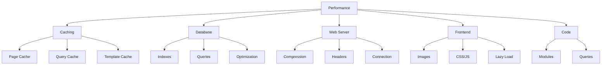

# XOOPS Ydeevneoptimering

Omfattende guide til optimering af XOOPS for maksimal hastighed og effektivitet.

## Oversigt over ydeevneoptimering



## Caching-konfiguration

Caching er den hurtigste måde at forbedre ydeevnen på.

### Caching på sideniveau

Aktiver cachelagring af hele sider i XOOPS:

**Admin Panel > System > Præferencer > Cacheindstillinger**

```
Enable Caching: Yes
Cache Type: File Cache (or APCu/Memcache)
Cache Lifetime: 3600 seconds (1 hour)
Cache Module Lists: Yes
Cache Configuration: Yes
Cache Search Results: Yes
```

### Filbaseret cachelagring

Konfigurer filcacheplacering:

```bash
# Create cache directory outside web root (more secure)
mkdir -p /var/cache/xoops
chown www-data:www-data /var/cache/xoops
chmod 755 /var/cache/xoops

# Edit mainfile.php
define('XOOPS_CACHE_PATH', '/var/cache/xoops/');
```

### APCu Caching

APCu giver caching i hukommelsen (meget hurtigt):

```bash
# Install APCu
apt-get install php-apcu

# Verify installation
php -m | grep apcu

# Configure in php.ini
apc.enabled = 1
apc.memory_size = 128M
apc.ttl = 0
apc.user_ttl = 3600
apc.shm_size = 128
```

Aktiver i XOOPS:

**Admin Panel > System > Præferencer > Cacheindstillinger**

```
Cache Type: APCu
```

### Memcache/Redis Caching

Distribueret caching for websteder med høj trafik:

**Installer Memcache:**

```bash
# Install Memcache server
apt-get install memcached

# Start service
systemctl start memcached
systemctl enable memcached

# Verify running
netstat -tlnp | grep memcached
# Should show listening on port 11211
```

**Konfigurer i XOOPS:**

Rediger hovedfil.php:

```php
// Memcache configuration
define('XOOPS_CACHE_TYPE', 'memcache');
define('XOOPS_CACHE_HOST', 'localhost');
define('XOOPS_CACHE_PORT', 11211);
define('XOOPS_CACHE_TIMEOUT', 0);
```

Eller i admin panel:

```
Cache Type: Memcache
Memcache Host: localhost:11211
```

### Skabeloncaching

Kompiler og cache XOOPS skabeloner:

```bash
# Ensure templates_c is writable
chmod 777 /var/www/html/xoops/templates_c/

# Clear old cached templates
rm -rf /var/www/html/xoops/templates_c/*
```

Konfigurer i tema:

```html
<!-- In theme xoops_version.php -->
{smarty.const.XOOPS_VAR_PATH|constant}
<{$xoops_meta}>

<!-- Templates use caching -->
{cache}
    [Cached content here]
{/cache}
```

## Databaseoptimering

### Tilføj databaseindekser

Korrekt indekserede databaser forespørger meget hurtigere.

```sql
-- Check current indexes
SHOW INDEXES FROM xoops_users;

-- Common indexes to add
ALTER TABLE xoops_users ADD INDEX idx_uname (uname);
ALTER TABLE xoops_users ADD INDEX idx_email (email);
ALTER TABLE xoops_users ADD INDEX idx_uid_active (uid, user_actkey);

-- Add indexes to posts/content tables
ALTER TABLE xoops_posts ADD INDEX idx_post_published (post_published);
ALTER TABLE xoops_posts ADD INDEX idx_post_uid (post_uid);
ALTER TABLE xoops_posts ADD INDEX idx_post_created (post_created);

-- Verify indexes created
SHOW INDEXES FROM xoops_users\G
```

### Optimer tabeller

Regelmæssig tabeloptimering forbedrer ydeevnen:

```sql
-- Optimize all tables
OPTIMIZE TABLE xoops_users;
OPTIMIZE TABLE xoops_posts;
OPTIMIZE TABLE xoops_config;
OPTIMIZE TABLE xoops_comments;

-- Or optimize all at once
REPAIR TABLE xoops_users;
OPTIMIZE TABLE xoops_users;
REPAIR TABLE xoops_posts;
OPTIMIZE TABLE xoops_posts;
```

Opret automatisk optimeringsscript:

```bash
#!/bin/bash
# Database optimization script

echo "Optimizing XOOPS database..."

mysql -u xoops_user -p xoops_db << EOF
-- Optimize all tables
OPTIMIZE TABLE xoops_users;
OPTIMIZE TABLE xoops_posts;
OPTIMIZE TABLE xoops_config;
OPTIMIZE TABLE xoops_comments;
OPTIMIZE TABLE xoops_users_online;

-- Show database size
SELECT table_schema,
       ROUND(SUM(data_length + index_length) / 1024 / 1024, 2) as total_mb
FROM information_schema.tables
WHERE table_schema = 'xoops_db'
GROUP BY table_schema;
EOF

echo "Database optimization completed!"
```

Tidsplan med cron:

```bash
# Weekly optimization
crontab -e
# Add: 0 3 * * 0 /usr/local/bin/optimize-xoops-db.sh
```

### Forespørgselsoptimering

Gennemgå langsomme forespørgsler:

```sql
-- Enable slow query log
SET GLOBAL slow_query_log = 'ON';
SET GLOBAL long_query_time = 2;

-- View slow queries
SELECT * FROM mysql.slow_log;

-- Or check slow log file
tail -100 /var/log/mysql/slow.log
```

Almindelige optimeringsteknikker:

```php
// SLOW - Avoid unnecessary queries in loops
foreach ($users as $user) {
    $profile = getUserProfile($user['uid']);  // Query in loop!
    echo $profile['name'];
}

// FAST - Get all data at once
$profiles = getAllUserProfiles($user_ids);
foreach ($users as $user) {
    echo $profiles[$user['uid']]['name'];
}
```

### Forøg bufferpuljen

Konfigurer MySQL for bedre caching:

Rediger `/etc/mysql/mysql.conf.d/mysqld.cnf`:

```ini
# InnoDB Buffer Pool (50-80% of system RAM)
innodb_buffer_pool_size = 1G

# Query Cache (optional, can be disabled in MySQL 5.7+)
query_cache_size = 64M
query_cache_type = 1

# Max Connections
max_connections = 500

# Max Allowed Packet
max_allowed_packet = 256M

# Connection timeout
connect_timeout = 10
```

Genstart MySQL:

```bash
systemctl restart mysql
```

## Webserveroptimering

### Aktiver Gzip-komprimering

Komprimer svarene for at reducere båndbredden:

**Apache-konfiguration:**

```apache
<IfModule mod_deflate.c>
    AddOutputFilterByType DEFLATE text/html text/plain text/xml text/css text/javascript application/javascript application/json

    # Don't compress images and already compressed files
    SetEnvIfNoCase Request_URI \.(jpg|jpeg|png|gif|zip|gzip)$ no-gzip dont-vary

    # Log compressed responses
    DeflateBufferSize 8096
</IfModule>
```

**Nginx-konfiguration:**

```nginx
gzip on;
gzip_types text/html text/plain text/css text/javascript application/javascript application/json;
gzip_min_length 1000;
gzip_vary on;
gzip_comp_level 6;

# Don't compress already compressed formats
gzip_disable "msie6";
```

Bekræft komprimering:

```bash
# Check if response is gzipped
curl -I -H "Accept-Encoding: gzip" http://your-domain.com/xoops/

# Should show:
# Content-Encoding: gzip
```

### Browser-cacheoverskrifter

Indstil cache-udløb for statiske aktiver:

**Apache:**

```apache
<IfModule mod_expires.c>
    ExpiresActive On

    # Cache images for 30 days
    ExpiresByType image/jpeg "access plus 30 days"
    ExpiresByType image/gif "access plus 30 days"
    ExpiresByType image/png "access plus 30 days"
    ExpiresByType image/svg+xml "access plus 30 days"

    # Cache CSS/JS for 30 days
    ExpiresByType text/css "access plus 30 days"
    ExpiresByType application/javascript "access plus 30 days"
    ExpiresByType text/javascript "access plus 30 days"

    # Cache fonts for 1 year
    ExpiresByType font/eot "access plus 1 year"
    ExpiresByType font/ttf "access plus 1 year"
    ExpiresByType font/woff "access plus 1 year"
    ExpiresByType font/woff2 "access plus 1 year"

    # Don't cache HTML
    ExpiresByType text/html "access plus 1 hour"
</IfModule>
```

**Nginx:**

```nginx
location ~* \.(jpg|jpeg|png|gif|ico|svg|woff|woff2|ttf|eot)$ {
    expires 30d;
    add_header Cache-Control "public, immutable";
}

location ~* \.(css|js)$ {
    expires 30d;
    add_header Cache-Control "public";
}

location ~ \.html$ {
    expires 1h;
    add_header Cache-Control "public";
}
```

### Forbindelse Keep-Alive

Aktiver vedvarende HTTP-forbindelser:

**Apache:**

```apache
<IfModule mod_http.c>
    KeepAlive On
    KeepAliveTimeout 15
    MaxKeepAliveRequests 100
</IfModule>
```

**Nginx:**

```nginx
keepalive_timeout 15s;
keepalive_requests 100;
```

## Frontend optimering

### Optimer billeder

Reducer billedfilstørrelser:

```bash
# Batch compress JPEG images
for img in *.jpg; do
    convert "$img" -quality 85 "optimized_$img"
done

# Batch compress PNG images
for img in *.png; do
    optipng -o2 "$img"
done

# Or use imagemin CLI
npm install -g imagemin-cli
imagemin images/ --out-dir=images-optimized
```

### Formindsk CSS og JavaScript

Reducer CSS/JS filstørrelser:

**Brug af Node.js-værktøjer:**

```bash
# Install minifiers
npm install -g uglify-js clean-css-cli

# Minify JavaScript
uglifyjs script.js -o script.min.js

# Minify CSS
cleancss style.css -o style.min.css
```

**Brug af onlineværktøjer:**
- CSS Minifier: https://cssminifier.com/
- JavaScript Minifier: https://www.minifycode.com/javascript-minifier/

### Doven indlæs billeder

Indlæs kun billeder, når det er nødvendigt:

```html
<!-- Add loading="lazy" attribute -->


<!-- Or use JavaScript library for older browsers -->


<script src="https://cdnjs.cloudflare.com/ajax/libs/vanilla-lazyload/17.1.2/lazyload.min.js"></script>
<script>
    var lazyLoad = new LazyLoad({
        elements_selector: ".lazy"
    });
</script>
```

### Reducer ressourcer til gengivelsesblokering

Indlæs CSS/JS strategisk:

```html
<!-- Load critical CSS inline -->
<style>
    /* Critical styles for above-the-fold */
</style>

<!-- Defer non-critical CSS -->
<link rel="stylesheet" href="style.css" media="print" onload="this.media='all'">

<!-- Defer JavaScript -->
<script src="script.js" defer></script>

<!-- Or use async for non-critical scripts -->
<script src="analytics.js" async></script>
```

## CDN Integration

Brug et indholdsleveringsnetværk for hurtigere global adgang.

### Populære CDN'er

| CDN | Omkostninger | Funktioner |
|---|---|---|
| Cloudflare | Gratis/betalt | DDoS, DNS, Cache, Analytics |
| AWS CloudFront | Betalt | Høj ydeevne, global |
| Bunny CDN | Overkommelig | Opbevaring, video, cache |
| jsDelivr | Gratis | JavaScript biblioteker |
| cdnjs | Gratis | Populære biblioteker |

### Cloudflare-opsætning

1. Tilmeld dig på https://www.cloudflare.com/
2. Tilføj dit domæne
3. Opdater navneservere med Cloudflare's
4. Aktiver cacheindstillinger:
   - Cacheniveau: Aggressiv
   - Caching på alt: Til
   - Browser Caching TTL: 1 måned

5. I XOOPS skal du opdatere dit domæne for at bruge Cloudflare DNS

### Konfigurer CDN i XOOPS

Opdater billed-URL'er til CDN:

Rediger temaskabelon:

```html
<!-- Original -->


<!-- With CDN -->

```

Eller indstil i PHP:

```php
// In mainfile.php or config
define('XOOPS_CDN_URL', 'https://cdn.your-domain.com');

// In template

```

## Ydeevneovervågning

### PageSpeed Insights Testing

Test dit websteds ydeevne:

1. Besøg Google PageSpeed Insights: https://pagespeed.web.dev/
2. Indtast din XOOPS URL
3. Gennemgå anbefalinger
4. Implementer foreslåede forbedringer

### Overvågning af serverydelse

Overvåg servermetrics i realtid:

```bash
# Install monitoring tools
apt-get install htop iotop nethogs

# Monitor CPU and memory
htop

# Monitor disk I/O
iotop

# Monitor network
nethogs
```

### PHP Ydelsesprofilering

Identificer langsom PHP-kode:

```php
<?php
// Use Xdebug for profiling
xdebug_start_trace('profile');

// Your code here
$result = someExpensiveFunction();

xdebug_stop_trace();
?>
```

### MySQL Forespørgselsovervågning

Spor langsomme forespørgsler:

```bash
# Enable query logging
mysql -u root -p

SET GLOBAL general_log = 'ON';
SET GLOBAL log_output = 'FILE';
SET GLOBAL general_log_file = '/var/log/mysql/query.log';

# Review slow queries
tail -f /var/log/mysql/slow.log

# Analyze query with EXPLAIN
EXPLAIN SELECT * FROM xoops_users WHERE uid = 1\G
```

## Tjekliste til optimering af ydeevne

Implementer disse for den bedste ydeevne:- [ ] **Caching:** Aktiver fil/APCu/Memcache-cache
- [ ] **Database:** Tilføj indekser, optimer tabeller
- [ ] **Kompression:** Aktiver Gzip-komprimering
- [ ] **Browsercache:** Indstil cacheoverskrifter
- [ ] **Billeder:** Optimer og komprimer
- [ ] **CSS/JS:** Formindsk filer
- [ ] **Lazy Loading:** Implement til billeder
- [ ] **CDN:** Bruges til statiske aktiver
- [ ] **Keep-Alive:** Aktiver vedvarende forbindelser
- [ ] **Moduler:** Deaktiver ubrugte moduler
- [ ] **Temaer:** Brug lette, optimerede temaer
- [ ] **Overvågning:** Spor præstationsmålinger
- [ ] ** Regelmæssig vedligeholdelse:** Ryd cache, optimer DB

## Performance Optimization Script

Automatisk optimering:

```bash
#!/bin/bash
# Performance optimization script

echo "=== XOOPS Performance Optimization ==="

# Clear cache
echo "Clearing cache..."
rm -rf /var/www/html/xoops/cache/*
rm -rf /var/www/html/xoops/templates_c/*

# Optimize database
echo "Optimizing database..."
mysql -u xoops_user -p xoops_db << EOF
OPTIMIZE TABLE xoops_users;
OPTIMIZE TABLE xoops_posts;
OPTIMIZE TABLE xoops_config;
OPTIMIZE TABLE xoops_comments;
EOF

# Check file permissions
echo "Verifying file permissions..."
find /var/www/html/xoops -type f -exec chmod 644 {} \;
find /var/www/html/xoops -type d -exec chmod 755 {} \;
chmod 777 /var/www/html/xoops/cache
chmod 777 /var/www/html/xoops/templates_c
chmod 777 /var/www/html/xoops/uploads
chmod 777 /var/www/html/xoops/var

# Generate performance report
echo "Performance Optimization Complete!"
echo ""
echo "Next steps:"
echo "1. Test site at https://pagespeed.web.dev/"
echo "2. Monitor performance in admin panel"
echo "3. Consider CDN for static assets"
echo "4. Review slow queries in MySQL"
```

## Før og efter metrics

Spor forbedringer:

```
Before Optimization:
- Page Load Time: 3.5 seconds
- Database Queries: 45
- Cache Hit Rate: 0%
- Database Size: 250MB

After Optimization:
- Page Load Time: 0.8 seconds (77% faster)
- Database Queries: 8 (cached)
- Cache Hit Rate: 85%
- Database Size: 120MB (optimized)
```

## Næste trin

1. Gennemgå grundlæggende konfiguration
2. Sørg for sikkerhedsforanstaltninger
3. Implementer caching
4. Overvåg ydeevne med værktøjer
5. Juster baseret på metrics

---

**Tags:** #performance #optimization #caching #database #cdn

**Relaterede artikler:**
- ../../06-Publisher-Module/User-Guide/Basic-Configuration
- System-indstillinger
- Sikkerhed-konfiguration
- ../Installation/Server-Requirements
