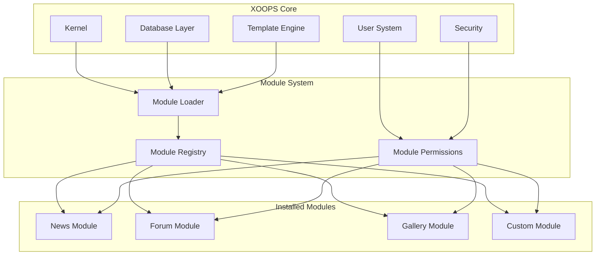
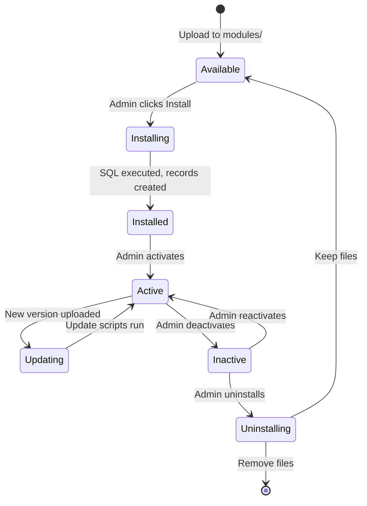

# ADR-001: Modulær arkitektur

> Architecture Decision Record for XOOPS's kernemodulære designfilosofi.

---

## Status

**Accepteret** - Grundlæggende beslutning siden XOOPS begyndelsen

---

## Kontekst

XOOPS (eXtensible Object-Oriented Portal System) havde brug for en arkitektur, der ville:

1. Tillad tredjepartsudviklere at udvide funktionaliteten
2. Giv webstedsadministratorer mulighed for at tilpasse uden kodning
3. Støtte uafhængig udvikling og opdateringer
4. Sørg for isolation mellem forskellige funktioner
5. Skaler fra simple blogs til komplekse portaler

De tidlige 2000'ers CMS-landskab tilbød monolitiske systemer, der var svære at tilpasse og udvide.

---

## Beslutningsdiagram



---

## Beslutning

Vi implementerer en **modulær arkitektur** hvor:

### 1. Core leverer infrastruktur
- Databaseabstraktion
- Brugergodkendelse og tilladelser
- Skabelongengivelse (Smarty)
- Sikkerhedsværktøjer
- Formgenerering
- Fælles hjælpemidler

### 2. Moduler er selvstændige
Hvert modul:
- Har sin egen mappestruktur
- Indeholder sine egne klasser, skabeloner, SQL
- Definerer sin egen konfiguration
- Kan installeres/afinstalleres uafhængigt
- Har versionssporing

### 3. Standard modulstruktur
```
modules/modulename/
├── admin/                  # Admin interface
│   ├── index.php
│   └── menu.php
├── class/                  # PHP classes
├── include/                # Include files
├── language/               # Translations
├── sql/                    # Database schema
├── templates/              # Smarty templates
├── blocks/                 # Block definitions
├── xoops_version.php       # Module manifest
├── index.php               # Entry point
└── header.php              # Module bootstrap
```

### 4. Modulmanifest (xoops_version.php)
```php
<?php
$modversion['name']        = 'Module Name';
$modversion['version']     = '1.0.0';
$modversion['description'] = 'Module description';
$modversion['dirname']     = basename(__DIR__);
$modversion['hasMain']     = 1;
$modversion['hasAdmin']    = 1;
$modversion['sqlfile']['mysql'] = 'sql/mysql.sql';
$modversion['tables']      = ['modulename_table1'];
$modversion['templates']   = [...];
$modversion['config']      = [...];
$modversion['blocks']      = [...];
```

### 5. Modulkommunikation
- Gennem kerne-API'er (handlere, begivenheder)
- Database relationer
- Forspændende kroge
- Fælles tjenester

---

## Modullivscyklus



---

## Konsekvenser

### Positiv

1. **Udvidelighed**: Tusindvis af moduler skabt af fællesskabet
2. **Uafhængighed**: Moduler kan udvikles separat
3. **Fleksibilitet**: Websteder kan blande og matche funktioner
4. **Vedligeholdelse**: Opdateringer påvirker ikke andre moduler
5. **Markedsplads**: Moduløkosystem opstod
6. **Læringskurve**: Udviklere lærer ét mønster

### Negativ

1. **Overhead**: Hvert modul har bootstrap-omkostninger
2. **Duplikering**: Fælles kode kan gentages
3. **Integration**: Funktioner på tværs af moduler kræver et omhyggeligt design
4. **Versionering**: Modulkompatibilitetsstyring påkrævet
5. **Kvalitetsvariance**: Tredjeparts modulkvalitet varierer

### Neutral

1. **Database**: Hvert modul administrerer sine egne tabeller
2. **Skabeloner**: Tema skal rumme forskellige moduler
3. **Opdateringer**: Kerne og moduler opdateres uafhængigt

---

## Alternativer overvejet

### 1. Monolitisk arkitektur
**Afvist** - For stiv, svær at tilpasse

### 2. Plugin-arkitektur (WordPress-stil)
**Delvist vedtaget** - Blokke og preloads giver plugin-lignende kroge i moduler

### 3. Komponentarkitektur (Joomla-stil)
**Afvist** - Mere kompleks, mindre udviklervenlig

### 4. Mikrotjenester
**Ikke relevant** - For kompleks til delt hosting-æra

---

## Relaterede beslutninger

- ADR-002: Objektorienteret databaseadgang
- ADR-003: Smarty Template Engine
- ADR-005: Tilladelsessystem

---

## Referencer

- XOOPS Projekthistorie
- PHP applikationsarkitekturmønstre
- CMS sammenligningsundersøgelser (2001-2005)

---

#xoops #arkitektur #adr #moduler #design-beslutning
