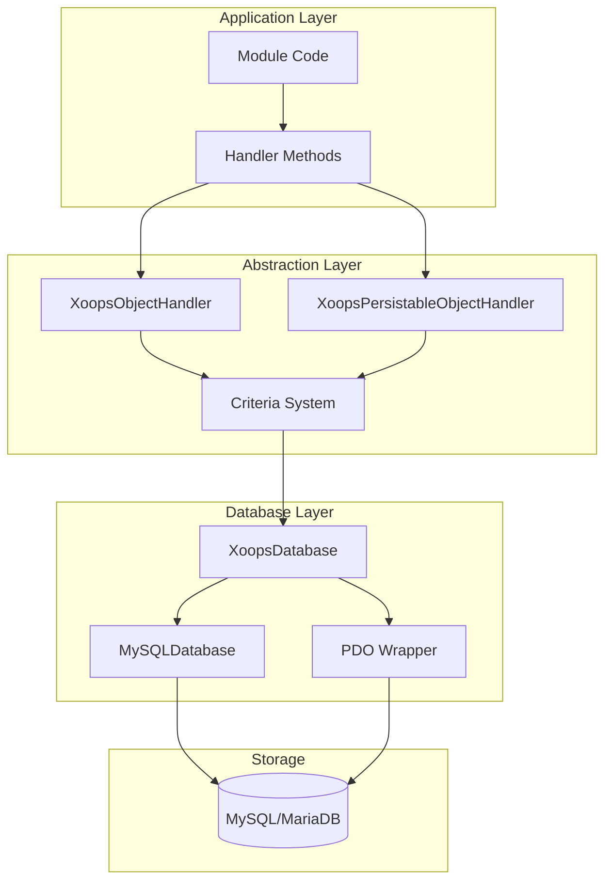
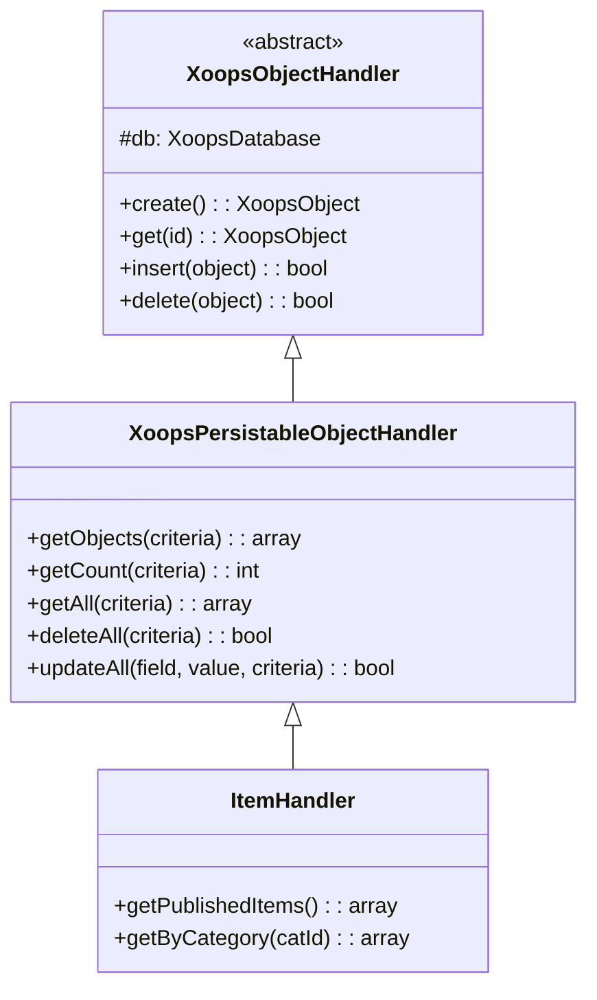
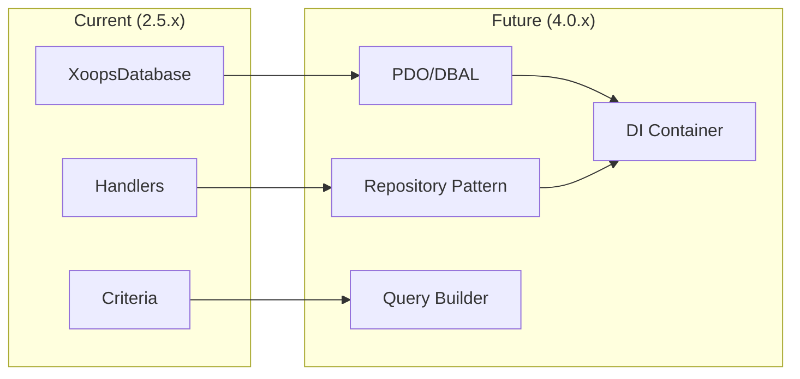

# ADR-002: Databaseabstraktion

> Architecture Decision Record for XOOPS's objektorienterede databaseadgangsmønster.

---

## Status

**Accepteret** - Kernemønster siden XOOPS 2.0

---

## Kontekst

XOOPS havde brug for en databaseinteraktionsstrategi, der ville:

1. Abstrakt væk database-specifik SQL syntaks
2. Sørg for ensartede CRUD-operationer på tværs af alle moduler
3. Aktiver automatisk datasanering og escape
4. Understøtte fremtidige ændringer i databasemotoren
5. Forenkle almindelige operationer for udviklere

Alternativerne var:
- Rå SQL i hele kodebasen
- Fuld ORM (doktrin, veltalende)
- Brugerdefineret letvægtsabstraktion

---

## Beslutningsdiagram



---

## Beslutning

Vi implementerer et **Handler-mønster** med:

### 1. XoopsObject - Databeholder

Hver dataenhed udvider XoopsObject:

```php
class Item extends XoopsObject
{
    public function __construct()
    {
        $this->initVar('id', XOBJ_DTYPE_INT, null, false);
        $this->initVar('title', XOBJ_DTYPE_TXTBOX, '', true, 255);
        $this->initVar('content', XOBJ_DTYPE_TXTAREA, '', false);
        $this->initVar('status', XOBJ_DTYPE_INT, 0, false);
    }
}
```

### 2. Handler - Operations Manager

Hvert objekt har en tilsvarende behandler:

```php
class ItemHandler extends XoopsPersistableObjectHandler
{
    public function __construct($db)
    {
        parent::__construct($db, 'mymodule_items', Item::class, 'id', 'title');
    }

    // CRUD methods inherited:
    // - create(), get(), insert(), delete()
    // - getObjects(), getCount(), getAll()
}
```

### 3. Kriterier - Forespørgselsbygger

Objektorienterede forespørgselsbetingelser:

```php
$criteria = new CriteriaCompo();
$criteria->add(new Criteria('status', 1));
$criteria->add(new Criteria('created', time() - 86400, '>='));
$criteria->setSort('created');
$criteria->setOrder('DESC');
$criteria->setLimit(10);

$items = $handler->getObjects($criteria);
```

---

## Datatypekonstanter

```php
// Variable types with automatic sanitization
XOBJ_DTYPE_INT       // Integer
XOBJ_DTYPE_TXTBOX    // Single-line text (escaped)
XOBJ_DTYPE_TXTAREA   // Multi-line text (escaped)
XOBJ_DTYPE_EMAIL     // Email validation
XOBJ_DTYPE_URL       // URL validation
XOBJ_DTYPE_ARRAY     // Serialized array
XOBJ_DTYPE_OTHER     // No processing
XOBJ_DTYPE_FLOAT     // Floating point
```

---

## Handler Arv



---

## Konsekvenser

### Positiv

1. **Konsistens**: Alle moduler bruger samme mønstre
2. **Sikkerhed**: Automatisk escape forhindrer SQL-injektion
3. **Simpelt**: Almindelige operationer kræver minimal kode
4. **Vedligeholdelse**: Ændringer i databaselaget påvirker ikke moduler
5. **Testbarhed**: Håndtere kan hånes for test

### Negativ

1. **Ydeevne**: Ekstra abstraktionsoverhead
2. **Kompleksitet**: Læringskurve for nye udviklere
3. **Begrænsninger**: Komplekse forespørgsler kan have brug for rå SQL
4. **N+1 Problem**: Ingen indbygget ivrig lastning

### Afhjælpninger

- **Ydeevne**: Cachelagre ofte anvendte objekter
- **Komplekse forespørgsler**: Tillad rå SQL, når det er nødvendigt
- **N+1**: Brug getAll() med de rigtige kriterier

---

## Udvikling til XOOPS 4.0



XOOPS 4.0 planer:
- Doktrin DBAL til databaseabstraktion
- Depotmønster, der erstatter behandlere
- Forespørgselsbygger til komplekse forespørgsler
- Fuld PSR-11 container integration

---

## Kodeeksempler

### Grundlæggende CRUD

```php
$helper = Helper::getInstance();
$handler = $helper->getHandler('Item');

// Create
$item = $handler->create();
$item->setVar('title', 'New Item');
$handler->insert($item);

// Read
$item = $handler->get($id);
$title = $item->getVar('title');

// Update
$item->setVar('title', 'Updated Title');
$handler->insert($item);

// Delete
$handler->delete($item);
```

### Kompleks forespørgsel

```php
$criteria = new CriteriaCompo();
$criteria->add(new Criteria('status', 'published'));
$criteria->add(new Criteria('category_id', '(1,2,3)', 'IN'));
$criteria->add(new Criteria('created', strtotime('-30 days'), '>='));
$criteria->setSort('views');
$criteria->setOrder('DESC');
$criteria->setLimit(10);
$criteria->setStart(0);

$items = $handler->getObjects($criteria);
$total = $handler->getCount($criteria);
```

---

## Relaterede beslutninger

- ADR-001: Modulær arkitektur
- ADR-003: Smarty Template Engine

---

## Referencer

- Martin Fowler - Patterns of Enterprise Application Architecture
- Domænedrevne designkoncepter
- Active Record vs Data Mapper mønstre

---

#xoops #arkitektur #adr #database #handler #design-beslutning
