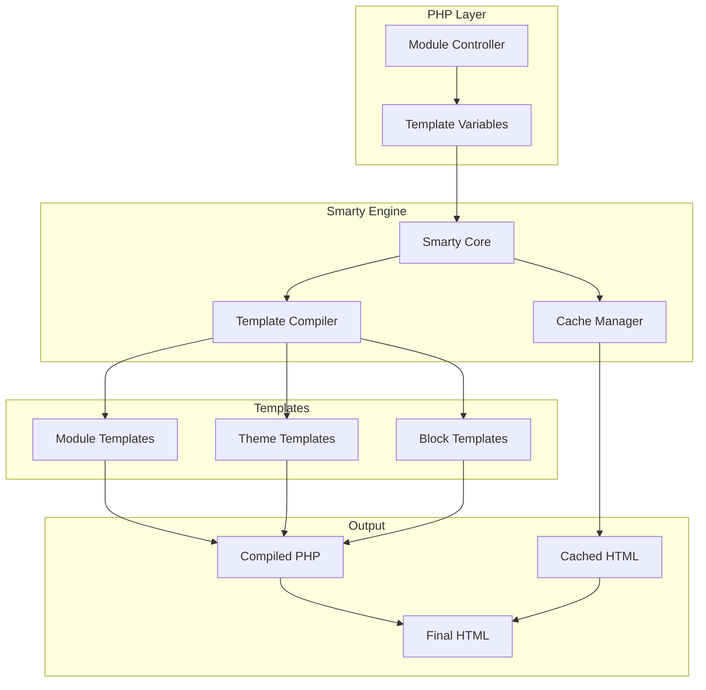
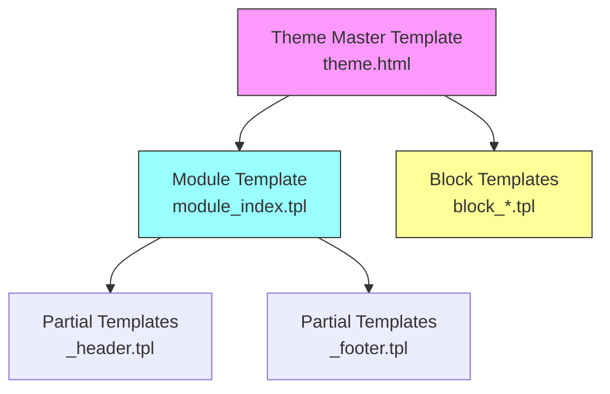
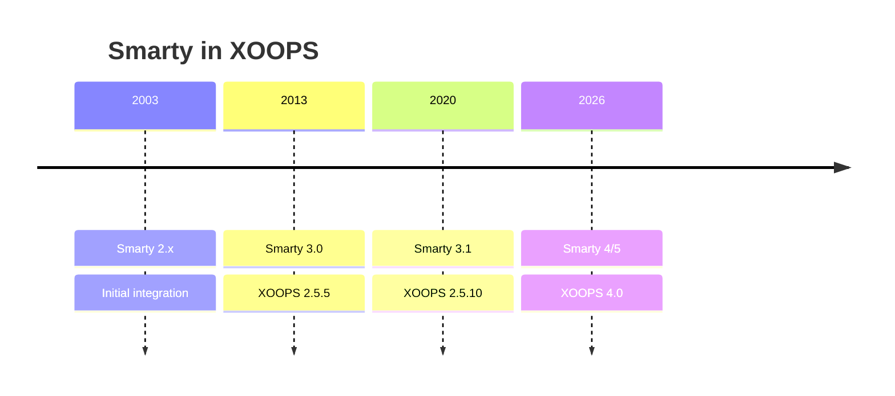

# ADR-003: Template Engine (Smarty)

> Architecture Decision Record for XOOPS's vedtagelse af Smarty-skabelonmotoren.

---

## Status

**Accepteret** - Kernebeslutning siden XOOPS 2.0

**Udvikler** - Migrering til Smarty 4/5 er planlagt til XOOPS 4.0

---

## Kontekst

XOOPS havde brug for en skabelonløsning, der ville:

1. Adskil præsentation fra forretningslogik
2. Tillad temadesignere at arbejde uden PHP viden
3. Støtte skabelon arv og inkluderer
4. Sørg for caching for ydeevne
5. Aktiver brugertilpassede skabeloner
6. Støtte internationalisering

---

## Beslutningsdiagram



---

## Beslutning

Vi vil bruge **Smarty** som skabelonmotor, fordi:

### 1. Adskillelse af bekymringer

```php
// PHP (Controller) - Business logic
$items = $itemHandler->getPublishedItems();
$xoopsTpl->assign('items', $items);

// Smarty (View) - Presentation
// templates/items.tpl
```

```smarty
{* Smarty template - No PHP logic *}
<{foreach item=item from=$items}>
    <article>
        <h2><{$item.title}></h2>
        <p><{$item.summary}></p>
    </article>
<{/foreach}>
```

### 2. XOOPS Afgrænsere

XOOPS bruger `<{` og `}>` i stedet for standard `{` `}`:

```smarty
{* Standard Smarty *}
{$variable}

{* XOOPS Smarty - Avoids JavaScript conflicts *}
<{$variable}>
```

### 3. Skabelonhierarki



### 4. Skabelonopbevaring

- **Database**: Tilpassede skabeloner gemt for at kunne vende tilbage
- **Filsystem**: Originale skabeloner i modulbiblioteker
- **Cache**: Kompilerede skabeloner til ydeevne

---

## Smarty-konfiguration

```php
// XOOPS Smarty initialization
$xoopsTpl = new XoopsTpl();

// Custom delimiters
$xoopsTpl->left_delim = '<{';
$xoopsTpl->right_delim = '}>';

// Caching
$xoopsTpl->caching = XOOPS_TEMPLATE_CACHE;
$xoopsTpl->cache_lifetime = 3600;

// Security
$xoopsTpl->security_policy = new Smarty_Security($xoopsTpl);
$xoopsTpl->security_policy->php_functions = [];
$xoopsTpl->security_policy->php_modifiers = ['escape', 'count'];
```

---

## Skabelonfunktioner brugt

### Variabler

```smarty
{* Simple variable *}
<{$title}>

{* Object property *}
<{$item.title}>

{* With modifier *}
<{$content|truncate:200:'...'}>

{* Escaped output *}
<{$userInput|escape:'html'}>
```

### Kontrolstrukturer

```smarty
{* Conditional *}
<{if $isAdmin}>
    <a href="admin.php">Admin</a>
<{elseif $isUser}>
    <a href="profile.php">Profile</a>
<{else}>
    <a href="login.php">Login</a>
<{/if}>

{* Loop *}
<{foreach item=item from=$items name=itemloop}>
    <{$smarty.foreach.itemloop.index}>: <{$item.title}>
<{/foreach}>
```

### Inkluderer

```smarty
{* Include another template *}
<{include file="db:mymodule_header.tpl"}>

{* Include with variables *}
<{include file="db:mymodule_item.tpl" item=$currentItem}>

{* Include from theme *}
<{include file="file:$theme_path/partials/sidebar.tpl"}>
```

---

## Konsekvenser

### Positiv

1. **Designervenlig**: HTML-lignende syntaks
2. **Caching**: Indbygget skabeloncaching
3. **Sikkerhed**: PHP kodeisolering
4. **Fleksibilitet**: Modifikatorer, funktioner, plugins
5. **Tilpasning**: Brugere kan ændre skabeloner
6. **Fællesskab**: Stort smart økosystem

### Negativ

1. **Læringskurve**: Smarty-specifik syntaks
2. **Overhead**: Kompileringstrin påkrævet
3. **Fejlretning**: Skabelonfejl kan være kryptiske
4. **Versionsproblemer**: Skiftende ændringer mellem versioner

### Afhjælpninger

- **Læring**: Omfattende dokumentation
- **Ydeevne**: Aggressiv caching
- **Fejlretning**: Fejlfindingskonsol, rydde fejlmeddelelser
- **Versioner**: Kompatibilitetslag i XOOPS

---

## Versionshistorik



---

## Migration: Smarty 3 til 4/5

### Brydende ændringer

```smarty
{* Smarty 3 - Deprecated *}
<{php}>echo date('Y');<{/php}>

{* Smarty 4+ - Use modifiers or assign from PHP *}
<{$current_year}>

{* Smarty 3 - {section} deprecated *}
<{section name=i loop=$items}>
    <{$items[i].title}>
<{/section}>

{* Smarty 4+ - Use {foreach} *}
<{foreach $items as $item}>
    <{$item.title}>
<{/foreach}>
```

### Kompatibilitetslag

XOOPS giver et kompatibilitetslag til jævne overgange:

```php
// XoopsTpl extends Smarty with compatibility methods
class XoopsTpl extends Smarty
{
    public function assign($tpl_var, $value = null)
    {
        // Handles both Smarty 3 and 4 syntax
        return parent::assign($tpl_var, $value);
    }
}
```

---

## Alternativer overvejet

### 1. Kvist
**Fordele**: Moderne Symfony-økosystem
** Ulemper**: Forskellig syntaks, migreringsindsats
**Beslutning**: Mulig fremtidig mulighed for XOOPS 3.x

### 2. Blade (Laravel)
**Fordele**: Ren syntaks, populær
**Udele**: Laravel-specifik
**Beslutning**: Ikke egnet til selvstændig brug

### 3. Native PHP skabeloner
**Fordele**: Ingen indlæringskurve, hurtigt
**Idele**: Sikkerhedsrisici, ingen adskillelse
**Afgørelse**: Afvist på grund af vedligeholdelse

---

## Relaterede beslutninger

- ADR-001: Modulær arkitektur
- ADR-002: Databaseabstraktion

---

## Referencer

- Smarty Dokumentation: https://www.smarty.net/docs/en/
- XOOPS skabelonsystemvejledning
- MVC mønster i webapplikationer

---

#xoops #arkitektur #adr #smart #skabeloner #design-beslutning
