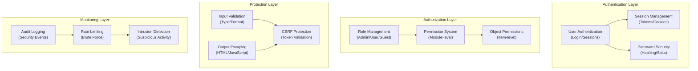

# ADR-004: Sikkerhedssystemarkitektur

> Omfattende sikkerhedsarkitektur til XOOPS CMS, der beskytter mod moderne trusler.

---

## Status

**Accepteret** - Kernesikkerhedslag siden XOOPS 2.5

---

## Kontekst

### Problemerklæring

XOOPS har brug for et robust sikkerhedssystem, der:

1. **Beskytter mod almindelige websårbarheder** (OWASP Top 10)
2. **Giver granulær tilladelseskontrol** på tværs af moduler
3. **Giver sikker brugergodkendelse** med moderne standarder
4. **Forhindrer databrud** og uautoriseret adgang
5. **Understøtter adgangskontrol på flere niveauer** (admin, moderator, bruger, gæst)
6. **Integrerer med alle moduler** problemfrit

### Aktuelle trusler

Moderne webangreb inkluderer:

- **SQL Injection** - Ondsindet SQL i brugerinput
- **XSS (Cross-Site Scripting)** - Injiceret JavaScript på sider
- **CSRF (forfalskning af anmodninger på tværs af websteder)** - Uautoriserede formularindsendelser
- **Authentication bypass** - Svag session/adgangskodehåndtering
- **Autorisationsomgåelse** - Privilegiumeskalering
- **Dataeksponering** - Følsomme data i URL'er, logfiler eller caches

### XOOPS Sikkerhedskrav

1. Brugergodkendelse og sessionsstyring
2. Rollebaseret adgangskontrol (RBAC)
3. Tilladelsessystem for moduler og objekter
4. Inputvalidering og output-escape
5. Beskyttelse mod almindelige angreb
6. Revisionslogning af sikkerhedshændelser
7. Sikker adgangskodehåndtering
8. CSRF token beskyttelse

---

## Beslutning

### Kernesikkerhedsarkitektur



---

## Sikkerhedskomponenter

### 1. Godkendelsessystem

**Brugerloginproces:**

```php
<?php
// 1. Validate credentials
$user = $userHandler->findByLogin($username);
if (!$user || !password_verify($password, $user->getVar('pass'))) {
    throw new AuthenticationException('Invalid credentials');
}

// 2. Check if account is active
if (!$user->getVar('uactive')) {
    throw new AuthenticationException('Account inactive');
}

// 3. Create secure session
session_regenerate_id(true);
$_SESSION['uid'] = $user->getVar('uid');
$_SESSION['token'] = bin2hex(random_bytes(32));
$_SESSION['created'] = time();

// 4. Log the login
$this->auditLog('USER_LOGIN', $user->getVar('uid'));
```

**Adgangskodesikkerhed:**

```php
<?php
// Use password_hash (not MD5 or SHA1)
$hashed = password_hash($password, PASSWORD_BCRYPT, [
    'cost' => 12, // High cost = slow brute force
]);

// Verify password
if (!password_verify($inputPassword, $hashed)) {
    throw new Exception('Invalid password');
}

// Rehash if algorithm or cost changed
if (password_needs_rehash($hashed, PASSWORD_BCRYPT, ['cost' => 12])) {
    $newHash = password_hash($password, PASSWORD_BCRYPT, ['cost' => 12]);
    $user->setVar('pass', $newHash);
    $userHandler->insert($user);
}
```

### 2. Sessionsstyring

**Sikker sessionshåndtering:**

```php
<?php
// Session configuration
ini_set('session.cookie_httponly', true);  // No JS access
ini_set('session.cookie_secure', true);     // HTTPS only
ini_set('session.cookie_samesite', 'Strict'); // CSRF protection
ini_set('session.gc_maxlifetime', 3600);   // 1 hour timeout
ini_set('session.sid_length', 64);         // 64-char session ID

// Validate session
function validateSession() {
    // Check timeout
    if (time() - $_SESSION['created'] > 3600) {
        session_destroy();
        throw new SessionExpiredException();
    }

    // Validate user agent (prevent session hijacking)
    if ($_SESSION['user_agent'] !== $_SERVER['HTTP_USER_AGENT']) {
        throw new SessionInvalidException();
    }

    // Validate IP (optional, can be too strict)
    if (!in_array($_SERVER['REMOTE_ADDR'], $_SESSION['ips'])) {
        $_SESSION['ips'][] = $_SERVER['REMOTE_ADDR'];
    }
}
```

### 3. Godkendelse (RBAC)

**Rollebaseret adgangskontrol:**

```php
<?php
class XoopsUser {
    public function hasPermission(string $permissionName): bool
    {
        // Get user groups
        $groups = $this->getGroups();

        // Check if any group has permission
        foreach ($groups as $groupId) {
            if ($this->checkGroupPermission($groupId, $permissionName)) {
                return true;
            }
        }

        return false;
    }

    /**
     * User groups and their permissions
     * Admin: Full access
     * Moderator: Content management
     * User: Create own content
     * Guest: Read-only access
     */
    private function checkGroupPermission(int $groupId, string $permission): bool
    {
        $permissions = [
            1 => ['admin_access'],                 // Admin group
            2 => ['moderate_content', 'edit_own'], // Moderator group
            3 => ['create_content', 'edit_own'],   // User group
            4 => [],                               // Guest group (no permissions)
        ];

        return in_array($permission, $permissions[$groupId] ?? []);
    }
}
```

### 4. Inputvalidering

**Undgå SQL-indsprøjtnings- og typefejl:**

```php
<?php
// Always use prepared statements
$sql = 'SELECT * FROM users WHERE id = ?';
$result = $db->query($sql, [$userId]); // ✅ Safe

// Input validation
function validateUserInput(array $data): array
{
    return [
        'email' => filter_var($data['email'] ?? '', FILTER_VALIDATE_EMAIL),
        'age' => filter_var($data['age'] ?? 0, FILTER_VALIDATE_INT),
        'website' => filter_var($data['website'] ?? '', FILTER_VALIDATE_URL),
        'title' => substr(trim($data['title'] ?? ''), 0, 255),
    ];
}

// XOOPS Safe Input class
$safe = \Xmf\Request::getHtmlRequest('var_name', '');
$int = \Xmf\Request::getInt('page', 1);
```

### 5. Output escape

**Forebyg XSS-angreb:**

```php
<?php
// In PHP templates
echo htmlspecialchars($userInput, ENT_QUOTES, 'UTF-8');

// In Smarty templates (automatic escaping)
<{$user_input}>  {* Escaped by default *}
<{$html|escape:false}>  {* Only when needed *}

// JavaScript context
<script>
var message = "<{$userMessage|escape:'javascript'}>";
</script>

// URL context
<a href="<{$url|escape:'url'}>">Link</a>
```

### 6. CSRF Beskyttelse

**Forebyggelse af anmodninger på tværs af websteder:**

```php
<?php
// Generate CSRF token
session_start();
if (empty($_SESSION['csrf_token'])) {
    $_SESSION['csrf_token'] = bin2hex(random_bytes(32));
}

// In forms
<form method="POST">
    <input type="hidden" name="csrf_token" value="<{$csrf_token}>">
    <button type="submit">Submit</button>
</form>

// Validate token
if ($_SERVER['REQUEST_METHOD'] === 'POST') {
    if (hash_equals($_SESSION['csrf_token'], $_POST['csrf_token'] ?? '')) {
        // Process form
    } else {
        throw new InvalidTokenException('CSRF token invalid');
    }
}
```

---

## Konsekvenser

### Positive effekter

1. **Omfattende beskyttelse** - Dækker større sårbarhedsklasser
2. **Layered Security** - Flere lag af forsvar
3. **Fleksibel RBAC** - Finmasket tilladelseskontrol
4. **Audit Trail** - Spor sikkerhedshændelser
5. **Industristandard** - stemmer overens med OWASP anbefalinger
6. **Modulintegration** - Nemt for moduler at bruge sikkerheds-API'er

### Negative effekter

1. **Kompleksitet** - Mere kode og konfiguration påkrævet
2. **Ydeevne** - Hashing og validering tilføjer overhead
3. **Brugeroplevelse** - Sikkerhed nogle gange ubelejligt
4. **Vedligeholdelse** - Kræver løbende sikkerhedsopdateringer
5. **Uddannelse påkrævet** - Udviklere skal følge praksis

### Risici og begrænsninger

| Risiko | Sværhedsgrad | Afbødning |
|------|--------|--------|
| Udvikler ignorerer sikkerhed | Høj | Kodegennemgang, sikkerhedstræning |
| Nye sårbarheder opdaget | Medium | Regelmæssige sikkerhedsrevisioner, opdateringer |
| Ydeevnepåvirkning | Lav | Optimer hot paths, caching |
| Alt for komplekse tilladelser | Medium | Tydelig dokumentation, eksempler |

---

## Bedste praksis for sikkerhed

### For moduludviklere

```php
<?php
// ✅ DO: Use prepared statements
$result = $db->prepare('SELECT * FROM table WHERE id = ?')->execute([$id]);

// ❌ DON'T: Concatenate queries
$result = $db->query("SELECT * FROM table WHERE id = $id");

// ✅ DO: Escape output
echo htmlspecialchars($user_input, ENT_QUOTES, 'UTF-8');

// ❌ DON'T: Output raw user data
echo $user_input;

// ✅ DO: Check permissions
if (!$user->hasPermission('edit_content')) {
    throw new PermissionException();
}

// ❌ DON'T: Trust user roles directly
if ($_POST['is_admin']) {
    // Make user admin - SECURITY HOLE!
}

// ✅ DO: Validate input types
$page = (int)$_GET['page'];

// ❌ DON'T: Use untrusted values directly
$sql .= " LIMIT " . $_GET['limit'];
```

---

## Alternativer overvejet

### OAuth/OpenID Tilslut

**Hvorfor ikke valgt i første omgang:** For kompleks til delt hostingmiljø, men god til fremtidig integration med eksterne godkendelsessystemer.

### To-faktor-godkendelse (2FA)

**Status:** Accepteret som udvidelse, ikke kernekrav, se ADR-006

### HTTP-only session-cookies

**Status:** Implementeret - forhindrer JavaScript adgang til sessionsdata

---

## Relaterede beslutninger

- ADR-001: Modulær arkitektur - Moduler implementerer sikkerhed
- ADR-005: Modultilladelsessystem
- ADR-006: To-faktor-godkendelse (fremtidig)

---

## Referencer

### Sikkerhedsstandarder- [OWASP Top 10](https://owasp.org/www-project-top-ten/)
- [NIST Cybersecurity Framework](https://www.nist.gov/cyberframework)
- [CWE Top 25](https://cwe.mitre.org/top25/)

### PHP Sikkerhed

- [PHP sikkerhedsmanual](https://www.php.net/manual/en/security.php)
- [password_hash() dokumentation](https://www.php.net/manual/en/function.password-hash.php)
- [Sessionssikkerhed](https://www.php.net/manual/en/session.security.php)

### Værktøjer

- [OWASP ZAP](https://www.zaproxy.org/) - Sikkerhedstest
- [Snyk](https://snyk.io/) - Sårbarhedsscanning
- [SonarQube](https://www.sonarqube.org/) - Kodekvalitet

---

## Implementeringstjekliste

- [ ] Brugergodkendelsessystem
- [ ] Sessionsstyring
- [ ] Password hashing (bcrypt)
- [ ] Rollebaseret adgangskontrol
- [ ] Modultilladelser
- [ ] Inputvalideringsramme
- [ ] Output escape (PHP + Smarty)
- [ ] CSRF token-beskyttelse
- [ ] Sikkerhedsrevisionslogning
- [ ] Satsbegrænsende
- [ ] Sikkerhedsoverskrifter

---

## Versionshistorik

| Version | Dato | Ændringer |
|--------|-------|--------|
| 1.0.0 | 2024-01-28 | Oprindeligt dokument |

---

#xoops #adr #sikkerhed #arkitektur #godkendelse #autorisation #rbac
