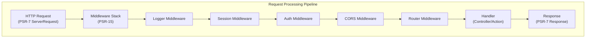

# ADR-005: PSR-15 Middleware-mønster til XOOPS 4.0

> Brug PSR-15 HTTP serverforespørgselshandlere (middleware) til forbedret pipeline til anmodningsbehandling.

:::caution[XOOPS 4.0-forslag — ikke tilgængelig i 2.5.x]
Denne ADR beskriver en **foreslået arkitektur for XOOPS 4.0**. PSR-15 middleware er **ikke tilgængelig i XOOPS 2.5.x**. Nuværende 2.5.x-moduler bruger Page Controller-mønsteret med `mainfile.php` bootstrap. Se XOOPS arkitektur for den aktuelle anmodnings livscyklus.
:::

---

## Status

**Foreslået** - Under evaluering for XOOPS 4.0-udgivelsen

---

## Kontekst

### Nuværende tilgang

XOOPS 2.5 bruger en monolitisk anmodningshåndteringstilgang:

```php
// Current: Sequential processing
require_once 'mainfile.php';
// → Kernel initialization
// → User authentication
// → Module loading
// → Page rendering

// All in one flow, mixed concerns
```

### Problemer med den nuværende tilgang

1. **Blandede bekymringer** - Autentificering, logning, routing alt sammenflettet
2. **Svært at teste** - Svært at enhedsteste individuelle anmodningsbehandlingstrin
3. **Svært at udvide** - Moduler kan kun tilsluttes via forudindlæsning/begivenheder
4. **Dårlig adskillelse** - Anmodningsbehandlingslogik spredt ud over kodebasen
5. **Ikke komponerbar** - Kan ikke nemt sammenkæde eller omarrangere behandlingstrin

### Hvad er PSR-15 Middleware?

PSR-15 definerer en standardgrænseflade til HTTP middleware:

```php
<?php
interface RequestHandlerInterface {
    public function handle(ServerRequestInterface $request): ResponseInterface;
}

interface MiddlewareInterface {
    public function process(
        ServerRequestInterface $request,
        RequestHandlerInterface $handler
    ): ResponseInterface;
}
```

**Middelvarekæde:**

```
Request
  ↓
[Logger] → logs request
  ↓
[Auth] → validates user session
  ↓
[CORS] → checks cross-origin
  ↓
[Router] → dispatches to handler
  ↓
[Handler] → generates response
  ↓
Response
```

---

## Beslutning

### Adopter PSR-15 Middleware Stack til XOOPS 4.0

Implementer en middleware-baseret anmodningsbehandlingspipeline efter PSR-15-standarden.

### Arkitekturoversigt



### Centrale Middleware-komponenter

#### 1. Application Middleware (Core Layer)

```php
<?php
declare(strict_types=1);

namespace XoopsCore;

use Psr\Http\Message\ResponseInterface;
use Psr\Http\Message\ServerRequestInterface;
use Psr\Http\Server\MiddlewareInterface;
use Psr\Http\Server\RequestHandlerInterface;

class SessionMiddleware implements MiddlewareInterface
{
    public function process(
        ServerRequestInterface $request,
        RequestHandlerInterface $handler
    ): ResponseInterface {
        // 1. Retrieve session (or start new)
        $sessionId = $request->getCookieParams()['PHPSESSID'] ?? null;
        $session = $this->sessionManager->load($sessionId);

        // 2. Attach session to request
        $request = $request->withAttribute('session', $session);

        // 3. Pass to next middleware
        $response = $handler->handle($request);

        // 4. Set session cookie if needed
        if ($session->isModified()) {
            $response = $response->withAddedHeader(
                'Set-Cookie',
                'PHPSESSID=' . $session->getId() . '; HttpOnly; SameSite=Strict'
            );
        }

        return $response;
    }
}
```

#### 2. Authentication Middleware

```php
<?php
class AuthMiddleware implements MiddlewareInterface
{
    public function process(
        ServerRequestInterface $request,
        RequestHandlerInterface $handler
    ): ResponseInterface {
        // Get session from previous middleware
        $session = $request->getAttribute('session');

        // Authenticate user from session
        $user = $this->authenticate($session);

        // Attach user to request
        $request = $request->withAttribute('user', $user);

        return $handler->handle($request);
    }

    private function authenticate(?Session $session): User
    {
        if ($session && $session->has('uid')) {
            return $this->userRepository->findById($session->get('uid'));
        }

        return new AnonymousUser();
    }
}
```

#### 3. Autorisation Middleware

```php
<?php
class AuthorizationMiddleware implements MiddlewareInterface
{
    public function __construct(private AuthorizationChecker $checker)
    {
    }

    public function process(
        ServerRequestInterface $request,
        RequestHandlerInterface $handler
    ): ResponseInterface {
        $user = $request->getAttribute('user');
        $route = $request->getAttribute('route');

        // Check if user has permission for this route
        if (!$this->checker->isGranted($user, $route)) {
            return new JsonResponse(
                ['error' => 'Unauthorized'],
                403
            );
        }

        return $handler->handle($request);
    }
}
```

#### 4. Modul Middleware

```php
<?php
// Modules can provide their own middleware
class PublisherAccessMiddleware implements MiddlewareInterface
{
    public function process(
        ServerRequestInterface $request,
        RequestHandlerInterface $handler
    ): ResponseInterface {
        $user = $request->getAttribute('user');

        // Module-specific access control
        if (!$user->hasPermission('publisher_view')) {
            return new HtmlResponse('Access denied', 403);
        }

        return $handler->handle($request);
    }
}
```

### Implementeringseksempel

```php
<?php
// bootstrap.php - Application setup

use Psr\Http\Message\ServerRequestInterface;
use Psr\Http\Server\RequestHandlerInterface;
use Xoops\Core\Middleware\{
    LoggerMiddleware,
    SessionMiddleware,
    AuthMiddleware,
    CorsMiddleware,
    ErrorHandlingMiddleware
};

// Create middleware pipeline
$middlewareStack = [
    // 1. Error handling (outermost)
    new ErrorHandlingMiddleware(),

    // 2. Logging
    new LoggerMiddleware($logger),

    // 3. CORS handling
    new CorsMiddleware($corsConfig),

    // 4. Session management
    new SessionMiddleware($sessionManager),

    // 5. Authentication
    new AuthMiddleware($userRepository),

    // 6. Authorization
    new AuthorizationMiddleware($authChecker),

    // 7. Routing and dispatching
    new RoutingMiddleware($router),

    // 8. Module middleware (dynamic)
    ...$this->loadModuleMiddleware(),
];

// Process request through middleware stack
$request = ServerRequestFactory::fromGlobals();
$dispatcher = new MiddlewareDispatcher($middlewareStack);
$response = $dispatcher->dispatch($request);

// Send response
http_response_code($response->getStatusCode());
foreach ($response->getHeaders() as $name => $values) {
    foreach ($values as $value) {
        header("$name: $value", false);
    }
}
echo $response->getBody();
```

### Modulintegration

Moduler kan levere middleware:

```php
<?php
// Publisher module - xoops_version.php

$modversion['middleware'] = [
    'PublisherAccessMiddleware' => true,      // Auto-load
    'PublisherLogMiddleware' => true,
];

// Or custom:
$modversion['middleware_factory'] = function() {
    return [
        new PublisherCacheMiddleware(),
        new PublisherPermissionMiddleware(),
    ];
};
```

---

## Konsekvenser

### Positive effekter

1. **Adskillelse af bekymringer** - Hver middleware håndterer ét ansvar
2. **Testbarhed** - Let at enhedsteste individuelle middleware-komponenter
3. **Komponerbarhed** - Middleware kan blandes og omarrangeres
4. **Overholder standarder** - Bruger standarderne PSR-15 og PSR-7
5. **Udvidelighed** - Moduler kan nemt tilføje tilpasset middleware
6. **Debugging** - Ryd anmodningsflow gennem pipeline
7. **Ydeevne** - Kan optimere specifikke middleware-lag
8. **Interoperabilitet** - Kan bruge tredjeparts PSR-15 middleware

### Negative effekter

1. **Læringskurve** - Udviklere skal forstå PSR-15
2. **Performance Overhead** - Flere funktionskald i pipeline
3. **Kompleksitet** - Flere bevægelige dele end monolitisk tilgang
4. **Migreringsindsats** - Kræver refaktorisering af eksisterende kode
5. **Afhængigheder** - Kræver PSR-7 HTTP bibliotek

### Risici og begrænsninger

| Risiko | Sværhedsgrad | Afbødning |
|------|--------|--------|
| Komplekse middleware-kæder | Medium | Tydelig dokumentation, eksempler |
| Ydeevneforringelse | Medium | Benchmark, optimer hot paths |
| Misbrug af udviklere | Medium | Kodegennemgang, guide til bedste praksis |
| Ændringer i migrationen | Høj | Afskrivningsperiode, hjælpere |
| Middleware-bestillingsproblemer | Medium | Ryd afhængighedsgraf |

---

## Implementeringsplan

### Fase 1: Fundering (Q2 2026)

- [ ] Implementer PSR-7 HTTP meddelelsesindpakning
- [ ] Opret MiddlewareDispatcher
- [ ] Implementer kerne-middleware (session, godkendelse)
- [ ] Opdater kerne for at bruge middleware

### Fase 2: Integration (3. kvartal 2026)

- [ ] Migrer eksisterende funktionalitet til middleware
- [ ] Tilføj modul-middleware-understøttelse
- [ ] Opret middleware-testværktøjer
- [ ] Skriv omfattende dokumentation

### Fase 3: Migration (4. kvartal 2026)

- [ ] Giv kompatibilitetslag til gammel kode
- [ ] Hjælpemoduler opdateres til ny middleware
- [ ] Ydelsesoptimering
- [ ] Sikkerhedsrevision

### Fase 4: Udgivelse (Q1 2027)- [ ] XOOPS 4.0 udgivelse med middleware
- [ ] Udgå gammelt preload/hook system
- [ ] Community feedback og opdateringer

---

## Succeskriterier

- [ ] Al kernefunktionalitet migreret til middleware
- [ ] 90 %+ testdækning for middleware
- [ ] Dokumentation komplet med eksempler
- [ ] Ydelse inden for 10 % af tidligere version
- [ ] Moduler bruger med succes nyt middleware-system
- [ ] Fællesskabets adoptionsrate >80 %

---

## Best Practices for Middleware

### Gør

- Hold fokus på middleware (enkelt ansvar)
- Brug uforanderlighed (opret ny anmodning/svar)
- Håndter fejl med ynde
- Dokumentafhængigheder
- Tilføj typetip
- Skrive tests til middleware
- Brug standard PSR-15-grænseflader

### Lad være

- Rediger ikke delte anmodnings-/svarobjekter
- Få ikke direkte adgang til globaler
- Opret ikke afhængigheder af middleware-rækkefølge
- Fang ikke alle undtagelser
- Bland ikke forretningslogik med middleware
- Lad ikke middleware gøre for meget

---

## Eksempler

### Brugerdefineret Middleware

```php
<?php
// Example: Rate limiting middleware

use Psr\Http\Message\ResponseInterface;
use Psr\Http\Message\ServerRequestInterface;
use Psr\Http\Server\MiddlewareInterface;
use Psr\Http\Server\RequestHandlerInterface;

class RateLimitMiddleware implements MiddlewareInterface
{
    public function __construct(
        private RateLimiter $limiter,
        private int $limit = 100,
        private int $window = 3600
    ) {
    }

    public function process(
        ServerRequestInterface $request,
        RequestHandlerInterface $handler
    ): ResponseInterface {
        $user = $request->getAttribute('user');
        $identifier = $user->getId() ?? $request->getClientIp();

        // Check rate limit
        $remaining = $this->limiter->check($identifier, $this->limit, $this->window);

        if ($remaining < 0) {
            return new JsonResponse(
                ['error' => 'Rate limit exceeded'],
                429
            );
        }

        // Add rate limit headers
        $response = $handler->handle($request);
        return $response
            ->withAddedHeader('X-RateLimit-Limit', (string)$this->limit)
            ->withAddedHeader('X-RateLimit-Remaining', (string)$remaining);
    }
}
```

---

## Relaterede beslutninger

- ADR-001: Modulær arkitektur - Fundament
- ADR-004: Sikkerhedssystem - Bruger middleware til godkendelse
- ADR-006: To-faktor godkendelse - Kan være middleware

---

## Referencer

### PSR standarder

- [PSR-7: HTTP meddelelsesgrænseflade](https://www.php-fig.org/psr/psr-7/)
- [PSR-15: HTTP Server Request Handlers](https://www.php-fig.org/psr/psr-15/)

### Middleware Frameworks

- [Slim Framework](https://www.slimframework.com/) - Middleware-eksempler
- [Zend Expressive](https://docs.zendframework.com/zend-expressive/) - PSR-15 framework
- [Guzzle](https://docs.guzzlephp.org/) - HTTP klient-middleware

### Værktøjer

- [RelayPHP](https://relayphp.com/) - Middleware-bibliotek
- [PSR-15 Middleware](https://github.com/middlewares) - Indsamling af middleware

---

## Versionshistorik

| Version | Dato | Ændringer |
|--------|-------|--------|
| 1.0.0 | 2024-01-28 | Oprindeligt forslag |

---

#xoops #adr #psr-15 #middleware #arkitektur #psr-7
