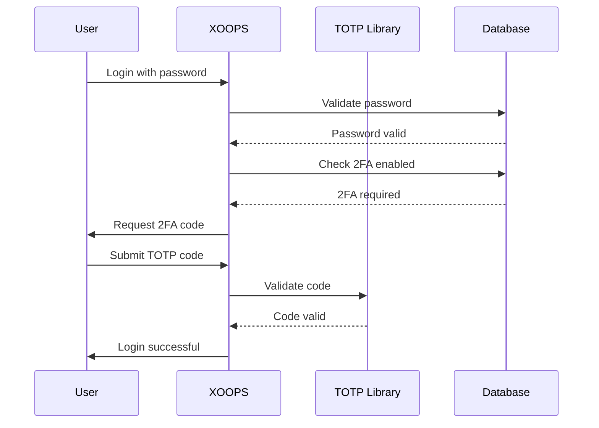

## Status

Foreslået

## Kontekst

XOOPS har brug for øget sikkerhed til brugergodkendelse. To-faktor autentificering (2FA) giver et ekstra lag af sikkerhed ud over adgangskoder, og beskytter konti, selvom adgangskoder er kompromitteret.

Nøgleovervejelser:
- Bagudkompatibilitet med eksisterende godkendelse
- Understøttelse af flere 2FA-metoder
- Brugeroplevelse under opsætning og login
- Gendannelsesmekanismer for mistede enheder
- Integration med eksisterende tilladelsessystem

## Beslutning

Vi vil implementere TOTP (Time-based One-Time Password) som den primære 2FA-metode med understøttelse af backup-koder.

### Implementeringsmetode



### Databaseskema

```sql
CREATE TABLE `{PREFIX}_users_2fa` (
    `user_id` INT(11) NOT NULL,
    `secret` VARCHAR(32) NOT NULL,
    `enabled` TINYINT(1) DEFAULT 0,
    `backup_codes` TEXT,
    `last_used` INT(11),
    `created` INT(11) NOT NULL,
    PRIMARY KEY (`user_id`),
    FOREIGN KEY (`user_id`) REFERENCES `{PREFIX}_users`(`uid`)
);
```

### Servicegrænseflade

```php
interface TwoFactorAuthInterface
{
    public function enable(int $userId): TwoFactorSetup;
    public function disable(int $userId): void;
    public function verify(int $userId, string $code): bool;
    public function generateBackupCodes(int $userId): array;
    public function isEnabled(int $userId): bool;
}
```

### Middleware-integration

```php
class TwoFactorMiddleware implements MiddlewareInterface
{
    public function process(
        ServerRequestInterface $request,
        RequestHandlerInterface $handler
    ): ResponseInterface {
        $session = $request->getAttribute('session');

        if ($session->has('pending_2fa_user_id')) {
            // User needs to complete 2FA
            if ($this->isVerificationRequest($request)) {
                return $handler->handle($request);
            }
            return new RedirectResponse('/2fa/verify');
        }

        return $handler->handle($request);
    }
}
```

## Konsekvenser

### Positiv

- Betydeligt forbedret kontosikkerhed
- Branchestandard TOTP-kompatibilitet (Google Authenticator, Authy osv.)
- Backup-koder forhindrer kontolåsning
- Valgfri pr. bruger - tvinger ikke vedtagelse
- PSR-15 middleware tillader ren integration

### Negativ

- Yderligere login-trin påvirker brugeroplevelsen
- Brugere skal administrere godkendelsesapps
- Tabte enheder kræver gendannelsesproces
- Yderligere databaselagring og forespørgsler
- Kræver kryptografisk biblioteksafhængighed

### Migrationssti

1. Tilføj databasetabel til 2FA-data
2. Implementer TOTP-tjenesten med biblioteksafhængighed
3. Tilføj middleware til godkendelseskæden
4. Opret opsætnings- og verifikations-UI
5. Admin mulighed for at kræve 2FA for specifikke grupper

## Alternativer overvejet

### SMS-baseret OTP

Afvist på grund af:
- SIM udskiftning af sårbarheder
- Pris for SMS gateway
- Telefonnummerbekræftelseskompleksitet
- Bekymringer om privatlivets fred

### Hardwaresikkerhedsnøgler (WebAuthn)

Udskudt til fremtidig ADR:
- Mere kompleks implementering
- Historisk begrænset browserunderstøttelse
- Højere brugeromkostninger
- Kunne tilføjes sammen med TOTP senere

### E-mail-baseret OTP

Afvist på grund af:
- E-mail-konto kompromis besejrer formålet
- Leveringsforsinkelser påvirker UX
- Problemer med spamfilter

## Referencer

- [RFC 6238 - TOTP](https://tools.ietf.org/html/rfc6238)
- [Google Authenticator Key Format](https://github.com/google/google-authenticator/wiki/Key-Uri-Format)
- ../../02-Core-Concepts/Security/Security-Best-Practices - Sikkerhedsretningslinjer
- ../../02-Core-Concepts/Users-Permissions/Authentication - Godkendelsessystemdokumentation
