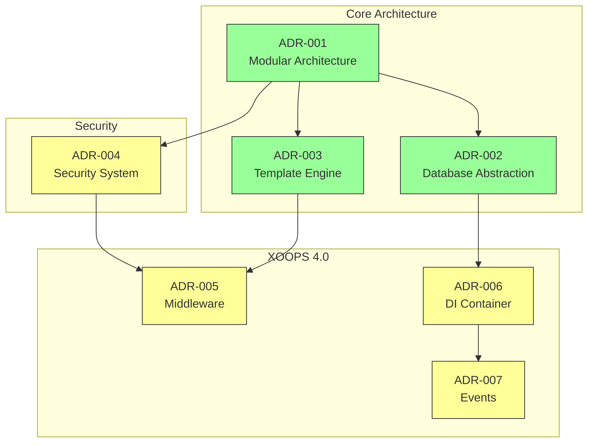
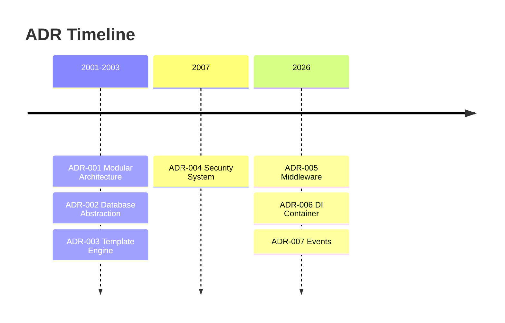

# 📋 Indeks for arkitekturbeslutninger

> Omfattende indeks over arkitektoniske beslutninger, der formede XOOPS CMS.

---

## Hvad er bivirkninger?

Architecture Decision Records (ADR'er) dokumenterer væsentlige arkitektoniske beslutninger truffet under udviklingen af ​​XOOPS. De fanger konteksten, beslutningen og konsekvenserne af hvert valg og giver værdifuld historisk kontekst for vedligeholdere og bidragydere.

---

## ADR Statusforklaring

| Status | Betydning |
|--------|--------|
| **Foreslået** | Under diskussion, endnu ikke accepteret |
| **Accepteret** | Beslutningen er vedtaget |
| **Forældet** | Ikke længere anbefalet |
| **Afløst** | Erstattet af en anden ADR |

---

## Aktuelle ADRs

### Grundlæggende beslutninger

| ADR | Titel | Status | Indvirkning |
|-----|-------|--------|--------|
| ADR-001 | Modulær arkitektur | Accepteret | Kerne |
| ADR-002 | Objektorienteret databaseadgang | Accepteret | Kerne |
| ADR-003 | Smarty skabelonmotor | Accepteret | Kerne |

### Planlagte ADR'er (XOOPS 4.0)

| ADR | Titel | Status | Indvirkning |
|-----|-------|--------|--------|
| ADR-004 | Design af sikkerhedssystemer | Foreslået | Sikkerhed |
| ADR-005 | PSR-15 Middleware | Foreslået | Arkitektur |
| ADR-006 | Dependency Injection Container | Foreslået | Arkitektur |
| ADR-007 | Event System Redesign | Foreslået | Arkitektur |

---

## ADR Relationer



---

## Tidslinje



---

## Oprettelse af nye ADR'er

Når du foreslår en ny arkitektonisk beslutning:

1. Kopier ADR skabelonen
2. Udfyld alle sektioner
3. Send som Pull-anmodning
4. Diskuter i GitHub Issues
5. Opdater status efter beslutning

### ADR skabelonstruktur

```markdown
# ADR-XXX: Title

## Status
Proposed | Accepted | Deprecated | Superseded

## Context
What is the issue motivating this decision?

## Decision
What is the change that we're proposing?

## Consequences
What becomes easier or harder as a result?

## Alternatives Considered
What other options were evaluated?
```

---

## 🔗 Relateret dokumentation

- Kernekoncepter
- Bidragende retningslinjer
- XOOPS 4.0 køreplan

---

#xoops #adr #arkitektur #indeks #beslutninger
