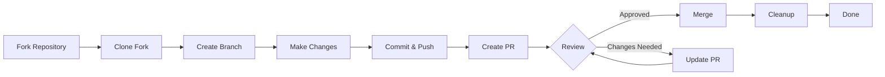

> Denne guide guider dig gennem hele processen med at bidrage til XOOPS, fra den indledende opsætning til den fusionerede pull-anmodning.

---

## Forudsætninger

Før du begynder at bidrage, skal du sikre dig, at du har:

- **Git** installeret og konfigureret
- **GitHub konto** (gratis)
- **PHP 7.4+** til XOOPS udvikling
- **Komponist** til afhængighedsstyring
- Grundlæggende kendskab til Git arbejdsgange
- Kendskab til Code of Conduct

---

## Trin 1: Fork the Repository

### På GitHub webgrænseflade

1. Naviger til lageret (f.eks. `XOOPS/XoopsCore27`)
2. Klik på knappen **Fork** i øverste højre hjørne
3. Vælg, hvor der skal fordeles (din personlige konto)
4. Vent på, at gaflen er færdig

### Hvorfor Fork?

- Du får dit eget eksemplar at arbejde videre med
- Vedligeholdere behøver ikke at styre mange filialer
- Du har fuld kontrol over din gaffel
- Pull Requests refererer til din gaffel og opstrøms repo

---

## Trin 2: Klon din gaffel lokalt

```bash
# Clone your fork (replace YOUR_USERNAME)
git clone https://github.com/YOUR_USERNAME/XoopsCore27.git
cd XoopsCore27

# Add upstream remote to track original repository
git remote add upstream https://github.com/XOOPS/XoopsCore27.git

# Verify remotes are set correctly
git remote -v
# origin    https://github.com/YOUR_USERNAME/XoopsCore27.git (fetch)
# origin    https://github.com/YOUR_USERNAME/XoopsCore27.git (push)
# upstream  https://github.com/XOOPS/XoopsCore27.git (fetch)
# upstream  https://github.com/XOOPS/XoopsCore27.git (nofetch)
```

---

## Trin 3: Opsæt udviklingsmiljø

### Installer afhængigheder

```bash
# Install Composer dependencies
composer install

# Install development dependencies
composer install --dev

# For module development
cd modules/mymodule
composer install
```

### Konfigurer Git

```bash
# Set your Git identity
git config user.name "Your Name"
git config user.email "your.email@example.com"

# Optional: Set global Git config
git config --global user.name "Your Name"
git config --global user.email "your.email@example.com"
```

### Kør test

```bash
# Make sure tests pass in clean state
./vendor/bin/phpunit

# Run specific test suite
./vendor/bin/phpunit --testsuite unit
```

---

## Trin 4: Opret funktionsgren

### Filialnavnekonvention

Følg dette mønster: `<type>/<description>`

**Typer:**
- `feature/` - Ny funktion
- `fix/` - Fejlrettelse
- `docs/` - Kun dokumentation
- `refactor/` - Kode refactoring
- `test/` - Testtilføjelser
- `chore/` - Vedligeholdelse, værktøj

**Eksempler:**
```bash
# Feature branch
git checkout -b feature/add-two-factor-auth

# Bug fix branch
git checkout -b fix/prevent-xss-in-forms

# Documentation branch
git checkout -b docs/update-api-guide

# Always branch from upstream/main (or develop)
git checkout -b feature/my-feature upstream/main
```

### Hold afdelingen opdateret

```bash
# Before you start work, sync with upstream
git fetch upstream
git merge upstream/main

# Later, if upstream has changed
git fetch upstream
git rebase upstream/main
```

---

## Trin 5: Foretag dine ændringer

### Udviklingspraksis

1. **Skriv kode** efter PHP-standarderne
2. **Skriv test** for ny funktionalitet
3. **Opdater dokumentation** om nødvendigt
4. **Kør linters** og kodeformatere

### Kodekvalitetstjek

```bash
# Run all tests
./vendor/bin/phpunit

# Run with coverage
./vendor/bin/phpunit --coverage-html coverage/

# Run PHP CS Fixer
./vendor/bin/php-cs-fixer fix --dry-run

# Run PHPStan static analysis
./vendor/bin/phpstan analyse class/ src/
```

### Begå gode ændringer

```bash
# Check what you changed
git status
git diff

# Stage specific files
git add class/MyClass.php
git add tests/MyClassTest.php

# Or stage all changes
git add .

# Commit with descriptive message
git commit -m "feat(auth): add two-factor authentication support"
```

---

## Trin 6: Hold grenen synkroniseret

Mens du arbejder på din funktion, kan hovedgrenen gå videre:

```bash
# Fetch latest changes from upstream
git fetch upstream

# Option A: Rebase (preferred for clean history)
git rebase upstream/main

# Option B: Merge (simpler but adds merge commits)
git merge upstream/main

# If conflicts occur, resolve them then:
git add .
git rebase --continue  # or git merge --continue
```

---

## Trin 7: Skub til din gaffel

```bash
# Push your branch to your fork
git push origin feature/my-feature

# On subsequent pushes
git push

# If you rebased, you might need force push (use carefully!)
git push --force-with-lease origin feature/my-feature
```

---

## Trin 8: Opret pull-anmodning

### På GitHub webgrænseflade

1. Gå til din gaffel på GitHub
2. Du vil se en meddelelse om at oprette en PR fra din filial
3. Klik på **"Sammenlign og træk anmodning"**
4. Eller klik manuelt på **"Ny pull request"** og vælg din filial

### PR-titel og beskrivelse

**Titelformat:**
```
<type>(<scope>): <subject>
```

Eksempler:
```
feat(auth): add two-factor authentication
fix(forms): prevent XSS in text input
docs: update installation guide
refactor(core): improve performance
```

**Beskrivelsesskabelon:**

```markdown
## Description
Brief explanation of what this PR does.

## Changes
- Changed X from A to B
- Added feature Y
- Fixed bug Z

## Type of Change
- [ ] New feature (adds new functionality)
- [ ] Bug fix (fixes an issue)
- [ ] Breaking change (API/behavior change)
- [ ] Documentation update

## Testing
- [ ] Added tests for new functionality
- [ ] All existing tests pass
- [ ] Manual testing performed

## Screenshots (if applicable)
Include before/after screenshots for UI changes.

## Related Issues
Closes #123
Related to #456

## Checklist
- [ ] Code follows style guidelines
- [ ] Self-reviewed own code
- [ ] Commented complex code
- [ ] Updated documentation
- [ ] No new warnings generated
- [ ] Tests pass locally
```

### PR Review Tjekliste

Før du indsender, skal du sikre dig:

- [ ] Koden følger PHP standarder
- [ ] Prøver er inkluderet og består
- [ ] Dokumentation opdateret (hvis nødvendigt)
- [ ] Ingen fusionskonflikter
- [ ] Forpligtelsesbeskeder er klare
- [ ] Der henvises til relaterede emner
- [ ] PR-beskrivelsen er detaljeret
- [ ] Ingen fejlretningskode eller konsollogfiler

---

## Trin 9: Svar på feedback

### Under kodegennemgang

1. **Læs kommentarer omhyggeligt** - Forstå feedbacken
2. **Stil spørgsmål** - Hvis det er uklart, så bed om afklaring
3. **Druter alternativer** - Debatter respektfuldt tilgange
4. **Foretag ønskede ændringer** - Opdater din filial
5. **Force-push opdaterede commits** - Hvis historikken omskrives

```bash
# Make changes
git add .
git commit --amend  # Modify last commit
git push --force-with-lease origin feature/my-feature

# Or add new commits
git commit -m "Address feedback on PR review"
git push origin feature/my-feature
```

### Forvent iteration

- De fleste PR'er kræver flere gennemgangsrunder
- Vær tålmodig og konstruktiv
- Se feedback som læringsmulighed
- Vedligeholdere kan foreslå refaktorer

---

## Trin 10: Sammenfletning og oprydning

### Efter godkendelse

Når vedligeholdere godkender og fusionerer:

1. **GitHub flettes automatisk** eller vedligeholdelsesklik flettes
2. **Din filial er slettet** (normalt automatisk)
3. **Ændringer er i upstream**

### Lokal oprydning

```bash
# Switch to main branch
git checkout main

# Update main with merged changes
git fetch upstream
git merge upstream/main

# Delete local feature branch
git branch -d feature/my-feature

# Delete from your fork (if not auto-deleted)
git push origin --delete feature/my-feature
```

---

## Workflow-diagram



---

## Almindelige scenarier

### Synkronisering før start

```bash
# Always start fresh
git fetch upstream
git checkout -b feature/new-thing upstream/main
```

### Tilføjelse af flere tilsagn

```bash
# Just push again
git add .
git commit -m "feat: additional changes"
git push origin feature/new-thing
```

### Udbedring af fejl

```bash
# Last commit has wrong message
git commit --amend -m "Correct message"
git push --force-with-lease

# Revert to previous state (careful!)
git reset --soft HEAD~1  # Keep changes
git reset --hard HEAD~1  # Discard changes
```

### Håndtering af flettekonflikter

```bash
# Rebase and resolve conflicts
git fetch upstream
git rebase upstream/main

# Edit conflicted files to resolve
# Then continue
git add .
git rebase --continue
git push --force-with-lease
```

---

## Bedste praksis

### Gør

- Hold filialer fokuseret på enkelte emner
- Lav små, logiske forpligtelser
- Skriv beskrivende forpligtelsesbeskeder
- Opdater din filial ofte
- Test før du skubber
- Dokumentændringer
- Vær lydhør over for feedback

### Lad være- Arbejde direkte på hoved-/mastergren
- Bland ikke-relaterede ændringer i én PR
- Commit genererede filer eller node_modules
- Tving push efter PR er offentlig (brug --force-with-lease)
- Ignorer feedback om kodegennemgang
- Opret enorme PR'er (bræk op i mindre)
- Send følsomme data (API nøgler, adgangskoder)

---

## Tips til succes

### Kommuniker

- Stil spørgsmål i spørgsmål inden arbejdet påbegyndes
- Bed om vejledning om komplekse ændringer
- Diskuter tilgang i PR-beskrivelsen
- Svar på feedback omgående

### Følg standarder

- Gennemgå PHP standarder
- Tjek retningslinjer for problemrapportering
- Læs bidragende oversigt
- Følg retningslinjerne for Pull Request

### Lær kodebasen

- Læs eksisterende kodemønstre
- Undersøg lignende implementeringer
- Forstå arkitekturen
- Tjek kernekoncepter

---

## Relateret dokumentation

- Code of Conduct
- Pull Request Guidelines
- Problemrapportering
- PHP kodningsstandarder
- Bidragende overblik

---

#xoops #git #github #bidragende #workflow #pull-request
