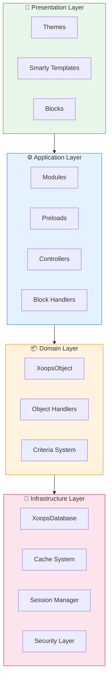
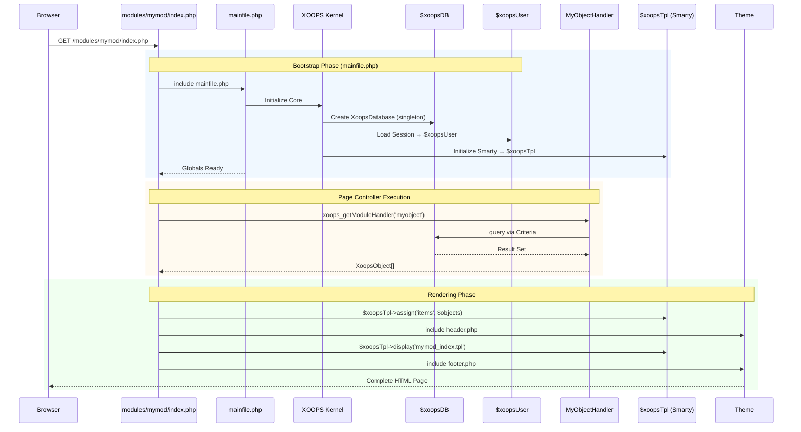

:::note[Om dette dokument]
Denne side beskriver den **konceptuelle arkitektur** af XOOPS, der gælder for både nuværende (2.5.x) og fremtidige (4.0.x) versioner. Nogle diagrammer viser den lagdelte designvision.

**For versionsspecifikke detaljer:**
- **XOOPS 2.5.x Today:** Bruger `mainfile.php`, globals (`$xoopsDB`, `$xoopsUser`), forudindlæsninger og handlermønster
- **XOOPS 4.0 Mål:** PSR-15 middleware, DI-beholder, router - se [Roadmap](../../07-XOOPS-4.0/XOOPS-4.0-Roadmap.md)
:::

Dette dokument giver et omfattende overblik over XOOPS systemarkitekturen og forklarer, hvordan de forskellige komponenter arbejder sammen for at skabe et fleksibelt og udvidbart indholdsstyringssystem.

## Oversigt

XOOPS følger en modulær arkitektur, der adskiller bekymringer i forskellige lag. Systemet er bygget op omkring flere kerneprincipper:

- **Modularitet**: Funktionalitet er organiseret i uafhængige, installerbare moduler
- **Udvidelsesmuligheder**: Systemet kan udvides uden at ændre kernekoden
- **Abstraktion**: Database- og præsentationslag er abstraheret fra forretningslogik
- **Sikkerhed**: Indbyggede sikkerhedsmekanismer beskytter mod almindelige sårbarheder

## Systemlag



### 1. Præsentationslag

Præsentationslaget håndterer brugergrænsefladegengivelse ved hjælp af Smarty-skabelonmotoren.

**Nøglekomponenter:**
- **Temaer**: Visuel styling og layout
- **Smarty skabeloner**: Dynamisk indholdsgengivelse
- **Blokkeringer**: Genanvendelige indholdswidgets

### 2. Applikationslag

Applikationslaget indeholder forretningslogik, controllere og modulfunktionalitet.

**Nøglekomponenter:**
- **Moduler**: Selvstændige funktionspakker
- **Behandlere**: Datamanipulationsklasser
- **Preloads**: Eventlyttere og hooks

### 3. Domænelag

Domænelaget indeholder kerneforretningsobjekter og regler.

**Nøglekomponenter:**
- **XoopsObject**: Basisklasse for alle domæneobjekter
- **Behandlere**: CRUD operationer for domæneobjekter

### 4. Infrastrukturlag

Infrastrukturlaget leverer kernetjenester som databaseadgang og caching.

## Anmod om livscyklus

At forstå anmodningens livscyklus er afgørende for effektiv udvikling af XOOPS.

### XOOPS 2.5.x Side Controller Flow

Den nuværende XOOPS 2.5.x bruger et **Page Controller**-mønster, hvor hver PHP-fil håndterer sin egen anmodning. Globaler (`$xoopsDB`, `$xoopsUser`, `$xoopsTpl` osv.) initialiseres under bootstrap og er tilgængelige under udførelse.



### Key Globals i 2.5.x

| Global | Skriv | Initialiseret | Formål |
|--------|------|-------------|--------|
| `$xoopsDB` | `XoopsDatabase` | Bootstrap | Databaseforbindelse (singleton) |
| `$xoopsUser` | `XoopsUser\|null` | Sessionsbelastning | Aktuel logget ind bruger |
| `$xoopsTpl` | `XoopsTpl` | Skabelon init | Smart skabelonmotor |
| `$xoopsModule` | `XoopsModule` | Modulbelastning | Aktuel modulkontekst |
| `$xoopsConfig` | `array` | Konfig indlæs | Systemkonfiguration |

:::note[XOOPS 4.0 sammenligning]
I XOOPS 4.0 er Page Controller-mønsteret erstattet med en **PSR-15 Middleware Pipeline** og routerbaseret afsendelse. Globaler erstattes med afhængighedsindsprøjtning. Se [Hybrid Mode Contract](../../07-XOOPS-4.0/Specifications/Hybrid-Mode-Contract.md) for kompatibilitetsgarantier under migrering.
:::

### 1. Bootstrap Phase

```php
// mainfile.php is the entry point
include_once XOOPS_ROOT_PATH . '/mainfile.php';

// Core initialization
$xoops = Xoops::getInstance();
$xoops->boot();
```

**Trin:**
1. Indlæs konfiguration (`mainfile.php`)
2. Initialiser autoloader
3. Opsæt fejlhåndtering
4. Opret databaseforbindelse
5. Indlæs brugersession
6. Initialiser Smarty skabelonmotor

### 2. Routing fase

```php
// Request routing to appropriate module
$module = $GLOBALS['xoopsModule'];
$controller = $module->getController();
$controller->dispatch($request);
```

**Trin:**
1. Parse anmodning URL
2. Identificer målmodulet
3. Indlæs modulkonfiguration
4. Tjek tilladelser
5. Rute til passende fører

### 3. Udførelsesfase

```php
// Controller execution
$data = $handler->getObjects($criteria);
$xoopsTpl->assign('items', $data);
```

**Trin:**
1. Udfør controllerlogik
2. Interager med datalaget
3. Behandle forretningsregler
4. Forbered visningsdata

### 4. Gengivelsesfase
```php
// Template rendering
include XOOPS_ROOT_PATH . '/header.php';
$xoopsTpl->display('db:module_template.tpl');
include XOOPS_ROOT_PATH . '/footer.php';
```

**Trin:**
1. Anvend temalayout
2. Gengiv modulskabelon
3. Procesblokke
4. Output respons

## Kernekomponenter

### XoopsObject

Basisklassen for alle dataobjekter i XOOPS.

```php
<?php
class MyModuleItem extends XoopsObject
{
    public function __construct()
    {
        $this->initVar('id', XOBJ_DTYPE_INT, null, false);
        $this->initVar('title', XOBJ_DTYPE_TXTBOX, '', true, 255);
        $this->initVar('content', XOBJ_DTYPE_TXTAREA, '', false);
        $this->initVar('created', XOBJ_DTYPE_INT, time(), false);
    }
}
```

**Nøglemetoder:**
- `initVar()` - Definer objektegenskaber
- `getVar()` - Hent egenskabsværdier
- `setVar()` - Indstil egenskabsværdier
- `assignVars()` - Massetildeling fra array

### XoopsPersistableObjectHandler

Håndterer CRUD-operationer for XoopsObject-forekomster.

```php
<?php
class MyModuleItemHandler extends XoopsPersistableObjectHandler
{
    public function __construct(\XoopsDatabase $db)
    {
        parent::__construct($db, 'mymodule_items', 'MyModuleItem', 'id', 'title');
    }

    public function getActiveItems($limit = 10)
    {
        $criteria = new CriteriaCompo();
        $criteria->add(new Criteria('status', 1));
        $criteria->setSort('created');
        $criteria->setOrder('DESC');
        $criteria->setLimit($limit);

        return $this->getObjects($criteria);
    }
}
```

**Nøglemetoder:**
- `create()` - Opret ny objektinstans
- `get()` - Hent objekt efter ID
- `insert()` - Gem objekt i databasen
- `delete()` - Fjern objekt fra databasen
- `getObjects()` - Hent flere objekter
- `getCount()` - Tæl matchende objekter

### Modulstruktur

Hvert XOOPS-modul følger en standard mappestruktur:

```
modules/mymodule/
├── class/                  # PHP classes
│   ├── MyModuleItem.php
│   └── MyModuleItemHandler.php
├── include/                # Include files
│   ├── common.php
│   └── functions.php
├── templates/              # Smarty templates
│   ├── mymodule_index.tpl
│   └── mymodule_item.tpl
├── admin/                  # Admin area
│   ├── index.php
│   └── menu.php
├── language/               # Translations
│   └── english/
│       ├── main.php
│       └── modinfo.php
├── sql/                    # Database schema
│   └── mysql.sql
├── xoops_version.php       # Module info
├── index.php               # Module entry
└── header.php              # Module header
```

## Dependency Injection Container

Moderne XOOPS-udvikling kan udnytte afhængighedsinjektion til bedre testbarhed.

### Grundlæggende containerimplementering

```php
<?php
class XoopsDependencyContainer
{
    private array $services = [];

    public function register(string $name, callable $factory): void
    {
        $this->services[$name] = $factory;
    }

    public function resolve(string $name): mixed
    {
        if (!isset($this->services[$name])) {
            throw new \InvalidArgumentException("Service not found: $name");
        }

        $factory = $this->services[$name];

        if (is_callable($factory)) {
            return $factory($this);
        }

        return $factory;
    }

    public function has(string $name): bool
    {
        return isset($this->services[$name]);
    }
}
```

### PSR-11 kompatibel beholder

```php
<?php
namespace Xmf\Di;

use Psr\Container\ContainerInterface;

class BasicContainer implements ContainerInterface
{
    protected array $definitions = [];

    public function set(string $id, mixed $value): void
    {
        $this->definitions[$id] = $value;
    }

    public function get(string $id): mixed
    {
        if (!$this->has($id)) {
            throw new \InvalidArgumentException("Service not found: $id");
        }

        $entry = $this->definitions[$id];

        if (is_callable($entry)) {
            return $entry($this);
        }

        return $entry;
    }

    public function has(string $id): bool
    {
        return isset($this->definitions[$id]);
    }
}
```

### Eksempel på brug

```php
<?php
// Service registration
$container = new XoopsDependencyContainer();

$container->register('database', function () {
    return XoopsDatabaseFactory::getDatabaseConnection();
});

$container->register('userHandler', function ($c) {
    return new XoopsUserHandler($c->resolve('database'));
});

// Service resolution
$userHandler = $container->resolve('userHandler');
$user = $userHandler->get($userId);
```

## Udvidelsespunkter

XOOPS giver flere forlængelsesmekanismer:

### 1. Forudindlæsninger

Preloads gør det muligt for moduler at tilslutte sig kernebegivenheder.

```php
<?php
// modules/mymodule/preloads/core.php
class MymoduleCorePreload extends XoopsPreloadItem
{
    public static function eventCoreHeaderEnd($args)
    {
        // Execute when header processing ends
    }

    public static function eventCoreFooterStart($args)
    {
        // Execute when footer processing starts
    }
}
```

### 2. Plugins

Plugins udvider specifik funktionalitet inden for moduler.

```php
<?php
// modules/mymodule/plugins/notify.php
class MymoduleNotifyPlugin
{
    public function onItemCreate($item)
    {
        // Send notification when item is created
    }
}
```

### 3. Filtre

Filtre ændrer data, når de passerer gennem systemet.

```php
<?php
// Content filter example
$myts = MyTextSanitizer::getInstance();
$content = $myts->displayTarea($rawContent, 1, 1, 1);
```

## Bedste praksis

### Kode Organisation

1. **Brug navnerum** til ny kode:
   
```php
   navneområde XoopsModules\MyModule;

   klasse Vare udvider \XoopsObject
   {
       // Implementering
   }
   
```

2. **Følg PSR-4 autoloading**:
   
```json
   {
       "autoload": {
           "psr-4": {
               "XoopsModules\\MyModule\\": "klasse/"
           }
       }
   }
   
```

3. **Særskilte bekymringer**:
   - Domænelogik i `class/`
   - Præsentation i `templates/`
   - Controllere i modulrod

### Ydeevne

1. **Brug cache** til dyre operationer
2. **Doven indlæs** ressourcer, når det er muligt
3. **Minimer databaseforespørgsler** ved hjælp af kriterie-batching
4. **Optimer skabeloner** ved at undgå kompleks logik

### Sikkerhed

1. **Valider alle input** ved hjælp af `Xmf\Request`
2. **Escape output** i skabeloner
3. **Brug forberedte udsagn** til databaseforespørgsler
4. **Tjek tilladelser** før følsomme handlinger

## Relateret dokumentation

- [Design-mønstre](Design-Patterns.md) - Designmønstre brugt i XOOPS
- [Database Layer](../Database/Database-Layer.md) - Databaseabstraktionsdetaljer
- [Smarty Basics](../Templates/Smarty-Basics.md) - Skabelonsystemdokumentation
- [Best Practices for sikkerhed](../Security/Security-Best-Practices.md) - Sikkerhedsretningslinjer

---

#xoops #arkitektur #kerne #design #system-design
