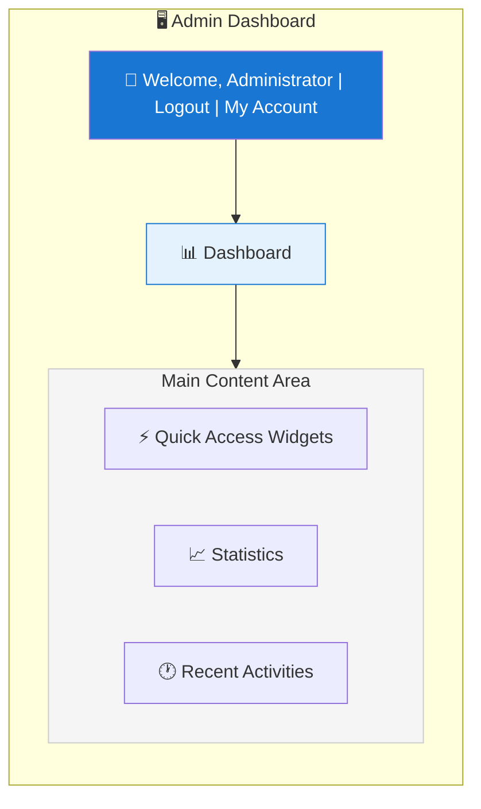
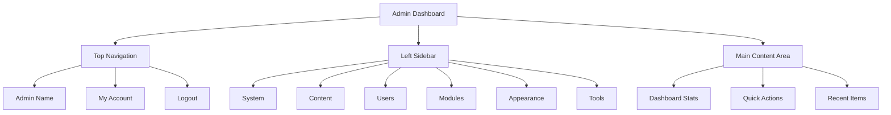

# XOOPS Oversigt over administratorpanelet

Komplet vejledning til at navigere og bruge XOOPS administrator dashboard.

## Adgang til administratorpanelet

### Admin login

Åbn din browser og naviger til:

```
http://your-domain.com/xoops/admin/
```

Eller hvis XOOPS er i root:

```
http://your-domain.com/admin/
```

Indtast dine administratoroplysninger:

```
Username: [Your admin username]
Password: [Your admin password]
```

### Efter login

Du vil se det primære admin-dashboard:



## Admin Panel Layout



## Dashboard-komponenter

### Top Bar

Den øverste bjælke indeholder vigtige kontroller:

| Element | Formål |
|---|---|
| **Admin Logo** | Klik for at vende tilbage til dashboard |
| **Velkomstbesked** | Viser logget ind admin navn |
| **Min konto** | Rediger admin profil og adgangskode |
| **Hjælp** | Adgang til dokumentation |
| **Log ud** | Log ud af admin panel |

### Venstre navigationssidebjælke

Hovedmenu organiseret efter funktion:

```
├── System
│   ├── Dashboard
│   ├── Preferences
│   ├── Admin Users
│   ├── Groups
│   ├── Permissions
│   ├── Modules
│   └── Tools
├── Content
│   ├── Pages
│   ├── Categories
│   ├── Comments
│   └── Media Manager
├── Users
│   ├── Users
│   ├── User Requests
│   ├── Online Users
│   └── User Groups
├── Modules
│   ├── Modules
│   ├── Module Settings
│   └── Module Updates
├── Appearance
│   ├── Themes
│   ├── Templates
│   ├── Blocks
│   └── Images
└── Tools
    ├── Maintenance
    ├── Email
    ├── Statistics
    ├── Logs
    └── Backups
```

### Hovedindholdsområde

Viser information og kontroller for det valgte afsnit:

- Formularer til konfiguration
- Datatabeller med lister
- Diagrammer og statistik
- Hurtige handlingsknapper
- Hjælpetekst og værktøjstip

### Dashboard-widgets

Hurtig adgang til nøgleoplysninger:

- **Systemoplysninger:** PHP version, MySQL version, XOOPS version
- **Hurtig statistik:** Brugerantal, samlede indlæg, installerede moduler
- **Seneste aktivitet:** Seneste logins, indholdsændringer, fejl
- **Serverstatus:** CPU, hukommelse, diskbrug
- **Meddelelser:** Systemadvarsler, afventende opdateringer

## Kerneadministratorfunktioner

### Systemstyring

**Placering:** System > [Forskellige muligheder]

#### Præferencer

Konfigurer grundlæggende systemindstillinger:

```
System > Preferences > [Settings Category]
```

Kategorier:
- Generelle indstillinger (webstedsnavn, tidszone)
- Brugerindstillinger (registrering, profiler)
- E-mail-indstillinger (SMTP-konfiguration)
- Cacheindstillinger (cacheindstillinger)
- URL Indstillinger (venlige URL'er)
- Metatags (SEO-indstillinger)

Se Grundlæggende konfiguration og systemindstillinger.

#### Admin-brugere

Administrer administratorkonti:

```
System > Admin Users
```

Funktioner:
- Tilføj nye administratorer
- Rediger admin profiler
- Skift admin adgangskoder
- Slet administratorkonti
- Indstil administratortilladelser

### Content Management

**Placering:** Indhold > [Forskellige muligheder]

#### Sider/artikler

Administrer webstedsindhold:

```
Content > Pages (or your module)
```

Funktioner:
- Opret nye sider
- Rediger eksisterende indhold
- Slet sider
- Udgiv/afpublicér
- Indstil kategorier
- Håndtere revisioner

#### Kategorier

Organiser indhold:

```
Content > Categories
```

Funktioner:
- Opret kategorihierarki
- Rediger kategorier
- Slet kategorier
- Tildel til sider

#### Kommentarer

Moderer brugerkommentarer:

```
Content > Comments
```

Funktioner:
- Se alle kommentarer
- Godkend kommentarer
- Rediger kommentarer
- Slet spam
- Bloker kommentatorer

### Brugerstyring

**Placering:** Brugere > [Forskellige muligheder]

#### Brugere

Administrer brugerkonti:

```
Users > Users
```

Funktioner:
- Se alle brugere
- Opret nye brugere
- Rediger brugerprofiler
- Slet konti
- Nulstil adgangskoder
- Skift brugerstatus
- Tildel til grupper

#### Onlinebrugere

Overvåg aktive brugere:

```
Users > Online Users
```

Viser:
- For øjeblikket onlinebrugere
- Sidste aktivitetstidspunkt
- IP-adresse
- Brugerplacering (hvis konfigureret)

#### Brugergrupper

Administrer brugerroller og tilladelser:

```
Users > Groups
```

Funktioner:
- Opret brugerdefinerede grupper
- Indstil gruppetilladelser
- Tildel brugere til grupper
- Slet grupper

### Modulstyring

**Placering:** Moduler > [Forskellige muligheder]

#### Moduler

Installer og konfigurer moduler:

```
Modules > Modules
```

Funktioner:
- Se installerede moduler
- Aktiver/deaktiver moduler
- Opdater moduler
- Konfigurer modulindstillinger
- Installer nye moduler
- Se moduldetaljer

#### Søg efter opdateringer

```
Modules > Modules > Check for Updates
```

Viser:
- Tilgængelige modulopdateringer
- Ændringslog
- Download og installer muligheder

### Udseendestyring

**Placering:** Udseende > [Forskellige muligheder]

#### Temaer

Administrer webstedstemaer:

```
Appearance > Themes
```

Funktioner:
- Se installerede temaer
- Indstil standardtema
- Upload nye temaer
- Slet temaer
- Forhåndsvisning af tema
- Tema konfiguration

#### Blokke

Administrer indholdsblokke:
```
Appearance > Blocks
```

Funktioner:
- Opret brugerdefinerede blokke
- Rediger blokindhold
- Arranger blokke på siden
- Indstil bloksynlighed
- Slet blokke
- Konfigurer blokcaching

#### Skabeloner

Administrer skabeloner (avanceret):

```
Appearance > Templates
```

For avancerede brugere og udviklere.

### Systemværktøjer

**Placering:** System > Værktøjer

#### Vedligeholdelsestilstand

Forhindre brugeradgang under vedligeholdelse:

```
System > Maintenance Mode
```

Konfigurer:
- Aktiver/deaktiver vedligeholdelse
- Brugerdefineret vedligeholdelsesmeddelelse
- Tilladte IP-adresser (til test)

#### Databasestyring

```
System > Database
```

Funktioner:
- Tjek databasekonsistens
- Kør databaseopdateringer
- Reparation af borde
- Optimer database
- Eksporter databasestruktur

#### Aktivitetslogs

```
System > Logs
```

Overvåg:
- Brugeraktivitet
- Administrative handlinger
- Systemhændelser
- Fejllogs

## Hurtige handlinger

Almindelige opgaver, der er tilgængelige fra dashboard:

```
Quick Links:
├── Create New Page
├── Add New User
├── Create Content Block
├── Upload Image
├── Send Mass Email
├── Update All Modules
└── Clear Cache
```

## Admin Panel Tastaturgenveje

Hurtig navigation:

| Genvej | Handling |
|---|---|
| `Ctrl+H` | Gå til hjælp |
| `Ctrl+D` | Gå til dashboard |
| `Ctrl+Q` | Hurtig søgning |
| `Ctrl+L` | Log ud |

## Brugerkontostyring

### Min konto

Få adgang til din administratorprofil:

1. Klik på "Min konto" øverst til højre
2. Rediger profiloplysninger:
   - E-mailadresse
   - Rigtige navn
   - Brugeroplysninger
   - Avatar

### Skift adgangskode

Skift din administratoradgangskode:

1. Gå til **Min konto**
2. Klik på "Skift adgangskode"
3. Indtast den aktuelle adgangskode
4. Indtast ny adgangskode (to gange)
5. Klik på "Gem"

**Sikkerhedstip:**
- Brug stærke adgangskoder (16+ tegn)
- Inkluder store bogstaver, små bogstaver, tal, symboler
- Skift adgangskode hver 90. dag
- Del aldrig administratoroplysninger

### Log ud

Log ud af administrationspanelet:

1. Klik på "Log ud" øverst til højre
2. Du bliver omdirigeret til login-siden

## Admin Panel Statistik

### Dashboard-statistik

Hurtigt overblik over webstedsmetrics:

| Metrisk | Værdi |
|--------|-------|
| Brugere online | 12 |
| Samlet antal brugere | 256 |
| Samlet antal indlæg | 1.234 |
| Samlet kommentarer | 5.678 |
| Moduler i alt | 8 |

### Systemstatus

Server- og ydeevneoplysninger:

| Komponent | Version/Værdi |
|--------|--------------|
| XOOPS Version | 2.5.11 |
| PHP Version | 8.2.x |
| MySQL Version | 8.0.x |
| Serverbelastning | 0,45, 0,42 |
| Oppetid | 45 dage |

### Seneste aktivitet

Tidslinje for de seneste begivenheder:

```
12:45 - Admin login
12:30 - New user registered
12:15 - Page published
12:00 - Comment posted
11:45 - Module updated
```

## Notifikationssystem

### Admin Alerts

Modtag notifikationer for:

- Nye brugerregistreringer
- Kommentarer afventer moderering
- Mislykkede loginforsøg
- Systemfejl
- Modulopdateringer tilgængelige
- Databaseproblemer
- Advarsler om diskplads

Konfigurer advarsler:

**System > Præferencer > E-mail-indstillinger**

```
Notify Admin on Registration: Yes
Notify Admin on Comments: Yes
Notify Admin on Errors: Yes
Alert Email: admin@your-domain.com
```

## Almindelige administratoropgaver

### Opret en ny side

1. Gå til **Indhold > Sider** (eller relevant modul)
2. Klik på "Tilføj ny side"
3. Udfyld:
   - Titel
   - Indhold
   - Beskrivelse
   - Kategori
   - Metadata
4. Klik på "Udgiv"

### Administrer brugere

1. Gå til **Brugere > Brugere**
2. Se brugerlisten med:
   - Brugernavn
   - E-mail
   - Registreringsdato
   - Sidste login
   - Status

3. Klik på brugernavn for at:
   - Rediger profil
   - Skift adgangskode
   - Rediger grupper
   - Bloker/ophæv blokering af bruger

### Konfigurer modul

1. Gå til **Moduler > Moduler**
2. Find modul i listen
3. Klik på modulnavnet
4. Klik på "Præferencer" eller "Indstillinger"
5. Konfigurer modulindstillinger
6. Gem ændringer

### Opret en ny blok

1. Gå til **Udseende > Blokke**
2. Klik på "Tilføj ny blok"
3. Indtast:
   - Blok titel
   - Bloker indhold (HTML tilladt)
   - Position på side
   - Synlighed (alle sider eller specifikke)
   - Modul (hvis relevant)
4. Klik på "Send"

## Hjælp til administratorpanelet

### Indbygget dokumentation

Få adgang til hjælp fra administratorpanelet:

1. Klik på knappen "Hjælp" i den øverste bjælke
2. Kontekstafhængig hjælp til den aktuelle side
3. Links til dokumentation
4. Ofte stillede spørgsmål

### Eksterne ressourcer

- XOOPS Officiel side: https://xoops.org/
- Fællesskabsforum: https://xoops.org/modules/newbb/
- Modullager: https://xoops.org/modules/repository/
- Fejl/problemer: https://github.com/XOOPS/XoopsCore/issues

## Tilpasning af Admin Panel

### Admin Tema

Vælg administratorgrænsefladetema:

**System > Præferencer > Generelle indstillinger**

```
Admin Theme: [Select theme]
```

Tilgængelige temaer:
- Standard (lys)
- Mørk tilstand
- Brugerdefinerede temaer

### Dashboardtilpasning

Vælg hvilke widgets der skal vises:**Dashboard > Tilpas**

Vælg:
- Systemoplysninger
- Statistik
- Seneste aktivitet
- Hurtige links
- Brugerdefinerede widgets

## Admin Panel Tilladelser

Forskellige administratorniveauer har forskellige tilladelser:

| Rolle | Evner |
|---|---|
| **Webmaster** | Fuld adgang til alle admin funktioner |
| **Admin** | Begrænsede admin funktioner |
| **Moderator** | Kun indholdsmoderering |
| **Redaktør** | Oprettelse og redigering af indhold |

Administrer tilladelser:

**System > Tilladelser**

## Bedste praksis for sikkerhed for administratorpanelet

1. **Stærk adgangskode:** Brug en adgangskode på 16+ tegn
2. **Almindelige ændringer:** Skift adgangskode hver 90. dag
3. **Monitoradgang:** Tjek "Administratorbrugere"-logfiler regelmæssigt
4. **Begræns adgang:** Omdøb admin mappe for yderligere sikkerhed
5. **Brug HTTPS:** Adgang altid admin via HTTPS
6. **IP-hvidlisting:** Begræns administratoradgang til specifikke IP'er
7. **Almindelig logout:** Log ud, når du er færdig
8. **Browsersikkerhed:** Ryd browserens cache regelmæssigt

Se Sikkerhedskonfiguration.

## Fejlfinding Admin Panel

### Kan ikke få adgang til Admin Panel

**Løsning:**
1. Bekræft login-legitimationsoplysninger
2. Ryd browserens cache og cookies
3. Prøv en anden browser
4. Kontroller, om admin-mappestien er korrekt
5. Bekræft filtilladelser på admin-mappen
6. Tjek databaseforbindelsen i mainfile.php

### Tom administratorside

**Løsning:**
```bash
# Check PHP errors
tail -f /var/log/apache2/error.log

# Enable debug mode temporarily
sed -i "s/define('XOOPS_DEBUG', 0)/define('XOOPS_DEBUG', 1)/" /var/www/html/xoops/mainfile.php

# Check file permissions
ls -la /var/www/html/xoops/admin/
```

### Langsomt administratorpanel

**Løsning:**
1. Ryd cache: **System > Værktøjer > Ryd cache**
2. Optimer database: **System > Database > Optimer**
3. Tjek serverressourcer: `htop`
4. Gennemgå langsomme forespørgsler i MySQL

### Modulet vises ikke

**Løsning:**
1. Bekræft modul installeret: **Moduler > Moduler**
2. Kontroller, at modulet er aktiveret
3. Bekræft tildelte tilladelser
4. Kontroller, at modulfiler findes
5. Gennemgå fejllogfiler

## Næste trin

Efter at have gjort dig bekendt med admin panelet:

1. Opret din første side
2. Opsæt brugergrupper
3. Installer yderligere moduler
4. Konfigurer grundlæggende indstillinger
5. Implementer sikkerhed

---

**Tags:** #admin-panel #dashboard #navigation #kom godt i gang

**Relaterede artikler:**
- ../Configuration/Basic-Configuration
- ../Configuration/System-Settings
- Oprettelse af-din-første-side
- Håndtering af brugere
- Installation af moduler
