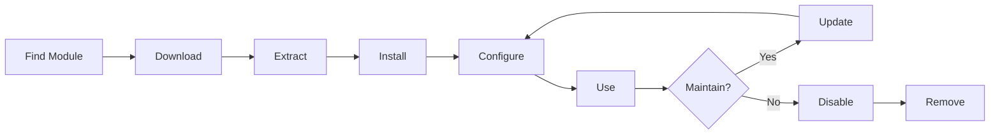

# Installation og administration af XOOPS-moduler

Lær, hvordan du udvider XOOPS-funktionaliteten ved at installere og konfigurere moduler.

## Forstå XOOPS-moduler

### Hvad er moduler?

Moduler er udvidelser, der tilføjer funktionalitet til XOOPS:

| Skriv | Formål | Eksempler |
|---|---|---|
| **Indhold** | Administrer specifikke indholdstyper | Nyheder, blog, billetter |
| **Fællesskab** | Brugerinteraktion | Forum, kommentarer, anmeldelser |
| **e-handel** | Salg af produkter | Butik, kurv, betalinger |
| **Medie** | Håndter filer/billeder | Galleri, downloads, videoer |
| **Utility** | Værktøj og hjælpere | E-mail, Backup, Analytics |

### Core vs. valgfrie moduler

| Modul | Skriv | Inkluderet | Aftagelig |
|---|---|---|---|
| **System** | Kerne | Ja | Nej |
| **Bruger** | Kerne | Ja | Nej |
| **Profil** | Anbefalet | Ja | Ja |
| **PM (privat besked)** | Anbefalet | Ja | Ja |
| **WF-Kanal** | Valgfrit | Ofte | Ja |
| **Nyheder** | Valgfrit | Nej | Ja |
| **Forum** | Valgfrit | Nej | Ja |

## Modullivscyklus



## Finde moduler

### XOOPS modullager

Officielt XOOPS modullager:

**Besøg:** https://xoops.org/modules/repository/

```
Directory > Modules > [Browse Categories]
```

Gennemse efter kategori:
- Content Management
- Fællesskab
- e-handel
- Multimedier
- Udvikling
- Site Administration

### Evaluering af moduler

Før du installerer, skal du kontrollere:

| Kriterier | Hvad skal man kigge efter |
|---|---|
| **Kompatibilitet** | Virker med din XOOPS version |
| **Bedømmelse** | Gode ​​brugeranmeldelser og vurderinger |
| **Opdateringer** | Nyligt vedligeholdt |
| **Downloads** | Populær og meget brugt |
| **Krav** | Kompatibel med din server |
| **Licens** | GPL eller lignende open source |
| **Support** | Aktiv udvikler og fællesskab |

### Læs moduloplysninger

Hver modulliste viser:

```
Module Name: [Name]
Version: [X.X.X]
Requires: XOOPS [Version]
Author: [Name]
Last Update: [Date]
Downloads: [Number]
Rating: [Stars]
Description: [Brief description]
Compatibility: PHP [Version], MySQL [Version]
```

## Installation af moduler

### Metode 1: Admin Panel Installation

**Trin 1: Afsnittet Adgangsmoduler**

1. Log ind på admin panel
2. Naviger til **Moduler > Moduler**
3. Klik på **"Installer nyt modul"** eller **"Gennemse moduler"**

**Trin 2: Upload modul**

Mulighed A - Direkte upload:
1. Klik på **"Vælg fil"**
2. Vælg modul .zip-fil fra computeren
3. Klik på **"Upload"**

Mulighed B - URL Upload:
1. Indsæt modulet URL
2. Klik på **"Download og installer"**

**Trin 3: Gennemgå moduloplysninger**

```
Module Name: [Name shown]
Version: [Version]
Author: [Author info]
Description: [Full description]
Requirements: [PHP/MySQL versions]
```

Gennemgå og klik på **"Fortsæt med installationen"**

**Trin 4: Vælg installationstype**

```
☐ Fresh Install (New installation)
☐ Update (Upgrade existing)
☐ Delete Then Install (Replace existing)
```

Vælg passende mulighed.

**Trin 5: Bekræft installation**

Gennemgå den endelige bekræftelse:
```
Module will be installed to: /modules/modulename/
Database: xoops_db
Proceed? [Yes] [No]
```

Klik på **"Ja"** for at bekræfte.

**Trin 6: Installationen er fuldført**

```
Installation successful!

Module: [Module Name]
Version: [Version]
Tables created: [Number]
Files installed: [Number]

[Go to Module Settings]  [Return to Modules]
```

### Metode 2: Manuel installation (avanceret)

Til manuel installation eller fejlfinding:

**Trin 1: Download modul**

1. Download modulet .zip fra repository
2. Udpak til `/var/www/html/xoops/modules/modulename/`

```bash
# Extract module
unzip module_name.zip
cp -r module_name /var/www/html/xoops/modules/

# Set permissions
chmod -R 755 /var/www/html/xoops/modules/module_name
```

**Trin 2: Kør installationsscript**

```
Visit: http://your-domain.com/xoops/modules/module_name/admin/index.php?op=install
```

Eller gennem admin panel (System > Moduler > Opdater DB).

**Trin 3: Bekræft installationen**

1. Gå til **Moduler > Moduler** i admin
2. Se efter dit modul på listen
3. Bekræft, at den vises som "Aktiv"

## Modulkonfiguration

### Adgangsmodulindstillinger

1. Gå til **Moduler > Moduler**
2. Find dit modul
3. Klik på modulnavn
4. Klik på **"Præferencer"** eller **"Indstillinger"**

### Fælles modulindstillinger

De fleste moduler tilbyder:

```
Module Status: [Enabled/Disabled]
Display in Menu: [Yes/No]
Module Weight: [1-999] (display order)
Visible To Groups: [Checkboxes for user groups]
```

### Modulspecifikke muligheder

Hvert modul har unikke indstillinger. Eksempler:

**Nyhedsmodul:**
```
Items Per Page: 10
Show Author: Yes
Allow Comments: Yes
Moderation Required: Yes
```

**Forummodul:**
```
Topics Per Page: 20
Posts Per Page: 15
Maximum Attachment Size: 5MB
Enable Signatures: Yes
```

**Gallerimodul:**
```
Images Per Page: 12
Thumbnail Size: 150x150
Maximum Upload: 10MB
Watermark: Yes/No
```

Gennemgå din moduldokumentation for specifikke muligheder.

### Gem konfiguration

Efter justering af indstillinger:

1. Klik på **"Send"** eller **"Gem"**
2. Du vil se bekræftelse:
   
```
   Indstillinger blev gemt!
   
```

## Håndtering af modulblokke

Mange moduler skaber "blokke" - widget-lignende indholdsområder.

### Vis modulblokke

1. Gå til **Udseende > Blokke**
2. Se efter blokke fra dit modul
3. De fleste moduler viser "[Modulnavn] - [Blokbeskrivelse]"

### Konfigurer blokke1. Klik på bloknavn
2. Juster:
   - Blok titel
   - Synlighed (alle sider eller specifikke)
   - Position på siden (venstre, midten, højre)
   - Brugergrupper, der kan se
3. Klik på **"Send"**

### Vis blok på hjemmesiden

1. Gå til **Udseende > Blokke**
2. Find den blok, du ønsker
3. Klik på **"Rediger"**
4. Indstil:
   - **Synlig for:** Vælg grupper
   - **Position:** Vælg kolonne (venstre/center/højre)
   - **Sider:** Hjemmeside eller alle sider
5. Klik på **"Send"**

## Installation af specifikke moduleksempler

### Installation af nyhedsmodul

**Perfekt til:** Blogindlæg, meddelelser

1. Download nyhedsmodulet fra repository
2. Upload via **Moduler > Moduler > Installer**
3. Konfigurer i **Moduler > Nyheder > Præferencer**:
   - Historier pr. side: 10
   - Tillad kommentarer: Ja
   - Godkend før publicering: Ja
4. Opret blokke til seneste nyheder
5. Begynd at udgive historier!

### Installation af forummodul

**Perfekt til:** Fællesskabsdiskussion

1. Download Forum modul
2. Installer via admin panel
3. Opret forumkategorier i modulet
4. Konfigurer indstillinger:
   - Emner/side: 20
   - Indlæg/side: 15
   - Aktiver moderering: Ja
5. Tildel brugergrupper tilladelser
6. Opret blokke til seneste emner

### Installation af gallerimodul

**Perfekt til:** Billedfremvisning

1. Download Galleri modul
2. Installer og konfigurer
3. Opret fotoalbum
4. Upload billeder
5. Indstil tilladelser til visning/upload
6. Vis galleri på hjemmesiden

## Opdatering af moduler

### Søg efter opdateringer

```
Admin Panel > Modules > Modules > Check for Updates
```

Dette viser:
- Tilgængelige modulopdateringer
- Nuværende vs. ny version
- Ændringslog/udgivelsesbemærkninger

### Opdater et modul

1. Gå til **Moduler > Moduler**
2. Klik på modul med tilgængelig opdatering
3. Klik på knappen **"Opdater"**
4. Vælg **"Opdater" fra Installationstype**
5. Følg installationsguiden
6. Modul opdateret!

### Vigtige opdateringsbemærkninger

Før opdatering:

- [ ] Backup database
- [ ] Backup modulfiler
- [ ] Gennemgå ændringslog
- [ ] Test først på iscenesættelsesserveren
- [ ] Bemærk eventuelle tilpassede ændringer

Efter opdatering:
- [ ] Bekræft funktionalitet
- [ ] Kontroller modulindstillinger
- [ ] Gennemgå for advarsler/fejl
- [ ] Ryd cache

## Modultilladelser

### Tildel brugergruppeadgang

Kontroller, hvilke brugergrupper der kan få adgang til moduler:

**Placering:** System > Tilladelser

For hvert modul skal du konfigurere:

```
Module: [Module Name]

Admin Access: [Select groups]
User Access: [Select groups]
Read Permission: [Groups allowed to view]
Write Permission: [Groups allowed to post]
Delete Permission: [Administrators only]
```

### Almindelige tilladelsesniveauer

```
Public Content (News, Pages):
├── Admin Access: Webmaster
├── User Access: All logged-in users
└── Read Permission: Everyone

Community Features (Forum, Comments):
├── Admin Access: Webmaster, Moderators
├── User Access: All logged-in users
└── Write Permission: All logged-in users

Admin Tools:
├── Admin Access: Webmaster only
└── User Access: Disabled
```

## Deaktivering og fjernelse af moduler

### Deaktiver modul (behold filer)

Behold modul, men skjul fra webstedet:

1. Gå til **Moduler > Moduler**
2. Find modul
3. Klik på modulnavn
4. Klik på **"Deaktiver"** eller indstil status til Inaktiv
5. Modul skjult, men data bevaret

Genaktiver når som helst:
1. Klik på modul
2. Klik på **"Aktiver"**

### Fjern modulet helt

Slet modul og dets data:

1. Gå til **Moduler > Moduler**
2. Find modul
3. Klik på **"Afinstaller"** eller **"Slet"**
4. Bekræft: "Slet modul og alle data?"
5. Klik på **"Ja"** for at bekræfte

**Advarsel:** Afinstallation sletter alle moduldata!

### Geninstaller efter afinstallation

Hvis du afinstallerer et modul:
- Modulfiler slettet
- Databasetabeller slettet
- Alle data er gået tabt
- Skal geninstalleres for at bruge igen
- Kan gendanne fra backup

## Fejlfinding Modul Installation

### Modulet vises ikke efter installation

**Symptom:** Modulet er angivet, men ikke synligt på stedet

**Løsning:**
```
1. Check module is "Active" (Modules > Modules)
2. Enable module blocks (Appearance > Blocks)
3. Verify user permissions (System > Permissions)
4. Clear cache (System > Tools > Clear Cache)
5. Check .htaccess doesn't block module
```

### Installationsfejl: "Tabel eksisterer allerede"

**Symptom:** Fejl under modulinstallation

**Løsning:**
```
1. Module partially installed before
2. Try "Delete then Install" option
3. Or uninstall first, then install fresh
4. Check database for existing tables:
   mysql> SHOW TABLES LIKE 'xoops_module%';
```

### Modul mangler afhængigheder

**Symptom:** Modulet kan ikke installeres - kræver et andet modul

**Løsning:**
```
1. Note required modules from error message
2. Install required modules first
3. Then install the module
4. Install in correct order
```

### Tom side ved adgang til modulet

**Symptom:** Modulet indlæses, men viser intet

**Løsning:**
```
1. Enable debug mode in mainfile.php:
   define('XOOPS_DEBUG', 1);

2. Check PHP error log:
   tail -f /var/log/php_errors.log

3. Verify file permissions:
   chmod -R 755 /var/www/html/xoops/modules/modulename

4. Check database connection in module config

5. Disable module and reinstall
```

### Modul bryder websted

**Symptom:** Installation af modul ødelægger webstedet

**Løsning:**
```
1. Disable the problematic module immediately:
   Admin > Modules > [Module] > Disable

2. Clear cache:
   rm -rf /var/www/html/xoops/cache/*
   rm -rf /var/www/html/xoops/templates_c/*

3. Restore from backup if needed

4. Check error logs for root cause

5. Contact module developer
```

## Modulsikkerhedsovervejelser

### Installer kun fra betroede kilder

```
✓ Official XOOPS Repository
✓ GitHub official XOOPS modules
✓ Trusted module developers
✗ Unknown websites
✗ Unverified sources
```

### Tjek modultilladelser

Efter installation:

1. Gennemgå modulkoden for mistænkelig aktivitet
2. Tjek databasetabeller for uregelmæssigheder
3. Overvåg filændringer
4. Hold moduler opdateret
5. Fjern ubrugte moduler

### Tilladelser bedste praksis

```
Module directory: 755 (readable, not writable by web server)
Module files: 644 (readable only)
Module data: Protected by database
```

## Moduludviklingsressourcer

### Lær moduludvikling- Officiel dokumentation: https://xoops.org/
- GitHub-lager: https://github.com/XOOPS/
- Fællesskabsforum: https://xoops.org/modules/newbb/
- Udviklervejledning: Tilgængelig i docs-mappen

## Bedste praksis for moduler

1. **Installer én ad gangen:** Overvåg for konflikter
2. **Test efter installation:** Bekræft funktionaliteten
3. **Document Custom Config:** Bemærk dine indstillinger
4. **Hold dig opdateret:** Installer modulopdateringer omgående
5. **Fjern ubrugte:** Slet moduler, der ikke er nødvendige
6. **Sikkerhedskopiering før:** Sikkerhedskopier altid før installation
7. **Læs dokumentation:** Tjek modulets instruktioner
8. **Bliv medlem af Fællesskabet:** Bed om hjælp, hvis det er nødvendigt

## Tjekliste for modulinstallation

For hver modulinstallation:

- [ ] Undersøg og læs anmeldelser
- [ ] Bekræft XOOPS versionskompatibilitet
- [ ] Sikkerhedskopier database og filer
- [ ] Download seneste version
- [ ] Installer via admin panel
- [ ] Konfigurer indstillinger
- [ ] Opret/positionér blokke
- [ ] Indstil brugertilladelser
- [ ] Test funktionalitet
- [ ] Dokumentkonfiguration
- [ ] Tidsplan for opdateringer

## Næste trin

Efter installation af moduler:

1. Opret indhold til moduler
2. Opsæt brugergrupper
3. Udforsk admin funktioner
4. Optimer ydeevnen
5. Installer yderligere moduler efter behov

---

**Tags:** #moduler #installation #udvidelse #styring

**Relaterede artikler:**
- Admin-Panel-Oversigt
- Håndtering af brugere
- Oprettelse af-din-første-side
- ../Configuration/System-Settings
