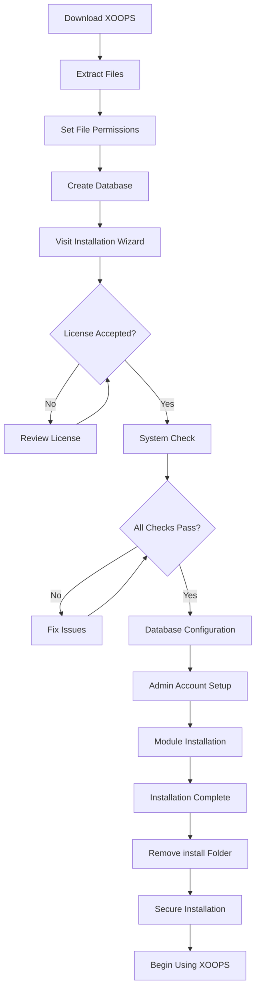

# Komplet XOOPS installationsvejledning

Denne vejledning giver en omfattende gennemgang af installation af XOOPS fra bunden ved hjælp af installationsguiden.

## Forudsætninger

Før du starter installationen, skal du sikre dig, at du har:

- Adgang til din webserver via FTP eller SSH
- Administratoradgang til din databaseserver
- Et registreret domænenavn
- Serverkrav bekræftet
- Backup værktøjer tilgængelige

## Installationsproces



## Trin-for-trin installation

### Trin 1: Download XOOPS

Download den seneste version fra [https://xoops.org/](https://xoops.org/):

```bash
# Using wget
wget https://xoops.org/download/xoops-2.5.8.zip

# Using curl
curl -O https://xoops.org/download/xoops-2.5.8.zip
```

### Trin 2: Udpak filer

Udpak XOOPS-arkivet til din webrod:

```bash
# Navigate to web root
cd /var/www/html

# Extract XOOPS
unzip xoops-2.5.8.zip

# Rename folder (optional, but recommended)
mv xoops-2.5.8 xoops
cd xoops
```

### Trin 3: Indstil filtilladelser

Indstil korrekte tilladelser for XOOPS mapper:

```bash
# Make directories writable (755 for dirs, 644 for files)
find . -type d -exec chmod 755 {} \;
find . -type f -exec chmod 644 {} \;

# Make specific directories writable by web server
chmod 777 uploads/
chmod 777 templates_c/
chmod 777 var/
chmod 777 cache/

# Secure mainfile.php after installation
chmod 644 mainfile.php
```

### Trin 4: Opret database

Opret en ny database til XOOPS ved hjælp af MySQL:

```sql
-- Create database
CREATE DATABASE xoops_db CHARACTER SET utf8mb4 COLLATE utf8mb4_unicode_ci;

-- Create user
CREATE USER 'xoops_user'@'localhost' IDENTIFIED BY 'secure_password_here';

-- Grant privileges
GRANT ALL PRIVILEGES ON xoops_db.* TO 'xoops_user'@'localhost';
FLUSH PRIVILEGES;
```

Eller ved at bruge phpMyAdmin:

1. Log ind på phpMyAdmin
2. Klik på fanen "Databaser".
3. Indtast databasenavn: `xoops_db`
4. Vælg "utf8mb4_unicode_ci"-sortering
5. Klik på "Opret"
6. Opret en bruger med samme navn som databasen
7. Giv alle privilegier

### Trin 5: Kør installationsguiden

Åbn din browser og naviger til:

```
http://your-domain.com/xoops/install/
```

#### Systemkontrolfase

Guiden kontrollerer din serverkonfiguration:

- PHP version >= 5.6.0
- MySQL/MariaDB tilgængelig
- Nødvendige PHP-udvidelser (GD, PDO osv.)
- Directory tilladelser
- Database tilslutning

**Hvis kontrol mislykkes:**

Se afsnittet #Common-Installation-Issues for løsninger.

#### Databasekonfiguration

Indtast dine databaselegitimationsoplysninger:

```
Database Host: localhost
Database Name: xoops_db
Database User: xoops_user
Database Password: [your_secure_password]
Table Prefix: xoops_
```

**Vigtige bemærkninger:**
- Hvis din databasevært adskiller sig fra localhost (f.eks. fjernserver), skal du indtaste det korrekte værtsnavn
- Tabelpræfikset hjælper, hvis du kører flere XOOPS-forekomster i én database
- Brug en stærk adgangskode med blandet store og små bogstaver, tal og symboler

#### Opsætning af administratorkonto

Opret din administratorkonto:

```
Admin Username: admin (or choose custom)
Admin Email: admin@your-domain.com
Admin Password: [strong_unique_password]
Confirm Password: [repeat_password]
```

**Bedste praksis:**
- Brug et unikt brugernavn, ikke "admin"
- Brug en adgangskode med 16+ tegn
- Gem legitimationsoplysninger i en sikker adgangskodeadministrator
- Del aldrig administratoroplysninger

#### Modulinstallation

Vælg standardmoduler til installation:

- **Systemmodul** (påkrævet) - Core XOOPS-funktionalitet
- **Brugermodul** (påkrævet) - Brugeradministration
- **Profilmodul** (anbefales) - Brugerprofiler
- **PM (Privat Besked) Modul** (anbefales) - Interne beskeder
- **WF-Channel Module** (valgfrit) - Indholdsstyring

Vælg alle anbefalede moduler til en komplet installation.

### Trin 6: Fuldfør installationen

Efter alle trin vil du se en bekræftelsesskærm:

```
Installation Complete!

Your XOOPS installation is ready to use.
Admin Panel: http://your-domain.com/xoops/admin/
User Panel: http://your-domain.com/xoops/
```

### Trin 7: Sikre din installation

#### Fjern installationsmappe

```bash
# Remove the install directory (CRITICAL for security)
rm -rf /var/www/html/xoops/install/

# Or rename it
mv /var/www/html/xoops/install/ /var/www/html/xoops/install.bak
```

**WARNING:** Lad aldrig installationsmappen være tilgængelig i produktionen!

#### Sikker hovedfil.php

```bash
# Make mainfile.php read-only
chmod 644 /var/www/html/xoops/mainfile.php

# Set ownership
chown www-data:www-data /var/www/html/xoops/mainfile.php
```

#### Indstil korrekte filtilladelser

```bash
# Recommended production permissions
find . -type f -name "*.php" -exec chmod 644 {} \;
find . -type d -exec chmod 755 {} \;

# Writable directories for web server
chmod 777 uploads/ var/ cache/ templates_c/
```

#### Aktiver HTTPS/SSL

Konfigurer SSL i din webserver (nginx eller Apache).

**For Apache:**
```apache
<VirtualHost *:443>
    ServerName your-domain.com
    DocumentRoot /var/www/html/xoops

    SSLEngine on
    SSLCertificateFile /etc/ssl/certs/your-cert.crt
    SSLCertificateKeyFile /etc/ssl/private/your-key.key

    # Force HTTPS redirect
    <IfModule mod_rewrite.c>
        RewriteEngine On
        RewriteCond %{HTTPS} off
        RewriteRule ^(.*)$ https://%{HTTP_HOST}%{REQUEST_URI} [L,R=301]
    </IfModule>
</VirtualHost>
```

## Konfiguration efter installation

### 1. Få adgang til Admin Panel

Naviger til:
```
http://your-domain.com/xoops/admin/
```

Log ind med dine administratoroplysninger.

### 2. Konfigurer grundlæggende indstillinger

Konfigurer følgende:

- Site navn og beskrivelse
- Admin e-mailadresse
- Tidszone og datoformat
- Søgemaskineoptimering

### 3. Test installation

- [ ] Besøg hjemmesiden
- [ ] Kontroller modulernes belastning
- [ ] Bekræft, at brugerregistreringen fungerer
- [ ] Test admin panelets funktioner
- [ ] Bekræft, at SSL/HTTPS fungerer

### 4. Planlæg sikkerhedskopier

Konfigurer automatisk sikkerhedskopiering:

```bash
# Create backup script (backup.sh)
#!/bin/bash
DATE=$(date +%Y%m%d_%H%M%S)
BACKUP_DIR="/backups/xoops"
XOOPS_DIR="/var/www/html/xoops"

# Backup database
mysqldump -u xoops_user -p[password] xoops_db > $BACKUP_DIR/db_$DATE.sql

# Backup files
tar -czf $BACKUP_DIR/files_$DATE.tar.gz $XOOPS_DIR

echo "Backup completed: $DATE"
```

Tidsplan med cron:
```bash
# Daily backup at 2 AM
0 2 * * * /usr/local/bin/backup.sh
```

## Almindelige installationsproblemer

### Problem: Tilladelse nægtet fejl

**Symptom:** "Tilladelse nægtet" ved upload eller oprettelse af filer

**Løsning:**
```bash
# Check web server user
ps aux | grep apache  # For Apache
ps aux | grep nginx   # For Nginx

# Fix permissions (replace www-data with your web server user)
chown -R www-data:www-data /var/www/html/xoops
chmod -R 755 /var/www/html/xoops
chmod 777 uploads/ var/ cache/ templates_c/
```

### Problem: Databaseforbindelse mislykkedes

**Symptom:** "Kan ikke oprette forbindelse til databaseserveren"**Løsning:**
1. Bekræft databaselegitimationsoplysningerne i installationsguiden
2. Kontroller, at MySQL/MariaDB kører:
   
```bash
   service mysql status # eller mariadb
   
```
3. Bekræft, at databasen eksisterer:
   
```sql
   SHOW DATABASES;
   
```
4. Test forbindelsen fra kommandolinjen:
   
```bash
   mysql -h localhost -u xoops_user -p xoops_db
   
```

### Problem: Blank hvid skærm

**Symptom:** Besøg XOOPS viser en tom side

**Løsning:**
1. Tjek PHP fejllogfiler:
   
```bash
   hale -f /var/log/apache2/error.log
   
```
2. Aktiver fejlretningstilstand i mainfile.php:
   
```php
   define('XOOPS_DEBUG', 1);
   
```
3. Tjek filtilladelser på mainfile.php og config-filer
4. Bekræft, at PHP-MySQL-udvidelsen er installeret

### Problem: Kan ikke skrive til uploads-mappe

**Symptom:** Uploadfunktionen mislykkes, "Kan ikke skrive til uploads/"

**Løsning:**
```bash
# Check current permissions
ls -la uploads/

# Fix permissions
chmod 777 uploads/
chown www-data:www-data uploads/

# For specific files
chmod 644 uploads/*
```

### Problem: PHP udvidelser mangler

**Symptom:** Systemtjek mislykkes med manglende udvidelser (GD, MySQL osv.)

**Løsning (Ubuntu/Debian):**
```bash
# Install PHP GD library
apt-get install php-gd

# Install PHP MySQL support
apt-get install php-mysql

# Restart web server
systemctl restart apache2  # or nginx
```

**Løsning (CentOS/RHEL):**
```bash
# Install PHP GD library
yum install php-gd

# Install PHP MySQL support
yum install php-mysql

# Restart web server
systemctl restart httpd
```

### Problem: Langsom installationsproces

**Symptom:** Installationsguiden udløber eller kører meget langsomt

**Løsning:**
1. Forøg PHP timeout i php.ini:
   
```ini
   max_execution_time = 300 # 5 minutter
   
```
2. Forøg MySQL max_allowed_packet:
   
```sql
   SET GLOBAL max_allowed_packet = 256M;
   
```
3. Tjek serverressourcer:
   
```bash
   gratis -h # Tjek RAM
   df -h # Tjek diskplads
   
```

### Problem: Admin Panel ikke tilgængeligt

**Symptom:** Kan ikke få adgang til admin panel efter installation

**Løsning:**
1. Bekræft, at der findes en administratorbruger i databasen:
   
```sql
   SELECT * FROM xoops_users WHERE uid = 1;
   
```
2. Ryd browserens cache og cookies
3. Tjek, om sessionsmappen er skrivbar:
   
```bash
   chmod 777 var/
   
```
4. Bekræft, at htaccess-reglerne ikke blokerer adminadgang

## Verifikationstjekliste

Efter installationen skal du kontrollere:

- [x] XOOPS hjemmeside indlæses korrekt
- [x] Admin panel er tilgængeligt på /xoops/admin/
- [x] SSL/HTTPS virker
- [x] Installationsmappen er fjernet eller utilgængelig
- [x] Filtilladelser er sikre (644 for filer, 755 for dirs)
- [x] Databasesikkerhedskopiering er planlagt
- [x] Moduler indlæses uden fejl
- [x] Brugerregistreringssystemet fungerer
- [x] Fil upload funktionalitet virker
- [x] E-mail-meddelelser sendes korrekt

## Næste trin

Når installationen er færdig:

1. Læs Grundlæggende konfigurationsvejledning
2. Sikre din installation
3. Udforsk administrationspanelet
4. Installer yderligere moduler
5. Opsæt brugergrupper og tilladelser

---

**Tags:** #installation #setup #kom i gang #fejlfinding

**Relaterede artikler:**
- Server-krav
- Opgradering-XOOPS
- ../Configuration/Security-Configuration
