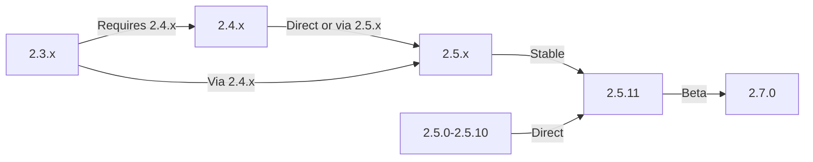

Denne vejledning dækker opgradering af XOOPS fra ældre versioner til den seneste udgivelse, mens dine data og tilpasninger bevares.

> **Versionsoplysninger**
> - **Stabil:** XOOPS 2.5.11
> - **Beta:** XOOPS 2.7.0 (test)
> - **Fremtid:** XOOPS 4.0 (under udvikling - se køreplan)

## Tjekliste til forudgående opgradering

Før du starter opgraderingen, skal du kontrollere:

- [ ] Aktuel XOOPS version dokumenteret
- [ ] Mål XOOPS version identificeret
- [ ] Fuld systemsikkerhedskopiering fuldført
- [ ] Database backup verificeret
- [ ] Liste over installerede moduler registreret
- [ ] Brugerdefinerede ændringer dokumenteret
- [ ] Testmiljø tilgængeligt
- [ ] Opgraderingsstien er kontrolleret (nogle versioner springer mellemliggende udgivelser over)
- [ ] Serverressourcer bekræftet (nok diskplads, hukommelse)
- [ ] Vedligeholdelsestilstand aktiveret

## Opgraderingsstivejledning

Forskellige opgraderingsstier afhængigt af den aktuelle version:



**Vigtigt:** Spring aldrig over større versioner. Hvis du opgraderer fra 2.3.x, skal du først opgradere til 2.4.x og derefter til 2.5.x.

## Trin 1: Fuldfør systemsikkerhedskopiering

### Database backup

Brug mysqldump til at sikkerhedskopiere databasen:

```bash
# Full database backup
mysqldump -u xoops_user -p xoops_db > /backups/xoops_db_backup_$(date +%Y%m%d_%H%M%S).sql

# Compressed backup
mysqldump -u xoops_user -p xoops_db | gzip > /backups/xoops_db_backup_$(date +%Y%m%d_%H%M%S).sql.gz
```

Eller ved at bruge phpMyAdmin:

1. Vælg din XOOPS-database
2. Klik på fanen "Eksporter".
3. Vælg "SQL" format
4. Vælg "Gem som fil"
5. Klik på "Go"

Bekræft sikkerhedskopieringsfil:

```bash
# Check backup size
ls -lh /backups/xoops_db_backup*.sql

# Verify backup integrity (uncompressed)
head -20 /backups/xoops_db_backup_*.sql

# Verify compressed backup
zcat /backups/xoops_db_backup_*.sql.gz | head -20
```

### Sikkerhedskopiering af filsystem

Sikkerhedskopier alle XOOPS-filer:

```bash
# Compressed file backup
tar -czf /backups/xoops_files_$(date +%Y%m%d_%H%M%S).tar.gz /var/www/html/xoops

# Uncompressed (faster, requires more disk space)
tar -cf /backups/xoops_files_$(date +%Y%m%d_%H%M%S).tar /var/www/html/xoops

# Show backup progress
tar -czf /backups/xoops_files_$(date +%Y%m%d_%H%M%S).tar.gz --verbose /var/www/html/xoops | tail
```

Gem sikkerhedskopier sikkert:

```bash
# Secure backup storage
chmod 600 /backups/xoops_*
ls -lah /backups/

# Optional: Copy to remote storage
scp /backups/xoops_* user@backup-server:/secure/backups/
```

### Test Backup Restoration

**CRITICAL:** Test altid, at din backup virker:

```bash
# Verify tar archive contents
tar -tzf /backups/xoops_files_*.tar.gz | head -20

# Extract to test location
mkdir /tmp/restore_test
cd /tmp/restore_test
tar -xzf /backups/xoops_files_*.tar.gz

# Verify key files exist
ls -la xoops/mainfile.php
ls -la xoops/install/
```

## Trin 2: Aktiver vedligeholdelsestilstand

Forhindre brugere i at få adgang til webstedet under opgradering:

### Mulighed 1: XOOPS Admin Panel

1. Log ind på admin panel
2. Gå til System > Vedligeholdelse
3. Aktiver "Site Maintenance Mode"
4. Indstil vedligeholdelsesmeddelelse
5. Gem

### Mulighed 2: Manuel vedligeholdelsestilstand

Opret en vedligeholdelsesfil ved web root:

```html
<!-- /var/www/html/maintenance.html -->
<!DOCTYPE html>
<html>
<head>
    <title>Under Maintenance</title>
    <style>
        body { font-family: Arial; text-align: center; padding: 50px; }
        h1 { color: #333; }
        p { color: #666; margin: 20px 0; }
    </style>
</head>
<body>
    <h1>Site Under Maintenance</h1>
    <p>We're currently upgrading our site.</p>
    <p>Expected time: approximately 30 minutes.</p>
    <p>Thank you for your patience!</p>
</body>
</html>
```

Konfigurer Apache til at vise vedligeholdelsessiden:

```apache
# In .htaccess or vhost config
ErrorDocument 503 /maintenance.html

# Redirect all traffic to maintenance page
<IfModule mod_rewrite.c>
    RewriteEngine On
    RewriteCond %{REMOTE_ADDR} !^192\.168\.1\.100$  # Your IP
    RewriteRule ^(.*)$ - [R=503,L]
</IfModule>
```

## Trin 3: Download ny version

Download XOOPS fra den officielle side:

```bash
# Download latest version
cd /tmp
wget https://xoops.org/download/xoops-2.5.8.zip

# Verify checksum (if provided)
sha256sum xoops-2.5.8.zip
# Compare with official SHA256 hash

# Extract to temporary location
unzip xoops-2.5.8.zip
cd xoops-2.5.8
```

## Trin 4: Forberedelse af fil til opgradering

### Identificer brugerdefinerede ændringer

Tjek for tilpassede kernefiler:

```bash
# Look for modified files (files with newer mtime)
find /var/www/html/xoops -type f -newer /var/www/html/xoops/install.php

# Check for custom themes
ls /var/www/html/xoops/themes/
# Note any custom themes

# Check for custom modules
ls /var/www/html/xoops/modules/
# Note any custom modules created by you
```

### Dokument aktuel tilstand

Opret en opgraderingsrapport:

```bash
cat > /tmp/upgrade_report.txt << EOF
=== XOOPS Upgrade Report ===
Date: $(date)
Current Version: 2.5.6
Target Version: 2.5.8

=== Installed Modules ===
$(ls /var/www/html/xoops/modules/)

=== Custom Modifications ===
[Document any custom theme or module modifications]

=== Themes ===
$(ls /var/www/html/xoops/themes/)

=== Plugin Status ===
[List any custom code modifications]

EOF
```

## Trin 5: Flet nye filer med aktuel installation

### Strategi: Bevar brugerdefinerede filer

Erstat XOOPS kernefiler, men bevar:
- `mainfile.php` (din databasekonfiguration)
- Brugerdefinerede temaer i `themes/`
- Brugerdefinerede moduler i `modules/`
- Bruger uploads i `uploads/`
- Site data i `var/`

### Manuel fletteproces

```bash
# Set variables
XOOPS_OLD="/var/www/html/xoops"
XOOPS_NEW="/tmp/xoops-2.5.8"
BACKUP="/backups/pre-upgrade"

# Create pre-upgrade backup in place
mkdir -p $BACKUP
cp -r $XOOPS_OLD/* $BACKUP/

# Copy new files (but preserve sensitive files)
# Copy everything except protected directories
rsync -av --exclude='mainfile.php' \
    --exclude='modules/custom*' \
    --exclude='themes/custom*' \
    --exclude='uploads' \
    --exclude='var' \
    --exclude='cache' \
    --exclude='templates_c' \
    $XOOPS_NEW/ $XOOPS_OLD/

# Verify critical files preserved
ls -la $XOOPS_OLD/mainfile.php
```

### Bruger upgrade.php (hvis tilgængelig)

Nogle XOOPS-versioner inkluderer automatisk opgraderingsscript:

```bash
# Copy new files with installer
cp -r /tmp/xoops-2.5.8/* /var/www/html/xoops/

# Run upgrade wizard
# Visit: http://your-domain.com/xoops/upgrade/
```

### Filtilladelser efter fletning

Gendan korrekte tilladelser:

```bash
# Set ownership
chown -R www-data:www-data /var/www/html/xoops

# Set directory permissions
find /var/www/html/xoops -type d -exec chmod 755 {} \;

# Set file permissions
find /var/www/html/xoops -type f -exec chmod 644 {} \;

# Make writable directories
chmod 777 /var/www/html/xoops/cache
chmod 777 /var/www/html/xoops/templates_c
chmod 777 /var/www/html/xoops/uploads
chmod 777 /var/www/html/xoops/var

# Secure mainfile.php
chmod 644 /var/www/html/xoops/mainfile.php
```

## Trin 6: Databasemigration

### Gennemgå databaseændringer

Tjek XOOPS release notes for ændringer i databasestrukturen:

```bash
# Extract and review SQL migration files
find /tmp/xoops-2.5.8 -name "*.sql" -type f
# Document all .sql files found
```

### Kør databaseopdateringer

### Mulighed 1: Automatisk opdatering (hvis tilgængelig)

Brug admin panel:

1. Log ind på admin
2. Gå til **System > Database**
3. Klik på "Kontroller opdateringer"
4. Gennemgå afventende ændringer
5. Klik på "Anvend opdateringer"

### Mulighed 2: Manuelle databaseopdateringer

Udfør migrerings-SQL-filer:

```bash
# Connect to database
mysql -u xoops_user -p xoops_db

# View pending changes (varies by version)
SELECT * FROM xoops_config WHERE conf_name LIKE '%version%';

# Run migration scripts manually if needed
SOURCE /tmp/xoops-2.5.8/migrate_2.5.6_to_2.5.8.sql;
```

### Databasebekræftelse

Bekræft databasens integritet efter opdatering:

```sql
-- Check database consistency
REPAIR TABLE xoops_users;
OPTIMIZE TABLE xoops_users;

-- Verify key tables exist
SHOW TABLES LIKE 'xoops_%';

-- Check row counts (should increase or stay same)
SELECT COUNT(*) FROM xoops_users;
SELECT COUNT(*) FROM xoops_posts;
```

## Trin 7: Bekræft opgradering

### Hjemmesidetjek

Besøg din XOOPS hjemmeside:

```
http://your-domain.com/xoops/
```

Forventet: Siden indlæses uden fejl, vises korrekt

### Admin Panel Check

Adgang admin:

```
http://your-domain.com/xoops/admin/
```

Bekræft:
- [ ] Adminpanelet indlæses
- [ ] Navigation fungerer
- [ ] Dashboard vises korrekt
- [ ] Ingen databasefejl i logfiler

### Modulbekræftelse

Tjek installerede moduler:

1. Gå til **Moduler > Moduler** i admin
2. Bekræft, at alle moduler stadig er installeret
3. Se efter eventuelle fejlmeddelelser
4. Aktiver alle moduler, der blev deaktiveret

### Logfilkontrol

Gennemgå systemlogfiler for fejl:

```bash
# Check web server error log
tail -50 /var/log/apache2/error.log

# Check PHP error log
tail -50 /var/log/php_errors.log

# Check XOOPS system log (if available)
# In admin panel: System > Logs
```

### Test kernefunktioner- [ ] Bruger login/logud fungerer
- [ ] Brugerregistrering virker
- [ ] Fil upload funktioner
- [ ] E-mail-meddelelser sendes
- [ ] Søgefunktionaliteten virker
- [ ] Admin-funktioner i drift
- [ ] Modulfunktionalitet intakt

## Trin 8: Oprydning efter opgradering

### Fjern midlertidige filer

```bash
# Remove extraction directory
rm -rf /tmp/xoops-2.5.8

# Clear template cache (safe to delete)
rm -rf /var/www/html/xoops/templates_c/*

# Clear site cache
rm -rf /var/www/html/xoops/cache/*
```

### Fjern vedligeholdelsestilstand

Genaktiver normal webstedsadgang:

```apache
# Remove maintenance mode redirect from .htaccess
# Or delete maintenance.html file
rm /var/www/html/maintenance.html
```

### Opdater dokumentation

Opdater dine opgraderingsnotater:

```bash
# Document successful upgrade
cat >> /tmp/upgrade_report.txt << EOF

=== Upgrade Results ===
Status: SUCCESS
Upgrade Date: $(date)
New Version: 2.5.8
Duration: [time in minutes]

Post-Upgrade Tests:
- [x] Homepage loads
- [x] Admin panel accessible
- [x] Modules functional
- [x] User registration works
- [x] Database optimized

EOF
```

## Fejlfinding af opgraderinger

### Problem: Blank hvid skærm efter opgradering

**Symptom:** Hjemmesiden viser intet

**Løsning:**
```bash
# Check PHP errors
tail -f /var/log/apache2/error.log

# Enable debug mode temporarily
echo "define('XOOPS_DEBUG', 1);" >> /var/www/html/xoops/mainfile.php

# Check file permissions
ls -la /var/www/html/xoops/mainfile.php

# Restore from backup if needed
cp /backups/xoops_files_*.tar.gz /tmp/
cd /tmp && tar -xzf xoops_files_*.tar.gz
```

### Problem: Databaseforbindelsesfejl

**Symptom:** Meddelelsen "Kan ikke oprette forbindelse til databasen".

**Løsning:**
```bash
# Verify database credentials in mainfile.php
grep -i "database\|host\|user" /var/www/html/xoops/mainfile.php

# Test connection
mysql -h localhost -u xoops_user -p xoops_db -e "SELECT 1"

# Check MySQL status
systemctl status mysql

# Verify database still exists
mysql -u xoops_user -p -e "SHOW DATABASES" | grep xoops
```

### Problem: Admin Panel ikke tilgængeligt

**Symptom:** Kan ikke få adgang til /xoops/admin/

**Løsning:**
```bash
# Check .htaccess rules
cat /var/www/html/xoops/.htaccess

# Verify admin files exist
ls -la /var/www/html/xoops/admin/

# Check mod_rewrite enabled
apache2ctl -M | grep rewrite

# Restart web server
systemctl restart apache2
```

### Problem: Moduler indlæses ikke

**Symptom:** Moduler viser fejl eller er deaktiveret

**Løsning:**
```bash
# Verify module files exist
ls /var/www/html/xoops/modules/

# Check module permissions
ls -la /var/www/html/xoops/modules/*/

# Check module configuration in database
mysql -u xoops_user -p xoops_db -e "SELECT * FROM xoops_modules WHERE module_status = 0"

# Reactivate modules in admin panel
# System > Modules > Click module > Update Status
```

### Problem: Tilladelse nægtet fejl

**Symptom:** "Tilladelse nægtet" ved upload eller lagring

**Løsning:**
```bash
# Check file ownership
ls -la /var/www/html/xoops/ | head -20

# Fix ownership
chown -R www-data:www-data /var/www/html/xoops

# Fix directory permissions
find /var/www/html/xoops -type d -exec chmod 755 {} \;

# Make cache/uploads writable
chmod 777 /var/www/html/xoops/cache
chmod 777 /var/www/html/xoops/templates_c
chmod 777 /var/www/html/xoops/uploads
chmod 777 /var/www/html/xoops/var
```

### Problem: Langsom sideindlæsning

**Symptom:** Sider indlæses meget langsomt efter opgradering

**Løsning:**
```bash
# Clear all caches
rm -rf /var/www/html/xoops/cache/*
rm -rf /var/www/html/xoops/templates_c/*

# Optimize database
mysql -u xoops_user -p xoops_db << EOF
OPTIMIZE TABLE xoops_users;
OPTIMIZE TABLE xoops_posts;
OPTIMIZE TABLE xoops_config;
ANALYZE TABLE xoops_users;
EOF

# Check PHP error log for warnings
grep -i "deprecated\|warning" /var/log/php_errors.log | tail -20

# Increase PHP memory/execution time temporarily
# Edit php.ini:
memory_limit = 256M
max_execution_time = 300
```

## Tilbagestillingsprocedure

Hvis opgraderingen mislykkes kritisk, skal du gendan fra backup:

### Gendan database

```bash
# Restore from backup
mysql -u xoops_user -p xoops_db < /backups/xoops_db_backup_YYYYMMDD_HHMMSS.sql

# Or from compressed backup
gunzip < /backups/xoops_db_backup_YYYYMMDD_HHMMSS.sql.gz | mysql -u xoops_user -p xoops_db

# Verify restoration
mysql -u xoops_user -p xoops_db -e "SELECT COUNT(*) FROM xoops_users"
```

### Gendan filsystemet

```bash
# Stop web server
systemctl stop apache2

# Remove current installation
rm -rf /var/www/html/xoops/*

# Extract backup
cd /var/www/html
tar -xzf /backups/xoops_files_YYYYMMDD_HHMMSS.tar.gz

# Fix permissions
chown -R www-data:www-data xoops/
find xoops -type d -exec chmod 755 {} \;
find xoops -type f -exec chmod 644 {} \;
chmod 777 xoops/cache xoops/templates_c xoops/uploads xoops/var

# Start web server
systemctl start apache2

# Verify restoration
# Visit http://your-domain.com/xoops/
```

## Tjekliste til opgraderingsbekræftelse

Når opgraderingen er fuldført, skal du bekræfte:

- [ ] XOOPS version opdateret (tjek admin > Systeminfo)
- [ ] Hjemmesiden indlæses uden fejl
- [ ] Alle moduler funktionelle
- [ ] Brugerlogin virker
- [ ] Admin panel tilgængeligt
- [ ] Filupload virker
- [ ] E-mail-meddelelser fungerer
- [ ] Databaseintegritet verificeret
- [ ] Filtilladelserne er korrekte
- [ ] Vedligeholdelsestilstand fjernet
- [ ] Sikkerhedskopier sikret og testet
- [ ] Ydeevne acceptabel
- [ ] SSL/HTTPS fungerer
- [ ] Ingen fejlmeddelelser i logfiler

## Næste trin

Efter vellykket opgradering:

1. Opdater eventuelle brugerdefinerede moduler til nyeste versioner
2. Gennemgå release notes for forældede funktioner
3. Overvej at optimere ydeevnen
4. Opdater sikkerhedsindstillinger
5. Test al funktionalitet grundigt
6. Hold backup-filer sikkert

---

**Tags:** #opgradering #vedligeholdelse #backup #database-migrering

**Relaterede artikler:**
- ../../06-Publisher-Module/User-Guide/Installation
- Server-krav
- ../Configuration/Basic-Configuration
- ../Configuration/Security-Configuration
