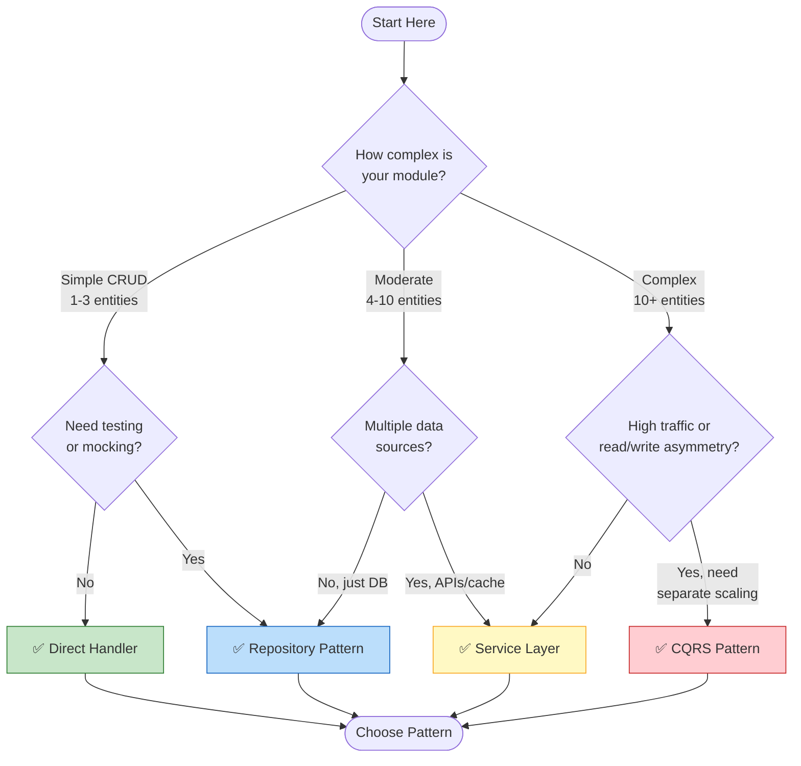
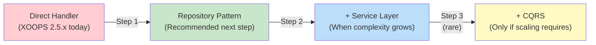

<span class="version-badge version-25x">2.5.x ✅</span> <span class="version-badge version-40x">4.0.x ✅</span>

> **Hvilket mønster skal jeg bruge?** Dette beslutningstræ hjælper dig med at vælge mellem direkte handlere, Repository Pattern, Service Layer og CQRS.

---

## Hurtigt beslutningstræ



---

## Mønstersammenligning

| Kriterier | Direkte Handler | Depot | Servicelag | CQRS |
|-----------|----------------------------------|-----|
| **Kompleksitet** | ⭐ | ⭐⭐ | ⭐⭐⭐ | ⭐⭐⭐⭐⭐ |
| **Testbarhed** | ❌ Hårdt | ✅ Godt | ✅ Fantastisk | ✅ Fantastisk |
| **Fleksibilitet** | ❌ Lav | ✅ Medium | ✅ Høj | ✅ Meget høj |
| **XOOPS 2.5.x** | ✅ Indfødt | ✅ Virker | ✅ Virker | ⚠️ Kompleks |
| **XOOPS 4.0** | ⚠️ Udgået | ✅ Anbefalet | ✅ Anbefalet | ✅ Til skala |
| **Holdstørrelse** | 1 udvikler | 1-3 udviklere | 2-5 devs | 5+ udviklere |
| **Vedligeholdelse** | ❌ Højere | ✅ Moderat | ✅ Nedre | ⚠️ Kræver ekspertise |

---

## Hvornår skal hvert mønster bruges

### ✅ Direct Handler (`XoopsPersistableObjectHandler`)

**Bedst til:** Simple moduler, hurtige prototyper, læring XOOPS

```php
// Simple and direct - good for small modules
$handler = xoops_getModuleHandler('article', 'news');
$articles = $handler->getObjects(new Criteria('status', 1));
```

**Vælg dette, når:**
- Opbygning af et simpelt modul med 1-3 databasetabeller
- Oprettelse af en hurtig prototype
- Du er den eneste udvikler og behøver ikke tests
- Modulet vil ikke vokse nævneværdigt

**Begrænsninger:**
- Svært at enhedsteste (global afhængighed)
- Tæt kobling til XOOPS databaselag
- Forretningslogik har en tendens til at lække ind i controllere

---

### ✅ Opbevaringsmønster

**Bedst til:** De fleste moduler, teams, der ønsker testbarhed

```php
// Abstraction allows mocking for tests
interface ArticleRepositoryInterface {
    public function findPublished(): array;
    public function save(Article $article): void;
}

class XoopsArticleRepository implements ArticleRepositoryInterface {
    private $handler;

    public function __construct() {
        $this->handler = xoops_getModuleHandler('article', 'news');
    }

    public function findPublished(): array {
        return $this->handler->getObjects(new Criteria('status', 1));
    }
}
```

**Vælg dette, når:**
- Du vil skrive enhedsprøver
- Du kan ændre datakilder senere (DB → API)
- Arbejde med 2+ udviklere
- Opbygning af moduler til distribution

**Opgraderingssti:** Dette er det anbefalede mønster til forberedelse af XOOPS 4.0.

---

### ✅ Servicelag

**Bedst til:** Moduler med kompleks forretningslogik

```php
// Service coordinates multiple repositories and contains business rules
class ArticlePublicationService {
    public function __construct(
        private ArticleRepositoryInterface $articles,
        private NotificationServiceInterface $notifications,
        private CacheInterface $cache
    ) {}

    public function publish(int $articleId): void {
        $article = $this->articles->find($articleId);
        $article->setStatus('published');
        $article->setPublishedAt(new DateTime());

        $this->articles->save($article);
        $this->notifications->notifySubscribers($article);
        $this->cache->invalidate("article:{$articleId}");
    }
}
```

**Vælg dette, når:**
- Operationer spænder over flere datakilder
- Forretningsregler er komplekse
- Du har brug for transaktionsstyring
- Flere dele af appen gør det samme

**Opgraderingssti:** Kombiner med Repository for en robust arkitektur.

---

### ⚠️ CQRS (Kommandoforespørgsel Ansvarsadskillelse)

**Bedst til:** Moduler i høj skala med læse/skrive-asymmetri

```php
// Commands modify state
class PublishArticleCommand {
    public function __construct(
        public readonly int $articleId,
        public readonly int $publisherId
    ) {}
}

// Queries read state (can use denormalized read models)
class GetPublishedArticlesQuery {
    public function __construct(
        public readonly int $limit = 10
    ) {}
}
```

**Vælg dette, når:**
- Læser langt flere end skrivere (100:1 eller mere)
- Du har brug for forskellig skalering for læsning og skrivning
- Komplekse krav til rapportering/analyse
- Event sourcing ville gavne dit domæne

**Advarsel:** CQRS tilføjer betydelig kompleksitet. De fleste XOOPS-moduler har ikke brug for det.

---

## Anbefalet opgraderingssti



### Trin 1: Indpak håndterere i repositories (2-4 timer)

1. Opret en grænseflade til dine behov for dataadgang
2. Implementer det ved hjælp af den eksisterende handler
3. Injicer lageret i stedet for at kalde `xoops_getModuleHandler()` direkte

### Trin 2: Tilføj servicelag, når det er nødvendigt (1-2 dage)

1. Når forretningslogik vises i controllere, udtræk til en tjeneste
2. Tjenesten bruger repositories, ikke handlere direkte
3. Controllere bliver tynde (rute → service → svar)

### Trin 3: Overvej kun CQRS hvis (sjældent)

1. Du har millioner af læsninger om dagen
2. Læse- og skrivemodeller er væsentligt forskellige
3. Du har brug for event sourcing til revisionsspor
4. Du har et team med erfaring med CQRS

---

## Hurtig referencekort

| Spørgsmål | Svar |
|--------|--------|
| **"Jeg skal bare gemme/indlæse data"** | Direkte Handler |
| **"Jeg vil skrive prøver"** | Opbevaringsmønster |
| **"Jeg har komplekse forretningsregler"** | Servicelag |
| **"Jeg skal skalere læser separat"** | CQRS |
| **"Jeg forbereder mig på XOOPS 4.0"** | Repository + Service Layer |

---

## Relateret dokumentation

- [Repository Pattern Guide](Patterns/Repository-Pattern.md)
- [Service Layer Pattern Guide](Patterns/Service-Layer-Pattern.md)
- [CQRS mønstervejledning](../07-XOOPS-4.0/Implementation-Guides/CQRS-Pattern-Guide.md) *(avanceret)*
- [Hybrid Mode Kontrakt](../07-XOOPS-4.0/Specifications/Hybrid-Mode-Contract.md)

---

#mønstre #dataadgang #beslutningstræ #bedste praksis #xoops
