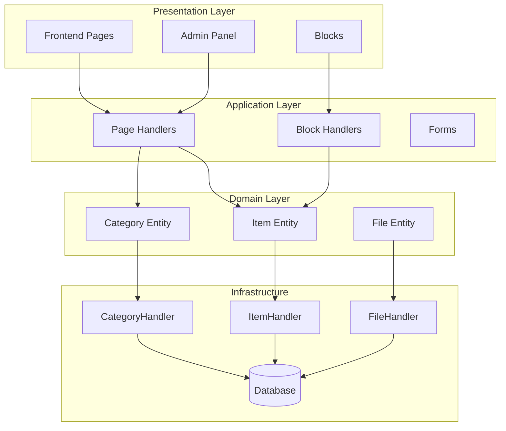
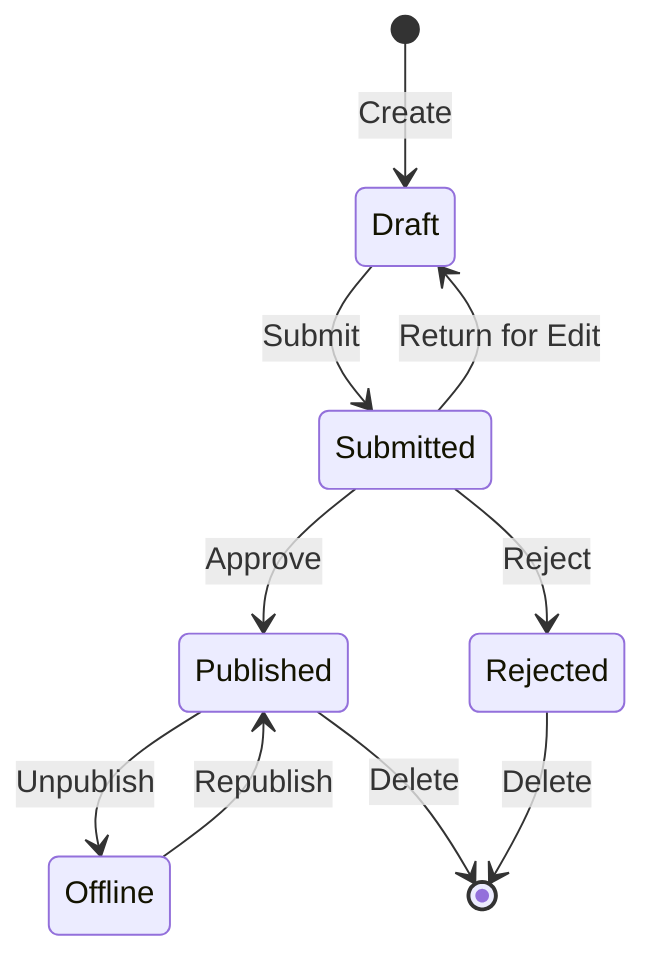

## Oversigt

Dette dokument giver en teknisk analyse af Publisher-modulets arkitektur, mønstre og implementeringsdetaljer. Brug dette som reference til at forstå, hvordan et XOOPS-modul i produktionskvalitet er opbygget.

## Arkitekturoversigt



## Directory Struktur

```
publisher/
├── admin/
│   ├── index.php           # Admin dashboard
│   ├── item.php            # Article management
│   ├── category.php        # Category management
│   ├── permission.php      # Permissions
│   ├── file.php            # File manager
│   └── menu.php            # Admin menu
├── assets/
│   ├── css/
│   ├── js/
│   └── images/
├── class/
│   ├── Category.php        # Category entity
│   ├── CategoryHandler.php # Category data access
│   ├── Item.php            # Article entity
│   ├── ItemHandler.php     # Article data access
│   ├── File.php            # File attachment
│   ├── FileHandler.php     # File data access
│   ├── Form/               # Form classes
│   ├── Common/             # Utilities
│   └── Helper.php          # Module helper
├── include/
│   ├── common.php          # Initialization
│   ├── functions.php       # Utility functions
│   ├── oninstall.php       # Install hooks
│   ├── onupdate.php        # Update hooks
│   └── search.php          # Search integration
├── language/
├── templates/
├── sql/
└── xoops_version.php
```

## Enhedsanalyse

### Vare (artikel) Enhed

```php
class Item extends \XoopsObject
{
    // Fields
    public function initVar(): void
    {
        $this->initVar('itemid', XOBJ_DTYPE_INT, null, false);
        $this->initVar('categoryid', XOBJ_DTYPE_INT, 0, false);
        $this->initVar('title', XOBJ_DTYPE_TXTBOX, '', true);
        $this->initVar('subtitle', XOBJ_DTYPE_TXTBOX, '');
        $this->initVar('summary', XOBJ_DTYPE_TXTAREA, '');
        $this->initVar('body', XOBJ_DTYPE_TXTAREA, '', true);
        $this->initVar('uid', XOBJ_DTYPE_INT, 0);
        $this->initVar('status', XOBJ_DTYPE_INT, 0);
        $this->initVar('datesub', XOBJ_DTYPE_INT, time());
        // ... more fields
    }

    // Business methods
    public function isPublished(): bool
    {
        return $this->getVar('status') == _PUBLISHER_STATUS_PUBLISHED;
    }

    public function canEdit(int $userId): bool
    {
        return $this->getVar('uid') == $userId
            || $this->isAdmin($userId);
    }
}
```

### Håndtermønster

```php
class ItemHandler extends \XoopsPersistableObjectHandler
{
    public function __construct(\XoopsDatabase $db)
    {
        parent::__construct(
            $db,
            'publisher_items',
            Item::class,
            'itemid',
            'title'
        );
    }

    public function getPublishedItems(int $limit = 10): array
    {
        $criteria = new \CriteriaCompo();
        $criteria->add(new \Criteria('status', _PUBLISHER_STATUS_PUBLISHED));
        $criteria->setSort('datesub');
        $criteria->setOrder('DESC');
        $criteria->setLimit($limit);

        return $this->getObjects($criteria);
    }
}
```

## Tilladelsessystem

### Tilladelsestyper

| Tilladelse | Beskrivelse |
|------------|-------------|
| `publisher_view` | Se kategori/artikler |
| `publisher_submit` | Indsend nye artikler |
| `publisher_approve` | Autogodkend indsendelser |
| `publisher_moderate` | Gennemgå afventende artikler |
| `publisher_global` | Globale modultilladelser |

### Tilladelsestjek

```php
class PermissionHandler
{
    public function isGranted(string $permission, int $categoryId): bool
    {
        $userId = $GLOBALS['xoopsUser']?->uid() ?? 0;
        $groups = $this->getUserGroups($userId);

        return $this->grouppermHandler->checkRight(
            $permission,
            $categoryId,
            $groups,
            $this->helper->getModule()->mid()
        );
    }
}
```

## Arbejdsgangstilstande



## Skabelonstruktur

### Frontend skabeloner

| Skabelon | Formål |
|--------|--------|
| `publisher_index.tpl` | Modulets hjemmeside |
| `publisher_item.tpl` | Enkelt artikel |
| `publisher_category.tpl` | Kategoriliste |
| `publisher_submit.tpl` | Indsendelsesformular |
| `publisher_search.tpl` | Søgeresultater |

### Blok skabeloner

| Skabelon | Formål |
|--------|--------|
| `publisher_block_latest.tpl` | Seneste artikler |
| `publisher_block_spotlight.tpl` | Udvalgt artikel |
| `publisher_block_category.tpl` | Kategori menu |

## Anvendte nøglemønstre

1. **Handler-mønster** - Indkapsling af dataadgang
2. **Værdiobjekt** - Statuskonstanter
3. **Skabelonmetode** - Formgenerering
4. **Strategi** - Forskellige visningstilstande
5. **Observatør** - Notifikationer om begivenheder

## Lektioner til moduludvikling

1. Brug XoopsPersistableObjectHandler til CRUD
2. Implementer granulære tilladelser
3. Adskil præsentation fra logik
4. Brug kriterier til forespørgsler
5. Understøtte flere indholdsstatusser
6. Integrer med XOOPS notifikationssystem

## Relateret dokumentation

- Oprettelse af artikler - Artikelhåndtering
- Managing-Categories - Kategorisystem
- Tilladelser-Opsætning - Tilladelseskonfiguration
- Udvikler-Guide/Hooks-and-Events - Udvidelsespunkter
