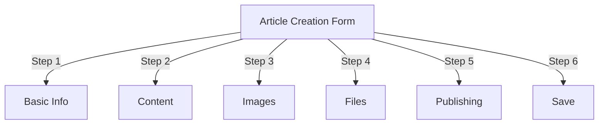
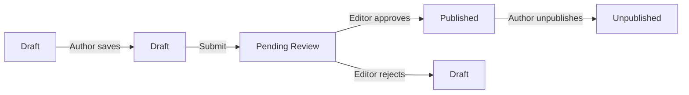
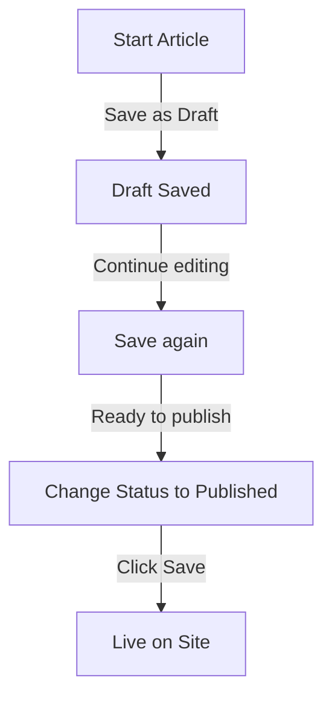

# Oprettelse af artikler i Publisher

> Trin-for-trin guide til oprettelse, redigering, formatering og publicering af artikler i Publisher-modulet.

---

## Få adgang til artikelstyring

### Admin Panel Navigation

```
Admin Panel
└── Modules
    └── Publisher
        └── Articles
            ├── Create New
            ├── Edit
            ├── Delete
            └── Publish
```

### Hurtigste vej

1. Log ind som **Administrator**
2. Klik på **Moduler** i administrationslinjen
3. Find **Udgiver**
4. Klik på linket **Admin**
5. Klik på **Artikler** i venstre menu
6. Klik på knappen **Tilføj artikel**

---

## Formular til oprettelse af artikel

### Grundlæggende oplysninger

Når du opretter en ny artikel, skal du udfylde følgende sektioner:



---

## Trin 1: Grundlæggende oplysninger

### Påkrævede felter

#### Artikeltitel

```
Field: Title
Type: Text input (required)
Max length: 255 characters
Example: "Top 5 Tips for Better Photography"
```

**Retningslinjer:**
- Beskrivende og specifik
- Inkluder nøgleord for SEO
- Undgå ALL CAPS
- Hold under 60 tegn for den bedste visning

#### Vælg kategori

```
Field: Category
Type: Dropdown (required)
Options: List of created categories
Example: Photography > Tutorials
```

**Tips:**
- Forældre og underkategorier tilgængelige
- Vælg den mest relevante kategori
- Kun én kategori pr. artikel
- Kan ændres senere

#### Artiklens undertitel (valgfrit)

```
Field: Subtitle
Type: Text input (optional)
Max length: 255 characters
Example: "Learn photography fundamentals in 5 easy steps"
```

**Bruges til:**
- Sammenfatningsoverskrift
- Teaser tekst
- Udvidet titel

### Artikelbeskrivelse

#### Kort beskrivelse

```
Field: Short Description
Type: Textarea (optional)
Max length: 500 characters
```

**Formål:**
- Forhåndsvisning af artikel
- Vises i kategoriliste
- Bruges i søgeresultater
- Metabeskrivelse for SEO

**Eksempel:**
```
"Discover essential photography techniques that will transform your photos
from ordinary to extraordinary. This comprehensive guide covers composition,
lighting, and exposure settings."
```

#### Fuldt indhold

```
Field: Article Body
Type: WYSIWYG Editor (required)
Max length: Unlimited
Format: HTML
```

Hovedartikelindholdsområdet med rich text-redigering.

---

## Trin 2: Formatering af indhold

### Brug af WYSIWYG Editor

#### Tekstformatering

```
Bold:           Ctrl+B or click [B] button
Italic:         Ctrl+I or click [I] button
Underline:      Ctrl+U or click [U] button
Strikethrough:  Alt+Shift+D or click [S] button
Subscript:      Ctrl+, (comma)
Superscript:    Ctrl+. (period)
```

#### Overskriftsstruktur

Opret korrekt dokumenthierarki:

```html
<h1>Article Title</h1>      <!-- Use once at top -->
<h2>Main Section</h2>        <!-- For major sections -->
<h3>Subsection</h3>          <!-- For subtopics -->
<h4>Sub-subsection</h4>      <!-- For details -->
```

**I Editor:**
- Klik på rullemenuen **Format**
- Vælg kursniveau (H1-H6)
- Indtast din overskrift

#### Lister

**Uordnet liste (punkter):**

```markdown
• Point one
• Point two
• Point three
```

Trin i editoren:
1. Klik på knappen [≡] Punktliste
2. Indtast hvert punkt
3. Tryk på Enter for næste punkt
4. Tryk på Backspace to gange for at afslutte listen

**Bestilt liste (nummereret):**

```markdown
1. First step
2. Second step
3. Third step
```

Trin i editoren:
1. Klik på knappen [1.] Nummereret liste
2. Indtast hvert element
3. Tryk på Enter for næste
4. Tryk på Backspace to gange for at afslutte

**Indlejrede lister:**

```markdown
1. Main point
   a. Sub-point
   b. Sub-point
2. Next point
```

Trin:
1. Opret første liste
2. Tryk på Tab for at indrykke
3. Opret indlejrede elementer
4. Tryk på Shift+Tab for at rykke ud

#### Links

**Tilføj hyperlink:**

1. Vælg tekst, der skal linkes
2. Klik på knappen **[🔗] Link**
3. Indtast URL: `https://example.com`
4. Valgfrit: Tilføj titel/mål
5. Klik på **Indsæt link**

**Fjern link:**

1. Klik i linket tekst
2. Klik på knappen **[🔗] Fjern link**

#### Kode & citater

**Blokcitat:**

```
"This is an important quote from an expert"
- Attribution
```

Trin:
1. Indtast citattekst
2. Klik på knappen **[❝] Blokcitat**
3. Tekst er indrykket og stylet

**Kodeblok:**

```python
def hello_world():
    print("Hello, World!")
```

Trin:
1. Klik på **Format → Kode**
2. Indsæt kode
3. Vælg sprog (valgfrit)
4. Kodevisninger med syntaksfremhævelse

---

## Trin 3: Tilføjelse af billeder

### Udvalgt billede (heltebillede)

```
Field: Featured Image / Main Image
Type: Image upload
Format: JPG, PNG, GIF, WebP
Max size: 5 MB
Recommended: 600x400 px
```

**For at uploade:**

1. Klik på knappen **Upload billede**
2. Vælg billede fra computer
3. Beskær/tilpas størrelse om nødvendigt
4. Klik på **Brug dette billede**

**Billedplacering:**
- Vises øverst i artiklen
- Bruges i kategorilister
- Vist i arkiv
- Bruges til social deling

### Inline billeder

Indsæt billeder i artikelteksten:

1. Placer markøren i editoren, hvor billedet skal hen
2. Klik på knappen **[🖼️] Billede** på værktøjslinjen
3. Vælg uploadmulighed:
   - Upload nyt billede
   - Vælg fra galleriet
   - Indtast billede URL
4. Konfigurer:
   
```
   Billedstørrelse:
   - Bredde: 300-600 px
   - Højde: Auto (vedligeholder forholdet)
   - Justering: Venstre/Center/Højre
   
```
5. Klik på **Indsæt billede**

**Ombryd tekst omkring billede:**

I editor efter indsættelse:

```html
<!-- Image floats left, text wraps around -->

```

### Billedgalleri

Opret galleri med flere billeder:

1. Klik på knappen **Galleri** (hvis tilgængelig)
2. Upload flere billeder:
   - Enkelt klik: Tilføj et
   - Træk og slip: Tilføj flere
3. Arranger rækkefølge ved at trække
4. Indstil billedtekster for hvert billede
5. Klik på **Opret galleri**

---

## Trin 4: Vedhæftning af filer

### Tilføj filvedhæftninger

```
Field: File Attachments
Type: File upload (multiple allowed)
Supported: PDF, DOC, XLS, ZIP, etc.
Max per file: 10 MB
Max per article: 5 files
```

**For at vedhæfte:**

1. Klik på knappen **Tilføj fil**
2. Vælg fil fra computer
3. Valgfrit: Tilføj filbeskrivelse
4. Klik på **Vedhæft fil**
5. Gentag for flere filer**Fileksempler:**
- PDF guider
- Excel regneark
- Word-dokumenter
- ZIP arkiver
- Kildekode

### Administrer vedhæftede filer

**Rediger fil:**

1. Klik på filnavn
2. Rediger beskrivelse
3. Klik på **Gem**

**Slet fil:**

1. Find filen på listen
2. Klik på ikonet **[×] Slet**
3. Bekræft sletning

---

## Trin 5: Udgivelse og status

### Artikelstatus

```
Field: Status
Type: Dropdown
Options:
  - Draft: Not published, only author sees
  - Pending: Waiting for approval
  - Published: Live on site
  - Archived: Old content
  - Unpublished: Was published, now hidden
```

**Status Workflow:**



### Udgivelsesmuligheder

#### Udgiv straks

```
Status: Published
Start Date: Today (auto-filled)
End Date: (leave blank for no expiration)
```

#### Tidsplan for senere

```
Status: Scheduled
Start Date: Future date/time
Example: February 15, 2024 at 9:00 AM
```

Artiklen udgives automatisk på det angivne tidspunkt.

#### Indstil udløb

```
Enable Expiration: Yes
Expiration Date: Future date
Action: Archive/Hide/Delete
Example: April 1, 2024 (article auto-archives)
```

### Synlighedsindstillinger

```yaml
Show Article:
  - Display on front page: Yes/No
  - Show in category: Yes/No
  - Include in search: Yes/No
  - Include in recent articles: Yes/No

Featured Article:
  - Mark as featured: Yes/No
  - Featured section position: (number)
```

---

## Trin 6: SEO & Metadata

### SEO Indstillinger

```
Field: SEO Settings (Expand section)
```

#### Metabeskrivelse

```
Field: Meta Description
Type: Text (160 characters recommended)
Used by: Search engines, social media

Example:
"Learn photography fundamentals in 5 easy steps.
Discover composition, lighting, and exposure techniques."
```

#### Meta søgeord

```
Field: Meta Keywords
Type: Comma-separated list
Max: 5-10 keywords

Example: Photography, Tutorial, Composition, Lighting, Exposure
```

#### URL Slug

```
Field: URL Slug (auto-generated from title)
Type: Text
Format: lowercase, hyphens, no spaces

Auto: "top-5-tips-for-better-photography"
Edit: Change before publishing
```

#### Åbn Graph Tags

Autogenereret fra artikelinfo:
- Titel
- Beskrivelse
- Udvalgt billede
- Artikel URL
- Udgivelsesdato

Brugt af Facebook, LinkedIn, WhatsApp osv.

---

## Trin 7: Kommentarer og interaktion

### Kommentarindstillinger

```yaml
Allow Comments:
  - Enable: Yes/No
  - Default: Inherit from preferences
  - Override: Specific to this article

Moderate Comments:
  - Require approval: Yes/No
  - Default: Inherit from preferences
```

### Bedømmelsesindstillinger

```yaml
Allow Ratings:
  - Enable: Yes/No
  - Scale: 5 stars (default)
  - Show average: Yes/No
  - Show count: Yes/No
```

---

## Trin 8: Avancerede indstillinger

### Forfatter & Byline

```
Field: Author
Type: Dropdown
Default: Current user
Options: All users with author permission

Display:
  - Show author name: Yes/No
  - Show author bio: Yes/No
  - Show author avatar: Yes/No
```

### Rediger lås

```
Field: Edit Lock
Purpose: Prevent accidental changes

Lock Article:
  - Locked: Yes/No
  - Lock reason: "Final version"
  - Unlock date: (optional)
```

### Revisionshistorik

Automatisk gemte versioner af artiklen:

```
View Revisions:
  - Click "Revision History"
  - Shows all saved versions
  - Compare versions
  - Restore previous version
```

---

## Gem og udgivelse

### Gem arbejdsgang



### Gem artikel

**Auto-gem:**
- Udløses hvert 60. sekund
- Gemmer automatisk som kladde
- Viser "Sidst gemt: 2 minutter siden"

**Manuel lagring:**
- Klik på **Gem og fortsæt** for at fortsætte med at redigere
- Klik på **Gem og vis** for at se den offentliggjorte version
- Klik på **Gem** for at gemme og lukke

### Udgiv artikel

1. Indstil **Status**: Udgivet
2. Indstil **Startdato**: Nu (eller fremtidig dato)
3. Klik på **Gem** eller **Udgiv**
4. Bekræftelsesmeddelelse vises
5. Artiklen er live (eller planlagt)

---

## Redigering af eksisterende artikler

### Få adgang til artikeleditor

1. Gå til **Admin → Udgiver → Artikler**
2. Find artiklen på listen
3. Klik på ikonet/knappen **Rediger**
4. Foretag ændringer
5. Klik på **Gem**

### Masseredigering

Rediger flere artikler på én gang:

```
1. Go to Articles list
2. Select articles (checkboxes)
3. Choose "Bulk Edit" from dropdown
4. Change selected field
5. Click "Update All"

Available for:
  - Status
  - Category
  - Featured (Yes/No)
  - Author
```

### Eksempel på artikel

Før udgivelse:

1. Klik på knappen **Preview**
2. Se som læserne vil se
3. Tjek formatering
4. Test links
5. Vend tilbage til editoren for at justere

---

## Artikelstyring

### Se alle artikler

**Artikellistevisning:**

```
Admin → Publisher → Articles

Columns:
  - Title
  - Category
  - Author
  - Status
  - Created date
  - Modified date
  - Actions (Edit, Delete, Preview)

Sorting:
  - By title (A-Z)
  - By date (newest/oldest)
  - By status (Published/Draft)
  - By category
```

### Filtrer artikler

```
Filter Options:
  - By category
  - By status
  - By author
  - By date range
  - Search by title

Example: Show all "Draft" articles by "John" in "News" category
```

### Slet artikel

**Blød sletning (anbefales):**

1. Skift **Status**: Ikke offentliggjort
2. Klik på **Gem**
3. Artikel skjult, men ikke slettet
4. Kan gendannes senere

**Hård sletning:**

1. Vælg artikel på listen
2. Klik på knappen **Slet**
3. Bekræft sletning
4. Artikel fjernet permanent

---

## Bedste praksis for indhold

### At skrive kvalitetsartikler

```
Structure:
  ✓ Compelling title
  ✓ Clear subtitle/description
  ✓ Engaging opening paragraph
  ✓ Logical sections with headers
  ✓ Supporting visuals
  ✓ Conclusion/summary
  ✓ Call-to-action

Length:
  - Blog posts: 500-2000 words
  - News: 300-800 words
  - Guides: 2000-5000 words
  - Minimum: 300 words
```

### SEO Optimering

```
Title Optimization:
  ✓ Include primary keyword
  ✓ Keep under 60 characters
  ✓ Put keyword near beginning
  ✓ Be descriptive and specific

Content Optimization:
  ✓ Use headings (H1, H2, H3)
  ✓ Include keyword in heading
  ✓ Use bold for important terms
  ✓ Add descriptive links
  ✓ Include images with alt text

Meta Description:
  ✓ Include primary keyword
  ✓ 155-160 characters
  ✓ Action-oriented
  ✓ Unique per article
```

### Formateringstip

```
Readability:
  ✓ Short paragraphs (2-4 sentences)
  ✓ Bullet points for lists
  ✓ Subheadings every 300 words
  ✓ Generous whitespace
  ✓ Line breaks between sections

Visual Appeal:
  ✓ Featured image at top
  ✓ Inline images in content
  ✓ Alt text on all images
  ✓ Code blocks for technical
  ✓ Blockquotes for emphasis
```

---

## Tastaturgenveje

### Editor-genveje

```
Bold:               Ctrl+B
Italic:             Ctrl+I
Underline:          Ctrl+U
Link:               Ctrl+K
Save Draft:         Ctrl+S
```

### Tekstgenveje

```
-- →  (dash to em dash)
... → … (three dots to ellipsis)
(c) → © (copyright)
(r) → ® (registered)
(tm) → ™ (trademark)
```

---

## Almindelige opgaver

### Kopier artikel

1. Åbn artikel
2. Klik på knappen **Duplicate** eller **Klon**
3. Artikel kopieret som udkast
4. Rediger titel og indhold
5. Udgiv

### Planlæg artikel

1. Opret artikel
2. Indstil **Startdato**: Fremtidig dato/tid
3. Indstil **Status**: Udgivet
4. Klik på **Gem**
5. Artiklen udgives automatisk

### Batch Publishing

1. Opret artikler som kladder
2. Indstil udgivelsesdatoer
3. Artikler udgives automatisk på planlagte tidspunkter
4. Overvåg fra "Planlagt" visning

### Flyt mellem kategorier

1. Rediger artikel
2. Skift rullemenuen **Kategori**
3. Klik på **Gem**
4. Artiklen vises i ny kategori

---

## Fejlfinding

### Problem: Artiklen kan ikke gemmes

**Løsning:**
```
1. Check form for required fields
2. Verify category is selected
3. Check PHP memory limit
4. Try saving as draft first
5. Clear browser cache
```

### Problem: Billeder vises ikke

**Løsning:**
```
1. Verify image upload succeeded
2. Check image file format (JPG, PNG)
3. Verify image path in database
4. Check upload directory permissions
5. Try re-uploading image
```

### Problem: Editorens værktøjslinje vises ikke

**Løsning:**
```
1. Clear browser cache
2. Try different browser
3. Disable browser extensions
4. Check JavaScript console for errors
5. Verify editor plugin installed
```

### Problem: Artiklen udgives ikke

**Løsning:**
```
1. Verify Status = "Published"
2. Check Start Date is today or earlier
3. Verify permissions allow publishing
4. Check category is published
5. Clear module cache
```

---

## Relaterede vejledninger

- Konfigurationsvejledning
- Kategoristyring
- Opsætning af tilladelser
- Brugerdefinerede skabeloner

---

## Næste trin

- Opret din første artikel
- Opsæt kategorier
- Konfigurer tilladelser
- Gennemgå skabelontilpasning

---

#udgiver #artikler #indhold #skabelse #formatering #redigering #xoops
