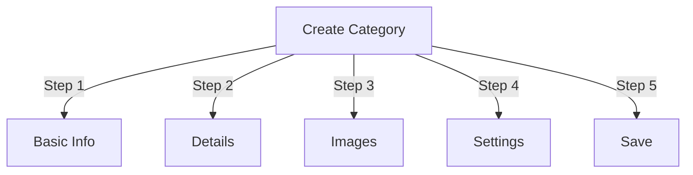

# Håndtering af kategorier i Publisher

> Komplet guide til at oprette, organisere hierarkier og administrere kategorier i Publisher-modulet.

---

## Grundlæggende om kategori

### Hvad er kategorier?

Kategorier organiserer artikler i logiske grupper:

```
Example Structure:

  News (Main Category)
    ├── Technology
    ├── Sports
    └── Entertainment

  Tutorials (Main Category)
    ├── Photography
    │   ├── Basics
    │   └── Advanced
    └── Writing
        └── Blogging
```

### Fordele ved god kategoristruktur

```
✓ Better user navigation
✓ Organized content
✓ Improved SEO
✓ Easier content management
✓ Better editorial workflow
```

---

## Adgangskategoristyring

### Admin Panel Navigation

```
Admin Panel
└── Modules
    └── Publisher
        └── Categories
            ├── Create New
            ├── Edit
            ├── Delete
            ├── Permissions
            └── Organize
```

### Hurtig adgang

1. Log ind som **Administrator**
2. Gå til **Admin → Moduler**
3. Klik på **Udgiver → Admin**
4. Klik på **Kategorier** i venstre menu

---

## Oprettelse af kategorier

### Formular til oprettelse af kategori



### Trin 1: Grundlæggende oplysninger

#### Kategorinavn

```
Field: Category Name
Type: Text input (required)
Max length: 100 characters
Uniqueness: Should be unique
Example: "Photography"
```

**Retningslinjer:**
- Konsekvent beskrivende og ental eller flertal
- Bruges med store bogstaver
- Undgå specialtegn
- Hold dig rimelig kort

#### Kategori Beskrivelse

```
Field: Description
Type: Textarea (optional)
Max length: 500 characters
Used in: Category listing pages, category blocks
```

**Formål:**
- Forklarer kategoriindhold
- Vises over kategoriartikler
- Hjælper brugerne med at forstå omfanget
- Bruges til SEO metabeskrivelse

**Eksempel:**
```
"Photography tips, tutorials, and inspiration for
all skill levels. From composition basics to advanced
lighting techniques, master your craft."
```

### Trin 2: Forældrekategori

#### Opret hierarki

```
Field: Parent Category
Type: Dropdown
Options: None (root), or existing categories
```

**Eksempler på hierarki:**

```
Flat Structure:
  News
  Tutorials
  Reviews

Nested Structure:
  News
    Technology
    Business
    Sports
  Tutorials
    Photography
      Basics
      Advanced
    Writing
```

**Opret underkategori:**

1. Klik på rullemenuen **Overordnet kategori**
2. Vælg forælder (f.eks. "Nyheder")
3. Udfyld kategorinavn
4. Gem
5. Ny kategori vises som underordnet

### Trin 3: Kategoribillede

#### Upload kategoribillede

```
Field: Category Image
Type: Image upload (optional)
Format: JPG, PNG, GIF, WebP
Max size: 5 MB
Recommended: 300x200 px (or your theme size)
```

**For at uploade:**

1. Klik på knappen **Upload billede**
2. Vælg billede fra computer
3. Beskær/tilpas størrelse om nødvendigt
4. Klik på **Brug dette billede**

**Hvor brugt:**
- Kategorilisteside
- Kategoriblokoverskrift
- Brødkrumme (nogle temaer)
- Deling på sociale medier

### Trin 4: Kategoriindstillinger

#### Skærmindstillinger

```yaml
Status:
  - Enabled: Yes/No
  - Hidden: Yes/No (hidden from menus, still accessible)

Display Options:
  - Show description: Yes/No
  - Show image: Yes/No
  - Show article count: Yes/No
  - Show subcategories: Yes/No

Layout:
  - Items per page: 10-50
  - Display order: Date/Title/Author
  - Display direction: Ascending/Descending
```

#### Kategoritilladelser

```yaml
Who Can View:
  - Anonymous: Yes/No
  - Registered: Yes/No
  - Specific groups: Configure per group

Who Can Submit:
  - Registered: Yes/No
  - Specific groups: Configure per group
  - Author must have: "submit articles" permission
```

### Trin 5: SEO Indstillinger

#### Metatags

```
Field: Meta Description
Type: Text (160 characters)
Purpose: Search engine description

Field: Meta Keywords
Type: Comma-separated list
Example: photography, tutorials, tips, techniques
```

#### URL Konfiguration

```
Field: URL Slug
Type: Text
Auto-generated from category name
Example: "photography" from "Photography"
Can be customized before saving
```

### Gem kategori

1. Udfyld alle obligatoriske felter:
   - Kategorinavn ✓
   - Beskrivelse (anbefales)
2. Valgfrit: Upload billede, indstil SEO
3. Klik på **Gem kategori**
4. Bekræftelsesmeddelelse vises
5. Kategori er nu tilgængelig

---

## Kategorihierarki

### Opret indlejret struktur

```
Step-by-step example: Create News → Technology subcategory

1. Go to Categories admin
2. Click "Add Category"
3. Name: "News"
4. Parent: (leave blank - this is root)
5. Save
6. Click "Add Category" again
7. Name: "Technology"
8. Parent: "News" (select from dropdown)
9. Save
```

### Se hierarkitræet

```
Categories view shows tree structure:

📁 News
  📄 Technology
  📄 Sports
  📄 Entertainment
📁 Tutorials
  📄 Photography
    📄 Basics
    📄 Advanced
  📄 Writing
```

Klik på udvidelsespilene for at vise/skjule underkategorier.

### Omorganiser kategorier

#### Flyt kategori

1. Gå til kategorilisten
2. Klik på **Rediger** på kategori
3. Skift **Overordnet kategori**
4. Klik på **Gem**
5. Kategori flyttet til ny stilling

#### Genarranger kategorier

Brug træk-og-slip, hvis det er tilgængeligt:

1. Gå til kategorilisten
2. Klik og træk kategori
3. Drop i ny position
4. Ordren gemmer automatisk

#### Slet kategori

**Mulighed 1: Soft Delete (Skjul)**

1. Rediger kategori
2. Indstil **Status**: Deaktiveret
3. Klik på **Gem**
4. Kategori skjult, men ikke slettet

**Mulighed 2: Slet hård**

1. Gå til kategorilisten
2. Klik på **Slet** på kategori
3. Vælg handling for artikler:
   
```
   ☐ Flyt artikler til overordnet kategori
   ☐ Flyt artikler til root (Nyheder)
   ☐ Slet alle artikler i kategorien
   
```
4. Bekræft sletning

---

## Kategori Operationer

### Rediger kategori

1. Gå til **Admin → Udgiver → Kategorier**
2. Klik på **Rediger** på kategori
3. Rediger felter:
   - Navn
   - Beskrivelse
   - Forældrekategori
   - Billede
   - Indstillinger
4. Klik på **Gem**

### Rediger kategoritilladelser

1. Gå til Kategorier
2. Klik på **Tilladelser** på kategori (eller klik på kategori og derefter på Tilladelser)
3. Konfigurer grupper:

```
For each group:
  ☐ View articles in this category
  ☐ Submit articles to this category
  ☐ Edit own articles
  ☐ Edit all articles
  ☐ Approve/Moderate articles
  ☐ Manage category
```

4. Klik på **Gem tilladelser**

### Indstil kategoribillede

**Upload nyt billede:**

1. Rediger kategori
2. Klik på **Skift billede**
3. Upload eller vælg billede
4. Beskær/tilpas størrelse
5. Klik på **Brug billede**
6. Klik på **Gem kategori**

**Fjern billede:**

1. Rediger kategori
2. Klik på **Fjern billede** (hvis tilgængeligt)
3. Klik på **Gem kategori**

---

## Kategoritilladelser

### Tilladelsesmatrix

```
                 Anonymous  Registered  Editor  Admin
View category        ✓         ✓         ✓       ✓
Submit article       ✗         ✓         ✓       ✓
Edit own article     ✗         ✓         ✓       ✓
Edit all articles    ✗         ✗         ✓       ✓
Moderate articles    ✗         ✗         ✓       ✓
Manage category      ✗         ✗         ✗       ✓
```

### Indstil tilladelser på kategoriniveau

#### Adgangskontrol pr. kategori

1. Gå til listen **Kategorier**
2. Vælg en kategori
3. Klik på **Tilladelser**
4. Vælg tilladelser for hver gruppe:

```
Example: News category
  Anonymous:   View only
  Registered:  Submit articles
  Editors:     Approve articles
  Admins:      Full control
```

5. Klik på **Gem**

#### Tilladelser på feltniveauKontroller, hvilke formularfelter brugere kan se/redigere:

```
Example: Limit field visibility for Registered users

Registered users can see/edit:
  ✓ Title
  ✓ Description
  ✓ Content
  ✗ Author (auto-set to current user)
  ✗ Scheduled date (only editors)
  ✗ Featured (only admins)
```

**Konfigurer i:**
- Kategoritilladelser
- Se efter afsnittet "Feltsynlighed".

---

## Bedste praksis for kategorier

### Kategoristruktur

```
✓ Keep hierarchy 2-3 levels deep
✗ Don't create too many top-level categories
✗ Don't create categories with one article

✓ Use consistent naming (plural or singular)
✗ Don't use vague names ("Stuff", "Other")

✓ Create categories for articles that exist
✗ Don't create empty categories in advance
```

### Retningslinjer for navngivning

```
Good names:
  "Photography"
  "Web Development"
  "Travel Tips"
  "Business News"

Avoid:
  "Articles" (too vague)
  "Content" (redundant)
  "News&Updates" (inconsistent)
  "PHOTOGRAPHY STUFF" (formatting)
```

### Organisationstip

```
By Topic:
  News
    Technology
    Sports
    Entertainment

By Type:
  Tutorials
    Video
    Text
    Interactive

By Audience:
  For Beginners
  For Experts
  Case Studies

Geographic:
  North America
    United States
    Canada
  Europe
```

---

## Kategori Blokke

### Publisher Category Block

Vis kategorilister på dit websted:

1. Gå til **Admin → Blokeringer**
2. Find **Udgiver - Kategorier**
3. Klik på **Rediger**
4. Konfigurer:

```
Block Title: "News Categories"
Show subcategories: Yes/No
Show article count: Yes/No
Height: (pixels or auto)
```

5. Klik på **Gem**

### Kategori Artikler Blok

Vis seneste artikler fra en bestemt kategori:

1. Gå til **Admin → Blokeringer**
2. Find **Udgiver - Kategoriartikler**
3. Klik på **Rediger**
4. Vælg:

```
Category: News (or specific category)
Number of articles: 5
Show images: Yes/No
Show description: Yes/No
```

5. Klik på **Gem**

---

## Kategorianalyse

### Se kategoristatistikker

Fra kategoriadministrator:

```
Each category shows:
  - Total articles: 45
  - Published: 42
  - Draft: 2
  - Pending approval: 1
  - Total views: 5,234
  - Latest article: 2 hours ago
```

### Vis Kategori Trafik

Hvis analyse er aktiveret:

1. Klik på kategorinavn
2. Klik på fanen **Statistik**
3. Vis:
   - Sidevisninger
   - Populære artikler
   - Trafiktendenser
   - Brugte søgetermer

---

## Kategori skabeloner

### Tilpas kategorivisning

Hvis du bruger tilpassede skabeloner, kan hver kategori tilsidesætte:

```
publisher_category.tpl
  ├── Category header
  ├── Category description
  ├── Category image
  ├── Article listing
  └── Pagination
```

**Sådan tilpasses:**

1. Kopier skabelonfil
2. Rediger HTML/CSS
3. Tildel til kategori i admin
4. Kategori bruger brugerdefineret skabelon

---

## Almindelige opgaver

### Opret nyhedshierarki

```
Admin → Publisher → Categories
1. Create "News" (parent)
2. Create "Technology" (parent: News)
3. Create "Sports" (parent: News)
4. Create "Entertainment" (parent: News)
```

### Flyt artikler mellem kategorier

1. Gå til **Artikler** admin
2. Vælg artikler (afkrydsningsfelter)
3. Vælg **"Skift kategori"** fra rullemenuen for massehandlinger
4. Vælg ny kategori
5. Klik på **Opdater alle**

### Skjul kategori uden at slette

1. Rediger kategori
2. Indstil **Status**: Deaktiveret/skjult
3. Gem
4. Kategori vises ikke i menuer (stadig tilgængelig via URL)

### Opret kategori til kladder

```
Best Practice:

Create "In Review" category
  ├── Purpose: Articles awaiting approval
  ├── Permissions: Hidden from public
  ├── Only admins/editors can see
  ├── Move articles here until approved
  └── Move to "News" when published
```

---

## Import/eksport kategorier

### Eksporter kategorier

Hvis tilgængelig:

1. Gå til **Kategorier** admin
2. Klik på **Eksporter**
3. Vælg format: CSV/JSON/XML
4. Download fil
5. Backup gemt

### Importer kategorier

Hvis tilgængelig:

1. Forbered fil med kategorier
2. Gå til **Kategorier** admin
3. Klik på **Importer**
4. Upload fil
5. Vælg opdateringsstrategi:
   - Kun oprette nye
   - Opdater eksisterende
   - Udskift alle
6. Klik på **Importer**

---

## Fejlfindingskategorier

### Problem: Underkategorier vises ikke

**Løsning:**
```
1. Verify parent category status is "Enabled"
2. Check permissions allow viewing
3. Verify subcategories have status "Enabled"
4. Clear cache: Admin → Tools → Clear Cache
5. Check theme shows subcategories
```

### Problem: Kan ikke slette kategori

**Løsning:**
```
1. Category must have no articles
2. Move or delete articles first:
   Admin → Articles
   Select articles in category
   Change category to another
3. Then delete empty category
4. Or choose "move articles" option when deleting
```

### Problem: Kategoribilledet vises ikke

**Løsning:**
```
1. Verify image uploaded successfully
2. Check image file format (JPG, PNG)
3. Verify upload directory permissions
4. Check theme displays category images
5. Try re-uploading image
6. Clear browser cache
```

### Problem: Tilladelser træder ikke i kraft

**Løsning:**
```
1. Check group permissions in Category
2. Check global Publisher permissions
3. Check user belongs to configured group
4. Clear session cache
5. Log out and log back in
6. Check permission modules installed
```

---

## Tjekliste for bedste praksis for kategori

Før du implementerer kategorier:

- [ ] Hierarki er 2-3 niveauer dybt
- [ ] Hver kategori har 5+ artikler
- [ ] Kategorinavne er konsistente
- [ ] Tilladelser er passende
- [ ] Kategoribilleder er optimeret
- [ ] Beskrivelserne er fuldstændige
- [ ] SEO metadata udfyldt
- [ ] URL'er er venlige
- [ ] Kategorier testet på front-end
- [ ] Dokumentation opdateret

---

## Relaterede vejledninger

- Oprettelse af artikler
- Administration af tilladelser
- Modulkonfiguration
- Installationsvejledning

---

## Næste trin

- Opret artikler i kategorier
- Konfigurer tilladelser
- Tilpas med brugerdefinerede skabeloner

---

#udgiver #kategorier #organisation #hierarki #ledelse #xoops
