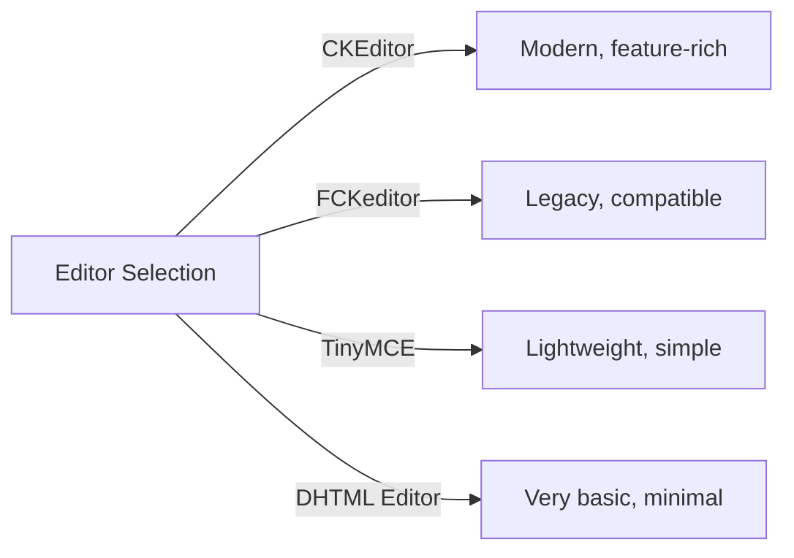
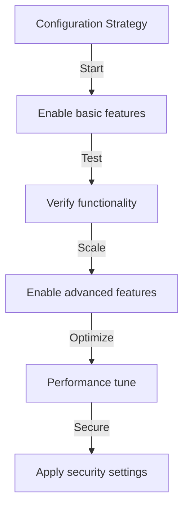

# Publisher Basic Configuration

> Konfigurer Publisher-modulets indstillinger, præferencer og generelle muligheder for din XOOPS-installation.

---

## Adgang til konfiguration

### Admin Panel Navigation

```
XOOPS Admin Panel
└── Modules
    └── Publisher
        ├── Preferences
        ├── Settings
        └── Configuration
```

1. Log ind som **Administrator**
2. Gå til **Admin Panel → Moduler**
3. Find **Publisher**-modulet
4. Klik på linket **Preferences** eller **Admin**

---

## Generelle indstillinger

### Adgang til konfiguration

```
Admin Panel → Modules → Publisher
```

Klik på **tandhjulsikonet** eller **Indstillinger** for disse muligheder:

#### Visningsindstillinger

| Indstilling | Indstillinger | Standard | Beskrivelse |
|--------|--------|--------|----------------|
| **Elementer pr. side** | 5-50 | 10 | Artikler vist i lister |
| **Vis brødkrumme** | Ja/Nej | Ja | Navigationsstivisning |
| **Brug personsøgning** | Ja/Nej | Ja | Sideinddeling af lange lister |
| **Vis dato** | Ja/Nej | Ja | Vis artikeldato |
| **Vis kategori** | Ja/Nej | Ja | Vis artikelkategori |
| **Vis forfatter** | Ja/Nej | Ja | Vis artikel forfatter |
| **Vis visninger** | Ja/Nej | Ja | Vis antal artikler |

**Eksempel på konfiguration:**

```yaml
Items Per Page: 15
Show Breadcrumb: Yes
Use Paging: Yes
Show Date: Yes
Show Category: Yes
Show Author: Yes
Show Views: Yes
```

#### Forfatterindstillinger

| Indstilling | Standard | Beskrivelse |
|--------|--------|------------|
| **Vis forfatternavn** | Ja | Vis rigtige navn eller brugernavn |
| **Brug brugernavn** | Nej | Vis brugernavn i stedet for navn |
| **Vis forfatterens e-mail** | Nej | Vis forfatterens kontakt-e-mail |
| **Vis forfatteravatar** | Ja | Vis brugeravatar |

---

## Editor Konfiguration

### Vælg WYSIWYG Editor

Publisher understøtter flere redaktører:

#### Tilgængelige redaktører



### CKEditor (anbefalet)

**Bedst til:** De fleste brugere, moderne browsere, alle funktioner

1. Gå til **Preferences**
2. Indstil **Editor**: CKEditor
3. Konfigurer muligheder:

```
Editor: CKEditor 4.x
Toolbar: Full
Height: 400px
Width: 100%
Remove plugins: []
Add plugins: [mathjax, codesnippet]
```

### FCKeditor

**Bedst til:** Kompatibilitet, ældre systemer

```
Editor: FCKeditor
Toolbar: Default
Custom config: (optional)
```

### TinyMCE

**Bedst til:** Minimalt fodaftryk, grundlæggende redigering

```
Editor: TinyMCE
Plugins: [paste, table, link, image]
Toolbar: minimal
```

---

## Fil- og uploadindstillinger

### Konfigurer upload-mapper

```
Admin → Publisher → Preferences → Upload Settings
```

#### Filtypeindstillinger

```yaml
Allowed File Types:
  Images:
    - jpg
    - jpeg
    - gif
    - png
    - webp
  Documents:
    - pdf
    - doc
    - docx
    - xls
    - xlsx
    - ppt
    - pptx
  Archives:
    - zip
    - rar
    - 7z
  Media:
    - mp3
    - mp4
    - webm
    - mov
```

#### Filstørrelsesgrænser

| Filtype | Max størrelse | Noter |
|-----------|--------|-------|
| **Billeder** | 5 MB | Per billedfil |
| **Dokumenter** | 10 MB | PDF, Office-filer |
| **Medie** | 50 MB | Video-/lydfiler |
| **Alle filer** | 100 MB | I alt pr. upload |

**Konfiguration:**

```
Max Image Upload Size: 5 MB
Max Document Upload Size: 10 MB
Max Media Upload Size: 50 MB
Total Upload Size: 100 MB
Max Files per Article: 5
```

### Ændring af billedstørrelse

Udgiveren tilpasser automatisk størrelsen på billeder for at sikre ensartethed:

```yaml
Thumbnail Size:
  Width: 150
  Height: 150
  Mode: Crop/Resize

Category Image Size:
  Width: 300
  Height: 200
  Mode: Resize

Article Featured Image:
  Width: 600
  Height: 400
  Mode: Resize
```

---

## Indstillinger for kommentar og interaktion

### Kommentarer Konfiguration

```
Preferences → Comments Section
```

#### Kommentarindstillinger

```yaml
Allow Comments:
  - Enabled: Yes/No
  - Default: Yes
  - Per-article override: Yes

Comment Moderation:
  - Moderate comments: Yes/No
  - Moderate guest comments only: Yes/No
  - Spam filter: Enabled
  - Max comments per day: (unlimited)

Comment Display:
  - Display format: Threaded/Flat
  - Comments per page: 10
  - Date format: Full date/Time ago
  - Show comment count: Yes/No
```

### Bedømmelseskonfiguration

```yaml
Allow Ratings:
  - Enabled: Yes/No
  - Default: Yes
  - Per-article override: Yes

Rating Options:
  - Rating scale: 5 stars (default)
  - Allow user to rate own: No
  - Show average rating: Yes
  - Show rating count: Yes
```

---

## SEO & URL Indstillinger

### Søgemaskineoptimering

```
Preferences → SEO Settings
```

#### URL Konfiguration

```yaml
SEO URLs:
  - Enabled: No (set to Yes for SEO URLs)
  - URL rewriting: None/Apache mod_rewrite/IIS rewrite

URL Format:
  - Category: /category/news
  - Article: /article/welcome-to-site
  - Archive: /archive/2024/01

Meta Description:
  - Auto-generate: Yes
  - Max length: 160 characters

Meta Keywords:
  - Auto-generate: Yes
  - From: Article tags, title
```

### Aktiver SEO URL'er (avanceret)

**Forudsætninger:**
- Apache med `mod_rewrite` aktiveret
- `.htaccess`-understøttelse aktiveret

**Konfigurationstrin:**

1. Gå til **Indstillinger → SEO Indstillinger**
2. Indstil **SEO URL'er**: Ja
3. Indstil **URL Rewriting**: Apache mod_rewrite
4. Bekræft, at `.htaccess`-filen findes i Publisher-mappen

**.htaccess Konfiguration:**

```apache
<IfModule mod_rewrite.c>
    RewriteEngine On
    RewriteBase /modules/publisher/

    # Category rewrites
    RewriteRule ^category/([0-9]+)-(.*)\.html$ index.php?op=showcategory&categoryid=$1 [L,QSA]

    # Article rewrites
    RewriteRule ^article/([0-9]+)-(.*)\.html$ index.php?op=showitem&itemid=$1 [L,QSA]

    # Archive rewrites
    RewriteRule ^archive/([0-9]+)/([0-9]+)/$ index.php?op=archive&year=$1&month=$2 [L,QSA]
</IfModule>
```

---

## Cache og ydeevne

### Caching-konfiguration

```
Preferences → Cache Settings
```

```yaml
Enable Caching:
  - Enabled: Yes
  - Cache type: File (or Memcache)

Cache Lifetime:
  - Category lists: 3600 seconds (1 hour)
  - Article lists: 1800 seconds (30 minutes)
  - Single article: 7200 seconds (2 hours)
  - Recent articles block: 900 seconds (15 minutes)

Cache Clear:
  - Manual clear: Available in admin
  - Auto-clear on article save: Yes
  - Clear on category change: Yes
```

### Ryd cache

**Manuel Cache Ryd:**

1. Gå til **Admin → Udgiver → Værktøjer**
2. Klik på **Ryd cache**
3. Vælg cachetyper, der skal ryddes:
   - [ ] Kategori cache
   - [ ] Artikelcache
   - [ ] Bloker cache
   - [ ] Alle cache
4. Klik på **Ryd valgte**

**Kommandolinje:**

```bash
# Clear all Publisher cache
php /path/to/xoops/admin/cache_manage.php publisher

# Or directly delete cache files
rm -rf /path/to/xoops/var/cache/publisher/*
```

---

## Underretning og arbejdsgang

### E-mail-meddelelser

```
Preferences → Notifications
```

```yaml
Notify Admin on New Article:
  - Enabled: Yes
  - Recipient: Admin email
  - Include summary: Yes

Notify Moderators:
  - Enabled: Yes
  - On new submission: Yes
  - On pending articles: Yes

Notify Author:
  - On approval: Yes
  - On rejection: Yes
  - On comment: No (optional)
```

### Indsendelsesarbejdsgang

```yaml
Require Approval:
  - Enabled: Yes
  - Editor approval: Yes
  - Admin approval: No

Draft Save:
  - Auto-save interval: 60 seconds
  - Save local versions: Yes
  - Revision history: Last 5 versions
```

---

## Indholdsindstillinger

### Udgivelsesstandarder

```
Preferences → Content Settings
```

```yaml
Default Article Status:
  - Draft/Published: Draft
  - Featured by default: No
  - Auto-publish time: None

Default Visibility:
  - Public/Private: Public
  - Show on front page: Yes
  - Show in categories: Yes

Scheduled Publishing:
  - Enabled: Yes
  - Allow per-article: Yes

Content Expiration:
  - Enabled: No
  - Auto-archive old: No
  - Archive after days: (unlimited)
```

### WYSIWYG Indholdsindstillinger

```yaml
Allow HTML:
  - In articles: Yes
  - In comments: No

Allow Embedded Media:
  - Videos (iframe): Yes
  - Images: Yes
  - Plugins: No

Content Filtering:
  - Strip tags: No
  - XSS filter: Yes (recommended)
```

---

## Indstillinger for søgemaskine

### Konfigurer søgeintegration

```
Preferences → Search Settings
```

```yaml
Enable Article Indexing:
  - Include in site search: Yes
  - Index type: Full text/Title only

Search Options:
  - Search in titles: Yes
  - Search in content: Yes
  - Search in comments: Yes

Meta Tags:
  - Auto generate: Yes
  - OG tags (social): Yes
  - Twitter cards: Yes
```

---

## Avancerede indstillinger

### Fejlretningstilstand (kun udvikling)

```
Preferences → Advanced
```

```yaml
Debug Mode:
  - Enabled: No (only for development!)

Development Features:
  - Show SQL queries: No
  - Log errors: Yes
  - Error email: admin@example.com
```

### Databaseoptimering

```
Admin → Tools → Optimize Database
```

```bash
# Manual optimization
mysql> OPTIMIZE TABLE publisher_items;
mysql> OPTIMIZE TABLE publisher_categories;
mysql> OPTIMIZE TABLE publisher_comments;
```

---

## Modultilpasning

### Temaskabeloner
```
Preferences → Display → Templates
```

Vælg skabelonsæt:
- Standard
- Klassisk
- Moderne
- Mørkt
- Brugerdefineret

Hver skabelon kontrollerer:
- Artikellayout
- Kategoriliste
- Arkivvisning
- Visning af kommentarer

---

## Konfigurationstip

### Bedste praksis



1. **Start Simple** - Aktiver kernefunktioner først
2. **Test hver ændring** - Bekræft før du går videre
3. **Aktiver cache** - Forbedrer ydeevnen
4. **Backup først** - Eksporter indstillinger før større ændringer
5. **Monitorlogs** - Tjek fejllogfiler regelmæssigt

### Ydeevneoptimering

```yaml
For Better Performance:
  - Enable caching: Yes
  - Cache lifetime: 3600 seconds
  - Limit items per page: 10-15
  - Compress images: Yes
  - Minify CSS/JS: Yes (if available)
```

### Sikkerhedshærdning

```yaml
For Better Security:
  - Moderate comments: Yes
  - Disable HTML in comments: Yes
  - XSS filtering: Yes
  - File type whitelist: Strict
  - Max upload size: Reasonable limit
```

---

## Eksport/importindstillinger

### Backup-konfiguration

```
Admin → Tools → Export Settings
```

**Sådan sikkerhedskopieres den aktuelle konfiguration:**

1. Klik på **Eksporter konfiguration**
2. Gem den downloadede `.cfg`-fil
3. Opbevar på et sikkert sted

**Sådan gendannes:**

1. Klik på **Importer konfiguration**
2. Vælg filen `.cfg`
3. Klik på **Gendan**

---

## Relaterede konfigurationsvejledninger

- Kategoristyring
- Oprettelse af artikler
- Tilladelseskonfiguration
- Installationsvejledning

---

## Fejlfinding Konfiguration

### Indstillinger gemmes ikke

**Løsning:**
1. Tjek mappetilladelser på `/var/config/`
2. Bekræft PHP skriveadgang
3. Tjek PHP fejllog for problemer
4. Ryd browserens cache, og prøv igen

### Editor vises ikke

**Løsning:**
1. Kontroller, at editor-plugin er installeret
2. Tjek XOOPS-editorens konfiguration
3. Prøv en anden redigeringsmulighed
4. Tjek browserkonsollen for JavaScript-fejl

### Ydeevneproblemer

**Løsning:**
1. Aktiver caching
2. Reducer varer pr. side
3. Komprimer billeder
4. Tjek databaseoptimering
5. Gennemgå log for langsomme forespørgsler

---

## Næste trin

- Konfigurer gruppetilladelser
- Opret din første artikel
- Opsæt kategorier
- Gennemgå brugerdefinerede skabeloner

---

#udgiver #konfiguration #præferencer #indstillinger #xoops
