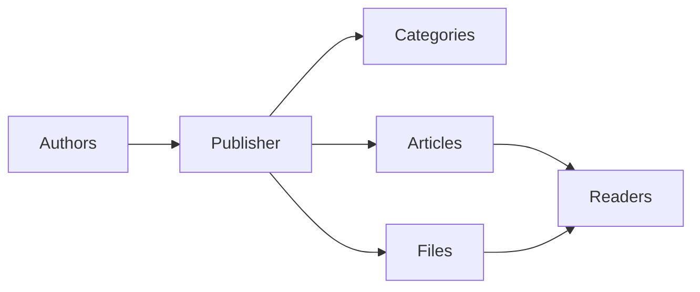
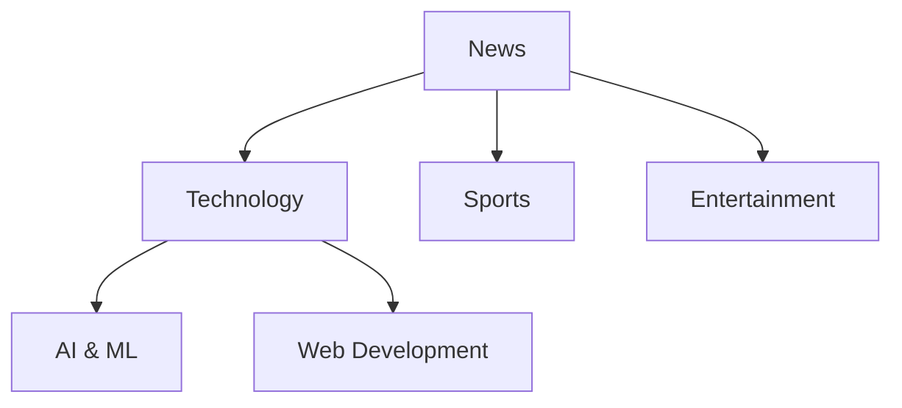
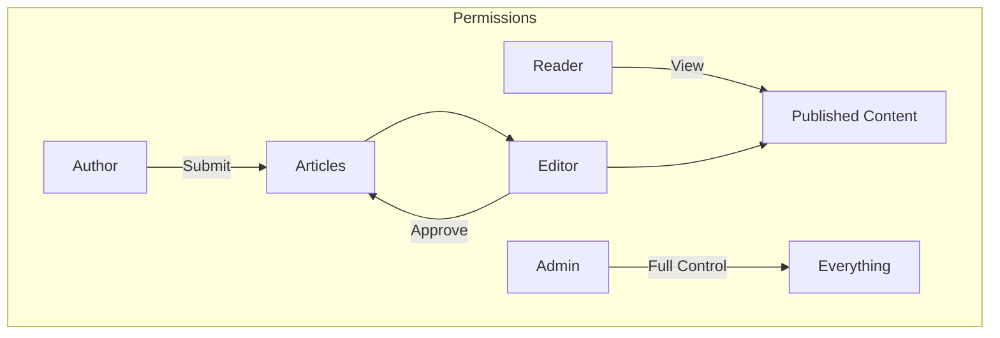
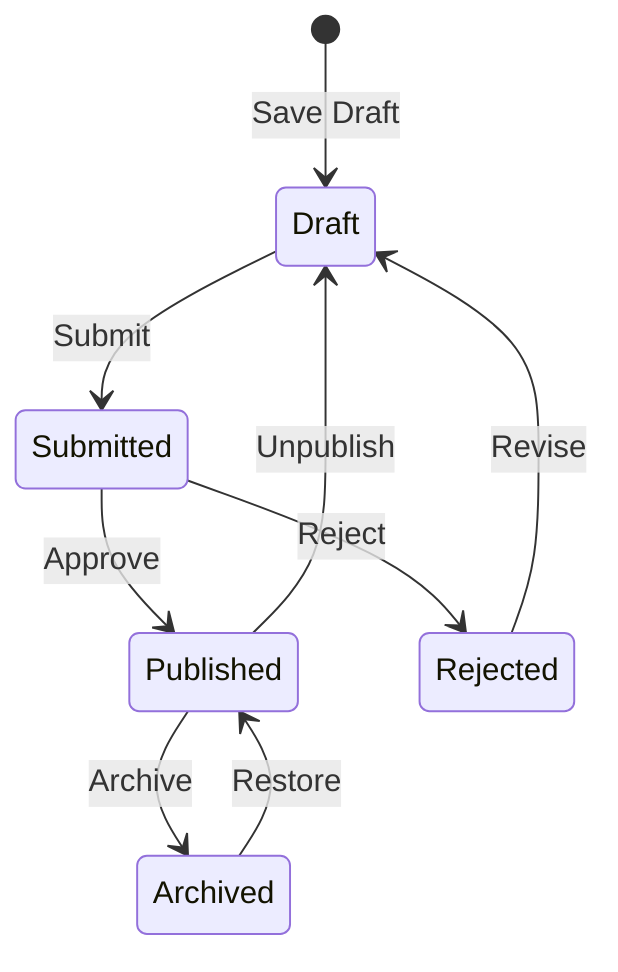

# Kom godt i gang med Publisher

> En trin-for-trin guide til opsætning og brug af Publisher-nyheder/blogmodulet.

---

## Hvad er Publisher?

Publisher er det førende indholdsstyringsmodul til XOOPS, designet til:

- **Nyhedswebsteder** - Udgiv artikler med kategorier
- **Blogs** - Personlig eller multi-forfatter blogging``
- **Dokumentation** - Organiserede vidensbaser
- **Indholdsportaler** - Blandet medieindhold



---

## Hurtig opsætning

### Trin 1: Installer Publisher

1. Download fra [GitHub](https://github.com/XoopsModules25x/publisher)
2. Upload til `modules/publisher/`
3. Gå til Admin → Moduler → Installer

### Trin 2: Opret kategorier



1. Admin → Udgiver → Kategorier
2. Klik på "Tilføj kategori"
3. Udfyld:
   - **Navn**: Kategorinavn
   - **Beskrivelse**: Hvad denne kategori indeholder
   - **Billede**: Valgfrit kategoribillede
4. Indstil tilladelser (hvem kan indsende/se)
5. Gem

### Trin 3: Konfigurer indstillinger

1. Admin → Udgiver → Præferencer
2. Nøgleindstillinger til at konfigurere:

| Indstilling | Anbefalet | Beskrivelse |
|--------|-------------|--------|
| Elementer pr. side | 10-20 | Artikler på indeks |
| Redaktør | TinyMCE/CKEditor | Rich text editor |
| Tillad bedømmelser | Ja | Læserfeedback |
| Tillad kommentarer | Ja | Diskussioner |
| Autogodkend | Nej | Redaktionel kontrol |

### Trin 4: Opret din første artikel

1. Hovedmenu → Udgiver → Indsend artikel
2. Udfyld formularen:
   - **Titel**: Artiklens overskrift
   - **Kategori**: Hvor det hører hjemme
   - **Sammendrag**: Kort beskrivelse
   - **Brødtekst**: Fuldt artiklens indhold
3. Tilføj valgfrie elementer:
   - Udvalgt billede
   - Vedhæftede filer
   - SEO indstillinger
4. Send til gennemgang eller offentliggør

---

## Brugerroller



### Læser
- Se offentliggjorte artikler
- Bedøm og kommenter
- Søg efter indhold

### Forfatter
- Indsend nye artikler
- Redigere egne artikler
- Vedhæft filer

### Redaktør
- Godkend/afvis indlæg
- Rediger enhver artikel
- Administrer kategorier

### Administrator
- Fuld modulkontrol
- Konfigurer indstillinger
- Administrer tilladelser

---

## At skrive artikler

### Artikeleditor

```
┌─────────────────────────────────────────────────────┐
│ Title: [Your Article Title                        ] │
├─────────────────────────────────────────────────────┤
│ Category: [Select Category          ▼]              │
├─────────────────────────────────────────────────────┤
│ Summary:                                            │
│ ┌─────────────────────────────────────────────────┐ │
│ │ Brief description shown in listings...          │ │
│ └─────────────────────────────────────────────────┘ │
├─────────────────────────────────────────────────────┤
│ Body:                                               │
│ ┌─────────────────────────────────────────────────┐ │
│ │ [B] [I] [U] [Link] [Image] [Code]               │ │
│ ├─────────────────────────────────────────────────┤ │
│ │                                                  │ │
│ │ Full article content goes here...               │ │
│ │                                                  │ │
│ └─────────────────────────────────────────────────┘ │
├─────────────────────────────────────────────────────┤
│ [Submit] [Preview] [Save Draft]                     │
└─────────────────────────────────────────────────────┘
```

### Bedste praksis

1. **Fantastiske titler** - Tydelige, engagerende overskrifter
2. **Gode opsummeringer** - Lok læserne til at klikke
3. **Struktureret indhold** - Brug overskrifter, lister, billeder
4. **Korrekt kategorisering** - Hjælp læserne med at finde indhold
5. **SEO optimering** - Nøgleord i titel og indhold

---

## Håndtering af indhold

### Artikel Status Flow



### Statusbeskrivelser

| Status | Beskrivelse |
|--------|-------------|
| Udkast | Igangværende arbejde |
| Indsendt | Afventer anmeldelse |
| Udgivet | Live på stedet |
| Udløbet | Tidligere udløbsdato |
| Afvist | Trænger til revision |
| Arkiveret | Fjernet fra lister |

---

## Navigation

### Adgang til Publisher

- **Hovedmenu** → Udgiver
- **Direkte URL**: `yoursite.com/modules/publisher/`

### Nøglesider

| Side | URL | Formål |
|------|-----|--------|
| Indeks | `/modules/publisher/` | Artikellister |
| Kategori | `/modules/publisher/category.php?id=X` | Kategoriartikler |
| Artikel | `/modules/publisher/item.php?itemid=X` | Enkelt artikel |
| Indsend | `/modules/publisher/submit.php` | Ny artikel |
| Søg | `/modules/publisher/search.php` | Find artikler |

---

## Blokke

Publisher tilbyder flere blokke til dit websted:

### Seneste artikler
Viser seneste publicerede artikler

### Kategorimenu
Navigation efter kategori

### Populære artikler
Mest set indhold

### Tilfældig artikel
Vis tilfældigt indhold

### Spotlight
Udvalgte artikler

---

## Relateret dokumentation

- Oprettelse og redigering af artikler
- Håndtering af kategorier
- Udvidende forlag

---

#xoops #udgiver #brugervejledning #kom godt i gang #cms
