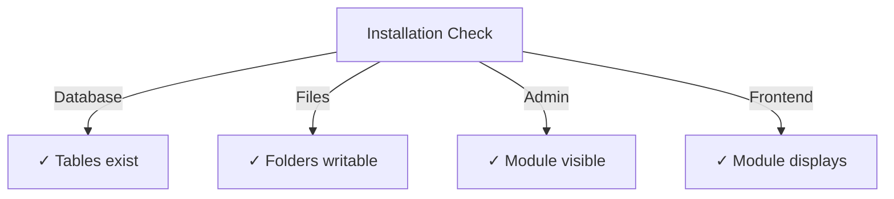

# Udgiverens installationsvejledning

> Fuldstændig instruktioner til installation og konfiguration af Publisher-modulet til XOOPS CMS.

---

## Systemkrav

### Minimumskrav

| Krav | Version | Noter |
|-------------|--------|-------|
| XOOPS | 2.5.10+ | Core CMS platform |
| PHP | 7,1+ | PHP 8.x anbefales |
| MySQL | 5,7+ | Databaseserver |
| Webserver | Apache/Nginx | Med støtte til omskrivning |

### PHP-udvidelser

```
- PDO (PHP Data Objects)
- pdo_mysql or mysqli
- mb_string (multibyte strings)
- curl (for external content)
- json
- gd (image processing)
```

### Diskplads

- **Modulfiler**: ~5 MB
- **Cachemappe**: 50+ MB anbefales
- **Upload bibliotek**: Efter behov for indhold

---

## Tjekliste før installation

Før du installerer Publisher, skal du kontrollere:

- [ ] XOOPS kerne er installeret og kører
- [ ] Adminkonto har moduladministrationstilladelser
- [ ] Database backup oprettet
- [ ] Filtilladelser tillader skriveadgang til mappen `/modules/`
- [ ] PHP hukommelsesgrænse er mindst 128 MB
- [ ] Størrelsesgrænser for filupload er passende (min. 10 MB)

---

## Installationstrin

### Trin 1: Download Publisher

#### Mulighed A: Fra GitHub (anbefalet)

```bash
# Navigate to modules directory
cd /path/to/xoops/htdocs/modules/

# Clone the repository
git clone https://github.com/XoopsModules25x/publisher.git

# Verify download
ls -la publisher/
```

#### Mulighed B: Manuel download

1. Besøg [GitHub Publisher Releases](https://github.com/XoopsModules25x/publisher/releases)
2. Download den seneste `.zip`-fil
3. Udpak til `modules/publisher/`

### Trin 2: Indstil filtilladelser

```bash
# Set proper ownership
chown -R www-data:www-data /path/to/xoops/htdocs/modules/publisher

# Set directory permissions (755)
find publisher -type d -exec chmod 755 {} \;

# Set file permissions (644)
find publisher -type f -exec chmod 644 {} \;

# Make scripts executable
chmod 755 publisher/admin/index.php
chmod 755 publisher/index.php
```

### Trin 3: Installer via XOOPS Admin

1. Log ind på **XOOPS Admin Panel** som administrator
2. Naviger til **System → Moduler**
3. Klik på **Installer modul**
4. Find **Udgiver** på listen
5. Klik på knappen **Installer**
6. Vent på, at installationen er fuldført (viser oprettede databasetabeller)

```
Installation Progress:
✓ Tables created
✓ Configuration initialized
✓ Permissions set
✓ Cache cleared
Installation Complete!
```

---

## Indledende opsætning

### Trin 1: Få adgang til Publisher Admin

1. Gå til **Admin Panel → Moduler**
2. Find **Publisher**-modulet
3. Klik på linket **Admin**
4. Du er nu i Publisher Administration

### Trin 2: Konfigurer modulpræferencer

1. Klik på **Preferences** i menuen til venstre
2. Konfigurer grundlæggende indstillinger:

```
General Settings:
- Editor: Select your WYSIWYG editor
- Items per page: 10
- Show breadcrumb: Yes
- Allow comments: Yes
- Allow ratings: Yes

SEO Settings:
- SEO URLs: No (enable later if needed)
- URL rewriting: None

Upload Settings:
- Max upload size: 5 MB
- Allowed file types: jpg, png, gif, pdf, doc, docx
```

3. Klik på **Gem indstillinger**

### Trin 3: Opret første kategori

1. Klik på **Kategorier** i venstre menu
2. Klik på **Tilføj kategori**
3. Udfyld formularen:

```
Category Name: News
Description: Latest news and updates
Image: (optional) Upload category image
Parent Category: (leave blank for top-level)
Status: Enabled
```

4. Klik på **Gem kategori**

### Trin 4: Bekræft installationen

Tjek disse indikatorer:



#### Databasekontrol

```bash
mysql -u xoops_user -p xoops_database
mysql> SHOW TABLES LIKE 'publisher%';

# Should show tables:
# - publisher_categories
# - publisher_items
# - publisher_comments
# - publisher_files
```

#### Front-End Check

1. Besøg din XOOPS-hjemmeside
2. Se efter **Udgiver** eller **Nyheder** blok
3. Skal vise seneste artikler

---

## Konfiguration efter installation

### Editor Valg

Publisher understøtter flere WYSIWYG-editorer:

| Redaktør | Fordele | Ulemper |
|--------|------|------|
| FCKeditor | Funktionsrig | Ældre, større |
| CKEditor | Moderne standard | Konfigurationskompleksitet |
| TinyMCE | Letvægts | Begrænsede funktioner |
| DHTML Editor | Grundlæggende | Meget grundlæggende |

**Sådan skifter du editor:**

1. Gå til **Preferences**
2. Rul til indstillingen **Editor**
3. Vælg fra rullemenuen
4. Gem og test

### Upload Directory Setup

```bash
# Create upload directories
mkdir -p /path/to/xoops/uploads/publisher/
mkdir -p /path/to/xoops/uploads/publisher/categories/
mkdir -p /path/to/xoops/uploads/publisher/images/
mkdir -p /path/to/xoops/uploads/publisher/files/

# Set permissions
chmod 755 /path/to/xoops/uploads/publisher/
chmod 755 /path/to/xoops/uploads/publisher/*
```

### Konfigurer billedstørrelser

Indstil miniaturestørrelser i Præferencer:

```
Category image size: 300 x 200 px
Article image size: 600 x 400 px
Thumbnail size: 150 x 100 px
```

---

## Trin efter installation

### 1. Indstil gruppetilladelser

1. Gå til **Tilladelser** i admin-menuen
2. Konfigurer adgang for grupper:
   - Anonym: Kun visning
   - Registrerede brugere: Indsend artikler
   - Redaktører: Godkend/rediger artikler
   - Administratorer: Fuld adgang

### 2. Konfigurer modulsynlighed

1. Gå til **Blocks** i XOOPS admin
2. Find udgiverblokke:
   - Udgiver - Seneste artikler
   - Udgiver - Kategorier
   - Forlag - Arkiver
3. Konfigurer bloksynlighed pr. side

### 3. Importer testindhold (valgfrit)

Importer prøveartikler til test:

1. Gå til **Publisher Admin → Import**
2. Vælg **Eksempelindhold**
3. Klik på **Importer**

### 4. Aktiver SEO URL'er (valgfrit)

For søgevenlige webadresser:

1. Gå til **Preferences**
2. Indstil **SEO URL'er**: Ja
3. Aktiver **.htaccess** omskrivning
4. Bekræft, at `.htaccess`-filen findes i Publisher-mappen

```apache
# .htaccess example
<IfModule mod_rewrite.c>
    RewriteEngine On
    RewriteBase /modules/publisher/
    RewriteRule ^category/([0-9]+)-(.*)\.html$ index.php?op=showcategory&categoryid=$1 [L]
    RewriteRule ^article/([0-9]+)-(.*)\.html$ index.php?op=showitem&itemid=$1 [L]
</IfModule>
```

---

## Fejlfinding Installation### Problem: Modulet vises ikke i admin

**Løsning:**
```bash
# Check file permissions
ls -la /path/to/xoops/modules/publisher/

# Check xoops_version.php exists
ls /path/to/xoops/modules/publisher/xoops_version.php

# Verify PHP syntax
php -l /path/to/xoops/modules/publisher/xoops_version.php
```

### Problem: Databasetabeller er ikke oprettet

**Løsning:**
1. Tjek, at MySQL bruger har CREATE TABLE privilegium
2. Tjek databasefejllog:
   
```bash
   mysql> SHOW WARNINGS;
   
```
3. Importer SQL manuelt:
   
```bash
   mysql -u bruger -p database < modules/publisher/sql/mysql.sql
   
```

### Problem: Filupload mislykkes

**Løsning:**
```bash
# Check directory exists and is writable
stat /path/to/xoops/uploads/publisher/

# Fix permissions
chmod 777 /path/to/xoops/uploads/publisher/

# Verify PHP settings
php -i | grep upload_max_filesize
```

### Problem: "Siden blev ikke fundet" fejl

**Løsning:**
1. Kontroller, at filen `.htaccess` er til stede
2. Kontroller, at Apache `mod_rewrite` er aktiveret:
   
```bash
   a2enmod omskrivning
   systemctl genstart apache2
   
```
3. Tjek `AllowOverride All` i Apache config

---

## Opgrader fra tidligere versioner

### Fra Publisher 1.x til 2.x

1. **Sikkerhedskopier aktuel installation:**
   
```bash
   cp -r modules/publisher/ modules/publisher-backup/
   mysqldump -u bruger -p database > publisher-backup.sql
   
```

2. **Download Publisher 2.x**

3. **Overskriv filer:**
   
```bash
   rm -rf moduler/udgiver/
   unzip publisher-2.0.zip -d moduler/
   
```

4. **Kør opdatering:**
   - Gå til **Admin → Udgiver → Opdater**
   - Klik på **Opdater database**
   - Vent på færdiggørelse

5. **Bekræft:**
   - Kontroller, at alle artikler vises korrekt
   - Bekræft, at tilladelserne er intakte
   - Test fil uploads

---

## Sikkerhedsovervejelser

### Filtilladelser

```
- Core files: 644 (readable by web server)
- Directories: 755 (browseable by web server)
- Upload directories: 755 or 777
- Config files: 600 (not readable by web)
```

### Deaktiver direkte adgang til følsomme filer

Opret `.htaccess` i uploadmapper:

```apache
<FilesMatch "\.(php|phtml|php3|php4|php5|phtml)$">
    Deny from all
</FilesMatch>
```

### Databasesikkerhed

```bash
# Use strong password
ALTER USER 'publisher_user'@'localhost' IDENTIFIED BY 'strong_password_here';

# Grant minimal permissions
GRANT SELECT, INSERT, UPDATE, DELETE ON publisher_db.* TO 'publisher_user'@'localhost';
FLUSH PRIVILEGES;
```

---

## Verifikationstjekliste

Efter installationen skal du kontrollere:

- [ ] Modulet vises på listen over adminmoduler
- [ ] Kan få adgang til Publisher-administrationssektionen
- [ ] Kan oprette kategorier
- [ ] Kan oprette artikler
- [ ] Artikler vises på front-end
- [ ] Filupload virker
- [ ] Billeder vises korrekt
- [ ] Tilladelser anvendes korrekt
- [ ] Databasetabeller oprettet
- [ ] Cache-mappen er skrivbar

---

## Næste trin

Efter vellykket installation:

1. Læs Grundlæggende konfigurationsvejledning
2. Opret din første artikel
3. Konfigurer gruppetilladelser
4. Gennemgå kategoristyring

---

## Support og ressourcer

- **GitHub Issues**: [Publisher Issues](https://github.com/XoopsModules25x/publisher/issues)
- **XOOPS Forum**: [Fællesskabssupport](https://www.xoops.org/modules/newbb/)
- **GitHub Wiki**: [Hjælp til installation](https://github.com/XoopsModules25x/publisher/wiki)

---

#publisher #installation #setup #xoops #modul #configuration
