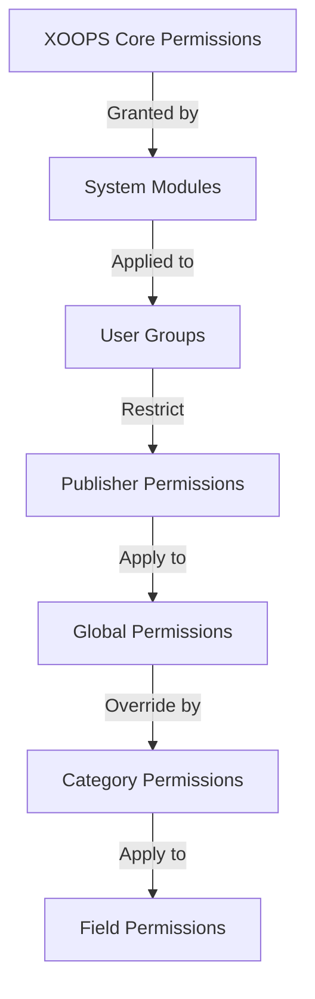

# Opsætning af udgivertilladelser

> Komplet vejledning til konfiguration af gruppetilladelser, adgangskontrol og administration af brugeradgang i Publisher.

---

## Grundlæggende om tilladelser

### Hvad er tilladelser?

Tilladelser styrer, hvad forskellige brugergrupper kan gøre i Publisher:

```
Who can:
  - View articles
  - Submit articles
  - Edit articles
  - Approve articles
  - Manage categories
  - Configure settings
```

### Tilladelsesniveauer

```
Anonymous
  └── View published articles only

Registered Users
  ├── View articles
  ├── Submit articles (pending approval)
  └── Edit own articles

Editors/Moderators
  ├── All registered permissions
  ├── Approve articles
  ├── Edit all articles
  └── Manage some categories

Administrators
  └── Full access to everything
```

---

## Administration af adgangstilladelser

### Naviger til Tilladelser

```
Admin Panel
└── Modules
    └── Publisher
        ├── Permissions
        ├── Category Permissions
        └── Group Management
```

### Hurtig adgang

1. Log ind som **Administrator**
2. Gå til **Admin → Moduler**
3. Klik på **Udgiver → Admin**
4. Klik på **Tilladelser** i venstre menu

---

## Globale tilladelser

### Tilladelser på modulniveau

Styr adgangen til Publisher-modulet og funktioner:

```
Permissions configuration view:
┌─────────────────────────────────────┐
│ Permission             │ Anon │ Reg │ Editor │ Admin │
├────────────────────────┼──────┼─────┼────────┼───────┤
│ View articles          │  ✓   │  ✓  │   ✓    │  ✓   │
│ Submit articles        │  ✗   │  ✓  │   ✓    │  ✓   │
│ Edit own articles      │  ✗   │  ✓  │   ✓    │  ✓   │
│ Edit all articles      │  ✗   │  ✗  │   ✓    │  ✓   │
│ Approve articles       │  ✗   │  ✗  │   ✓    │  ✓   │
│ Manage categories      │  ✗   │  ✗  │   ✗    │  ✓   │
│ Access admin panel     │  ✗   │  ✗  │   ✓    │  ✓   │
└─────────────────────────────────────┘
```

### Tilladelsesbeskrivelser

| Tilladelse | Brugere | Effekt |
|------------|-------|--------|
| **Se artikler** | Alle grupper | Kan se publicerede artikler på front-end |
| **Send artikler** | Registreret+ | Kan oprette nye artikler (afventer godkendelse) |
| **Rediger egne artikler** | Registreret+ | Kan redigere/slette deres egne artikler |
| **Rediger alle artikler** | Redaktører+ | Kan redigere enhver brugers artikler |
| **Slet egne artikler** | Registreret+ | Kan slette deres egne upublicerede artikler |
| **Slet alle artikler** | Redaktører+ | Kan slette enhver artikel |
| **Godkend artikler** | Redaktører+ | Kan udgive afventende artikler |
| **Administrer kategorier** | Administratorer | Opret, rediger, slet kategorier |
| **Admin adgang** | Redaktører+ | Få adgang til admin-grænsefladen |

---

## Konfigurer globale tilladelser

### Trin 1: Adgang til tilladelsesindstillinger

1. Gå til **Admin → Moduler**
2. Find **Udgiver**
3. Klik på **Tilladelser** (eller Admin-link og derefter på Tilladelser)
4. Du ser tilladelsesmatrix

### Trin 2: Indstil gruppetilladelser

For hver gruppe skal du konfigurere, hvad de kan gøre:

#### Anonyme brugere

```yaml
Anonymous Group Permissions:
  View articles: ✓ YES
  Submit articles: ✗ NO
  Edit articles: ✗ NO
  Delete articles: ✗ NO
  Approve articles: ✗ NO
  Manage categories: ✗ NO
  Admin access: ✗ NO

Result: Anonymous users can only view published content
```

#### Registrerede brugere

```yaml
Registered Group Permissions:
  View articles: ✓ YES
  Submit articles: ✓ YES (with approval required)
  Edit own articles: ✓ YES
  Edit all articles: ✗ NO
  Delete own articles: ✓ YES (drafts only)
  Delete all articles: ✗ NO
  Approve articles: ✗ NO
  Manage categories: ✗ NO
  Admin access: ✗ NO

Result: Registered users can contribute content after approval
```

#### Redaktørgruppe

```yaml
Editors Group Permissions:
  View articles: ✓ YES
  Submit articles: ✓ YES
  Edit own articles: ✓ YES
  Edit all articles: ✓ YES
  Delete own articles: ✓ YES
  Delete all articles: ✓ YES
  Approve articles: ✓ YES
  Manage categories: ✓ LIMITED
  Admin access: ✓ YES
  Configure settings: ✗ NO

Result: Editors manage content but not settings
```

#### Administratorer

```yaml
Admins Group Permissions:
  ✓ FULL ACCESS to all features

  - All editor permissions
  - Manage all categories
  - Configure all settings
  - Manage permissions
  - Install/uninstall
```

### Trin 3: Gem tilladelser

1. Konfigurer hver gruppes tilladelser
2. Afkrydsningsfelter for tilladte handlinger
3. Fjern markeringen i afkrydsningsfelterne for afviste handlinger
4. Klik på **Gem tilladelser**
5. Bekræftelsesmeddelelse vises

---

## Tilladelser på kategoriniveau

### Indstil kategoriadgang

Kontroller, hvem der kan se/indsende til bestemte kategorier:

```
Admin → Publisher → Categories
→ Select category → Permissions
```

### Kategori Tilladelse Matrix

```
                 Anonymous  Registered  Editor  Admin
View category        ✓         ✓         ✓       ✓
Submit to category   ✗         ✓         ✓       ✓
Edit own in category ✗         ✓         ✓       ✓
Edit all in category ✗         ✗         ✓       ✓
Approve in category  ✗         ✗         ✓       ✓
Manage category      ✗         ✗         ✗       ✓
```

### Konfigurer kategoritilladelser

1. Gå til **Kategorier** admin
2. Find kategori
3. Klik på knappen **Tilladelser**
4. Vælg for hver gruppe:
   - [ ] Se denne kategori
   - [ ] Indsend artikler
   - [ ] Rediger egne artikler
   - [ ] Rediger alle artikler
   - [ ] Godkend artikler
   - [ ] Administrer kategori
5. Klik på **Gem**

### Eksempler på kategoritilladelser

#### Offentlig nyhedskategori

```
Anonymous: View only
Registered: View + Submit (pending approval)
Editors: Approve + Edit
Admins: Full control
```

#### Intern opdateringskategori

```
Anonymous: No access
Registered: View only
Editors: Submit + Approve
Admins: Full control
```

#### Gæsteblogkategori

```
Anonymous: View only
Registered: Submit (pending approval)
Editors: Approve
Admins: Full control
```

---

## Tilladelser på feltniveau

### Kontrolformularfeltsynlighed

Begræns hvilke formularfelter brugere kan se/redigere:

```
Admin → Publisher → Permissions → Fields
```

### Feltindstillinger

```yaml
Visible Fields for Registered Users:
  ✓ Title
  ✓ Description
  ✓ Content (body)
  ✓ Featured image
  ✓ Category
  ✓ Tags
  ✗ Author (auto-set)
  ✗ Publication date (editors only)
  ✗ Scheduled date (editors only)
  ✗ Featured flag (editors only)
  ✗ Permissions (admins only)
```

### Eksempler

#### Begrænset indsendelse for registrerede

Registrerede brugere ser færre muligheder:

```
Available fields:
  - Title ✓
  - Description ✓
  - Content ✓
  - Featured image ✓
  - Category ✓

Hidden fields:
  - Author (auto-current user)
  - Publication date (editors decide)
  - Scheduled date (admins only)
  - Featured status (editors choose)
```

#### Fuld formular til redaktører

Redaktører ser alle muligheder:

```
Available fields:
  - All basic fields
  - All metadata
  - Author selection ✓
  - Publication date/time ✓
  - Scheduled date ✓
  - Featured status ✓
  - Expiration date ✓
  - Permissions ✓
```

---

## Brugergruppekonfiguration

### Opret brugerdefineret gruppe

1. Gå til **Admin → Brugere → Grupper**
2. Klik på **Opret gruppe**
3. Indtast gruppeoplysninger:

```
Group Name: "Community Bloggers"
Group Description: "Users who contribute blog content"
Type: Regular group
```

4. Klik på **Gem gruppe**
5. Gå tilbage til Udgivertilladelser
6. Indstil tilladelser for ny gruppe

### Gruppeeksempler

```
Suggested Groups for Publisher:

Group: Contributors
  - Regular members who submit articles
  - Can edit own articles
  - Cannot approve articles

Group: Reviewers
  - Can see submitted articles
  - Can approve/reject articles
  - Cannot delete others' articles

Group: Editors
  - Can edit any article
  - Can approve articles
  - Can moderate comments
  - Can manage some categories

Group: Publishers
  - Can edit any article
  - Can publish directly (no approval)
  - Can manage all categories
  - Can configure settings
```

---

## Tilladelseshierarkier

### Tilladelsesflow



### Tilladelse Arv

```
Base: Global module permissions
  ↓
Category: Overrides for specific categories
  ↓
Field: Further restricts available fields
  ↓
User: Has permission if ALL levels allow
```

**Eksempel:**

```
User wants to edit article:
1. User group must have "edit articles" permission (global)
2. Category must allow editing (category level)
3. Field restrictions must allow (if applicable)
4. User must be author OR editor (for own vs all)

If ANY level denies → Permission denied
```

---

## Godkendelse Workflow Permissions

### Konfigurer indsendelsesgodkendelse

Kontroller, om artikler skal godkendes:

```
Admin → Publisher → Preferences → Workflow
```

#### Godkendelsesmuligheder

```yaml
Submission Workflow:
  Require Approval: Yes

  For Registered Users:
    - New articles: Draft (pending approval)
    - Editors must approve
    - User can edit while pending
    - After approval: User can still edit

  For Editors:
    - New articles: Publish directly (optional)
    - Skip approval queue
    - Or always require approval
```

#### Konfigurer pr. gruppe

1. Gå til Præferencer
2. Find "Send arbejdsgang"
3. Indstil for hver gruppe:

```
Group: Registered Users
  Require approval: ✓ YES
  Default status: Draft
  Can modify while pending: ✓ YES

Group: Editors
  Require approval: ✗ NO
  Default status: Published
  Can modify published: ✓ YES
```

4. Klik på **Gem**

---

## Moderate artikler

### Godkend afventende artikler

For brugere med tilladelsen "godkend artikler":1. Gå til **Admin → Udgiver → Artikler**
2. Filtrer efter **Status**: Afventer
3. Klik på artiklen for at gennemgå
4. Tjek indholdets kvalitet
5. Indstil **Status**: Udgivet
6. Valgfrit: Tilføj redaktionelle bemærkninger
7. Klik på **Gem**

### Afvis artikler

Hvis artiklen ikke opfylder standarderne:

1. Åbn artikel
2. Indstil **Status**: Kladde
3. Tilføj årsag til afvisning (i kommentar eller e-mail)
4. Klik på **Gem**
5. Send besked til forfatteren, der forklarer afvisningen

### Moderate kommentarer

Hvis du modererer kommentarer:

1. Gå til **Admin → Udgiver → Kommentarer**
2. Filtrer efter **Status**: Afventer
3. Gennemgå kommentar
4. Valgmuligheder:
   - Godkend: Klik på **Godkend**
   - Afvis: Klik på **Slet**
   - Rediger: Klik på **Rediger**, ret, gem
5. Klik på **Gem**

---

## Administrer brugeradgang

### Se brugergrupper

Se hvilke brugere der tilhører grupper:

```
Admin → Users → User Groups

For each user:
  - Primary group (one)
  - Secondary groups (multiple)

Permissions apply from all groups (union)
```

### Føj bruger til gruppe

1. Gå til **Admin → Brugere**
2. Find bruger
3. Klik på **Rediger**
4. Marker grupper, der skal tilføjes, under **Grupper**
5. Klik på **Gem**

### Skift brugertilladelser

For individuelle brugere (hvis understøttet):

1. Gå til Brugeradmin
2. Find bruger
3. Klik på **Rediger**
4. Se efter tilsidesættelse af individuelle tilladelser
5. Konfigurer efter behov
6. Klik på **Gem**

---

## Almindelige tilladelsesscenarier

### Scenario 1: Åbn blog

Tillad enhver at indsende:

```
Anonymous: View
Registered: Submit, edit own, delete own
Editors: Approve, edit all, delete all
Admins: Full control

Result: Open community blog
```

### Scenario 2: Modereret nyhedsside

Streng godkendelsesproces:

```
Anonymous: View only
Registered: Cannot submit
Editors: Submit, approve others
Admins: Full control

Result: Only approved professionals publish
```

### Scenario 3: Personaleblog

Medarbejdere kan bidrage med:

```
Create group: "Staff"
Anonymous: View
Registered: View only (non-staff)
Staff: Submit, edit own, publish directly
Admins: Full control

Result: Staff-authored blog
```

### Scenario 4: Multi-kategori med forskellige redaktører

Forskellige redaktører til forskellige kategorier:

```
News category:
  Editors group A: Full control

Reviews category:
  Editors group B: Full control

Tutorials category:
  Editors group C: Full control

Result: Decentralized editorial control
```

---

## Tilladelsestest

### Bekræft, at tilladelserne virker

1. Opret testbruger i hver gruppe
2. Log ind som hver testbruger
3. Prøv at:
   - Se artikler
   - Indsend artikel (skal oprette udkast, hvis det er tilladt)
   - Rediger artikel (egen og andre)
   - Slet artikel
   - Få adgang til admin panel
   - Adgangskategorier

4. Bekræft resultaterne matcher forventede tilladelser

### Almindelige testtilfælde

```
Test Case 1: Anonymous user
  [ ] Can view published articles: ✓
  [ ] Cannot submit articles: ✓
  [ ] Cannot access admin: ✓

Test Case 2: Registered user
  [ ] Can submit articles: ✓
  [ ] Articles go to Draft: ✓
  [ ] Can edit own article: ✓
  [ ] Cannot edit others: ✓
  [ ] Cannot access admin: ✓

Test Case 3: Editor
  [ ] Can approve articles: ✓
  [ ] Can edit any article: ✓
  [ ] Can access admin: ✓
  [ ] Cannot delete all: ✓ (or ✓ if allowed)

Test Case 4: Admin
  [ ] Can do everything: ✓
```

---

## Fejlfindingstilladelser

### Problem: Brugeren kan ikke indsende artikler

**Tjek:**
```
1. User group has "submit articles" permission
   Admin → Publisher → Permissions

2. User belongs to allowed group
   Admin → Users → Edit user → Groups

3. Category allows submission from user's group
   Admin → Publisher → Categories → Permissions

4. User is registered (not anonymous)
```

**Løsning:**
```bash
1. Verify registered user group has submission permission
2. Add user to appropriate group
3. Check category permissions
4. Clear user session cache
```

### Problem: Redaktøren kan ikke godkende artikler

**Tjek:**
```
1. Editor group has "approve articles" permission
2. Articles exist with "Pending" status
3. Editor is in correct group
4. Category allows approval from editor's group
```

**Løsning:**
```bash
1. Go to Permissions, check "approve articles" is checked for editor group
2. Create test article, set to Draft
3. Try to approve as editor
4. Check error messages in system log
```

### Problem: Kan se artikler, men kan ikke få adgang til kategori

**Tjek:**
```
1. Category is not disabled/hidden
2. Category permissions allow viewing
3. User's group is permitted to view category
4. Category is published
```

**Løsning:**
```bash
1. Go to Categories, check category status is "Enabled"
2. Check category permissions are set
3. Add user's group to category view permission
```

### Problem: Tilladelser ændret, men træder ikke i kraft

**Løsning:**
```bash
1. Clear cache: Admin → Tools → Clear Cache
2. Clear session: Logout and login again
3. Check system log for errors
4. Verify permissions actually saved
5. Try different browser/incognito window
```

---

## Tilladelse Backup & Export

### Eksporttilladelser

Nogle systemer tillader eksport:

1. Gå til **Admin → Udgiver → Værktøjer**
2. Klik på **Eksporttilladelser**
3. Gem filen `.xml` eller `.json`
4. Behold som backup

### Importtilladelser

Gendan fra backup:

1. Gå til **Admin → Udgiver → Værktøjer**
2. Klik på **Importer tilladelser**
3. Vælg backup-fil
4. Gennemgå ændringer
5. Klik på **Importer**

---

## Bedste praksis

### Tilladelseskonfigurationstjekliste

- [ ] Beslut dig for brugergrupper
- [ ] Tildel klare navne til grupper
- [ ] Indstil basistilladelser for hver gruppe
- [ ] Test hvert tilladelsesniveau
- [ ] Dokumenttilladelsesstruktur
- [ ] Opret godkendelsesarbejdsgang
- [ ] Træn redaktører på moderation
- [ ] Overvåg brugen af tilladelser
- [ ] Gennemgå tilladelser kvartalsvis
- [ ] Sikkerhedskopieringstilladelsesindstillinger

### Bedste praksis for sikkerhed

```
✓ Principle of Least Privilege
  - Grant minimum necessary permissions

✓ Role-Based Access
  - Use groups for roles (editor, moderator, etc)

✓ Audit Permissions
  - Review who has what access

✓ Separate Duties
  - Submitter, approver, publisher are different

✓ Regular Review
  - Check permissions quarterly
  - Remove access when users leave
  - Update for new requirements
```

---

## Relaterede vejledninger

- Oprettelse af artikler
- Håndtering af kategorier
- Grundlæggende konfiguration
- Installation

---

## Næste trin

- Konfigurer tilladelser til din arbejdsgang
- Opret artikler med de rigtige tilladelser
- Konfigurer kategorier med tilladelser
- Træn brugere i artikeloprettelse

---

#udgiver #tilladelser #grupper #adgangskontrol #sikkerhed #moderering #xoops
