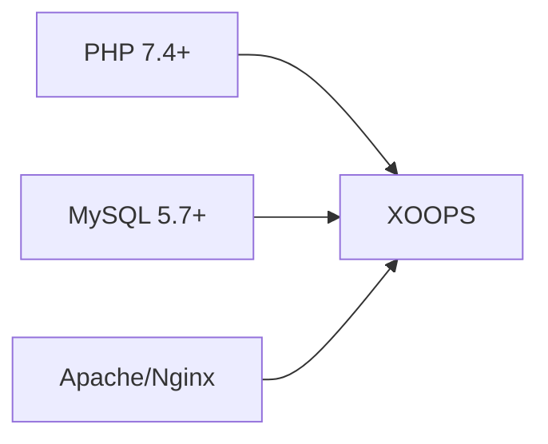
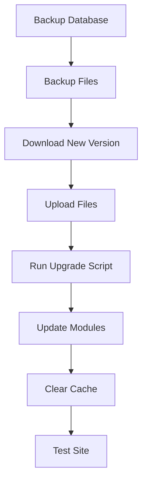

> Almindelige spørgsmål og svar om installation af XOOPS.

---

## Forinstallation

### Q: Hvad er minimumsserverkravene?

**A:** XOOPS 2.5.x kræver:
- PHP 7.4 eller højere (PHP 8.x anbefales)
- MySQL 5.7+ eller MariaDB 10.3+
- Apache med mod_rewrite eller Nginx
- Mindst 64MB PHP hukommelsesgrænse (128MB+ anbefales)



### Q: Kan jeg installere XOOPS på delt hosting?

**A:** Ja, XOOPS fungerer godt på de fleste delte hosting, der opfylder kravene. Tjek, at din vært giver:
- PHP med nødvendige udvidelser (mysqli, gd, curl, json, mbstring)
- MySQL databaseadgang
- Mulighed for at uploade filer
- .htaccess support (til Apache)

### Q: Hvilke PHP-udvidelser er påkrævet?

**A:** Påkrævede udvidelser:
- `mysqli` - Databaseforbindelse
- `gd` - Billedbehandling
- `json` - JSON håndtering
- `mbstring` - Multibyte streng understøttelse

Anbefalet:
- `curl` - Eksterne API-opkald
- `zip` - Modul installation
- `intl` - Internationalisering

---

## Installationsproces

### Q: Installationsguiden viser en tom side

**A:** Dette er normalt en PHP-fejl. Prøv:

1. Aktiver fejlvisning midlertidigt:
```php
// Add to htdocs/install/index.php at the top
error_reporting(E_ALL);
ini_set('display_errors', 1);
```

2. Tjek PHP fejllog
3. Bekræft PHP-versionens kompatibilitet
4. Sørg for, at alle nødvendige forlængelser er indlæst

### Q: Jeg får "Kan ikke skrive til mainfile.php"

**A:** Indstil skrivetilladelser før installation:

```bash
chmod 666 mainfile.php
# After installation, secure it:
chmod 444 mainfile.php
```

### Q: Databasetabeller oprettes ikke

**A:** Tjek:

1. MySQL-bruger har CREATE TABLE-privilegier:
```sql
GRANT ALL PRIVILEGES ON xoopsdb.* TO 'xoopsuser'@'localhost';
FLUSH PRIVILEGES;
```

2. Databasen findes:
```sql
CREATE DATABASE xoopsdb CHARACTER SET utf8mb4 COLLATE utf8mb4_unicode_ci;
```

3. Legitimationsoplysninger i guiden matcher databaseindstillinger

### Q: Installationen er fuldført, men webstedet viser fejl

**A:** Almindelige rettelser efter installation:

1. Fjern eller omdøb installationsmappen:
```bash
mv htdocs/install htdocs/install.bak
```

2. Indstil korrekte tilladelser:
```bash
chmod -R 755 htdocs/
chmod -R 777 xoops_data/
chmod 444 mainfile.php
```

3. Ryd cache:
```bash
rm -rf xoops_data/caches/smarty_cache/*
rm -rf xoops_data/caches/smarty_compile/*
```

---

## Konfiguration

### Q: Hvor er konfigurationsfilen?

**A:** Hovedkonfigurationen er i `mainfile.php` i XOOPS-roden. Nøgleindstillinger:

```php
define('XOOPS_ROOT_PATH', '/path/to/htdocs');
define('XOOPS_VAR_PATH', '/path/to/xoops_data');
define('XOOPS_URL', 'https://yoursite.com');
define('XOOPS_DB_HOST', 'localhost');
define('XOOPS_DB_USER', 'username');
define('XOOPS_DB_PASS', 'password');
define('XOOPS_DB_NAME', 'database');
define('XOOPS_DB_PREFIX', 'xoops');
```

### Q: Hvordan ændrer jeg webstedet URL?

**A:** Rediger `mainfile.php`:

```php
define('XOOPS_URL', 'https://newdomain.com');
```

Ryd derefter cachen og opdater eventuelle hårdkodede URL'er i databasen.

### Q: Hvordan flytter jeg XOOPS til en anden mappe?

**A:**

1. Flyt filer til en ny placering
2. Opdater stier i `mainfile.php`:
```php
define('XOOPS_ROOT_PATH', '/new/path/to/htdocs');
define('XOOPS_VAR_PATH', '/new/path/to/xoops_data');
```
3. Opdater databasen om nødvendigt
4. Ryd alle caches

---

## Opgraderinger

### Q: Hvordan opgraderer jeg XOOPS?

**A:**



1. **Sikkerhedskopier alt** (database + filer)
2. Download ny version af XOOPS
3. Upload filer (overskriv ikke `mainfile.php`)
4. Kør `htdocs/upgrade/`, hvis det er angivet
5. Opdater moduler via admin panel
6. Ryd alle caches
7. Test grundigt

### Q: Kan jeg springe versioner over, når jeg opgraderer?

**A:** Generelt nej. Opgrader sekventielt gennem større versioner for at sikre, at databasemigreringer kører korrekt. Se release notes for specifik vejledning.

### Q: Mine moduler holdt op med at fungere efter opgradering

**A:**

1. Tjek modulets kompatibilitet med den nye XOOPS-version
2. Opdater moduler til nyeste versioner
3. Gendan skabeloner: Admin → System → Vedligeholdelse → Skabeloner
4. Ryd alle caches
5. Kontroller PHP fejllogfiler for specifikke fejl

---

## Fejlfinding

### Q: Jeg har glemt admin-adgangskoden

**A:** Nulstil via database:

```sql
-- Generate new password hash
UPDATE xoops_users
SET pass = MD5('newpassword')
WHERE uname = 'admin';
```

Eller brug funktionen til nulstilling af adgangskode, hvis e-mail er konfigureret.

### Q: Siden er meget langsom efter installationen

**A:**

1. Aktiver caching i Admin → System → Præferencer
2. Optimer databasen:
```sql
OPTIMIZE TABLE xoops_session;
OPTIMIZE TABLE xoops_online;
```
3. Tjek for langsomme forespørgsler i fejlretningstilstand
4. Aktiver PHP OpCache

### Q: Images/CSS indlæses ikke

**A:**

1. Tjek filtilladelser (644 for filer, 755 for mapper)
2. Bekræft, at `XOOPS_URL` er korrekt i `mainfile.php`
3. Tjek .htaccess for omskrivningskonflikter
4. Undersøg browserkonsollen for 404-fejl

---

## Relateret dokumentation- Installationsvejledning
- Grundlæggende konfiguration
- White Screen of Death

---

#xoops #faq #installation #fejlfinding
