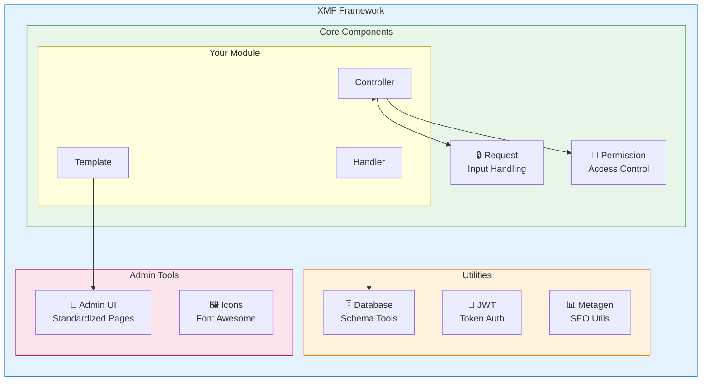
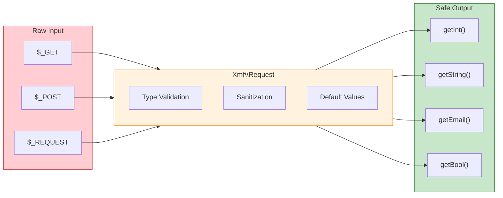

<span class="version-badge version-25x">2.5.x ✅</span> <span class="version-badge version-40x">4.0.x ✅</span>

:::tip[Broen til moderne XOOPS]
XMF fungerer i **både XOOPS 2.5.x og XOOPS 4.0.x**. Det er den anbefalede måde at modernisere dine moduler på i dag, mens du forbereder dig til XOOPS 4.0. XMF giver PSR-4 autoloading, navneområder og hjælpere, der glatter overgangen.
:::

**XOOPS Module Framework (XMF)** er et kraftfuldt bibliotek designet til at forenkle og standardisere XOOPS-moduludvikling. XMF leverer moderne PHP-praksis, herunder navnerum, autoloading og et omfattende sæt hjælperklasser, der reducerer boilerplate-kode og forbedrer vedligeholdelsesevnen.

## Hvad er XMF?

XMF er en samling af klasser og hjælpeprogrammer, der giver:

- **Moderne PHP-understøttelse** - Fuld navneområdeunderstøttelse med PSR-4 autoloading
- **Request Handling** - Sikker inputvalidering og desinficering
- **Modulhjælpere** - Forenklet adgang til modulkonfigurationer og -objekter
- **Tilladelsessystem** - Nem at bruge tilladelsesstyring
- **Databaseværktøjer** - Skemamigrering og tabelstyringsværktøjer
- **JWT Support** - JSON Web Token implementering til sikker godkendelse
- **Metadatagenerering** - SEO og indholdsekstraktionsværktøjer
- **Admin Interface** - Standardiserede moduladministrationssider

### XMF Komponentoversigt



## Nøglefunktioner

### Navneområder og autoindlæsning

Alle XMF-klasser findes i `Xmf`-navneområdet. Klasser indlæses automatisk, når der henvises til dem - der kræves ingen manual.

```php
use Xmf\Request;
use Xmf\Module\Helper;

// Classes load automatically when used
$input = Request::getString('input', '');
$helper = Helper::getHelper('mymodule');
```

### Sikker håndtering af anmodninger

[Request class](../05-XMF-Framework/Basics/XMF-Request.md) giver typesikker adgang til HTTP anmodningsdata med indbygget desinficering:



```php
use Xmf\Request;

$id = Request::getInt('id', 0);
$name = Request::getString('name', '');
$email = Request::getEmail('email', '');
```

### Modulhjælpersystem

[Module Helper](../05-XMF-Framework/Basics/XMF-Module-Helper.md) giver nem adgang til modulrelateret funktionalitet:

```php
$helper = \Xmf\Module\Helper::getHelper('mymodule');

// Access module configuration
$configValue = $helper->getConfig('setting_name', 'default');

// Get module object
$module = $helper->getModule();

// Access handlers
$handler = $helper->getHandler('items');
```

### Tilladelsesstyring

[Permission-Helper](../05-XMF-Framework/Recipes/Permission-Helper.md) forenkler håndtering af XOOPS tilladelser:

```php
$permHelper = new \Xmf\Module\Helper\Permission();

// Check user permission
if ($permHelper->checkPermission('view', $itemId)) {
    // User has permission
}
```

## Dokumentationsstruktur

### Grundlæggende

- [Kom godt i gang-med-XMF](../05-XMF-Framework/Basics/Getting-Started-with-XMF.md) - Installation og grundlæggende brug
- [XMF-Request](../05-XMF-Framework/Basics/XMF-Request.md) - Forespørgselshåndtering og inputvalidering
- [XMF-Module-Helper](../05-XMF-Framework/Basics/XMF-Module-Helper.md) - Brug af modulhjælperklasse

### Opskrifter

- [Permission-Helper](../05-XMF-Framework/Recipes/Permission-Helper.md) - Arbejde med tilladelser
- [Module-Admin-Pages](../05-XMF-Framework/Recipes/Module-Admin-Pages.md) - Oprettelse af standardiserede admin-grænseflader

### Reference

- [JWT](../05-XMF-Framework/Reference/JWT.md) - Implementering af JSON Web Token
- [Database](../05-XMF-Framework/Reference/Database.md) - Databaseværktøjer og skemastyring
- [Metagen](Reference/Metagen.md) - Metadata og SEO-værktøjer

## Krav

- XOOPS 2.5.8 eller nyere
- PHP 7.2 eller nyere (PHP 8.x anbefales)

## Installation

XMF er inkluderet med XOOPS 2.5.8 og nyere versioner. For tidligere versioner eller manuel installation:

1. Download XMF-pakken fra XOOPS-lageret
2. Udpak til din XOOPS `/class/xmf/` mappe
3. Autoloaderen vil håndtere klasseindlæsning automatisk

## Eksempel på hurtig start

Her er et komplet eksempel, der viser almindelige XMF-brugsmønstre:

```php
<?php
use Xmf\Request;
use Xmf\Module\Helper;
use Xmf\Module\Helper\Permission;

// Get module helper
$helper = Helper::getHelper('mymodule');

// Get configuration values
$itemsPerPage = $helper->getConfig('items_per_page', 10);

// Handle request input
$op = Request::getCmd('op', 'list');
$id = Request::getInt('id', 0);

// Check permissions
$permHelper = new Permission();
if (!$permHelper->checkPermission('view', $id)) {
    redirect_header('index.php', 3, 'Access denied');
}

// Process based on operation
switch ($op) {
    case 'view':
        $handler = $helper->getHandler('items');
        $item = $handler->get($id);
        // ... display item
        break;
    case 'list':
    default:
        // ... list items
        break;
}
```

## Ressourcer

- [XMF GitHub-lager](https://github.com/XOOPS/XMF)
- [XOOPS Project Website](https://xoops.org)

---

#xmf #xoops #framework #php #modul-udvikling
