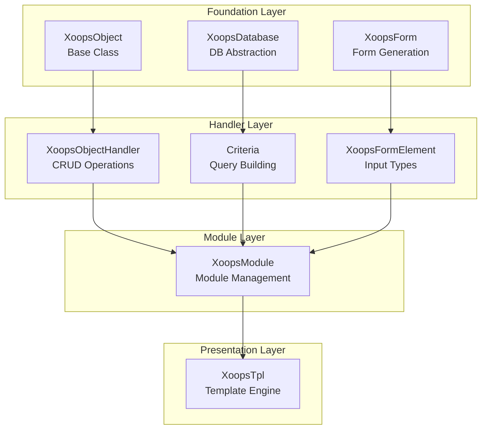
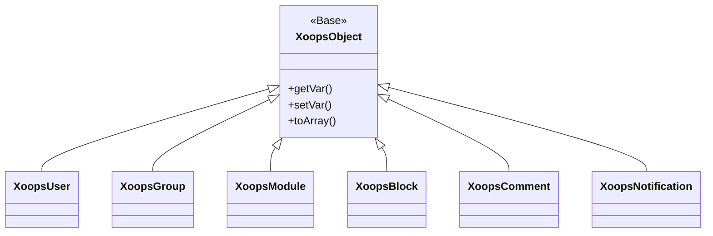
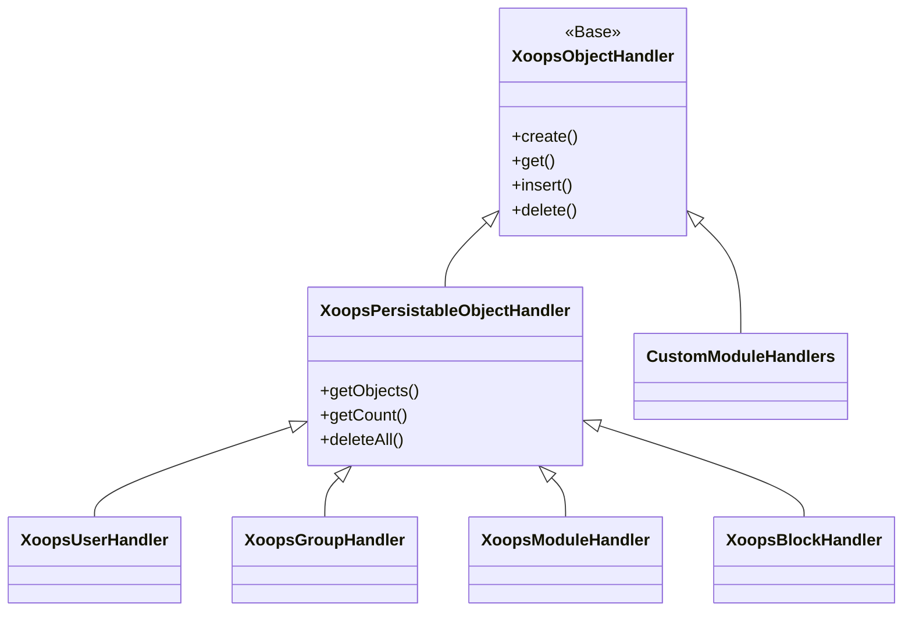
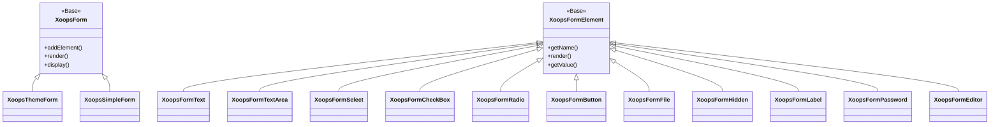

Bienvenido a la documentación completa de Referencia de la API XOOPS. Esta sección proporciona documentación detallada para todas las clases principales, métodos y sistemas que conforman el Sistema de Gestión de Contenidos XOOPS.

## Descripción General

La API XOOPS está organizada en varios subsistemas principales, cada uno responsable de un aspecto específico de la funcionalidad de CMS. Comprender estas APIs es esencial para desarrollar módulos, temas y extensiones para XOOPS.

## Secciones de la API

### Clases Principales

Las clases fundamentales sobre las que se construyen todos los demás componentes de XOOPS.

| Documentación | Descripción |
|--------------|-------------|
| XoopsObject | Clase base para todos los objetos de datos en XOOPS |
| XoopsObjectHandler | Patrón de controlador para operaciones CRUD |

### Capa de Base de Datos

Utilidades de abstracción de base de datos y construcción de consultas.

| Documentación | Descripción |
|--------------|-------------|
| XoopsDatabase | Capa de abstracción de base de datos |
| Criteria System | Criterios de consulta y condiciones |
| QueryBuilder | Construcción de consultas fluidas modernas |

### Sistema de Formularios

Generación y validación de formularios HTML.

| Documentación | Descripción |
|--------------|-------------|
| XoopsForm | Contenedor y representación de formularios |
| Form Elements | Todos los tipos de elementos de formulario disponibles |

### Clases del Kernel

Componentes del sistema principal y servicios.

| Documentación | Descripción |
|--------------|-------------|
| Kernel Classes | Sistema kernel y componentes principales |

### Sistema de Módulos

Gestión de módulos y ciclo de vida.

| Documentación | Descripción |
|--------------|-------------|
| Module System | Carga, instalación y gestión de módulos |

### Sistema de Plantillas

Integración de plantillas Smarty.

| Documentación | Descripción |
|--------------|-------------|
| Template System | Integración de Smarty y gestión de plantillas |

### Sistema de Usuarios

Gestión de usuarios y autenticación.

| Documentación | Descripción |
|--------------|-------------|
| User System | Cuentas de usuario, grupos y permisos |

## Descripción General de la Arquitectura



## Jerarquía de Clases

### Modelo de Objetos



### Modelo de Controlador



### Modelo de Formularios



## Patrones de Diseño

La API XOOPS implementa varios patrones de diseño bien conocidos:

### Patrón Singleton
Se utiliza para servicios globales como conexiones de base de datos e instancias de contenedor.

```php
$db = XoopsDatabase::getInstance();
$container = XoopsContainer::getInstance();
```

### Patrón Factory
Los controladores de objetos crean objetos de dominio consistentemente.

```php
$handler = xoops_getHandler('user');
$user = $handler->create();
```

### Patrón Composite
Los formularios contienen múltiples elementos de formulario; los criterios pueden contener criterios anidados.

```php
$criteria = new CriteriaCompo();
$criteria->add(new Criteria('status', 1));
$criteria->add(new CriteriaCompo(...)); // Nested
```

### Patrón Observer
El sistema de eventos permite un acoplamiento débil entre módulos.

```php
$dispatcher->addListener('module.news.article_published', $callback);
```

## Ejemplos de Inicio Rápido

### Creación y Guardado de un Objeto

```php
// Get the handler
$handler = xoops_getHandler('user');

// Create a new object
$user = $handler->create();
$user->setVar('uname', 'newuser');
$user->setVar('email', 'user@example.com');

// Save to database
$handler->insert($user);
```

### Consulta con Criterios

```php
// Build criteria
$criteria = new CriteriaCompo();
$criteria->add(new Criteria('level', 0, '>'));
$criteria->setSort('uname');
$criteria->setOrder('ASC');
$criteria->setLimit(10);

// Get objects
$handler = xoops_getHandler('user');
$users = $handler->getObjects($criteria);
```

### Creación de un Formulario

```php
$form = new XoopsThemeForm('User Profile', 'userform', 'save.php', 'post', true);
$form->addElement(new XoopsFormText('Username', 'uname', 50, 255, $user->getVar('uname')));
$form->addElement(new XoopsFormTextArea('Bio', 'bio', $user->getVar('bio')));
$form->addElement(new XoopsFormButton('', 'submit', _SUBMIT, 'submit'));
echo $form->render();
```

## Convenciones de la API

### Convenciones de Nomenclatura

| Tipo | Convención | Ejemplo |
|------|-----------|---------|
| Classes | PascalCase | `XoopsUser`, `CriteriaCompo` |
| Methods | camelCase | `getVar()`, `setVar()` |
| Properties | camelCase (protected) | `$_vars`, `$_handler` |
| Constants | UPPER_SNAKE_CASE | `XOBJ_DTYPE_INT` |
| Database Tables | snake_case | `users`, `groups_users_link` |

### Tipos de Datos

XOOPS define tipos de datos estándar para variables de objeto:

| Constante | Tipo | Descripción |
|----------|------|-------------|
| `XOBJ_DTYPE_TXTBOX` | String | Entrada de texto (desinfectada) |
| `XOBJ_DTYPE_TXTAREA` | String | Contenido de textarea |
| `XOBJ_DTYPE_INT` | Integer | Valores numéricos |
| `XOBJ_DTYPE_URL` | String | Validación de URL |
| `XOBJ_DTYPE_EMAIL` | String | Validación de correo electrónico |
| `XOBJ_DTYPE_ARRAY` | Array | Matrices serializadas |
| `XOBJ_DTYPE_OTHER` | Mixed | Manejo personalizado |
| `XOBJ_DTYPE_SOURCE` | String | Código fuente (desinfección mínima) |
| `XOBJ_DTYPE_STIME` | Integer | Marca de tiempo corta |
| `XOBJ_DTYPE_MTIME` | Integer | Marca de tiempo media |
| `XOBJ_DTYPE_LTIME` | Integer | Marca de tiempo larga |

## Métodos de Autenticación

La API admite múltiples métodos de autenticación:

### Autenticación por Clave de API
```
X-API-Key: your-api-key
```

### Token Bearer de OAuth
```
Authorization: Bearer your-oauth-token
```

### Autenticación Basada en Sesión
Utiliza la sesión XOOPS existente cuando se inicia sesión.

## Puntos Finales de la API REST

Cuando la API REST está habilitada:

| Punto Final | Método | Descripción |
|----------|--------|-------------|
| `/api.php/rest/users` | GET | Listar usuarios |
| `/api.php/rest/users/{id}` | GET | Obtener usuario por ID |
| `/api.php/rest/users` | POST | Crear usuario |
| `/api.php/rest/users/{id}` | PUT | Actualizar usuario |
| `/api.php/rest/users/{id}` | DELETE | Eliminar usuario |
| `/api.php/rest/modules` | GET | Listar módulos |

## Documentación Relacionada

- Guía de Desarrollo de Módulos
- Guía de Desarrollo de Temas
- Configuración del Sistema
- Mejores Prácticas de Seguridad

## Historial de Versiones

| Versión | Cambios |
|---------|---------|
| 2.5.11 | Lanzamiento estable actual |
| 2.5.10 | Compatibilidad agregada con API GraphQL |
| 2.5.9 | Sistema de Criterios mejorado |
| 2.5.8 | Compatibilidad de carga automática PSR-4 |

---

*Esta documentación es parte de la Base de Conocimientos XOOPS. Para las últimas actualizaciones, visite el [repositorio XOOPS GitHub](https://github.com/XOOPS).*
