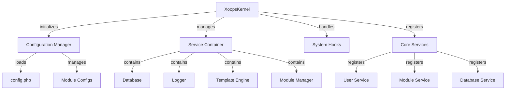

El Kernel de XOOPS proporciona el marco fundamental para el bootstrapping del sistema, gestión de configuraciones, manejo de eventos del sistema y proporciona utilidades principales. Estas clases forman la base de la aplicación XOOPS.

## Arquitectura del Sistema



## Clase XoopsKernel

La clase del kernel principal que inicializa y gestiona el sistema XOOPS.

### Descripción General de la Clase

```php
namespace Xoops;

class XoopsKernel
{
    private static ?XoopsKernel $instance = null;
    protected ServiceContainer $services;
    protected ConfigurationManager $config;
    protected array $modules = [];
    protected bool $isLoaded = false;
}
```

### Constructor

```php
private function __construct()
```

El constructor privado refuerza el patrón singleton.

### getInstance

Obtiene la instancia única del kernel.

```php
public static function getInstance(): XoopsKernel
```

**Retorna:** `XoopsKernel` - La instancia única del kernel

**Ejemplo:**
```php
$kernel = XoopsKernel::getInstance();
```

### Proceso de Arranque

El proceso de arranque del kernel sigue estos pasos:

1. **Inicialización** - Establecer controladores de errores, definir constantes
2. **Configuración** - Cargar archivos de configuración
3. **Registro de Servicios** - Registrar servicios principales
4. **Detección de Módulos** - Escanear e identificar módulos activos
5. **Inicialización de Base de Datos** - Conectar a la base de datos
6. **Limpieza** - Preparar para el manejo de solicitudes

```php
public function boot(): void
```

**Ejemplo:**
```php
$kernel = XoopsKernel::getInstance();
$kernel->boot();
```

### Métodos del Contenedor de Servicios

#### registerService

Registra un servicio en el contenedor de servicios.

```php
public function registerService(
    string $name,
    callable|object $definition
): void
```

**Parámetros:**

| Parámetro | Tipo | Descripción |
|-----------|------|-------------|
| `$name` | string | Identificador del servicio |
| `$definition` | callable\|object | Factory del servicio o instancia |

**Ejemplo:**
```php
$kernel->registerService('custom.handler', function($c) {
    return new CustomHandler();
});
```

#### getService

Obtiene un servicio registrado.

```php
public function getService(string $name): mixed
```

**Parámetros:**

| Parámetro | Tipo | Descripción |
|-----------|------|-------------|
| `$name` | string | Identificador del servicio |

**Retorna:** `mixed` - El servicio solicitado

**Ejemplo:**
```php
$database = $kernel->getService('database');
$logger = $kernel->getService('logger');
```

#### hasService

Verifica si un servicio está registrado.

```php
public function hasService(string $name): bool
```

**Ejemplo:**
```php
if ($kernel->hasService('cache')) {
    $cache = $kernel->getService('cache');
}
```

## Gestor de Configuración

Gestiona la configuración de la aplicación y la configuración de módulos.

### Vista General de la Clase

```php
namespace Xoops\Core;

class ConfigurationManager
{
    protected array $config = [];
    protected array $defaults = [];
    protected string $configPath;
}
```

### Métodos

#### load

Carga la configuración desde un archivo o array.

```php
public function load(string|array $source): void
```

**Parámetros:**

| Parámetro | Tipo | Descripción |
|-----------|------|-------------|
| `$source` | string\|array | Ruta del archivo de config o array |

**Ejemplo:**
```php
$config = $kernel->getService('config');
$config->load(XOOPS_ROOT_PATH . '/include/config.php');
$config->load(['sitename' => 'Mi Sitio', 'admin_email' => 'admin@example.com']);
```

#### get

Obtiene un valor de configuración.

```php
public function get(string $key, mixed $default = null): mixed
```

**Parámetros:**

| Parámetro | Tipo | Descripción |
|-----------|------|-------------|
| `$key` | string | Clave de configuración (notación punto) |
| `$default` | mixed | Valor por defecto si no se encuentra |

**Retorna:** `mixed` - Valor de configuración

**Ejemplo:**
```php
$siteName = $config->get('sitename');
$adminEmail = $config->get('admin.email', 'admin@example.com');
```

#### set

Establece un valor de configuración.

```php
public function set(string $key, mixed $value): void
```

**Parámetros:**

| Parámetro | Tipo | Descripción |
|-----------|------|-------------|
| `$key` | string | Clave de configuración |
| `$value` | mixed | Valor de configuración |

**Ejemplo:**
```php
$config->set('sitename', 'Nombre Nuevo del Sitio');
$config->set('features.cache_enabled', true);
```

#### getModuleConfig

Obtiene la configuración de un módulo específico.

```php
public function getModuleConfig(
    string $moduleName
): array
```

**Parámetros:**

| Parámetro | Tipo | Descripción |
|-----------|------|-------------|
| `$moduleName` | string | Nombre del directorio del módulo |

**Retorna:** `array` - Array de configuración del módulo

**Ejemplo:**
```php
$publisherConfig = $config->getModuleConfig('publisher');
```

## Hooks del Sistema

Los hooks del sistema permiten a los módulos y plugins ejecutar código en puntos específicos del ciclo de vida de la aplicación.

### Clase HookManager

```php
namespace Xoops\Core;

class HookManager
{
    protected array $hooks = [];
    protected array $listeners = [];
}
```

### Métodos

#### addHook

Registra un punto de hook.

```php
public function addHook(string $name): void
```

**Parámetros:**

| Parámetro | Tipo | Descripción |
|-----------|------|-------------|
| `$name` | string | Identificador del hook |

**Ejemplo:**
```php
$hooks = $kernel->getService('hooks');
$hooks->addHook('system.startup');
$hooks->addHook('user.login');
$hooks->addHook('module.install');
```

#### listen

Adjunta un listener a un hook.

```php
public function listen(
    string $hookName,
    callable $callback,
    int $priority = 10
): void
```

**Parámetros:**

| Parámetro | Tipo | Descripción |
|-----------|------|-------------|
| `$hookName` | string | Identificador del hook |
| `$callback` | callable | Función a ejecutar |
| `$priority` | int | Prioridad de ejecución (mayor se ejecuta primero) |

**Ejemplo:**
```php
$hooks->listen('user.login', function($user) {
    error_log('Usuario ' . $user->uname . ' inició sesión');
}, 10);

$hooks->listen('module.install', function($module) {
    // Lógica personalizada de instalación de módulo
    echo "Instalando " . $module->getName();
}, 5);
```

#### trigger

Ejecuta todos los listeners para un hook.

```php
public function trigger(
    string $hookName,
    mixed $arguments = null
): array
```

**Parámetros:**

| Parámetro | Tipo | Descripción |
|-----------|------|-------------|
| `$hookName` | string | Identificador del hook |
| `$arguments` | mixed | Datos a pasar a los listeners |

**Retorna:** `array` - Resultados de todos los listeners

**Ejemplo:**
```php
$results = $hooks->trigger('system.startup');
$results = $hooks->trigger('user.created', $newUser);
```

## Vista General de Servicios Principales

El kernel registra varios servicios principales durante el arranque:

| Servicio | Clase | Propósito |
|---------|-------|---------|
| `database` | XoopsDatabase | Capa de abstracción de base de datos |
| `config` | ConfigurationManager | Gestión de configuración |
| `logger` | Logger | Registro de aplicación |
| `template` | XoopsTpl | Motor de plantillas |
| `user` | UserManager | Servicio de gestión de usuarios |
| `module` | ModuleManager | Gestión de módulos |
| `cache` | CacheManager | Capa de caché |
| `hooks` | HookManager | Hooks de eventos del sistema |

## Ejemplo de Uso Completo

```php
<?php
/**
 * Proceso de arranque de módulo personalizado usando kernel
 */

// Obtener instancia del kernel
$kernel = XoopsKernel::getInstance();

// Arrancar el sistema
$kernel->boot();

// Obtener servicios
$config = $kernel->getService('config');
$database = $kernel->getService('database');
$logger = $kernel->getService('logger');
$hooks = $kernel->getService('hooks');

// Acceder a configuración
$siteName = $config->get('sitename');
$adminEmail = $config->get('admin.email');

// Registrar hooks específicos del módulo
$hooks->listen('user.login', function($user) {
    // Registrar inicio de sesión del usuario
    $logger->info('Inicio de sesión del usuario: ' . $user->uname);

    // Rastrear en base de datos
    $database->query(
        'INSERT INTO ' . $database->prefix('event_log') .
        ' (type, user_id, message, timestamp) VALUES (?, ?, ?, ?)',
        ['login', $user->uid(), 'Inicio de sesión de usuario', time()]
    );
});

$hooks->listen('module.install', function($module) {
    $logger->info('Módulo instalado: ' . $module->getName());
});

// Disparar hooks
$hooks->trigger('system.startup');

// Usar servicio de base de datos
$result = $database->query(
    'SELECT * FROM ' . $database->prefix('users') .
    ' LIMIT 10'
);

while ($row = $database->fetchArray($result)) {
    echo "Usuario: " . htmlspecialchars($row['uname']) . "\n";
}

// Registrar servicio personalizado
$kernel->registerService('custom.repository', function($c) {
    return new CustomRepository($c->getService('database'));
});

// Acceder más tarde a servicio personalizado
$repo = $kernel->getService('custom.repository');
```

## Constantes Principales

El kernel define varias constantes importantes durante el arranque:

```php
// Rutas del sistema
define('XOOPS_ROOT_PATH', '/var/www/xoops');
define('XOOPS_HTDOCS_PATH', XOOPS_ROOT_PATH . '/htdocs');
define('XOOPS_MODULES_PATH', XOOPS_ROOT_PATH . '/htdocs/modules');
define('XOOPS_THEMES_PATH', XOOPS_ROOT_PATH . '/htdocs/themes');

// Rutas web
define('XOOPS_URL', 'http://example.com');
define('XOOPS_HTDOCS_URL', XOOPS_URL . '/htdocs');

// Base de datos
define('XOOPS_DB_PREFIX', 'xoops_');
```

## Manejo de Errores

El kernel configura controladores de errores durante el arranque:

```php
// Establecer controlador de errores personalizado
set_error_handler(function($errno, $errstr, $errfile, $errline) {
    $kernel->getService('logger')->error(
        "Error: $errstr en $errfile:$errline"
    );
});

// Establecer controlador de excepciones
set_exception_handler(function($exception) {
    $kernel->getService('logger')->critical(
        "Excepción: " . $exception->getMessage()
    );
});
```

## Mejores Prácticas

1. **Arranque Único** - Llamar a `boot()` solo una vez durante el inicio de la aplicación
2. **Usar Contenedor de Servicios** - Registrar y obtener servicios a través del kernel
3. **Manejar Hooks Temprano** - Registrar listeners de hooks antes de dispararlos
4. **Registrar Eventos Importantes** - Usar el servicio logger para depuración
5. **Cachear Configuración** - Cargar config una vez y reutilizar
6. **Manejo de Errores** - Siempre configurar controladores de errores antes de procesar solicitudes

## Documentación Relacionada

- ../Module/Module-System - Sistema de módulos y ciclo de vida
- ../Template/Template-System - Integración del motor de plantillas
- ../User/User-System - Autenticación y gestión de usuarios
- ../Database/XoopsDatabase - Capa de base de datos

---

*Ver también: [Código Fuente del Kernel XOOPS](https://github.com/XOOPS/XoopsCore27/tree/master/htdocs/class)*
