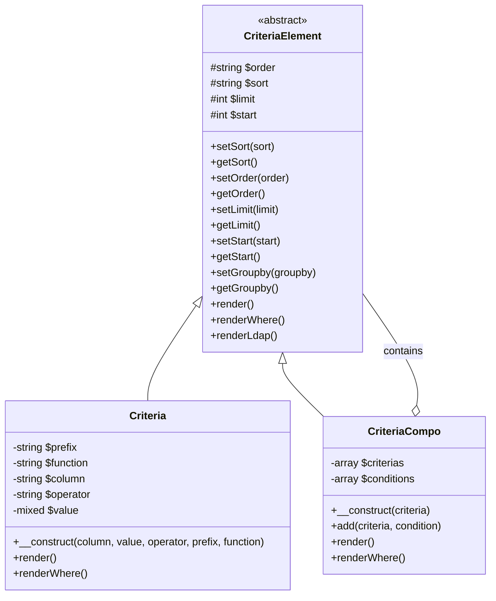
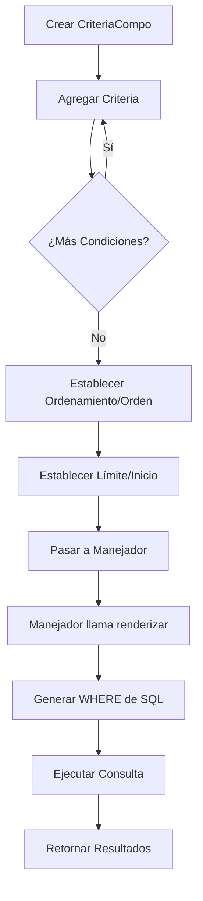
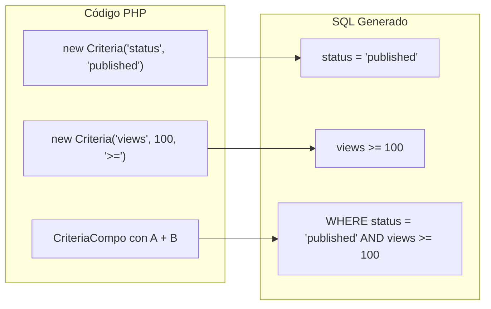
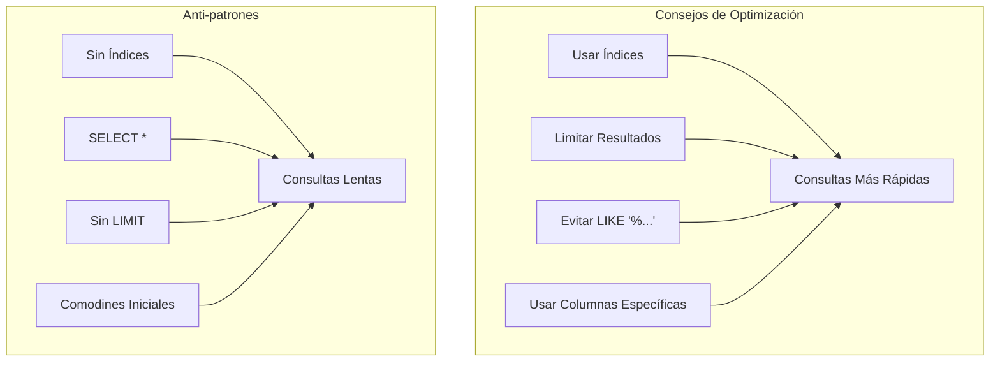

> Documentación completa de API para el sistema de construcción de consultas Criteria de XOOPS.

---

## Arquitectura del Sistema Criteria



---

## Clase Criteria

### Constructor

```php
public function __construct(
    string $column,           // Nombre de columna
    mixed $value = '',        // Valor a comparar
    string $operator = '=',   // Operador de comparación
    string $prefix = '',      // Prefijo de tabla
    string $function = ''     // Envoltorio de función SQL
)
```

### Operadores

| Operador | Ejemplo | Salida SQL |
|----------|---------|------------|
| `=` | `new Criteria('status', 1)` | `status = 1` |
| `!=` | `new Criteria('status', 0, '!=')` | `status != 0` |
| `<>` | `new Criteria('status', 0, '<>')` | `status <> 0` |
| `<` | `new Criteria('age', 18, '<')` | `age < 18` |
| `<=` | `new Criteria('age', 18, '<=')` | `age <= 18` |
| `>` | `new Criteria('age', 18, '>')` | `age > 18` |
| `>=` | `new Criteria('age', 18, '>=')` | `age >= 18` |
| `LIKE` | `new Criteria('title', '%php%', 'LIKE')` | `title LIKE '%php%'` |
| `NOT LIKE` | `new Criteria('title', '%spam%', 'NOT LIKE')` | `title NOT LIKE '%spam%'` |
| `IN` | `new Criteria('id', '(1,2,3)', 'IN')` | `id IN (1,2,3)` |
| `NOT IN` | `new Criteria('id', '(1,2,3)', 'NOT IN')` | `id NOT IN (1,2,3)` |
| `IS NULL` | `new Criteria('deleted', null, 'IS NULL')` | `deleted IS NULL` |
| `IS NOT NULL` | `new Criteria('email', null, 'IS NOT NULL')` | `email IS NOT NULL` |
| `BETWEEN` | `new Criteria('created', '1000 AND 2000', 'BETWEEN')` | `created BETWEEN 1000 AND 2000` |

### Ejemplos de Uso

```php
// Igualdad simple
$criteria = new Criteria('status', 'published');

// Comparación numérica
$criteria = new Criteria('views', 100, '>=');

// Coincidencia de patrones
$criteria = new Criteria('title', '%XOOPS%', 'LIKE');

// Con prefijo de tabla
$criteria = new Criteria('uid', 1, '=', 'u');
// Renderiza: u.uid = 1

// Con función SQL
$criteria = new Criteria('title', '', '!=', '', 'LOWER');
// Renderiza: LOWER(title) != ''
```

---

## Clase CriteriaCompo

### Constructor y Métodos

```php
// Crear compo vacío
$criteria = new CriteriaCompo();

// O con criteria inicial
$criteria = new CriteriaCompo(new Criteria('status', 'active'));

// Agregar criteria (AND por defecto)
$criteria->add(new Criteria('views', 10, '>='));

// Agregar con OR
$criteria->add(new Criteria('featured', 1), 'OR');

// Anidamiento
$subCriteria = new CriteriaCompo();
$subCriteria->add(new Criteria('author', 1));
$subCriteria->add(new Criteria('author', 2), 'OR');
$criteria->add($subCriteria); // (author = 1 OR author = 2)
```

### Ordenamiento y Paginación

```php
$criteria = new CriteriaCompo();
$criteria->add(new Criteria('status', 'published'));

// Ordenamiento simple
$criteria->setSort('created');
$criteria->setOrder('DESC');

// Múltiples columnas de ordenamiento
$criteria->setSort('category_id, created');
$criteria->setOrder('ASC, DESC');

// Paginación
$criteria->setLimit(10);    // Elementos por página
$criteria->setStart(0);     // Desplazamiento (página * límite)

// Agrupar por
$criteria->setGroupby('category_id');
```

---

## Flujo de Construcción de Consultas



---

## Ejemplos de Consultas Complejas

### Búsqueda con Múltiples Condiciones

```php
$criteria = new CriteriaCompo();

// El estado debe ser publicado
$criteria->add(new Criteria('status', 'published'));

// La categoría es 1, 2, o 3
$criteria->add(new Criteria('category_id', '(1, 2, 3)', 'IN'));

// Creado en los últimos 30 días
$thirtyDaysAgo = time() - (30 * 24 * 60 * 60);
$criteria->add(new Criteria('created', $thirtyDaysAgo, '>='));

// Término de búsqueda en título O contenido
$searchCriteria = new CriteriaCompo();
$searchCriteria->add(new Criteria('title', '%' . $searchTerm . '%', 'LIKE'));
$searchCriteria->add(new Criteria('content', '%' . $searchTerm . '%', 'LIKE'), 'OR');
$criteria->add($searchCriteria);

// Ordenar por vistas descendente
$criteria->setSort('views');
$criteria->setOrder('DESC');

// Paginar
$criteria->setLimit($perPage);
$criteria->setStart($page * $perPage);

// Ejecutar
$items = $itemHandler->getObjects($criteria);
$total = $itemHandler->getCount($criteria);
```

### Consulta de Rango de Fechas

```php
$criteria = new CriteriaCompo();

// Entre dos fechas
$startDate = strtotime('2024-01-01');
$endDate = strtotime('2024-12-31');

$criteria->add(new Criteria('created', $startDate, '>='));
$criteria->add(new Criteria('created', $endDate, '<='));

// O usando BETWEEN
$criteria->add(new Criteria('created', "$startDate AND $endDate", 'BETWEEN'));
```

### Filtro de Permisos de Usuario

```php
$criteria = new CriteriaCompo();
$criteria->add(new Criteria('status', 'published'));

// Si no es admin, mostrar solo elementos propios o públicos
if (!$xoopsUser || !$xoopsUser->isAdmin()) {
    $permCriteria = new CriteriaCompo();
    $permCriteria->add(new Criteria('visibility', 'public'));

    if (is_object($xoopsUser)) {
        $permCriteria->add(new Criteria('author_id', $xoopsUser->getVar('uid')), 'OR');
    }

    $criteria->add($permCriteria);
}
```

### Consulta Similar a Join

```php
// Obtener elementos donde la categoría está activa
// (Usando enfoque de subconsulta)
$categoryHandler = xoops_getHandler('category');
$activeCatCriteria = new Criteria('status', 'active');
$activeCategories = $categoryHandler->getIds($activeCatCriteria);

if (!empty($activeCategories)) {
    $criteria->add(new Criteria('category_id', '(' . implode(',', $activeCategories) . ')', 'IN'));
}
```

---

## Visualización de Criteria a SQL



---

## Integración de Manejador

```php
// Métodos estándar del manejador que aceptan Criteria

// Obtener múltiples objetos
$objects = $handler->getObjects($criteria);
$objects = $handler->getObjects($criteria, true);  // Como array
$objects = $handler->getObjects($criteria, true, true); // Como array, id como clave

// Obtener conteo
$count = $handler->getCount($criteria);

// Obtener lista (id => identificador)
$list = $handler->getList($criteria);

// Eliminar coincidencias
$deleted = $handler->deleteAll($criteria);

// Actualizar coincidencias
$handler->updateAll('status', 'archived', $criteria);
```

---

## Consideraciones de Rendimiento



### Mejores Prácticas

1. **Siempre establecer LIMIT** para tablas grandes
2. **Usar índices** en columnas usadas en criteria
3. **Evitar comodines iniciales** en LIKE (`'%term'` es lento)
4. **Pre-filtrar en PHP** cuando sea posible para lógica compleja
5. **Usar COUNT con moderación** - cachear resultados cuando sea posible

---

## Documentación Relacionada

- Capa de Base de Datos
- API XoopsObjectHandler
- Prevención de Inyección SQL

---

#xoops #api #criteria #database #query #reference
