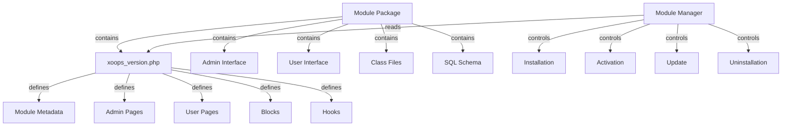

El Sistema de Módulos de XOOPS proporciona un marco completo para desarrollar, instalar, gestionar y extender la funcionalidad de los módulos. Los módulos son paquetes autónomos que extienden XOOPS con características y capacidades adicionales.

## Arquitectura del Módulo



## Estructura del Módulo

Estructura estándar del directorio del módulo XOOPS:

```
mymodule/
├── xoops_version.php          # Manifiesto y configuración del módulo
├── admin.php                  # Página principal de administración
├── index.php                  # Página principal del usuario
├── admin/                     # Directorio de páginas de administración
│   ├── main.php
│   ├── manage.php
│   └── settings.php
├── class/                     # Clases del módulo
│   ├── Handler/
│   │   ├── ItemHandler.php
│   │   └── CategoryHandler.php
│   └── Objects/
│       ├── Item.php
│       └── Category.php
├── sql/                       # Esquemas de base de datos
│   ├── mysql.sql
│   └── postgres.sql
├── include/                   # Archivos de inclusión
│   ├── common.inc.php
│   └── functions.php
├── templates/                 # Plantillas del módulo
│   ├── admin/
│   │   └── main.tpl
│   └── user/
│       ├── index.tpl
│       └── item.tpl
├── blocks/                    # Bloques del módulo
│   └── blocks.php
├── tests/                     # Pruebas unitarias
├── language/                  # Archivos de idioma
│   ├── english/
│   │   └── main.php
│   └── spanish/
│       └── main.php
└── docs/                      # Documentación
```

## Clase XoopsModule

La clase XoopsModule representa un módulo XOOPS instalado.

### Vista General de la Clase

```php
namespace Xoops\Core\Module;

class XoopsModule extends XoopsObject
{
    protected int $moduleid = 0;
    protected string $name = '';
    protected string $dirname = '';
    protected string $version = '';
    protected string $description = '';
    protected array $config = [];
    protected array $blocks = [];
    protected array $adminPages = [];
    protected array $userPages = [];
}
```

### Propiedades

| Propiedad | Tipo | Descripción |
|----------|------|-------------|
| `$moduleid` | int | ID único del módulo |
| `$name` | string | Nombre de visualización del módulo |
| `$dirname` | string | Nombre del directorio del módulo |
| `$version` | string | Versión actual del módulo |
| `$description` | string | Descripción del módulo |
| `$config` | array | Configuración del módulo |
| `$blocks` | array | Bloques del módulo |
| `$adminPages` | array | Páginas del panel de administración |
| `$userPages` | array | Páginas visibles para el usuario |

### Constructor

```php
public function __construct()
```

Crea una nueva instancia de módulo e inicializa variables.

### Métodos Principales

#### getName

Obtiene el nombre de visualización del módulo.

```php
public function getName(): string
```

**Retorna:** `string` - Nombre de visualización del módulo

**Ejemplo:**
```php
$module = new XoopsModule();
$module->setVar('name', 'Publisher');
echo $module->getName(); // "Publisher"
```

#### getDirname

Obtiene el nombre del directorio del módulo.

```php
public function getDirname(): string
```

**Retorna:** `string` - Nombre del directorio del módulo

**Ejemplo:**
```php
echo $module->getDirname(); // "publisher"
```

#### getVersion

Obtiene la versión actual del módulo.

```php
public function getVersion(): string
```

**Retorna:** `string` - Cadena de versión

**Ejemplo:**
```php
echo $module->getVersion(); // "2.1.0"
```

#### getDescription

Obtiene la descripción del módulo.

```php
public function getDescription(): string
```

**Retorna:** `string` - Descripción del módulo

**Ejemplo:**
```php
$desc = $module->getDescription();
```

#### getConfig

Obtiene la configuración del módulo.

```php
public function getConfig(string $key = null): mixed
```

**Parámetros:**

| Parámetro | Tipo | Descripción |
|-----------|------|-------------|
| `$key` | string | Clave de configuración (null para todas) |

**Retorna:** `mixed` - Valor de configuración o array

**Ejemplo:**
```php
$config = $module->getConfig();
$itemsPerPage = $module->getConfig('items_per_page');
```

#### setConfig

Establece la configuración del módulo.

```php
public function setConfig(string $key, mixed $value): void
```

**Parámetros:**

| Parámetro | Tipo | Descripción |
|-----------|------|-------------|
| `$key` | string | Clave de configuración |
| `$value` | mixed | Valor de configuración |

**Ejemplo:**
```php
$module->setConfig('items_per_page', 20);
$module->setConfig('enable_cache', true);
```

#### getPath

Obtiene la ruta completa del sistema de archivos al módulo.

```php
public function getPath(): string
```

**Retorna:** `string` - Ruta absoluta del directorio del módulo

**Ejemplo:**
```php
$path = $module->getPath(); // "/var/www/xoops/modules/publisher"
$classPath = $module->getPath() . '/class';
```

#### getUrl

Obtiene la URL del módulo.

```php
public function getUrl(): string
```

**Retorna:** `string` - URL del módulo

**Ejemplo:**
```php
$url = $module->getUrl(); // "http://example.com/modules/publisher"
```

## Proceso de Instalación del Módulo

### Función xoops_module_install

La función de instalación del módulo definida en `xoops_version.php`:

```php
function xoops_module_install_modulename($module)
{
    // $module es una instancia XoopsModule

    // Crear tablas de base de datos
    // Inicializar configuración por defecto
    // Crear carpetas por defecto
    // Configurar permisos de archivos

    return true; // Éxito
}
```

**Parámetros:**

| Parámetro | Tipo | Descripción |
|-----------|------|-------------|
| `$module` | XoopsModule | El módulo siendo instalado |

**Retorna:** `bool` - True si es exitoso, false si falla

**Ejemplo:**
```php
function xoops_module_install_publisher($module)
{
    // Obtener ruta del módulo
    $modulePath = $module->getPath();

    // Crear directorio de cargas
    $uploadsPath = XOOPS_ROOT_PATH . '/uploads/publisher';
    if (!is_dir($uploadsPath)) {
        mkdir($uploadsPath, 0755, true);
    }

    // Obtener conexión de base de datos
    global $xoopsDB;

    // Ejecutar script de instalación SQL
    $sqlFile = $modulePath . '/sql/mysql.sql';
    if (file_exists($sqlFile)) {
        $sqlQueries = file_get_contents($sqlFile);
        // Ejecutar consultas (simplificado)
        $xoopsDB->queryFromFile($sqlFile);
    }

    // Establecer configuración por defecto
    $module->setConfig('items_per_page', 10);
    $module->setConfig('enable_comments', true);

    return true;
}
```

### Función xoops_module_uninstall

La función de desinstalación del módulo:

```php
function xoops_module_uninstall_modulename($module)
{
    // Eliminar tablas de base de datos
    // Eliminar archivos cargados
    // Limpiar configuración

    return true;
}
```

**Ejemplo:**
```php
function xoops_module_uninstall_publisher($module)
{
    global $xoopsDB;

    // Eliminar tablas
    $tables = ['publisher_items', 'publisher_categories', 'publisher_comments'];
    foreach ($tables as $table) {
        $xoopsDB->query('DROP TABLE IF EXISTS ' . $xoopsDB->prefix($table));
    }

    // Eliminar carpeta de cargas
    $uploadsPath = XOOPS_ROOT_PATH . '/uploads/publisher';
    if (is_dir($uploadsPath)) {
        // Eliminación recursiva de directorio
        $this->recursiveRemoveDir($uploadsPath);
    }

    return true;
}
```

## Hooks del Módulo

Los hooks del módulo permiten que los módulos se integren con otros módulos y el sistema.

### Declaración de Hook

En `xoops_version.php`:

```php
$modversion['hooks'] = [
    'system.page.footer' => [
        'function' => 'publisher_page_footer'
    ],
    'user.profile.view' => [
        'function' => 'publisher_user_articles'
    ],
];
```

### Implementación de Hook

```php
// En un archivo del módulo (ej., include/hooks.php)

function publisher_page_footer()
{
    // Retornar HTML para el pie de página
    return '<div class="publisher-footer">Contenido del Pie de Página Publisher</div>';
}

function publisher_user_articles($user_id)
{
    global $xoopsDB;

    // Obtener artículos del usuario
    $result = $xoopsDB->query(
        'SELECT * FROM ' . $xoopsDB->prefix('publisher_articles') .
        ' WHERE author_id = ? ORDER BY published DESC LIMIT 5',
        [$user_id]
    );

    $articles = [];
    while ($row = $xoopsDB->fetchAssoc($result)) {
        $articles[] = $row;
    }

    return $articles;
}
```

### Hooks del Sistema Disponibles

| Hook | Parámetros | Descripción |
|------|-----------|-------------|
| `system.page.header` | Ninguno | Salida del encabezado de página |
| `system.page.footer` | Ninguno | Salida del pie de página |
| `user.login.success` | objeto $user | Después del inicio de sesión del usuario |
| `user.logout` | objeto $user | Después del cierre de sesión del usuario |
| `user.profile.view` | $user_id | Visualización del perfil del usuario |
| `module.install` | objeto $module | Instalación del módulo |
| `module.uninstall` | objeto $module | Desinstalación del módulo |

## Servicio de Gestor de Módulos

El servicio ModuleManager maneja las operaciones del módulo.

### Métodos

#### getModule

Obtiene un módulo por nombre.

```php
public function getModule(string $dirname): ?XoopsModule
```

**Parámetros:**

| Parámetro | Tipo | Descripción |
|-----------|------|-------------|
| `$dirname` | string | Nombre del directorio del módulo |

**Retorna:** `?XoopsModule` - Instancia del módulo o nulo

**Ejemplo:**
```php
$moduleManager = $kernel->getService('module');
$publisher = $moduleManager->getModule('publisher');
if ($publisher) {
    echo $publisher->getName();
}
```

#### getAllModules

Obtiene todos los módulos instalados.

```php
public function getAllModules(bool $activeOnly = true): array
```

**Parámetros:**

| Parámetro | Tipo | Descripción |
|-----------|------|-------------|
| `$activeOnly` | bool | Retornar solo módulos activos |

**Retorna:** `array` - Array de objetos XoopsModule

**Ejemplo:**
```php
$activeModules = $moduleManager->getAllModules(true);
foreach ($activeModules as $module) {
    echo $module->getName() . " - " . $module->getVersion() . "\n";
}
```

#### isModuleActive

Verifica si un módulo está activo.

```php
public function isModuleActive(string $dirname): bool
```

**Ejemplo:**
```php
if ($moduleManager->isModuleActive('publisher')) {
    // El módulo Publisher está activo
}
```

#### activateModule

Activa un módulo.

```php
public function activateModule(string $dirname): bool
```

**Ejemplo:**
```php
if ($moduleManager->activateModule('publisher')) {
    echo "Publisher activado";
}
```

#### deactivateModule

Desactiva un módulo.

```php
public function deactivateModule(string $dirname): bool
```

**Ejemplo:**
```php
if ($moduleManager->deactivateModule('publisher')) {
    echo "Publisher desactivado";
}
```

## Configuración del Módulo (xoops_version.php)

Ejemplo de manifiesto de módulo completo:

```php
<?php
/**
 * Manifiesto del módulo Publisher
 */

$modversion = [
    'name' => 'Publisher',
    'version' => '2.1.0',
    'description' => 'Módulo profesional de publicación de contenidos',
    'author' => 'Comunidad XOOPS',
    'credits' => 'Basado en trabajo original de...',
    'license' => 'GPL v2',
    'official' => 1,
    'image' => 'images/logo.png',
    'dirname' => 'publisher',
    'onInstall' => 'xoops_module_install_publisher',
    'onUpdate' => 'xoops_module_update_publisher',
    'onUninstall' => 'xoops_module_uninstall_publisher',

    // Páginas de administración
    'hasAdmin' => 1,
    'adminindex' => 'admin/main.php',
    'adminmenu' => [
        [
            'title' => 'Panel de Control',
            'link' => 'admin/main.php',
            'icon' => 'dashboard.png'
        ],
        [
            'title' => 'Gestionar Elementos',
            'link' => 'admin/items.php',
            'icon' => 'items.png'
        ],
        [
            'title' => 'Configuración',
            'link' => 'admin/settings.php',
            'icon' => 'settings.png'
        ]
    ],

    // Páginas del usuario
    'hasMain' => 1,
    'main_file' => 'index.php',

    // Bloques
    'blocks' => [
        [
            'file' => 'blocks/recent.php',
            'name' => 'Artículos Recientes',
            'description' => 'Mostrar artículos recientemente publicados',
            'show_func' => 'publisher_recent_show',
            'edit_func' => 'publisher_recent_edit',
            'options' => '5|0|0',
            'template' => 'publisher_block_recent.tpl'
        ],
        [
            'file' => 'blocks/featured.php',
            'name' => 'Artículos Destacados',
            'description' => 'Mostrar artículos destacados',
            'show_func' => 'publisher_featured_show',
            'edit_func' => 'publisher_featured_edit'
        ]
    ],

    // Hooks del módulo
    'hooks' => [
        'system.page.footer' => [
            'function' => 'publisher_page_footer'
        ],
        'user.profile.view' => [
            'function' => 'publisher_user_articles'
        ]
    ],

    // Elementos de configuración
    'config' => [
        [
            'name' => 'items_per_page',
            'title' => '_MI_PUBLISHER_ITEMS_PER_PAGE',
            'description' => '_MI_PUBLISHER_ITEMS_PER_PAGE_DESC',
            'formtype' => 'text',
            'valuetype' => 'int',
            'default' => '10'
        ],
        [
            'name' => 'enable_comments',
            'title' => '_MI_PUBLISHER_ENABLE_COMMENTS',
            'description' => '_MI_PUBLISHER_ENABLE_COMMENTS_DESC',
            'formtype' => 'yesno',
            'valuetype' => 'int',
            'default' => '1'
        ]
    ]
];

function xoops_module_install_publisher($module)
{
    // Lógica de instalación
    return true;
}

function xoops_module_update_publisher($module)
{
    // Lógica de actualización
    return true;
}

function xoops_module_uninstall_publisher($module)
{
    // Lógica de desinstalación
    return true;
}
```

## Mejores Prácticas

1. **Espacios de Nombres para Clases** - Usar espacios de nombres específicos del módulo para evitar conflictos

2. **Usar Manejadores** - Siempre usar clases manejador para operaciones de base de datos

3. **Internacionalizar Contenido** - Usar constantes de idioma para todas las cadenas visibles al usuario

4. **Crear Scripts de Instalación** - Proporcionar esquemas SQL para tablas de base de datos

5. **Documentar Hooks** - Documentar claramente qué hooks proporciona el módulo

6. **Versionar el Módulo** - Incrementar números de versión con lanzamientos

7. **Probar Instalación** - Probar exhaustivamente los procesos de instalación/desinstalación

8. **Manejar Permisos** - Verificar permisos de usuario antes de permitir acciones

## Ejemplo Completo del Módulo

```php
<?php
/**
 * Página Principal del Módulo Personalizado de Artículos
 */

include __DIR__ . '/include/common.inc.php';

// Obtener instancia del módulo
$module = xoops_getModuleByDirname('mymodule');

// Verificar si el módulo está activo
if (!$module) {
    die('Módulo no encontrado');
}

// Obtener configuración del módulo
$itemsPerPage = $module->getConfig('items_per_page');

// Obtener manejador de elementos
$itemHandler = xoops_getModuleHandler('item', 'mymodule');

// Obtener elementos con paginación
$criteria = new CriteriaCompo();
$criteria->add(new Criteria('status', 1));
$items = $itemHandler->getObjects($criteria, $itemsPerPage);

// Preparar plantilla
$xoopsTpl->assign('items', $items);
$xoopsTpl->assign('module_name', $module->getName());
$xoopsTpl->display($module->getPath() . '/templates/user/index.tpl');
```

## Documentación Relacionada

- ../Kernel/Kernel-Classes - Inicialización del kernel y servicios principales
- ../Template/Template-System - Plantillas del módulo e integración de temas
- ../Database/QueryBuilder - Construcción de consultas de base de datos
- ../Core/XoopsObject - Clase de objeto base

---

*Ver también: [Guía de Desarrollo de Módulos XOOPS](https://github.com/XOOPS/XoopsCore27/wiki/Module-Development)*
