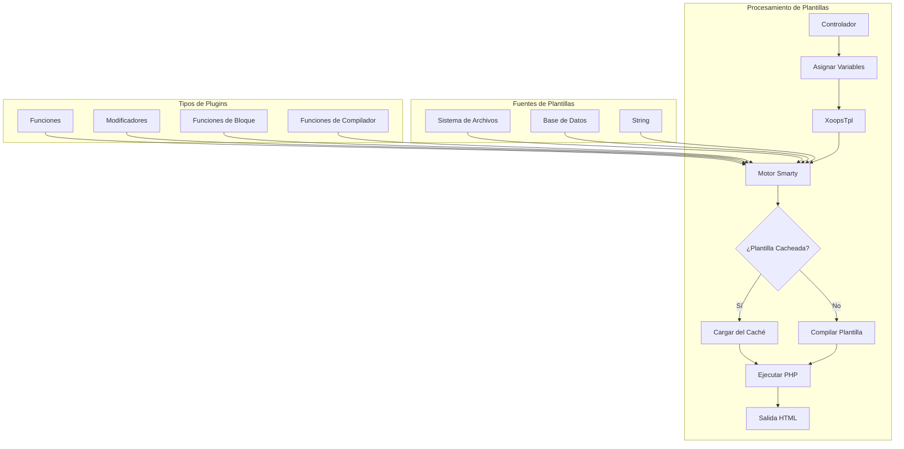
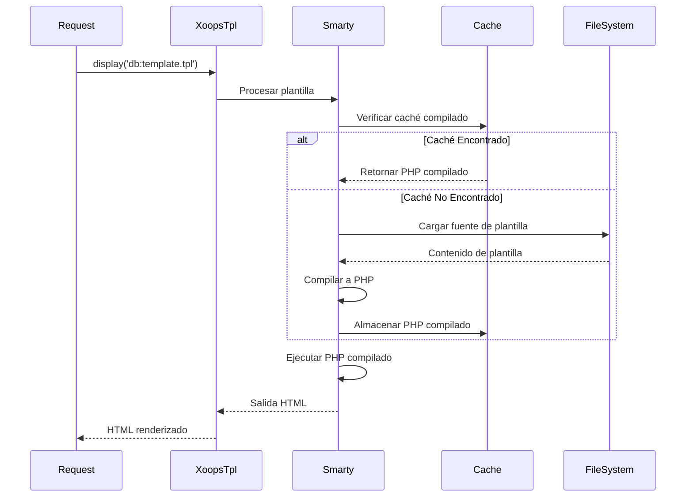
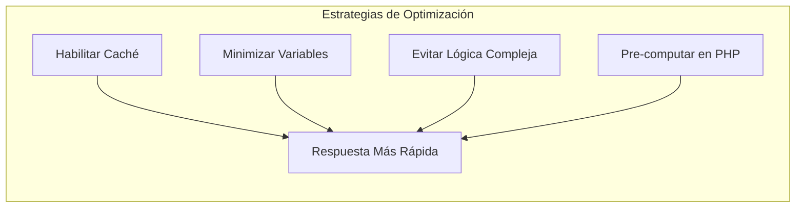

> Documentación completa de API para plantillas Smarty en XOOPS.

---

## Arquitectura del Motor de Plantillas



---

## Clase XoopsTpl

### Inicialización

```php
// Objeto de plantilla global
global $xoopsTpl;

// O obtener nueva instancia
$tpl = new XoopsTpl();

// Disponible en módulos
$GLOBALS['xoopsTpl']->assign('myvar', $value);
```

### Métodos Principales

| Método | Parámetros | Descripción |
|--------|------------|-------------|
| `assign` | `string $name, mixed $value` | Asignar variable a plantilla |
| `assignByRef` | `string $name, mixed &$value` | Asignar por referencia |
| `append` | `string $name, mixed $value, bool $merge = false` | Agregar a variable array |
| `display` | `string $template` | Renderizar y mostrar plantilla |
| `fetch` | `string $template` | Renderizar y retornar plantilla |
| `clearAssign` | `string $name` | Limpiar variable asignada |
| `clearAllAssign` | - | Limpiar todas las variables |
| `getTemplateVars` | `string $name = null` | Obtener variables asignadas |
| `templateExists` | `string $template` | Verificar si existe plantilla |
| `isCached` | `string $template` | Verificar si plantilla está cacheada |
| `clearCache` | `string $template = null` | Limpiar caché de plantilla |

### Asignación de Variables

```php
// Asignación simple
$xoopsTpl->assign('title', 'Mi Título de Página');
$xoopsTpl->assign('count', 42);
$xoopsTpl->assign('is_admin', true);

// Asignación de array
$xoopsTpl->assign('items', [
    ['id' => 1, 'name' => 'Elemento 1'],
    ['id' => 2, 'name' => 'Elemento 2'],
]);

// Asignación de objeto
$xoopsTpl->assign('user', $xoopsUser);

// Asignaciones múltiples
$xoopsTpl->assign([
    'title' => 'Mi Título',
    'content' => 'Mi Contenido',
    'author' => 'Juan Pérez'
]);

// Agregar a array
$xoopsTpl->append('items', ['id' => 3, 'name' => 'Elemento 3']);
```

### Carga de Plantillas

```php
// Desde base de datos (compilada)
$xoopsTpl->display('db:mymodule_index.tpl');

// Desde sistema de archivos
$xoopsTpl->display('file:' . XOOPS_ROOT_PATH . '/modules/mymodule/templates/custom.tpl');

// Obtener sin mostrar
$html = $xoopsTpl->fetch('db:mymodule_item.tpl');

// Desde string
$template = '<h1>{$title}</h1><p>{$content}</p>';
$html = $xoopsTpl->fetch('string:' . $template);
```

---

## Referencia de Sintaxis de Smarty

### Variables

```smarty
{* Variable simple *}
<{$title}>

{* Acceso a array *}
<{$item.name}>
<{$item['name']}>

{* Propiedad de objeto *}
<{$user->name}>
<{$user->getVar('uname')}>

{* Variable de configuración *}
<{$xoops_sitename}>

{* Constante *}
<{$smarty.const._MD_MYMODULE_TITLE}>

{* Variables del servidor *}
<{$smarty.server.REQUEST_URI}>
<{$smarty.get.id}>
<{$smarty.post.name}>
```

### Modificadores

```smarty
{* Modificadores de string *}
<{$title|upper}>
<{$title|lower}>
<{$title|capitalize}>
<{$title|truncate:50:"..."}>
<{$content|strip_tags}>
<{$content|nl2br}>
<{$text|escape:'html'}>
<{$text|escape:'url'}>

{* Formato de fecha *}
<{$timestamp|date_format:"%Y-%m-%d"}>
<{$timestamp|date_format:"%B %e, %Y"}>

{* Formato de número *}
<{$price|number_format:2:".":","}>

{* Valor por defecto *}
<{$optional|default:"N/A"}>

{* Modificadores encadenados *}
<{$title|strip_tags|truncate:50|escape}>

{* Contar array *}
<{$items|@count}>
```

### Estructuras de Control

```smarty
{* If/else *}
<{if $is_admin}>
    <p>Contenido de administrador</p>
<{elseif $is_moderator}>
    <p>Contenido de moderador</p>
<{else}>
    <p>Contenido de usuario</p>
<{/if}>

{* Loop foreach *}
<{foreach from=$items item=item key=key}>
    <li><{$key}>: <{$item.name}></li>
<{/foreach}>

{* Foreach con propiedades *}
<{foreach from=$items item=item name=itemLoop}>
    <{if $smarty.foreach.itemLoop.first}>
        <ul>
    <{/if}>

    <li class="<{if $smarty.foreach.itemLoop.iteration is odd}>odd<{else}>even<{/if}>">
        <{$smarty.foreach.itemLoop.iteration}>. <{$item.name}>
    </li>

    <{if $smarty.foreach.itemLoop.last}>
        </ul>
        <p>Total: <{$smarty.foreach.itemLoop.total}></p>
    <{/if}>
<{/foreach}>

{* Loop for *}
<{for $i=1 to 10}>
    <{$i}>
<{/for}>

{* Loop while *}
<{while $count < 10}>
    <{$count}>
    <{$count = $count + 1}>
<{/while}>
```

### Inclusiones

```smarty
{* Incluir otra plantilla *}
<{include file="db:mymodule_header.tpl"}>

{* Incluir con variables *}
<{include file="db:mymodule_item.tpl" item=$currentItem showAuthor=true}>

{* Incluir desde tema *}
<{include file="$theme_template_set/header.tpl"}>
```

### Comentarios

```smarty
{* Este es un comentario de Smarty - no se renderiza en la salida *}

{*
    Comentario multilínea
    explicando la plantilla
*}
```

---

## Funciones Específicas de XOOPS

### Renderizado de Bloques

```smarty
{* Renderizar bloque por ID *}
<{xoBlock id=5}>

{* Renderizar bloque por nombre *}
<{xoBlock name="mymodule_recent"}>

{* Renderizar todos los bloques en posición *}
<{foreach item=block from=$xoBlocks.canvas_left}>
    <div class="block">
        <h3><{$block.title}></h3>
        <{$block.content}>
    </div>
<{/foreach}>
```

### Manejo de Imágenes y Activos

```smarty
{* Imagen del módulo *}
/modules/<{$xoops_dirname}>/assets/images/logo.png">

{* Imagen del tema *}
icon.png">

{* Directorio de cargas *}
/<{$item.image}>">
```

### Generación de URLs

```smarty
{* URL del módulo *}
<a href="<{$xoops_url}>/modules/<{$xoops_dirname}>/item.php?id=<{$item.id}>">
    <{$item.title}>
</a>

{* Con URL amigable para SEO (si está habilitado) *}
<a href="<{$item.url}>"><{$item.title}></a>
```

---

## Flujo de Compilación de Plantillas



---

## Plugins Smarty Personalizados

### Plugin de Función

```php
// plugins/function.myfunction.php
function smarty_function_myfunction($params, $smarty)
{
    $name = $params['name'] ?? 'Mundo';
    return "Hola, {$name}!";
}

// Uso en plantilla:
// <{myfunction name="Juan"}>
```

### Plugin de Modificador

```php
// plugins/modifier.timeago.php
function smarty_modifier_timeago($timestamp)
{
    $diff = time() - $timestamp;

    if ($diff < 60) {
        return 'hace poco';
    } elseif ($diff < 3600) {
        $mins = floor($diff / 60);
        return "hace {$mins} minuto(s)";
    } elseif ($diff < 86400) {
        $hours = floor($diff / 3600);
        return "hace {$hours} hora(s)";
    } else {
        $days = floor($diff / 86400);
        return "hace {$days} día(s)";
    }
}

// Uso en plantilla:
// <{$item.created|timeago}>
```

### Plugin de Bloque

```php
// plugins/block.cache.php
function smarty_block_cache($params, $content, $smarty, &$repeat)
{
    if ($repeat) {
        // Etiqueta de apertura
        return '';
    } else {
        // Etiqueta de cierre - procesar contenido
        $ttl = $params['ttl'] ?? 3600;
        $key = md5($content);

        // Verificar caché...
        return $content;
    }
}

// Uso en plantilla:
// <{cache ttl=3600}>
//     Contenido costoso aquí
// <{/cache}>
```

---

## Consejos de Rendimiento



### Mejores Prácticas

1. **Habilitar caché de plantillas** en producción
2. **Asignar solo variables necesarias** - no pasar objetos completos
3. **Usar modificadores con moderación** - pre-formatear en PHP cuando sea posible
4. **Evitar loops anidados** - reestructurar datos en PHP
5. **Cachear bloques costosos** - usar caché de bloques para consultas complejas

---

## Documentación Relacionada

- Fundamentos de Smarty
- Desarrollo de Temas
- Migración a Smarty 4

---

#xoops #api #smarty #templates #reference
