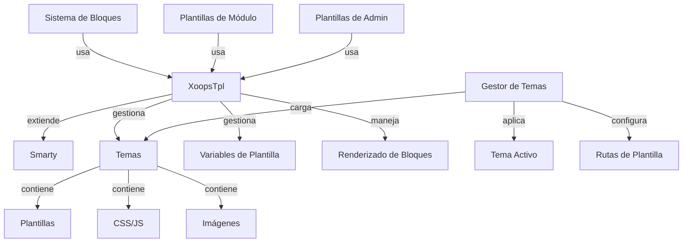

El Sistema de Plantillas XOOPS se construye sobre el potente motor de plantillas Smarty, proporcionando una forma flexible y extensible de separar la lógica de presentación de la lógica empresarial. Gestiona temas, renderizado de plantillas, asignación de variables y generación de contenido dinámico.

## Arquitectura de Plantillas



## Clase XoopsTpl

La clase principal del motor de plantillas que extiende Smarty.

### Descripción General de la Clase

```php
namespace Xoops\Core;

class XoopsTpl extends Smarty
{
    protected array $vars = [];
    protected string $currentTheme = '';
    protected array $blocks = [];
    protected bool $isAdmin = false;
}
```

### Extender Smarty

```php
use Xoops\Core\XoopsTpl;

class XoopsTpl extends Smarty
{
    private static ?XoopsTpl $instance = null;

    private function __construct()
    {
        parent::__construct();
        $this->configureDirectories();
        $this->registerPlugins();
    }

    public static function getInstance(): XoopsTpl
    {
        if (!isset(self::$instance)) {
            self::$instance = new self();
        }
        return self::$instance;
    }
}
```

### Métodos Principales

#### getInstance

Obtiene la instancia singleton de plantillas.

```php
public static function getInstance(): XoopsTpl
```

**Retorna:** `XoopsTpl` - Instancia singleton

**Ejemplo:**
```php
$xoopsTpl = XoopsTpl::getInstance();
```

#### assign

Asigna una variable a la plantilla.

```php
public function assign(
    string|array $tplVar,
    mixed $value = null
): void
```

**Parámetros:**

| Parámetro | Tipo | Descripción |
|-----------|------|-------------|
| `$tplVar` | string\|array | Nombre de variable o matriz asociativa |
| `$value` | mixed | Valor de la variable |

**Ejemplo:**
```php
$xoopsTpl->assign('page_title', 'Bienvenido');
$xoopsTpl->assign('user_name', 'Juan Pérez');

// Múltiples asignaciones
$xoopsTpl->assign([
    'items' => $items,
    'total_count' => count($items),
    'show_pagination' => true
]);
```

#### appendAssign

Añade valores a variables de matriz de plantilla.

```php
public function appendAssign(
    string $tplVar,
    mixed $value
): void
```

**Parámetros:**

| Parámetro | Tipo | Descripción |
|-----------|------|-------------|
| `$tplVar` | string | Nombre de variable |
| `$value` | mixed | Valor a añadir |

**Ejemplo:**
```php
$xoopsTpl->assign('breadcrumbs', ['Inicio']);
$xoopsTpl->appendAssign('breadcrumbs', 'Blog');
$xoopsTpl->appendAssign('breadcrumbs', 'Artículos');
// breadcrumbs = ['Inicio', 'Blog', 'Artículos']
```

#### getAssignedVars

Obtiene todas las variables asignadas de plantilla.

```php
public function getAssignedVars(): array
```

**Retorna:** `array` - Variables asignadas

**Ejemplo:**
```php
$vars = $xoopsTpl->getAssignedVars();
foreach ($vars as $name => $value) {
    echo "$name = " . var_export($value, true) . "\n";
}
```

#### display

Renderiza una plantilla y envía salida al navegador.

```php
public function display(
    string $resource,
    string|array $cache_id = null,
    string $compile_id = null,
    object $parent = null
): void
```

**Parámetros:**

| Parámetro | Tipo | Descripción |
|-----------|------|-------------|
| `$resource` | string | Ruta del archivo de plantilla |
| `$cache_id` | string\|array | Identificador de caché |
| `$compile_id` | string | Identificador de compilación |
| `$parent` | object | Objeto de plantilla padre |

**Ejemplo:**
```php
$xoopsTpl->assign('page_title', 'Inicio');
$xoopsTpl->display('user:index.tpl');

// Con ruta absoluta
$xoopsTpl->display(XOOPS_ROOT_PATH . '/templates/user/index.tpl');
```

#### fetch

Renderiza una plantilla y la devuelve como cadena.

```php
public function fetch(
    string $resource,
    string|array $cache_id = null,
    string $compile_id = null,
    object $parent = null
): string
```

**Retorna:** `string` - Contenido de plantilla renderizado

**Ejemplo:**
```php
$xoopsTpl->assign('message', 'Hola Mundo');
$html = $xoopsTpl->fetch('user:message.tpl');
echo $html;

// Usar para plantillas de correo electrónico
$emailContent = $xoopsTpl->fetch('mail:notification.tpl');
mail($to, $subject, $emailContent);
```

#### loadTheme

Carga un tema específico.

```php
public function loadTheme(string $themeName): bool
```

**Parámetros:**

| Parámetro | Tipo | Descripción |
|-----------|------|-------------|
| `$themeName` | string | Nombre de directorio del tema |

**Retorna:** `bool` - Verdadero en caso de éxito

**Ejemplo:**
```php
if ($xoopsTpl->loadTheme('bluemoon')) {
    echo "Tema cargado correctamente";
}
```

#### getCurrentTheme

Obtiene el nombre del tema activo actual.

```php
public function getCurrentTheme(): string
```

**Retorna:** `string` - Nombre del tema

**Ejemplo:**
```php
$currentTheme = $xoopsTpl->getCurrentTheme();
echo "Tema activo: $currentTheme";
```

#### setOutputFilter

Añade un filtro de salida para procesar la salida de plantilla.

```php
public function setOutputFilter(string $function): void
```

**Parámetros:**

| Parámetro | Tipo | Descripción |
|-----------|------|-------------|
| `$function` | string | Nombre de función de filtro |

**Ejemplo:**
```php
// Eliminar espacios en blanco de la salida
$xoopsTpl->setOutputFilter('trim');

// Filtro personalizado
function my_output_filter($output) {
    // Minificar HTML
    $output = preg_replace('/\s+/', ' ', $output);
    return trim($output);
}
$xoopsTpl->setOutputFilter('my_output_filter');
```

#### registerPlugin

Registra un plugin personalizado de Smarty.

```php
public function registerPlugin(
    string $type,
    string $name,
    callable $callback
): void
```

**Parámetros:**

| Parámetro | Tipo | Descripción |
|-----------|------|-------------|
| `$type` | string | Tipo de plugin (modifier, block, function) |
| `$name` | string | Nombre del plugin |
| `$callback` | callable | Función de callback |

**Ejemplo:**
```php
// Registrar modificador personalizado
$xoopsTpl->registerPlugin('modifier', 'markdown', function($text) {
    return markdown_parse($text);
});

// Usar en plantilla: {$content|markdown}

// Registrar etiqueta de bloque personalizada
$xoopsTpl->registerPlugin('block', 'permission', function($params, $content, $smarty, &$repeat) {
    if ($repeat) return;

    // Verificar permiso
    if (has_permission($params['name'])) {
        return $content;
    }
    return '';
});

// Usar en plantilla: {permission name="admin"}...{/permission}
```

## Sistema de Temas

### Estructura de Tema

Estructura de directorio estándar del tema XOOPS:

```
bluemoon/
├── style.css              # Hoja de estilos principal
├── admin.css              # Hoja de estilos de admin
├── theme.html             # Plantilla de página principal
├── admin.html             # Plantilla de página de admin
├── blocks/                # Plantillas de bloques
│   ├── block_left.tpl
│   └── block_right.tpl
├── modules/               # Plantillas de módulo
│   ├── publisher/
│   │   ├── index.tpl
│   │   └── item.tpl
│   └── news/
│       └── index.tpl
├── images/                # Imágenes de tema
│   ├── logo.png
│   └── banner.png
├── js/                    # JavaScript de tema
│   └── script.js
└── readme.txt             # Documentación del tema
```

### Clase Gestor de Temas

```php
namespace Xoops\Core\Theme;

class ThemeManager
{
    protected array $themes = [];
    protected string $activeTheme = '';
    protected string $themeDirectory = '';

    public function getActiveTheme(): string {}
    public function setActiveTheme(string $theme): bool {}
    public function getThemeList(): array {}
    public function themeExists(string $name): bool {}
}
```

## Variables de Plantilla

### Variables Globales Estándar

XOOPS asigna automáticamente varias variables globales de plantilla:

| Variable | Tipo | Descripción |
|----------|------|-------------|
| `$xoops_url` | string | URL de instalación de XOOPS |
| `$xoops_user` | XoopsUser\|null | Objeto del usuario actual |
| `$xoops_uname` | string | Nombre de usuario actual |
| `$xoops_isadmin` | bool | El usuario es administrador |
| `$xoops_banner` | string | HTML del banner |
| `$xoops_notification` | string | Marcado de notificación |
| `$xoops_version` | string | Versión de XOOPS |

### Variables Específicas de Bloque

Cuando se renderiza bloques:

| Variable | Tipo | Descripción |
|----------|------|-------------|
| `$block` | array | Información de bloque |
| `$block.title` | string | Título del bloque |
| `$block.content` | string | Contenido del bloque |
| `$block.id` | int | ID del bloque |
| `$block.module` | string | Nombre del módulo |

### Variables de Plantilla de Módulo

Los módulos típicamente asignan:

| Variable | Tipo | Descripción |
|----------|------|-------------|
| `$module_name` | string | Nombre de visualización del módulo |
| `$module_dir` | string | Directorio del módulo |
| `$xoops_module_header` | string | CSS/JS del módulo |

## Configuración de Smarty

### Modificadores Comunes de Smarty

| Modificador | Descripción | Ejemplo |
|----------|-------------|---------|
| `capitalize` | Capitalizar primera letra | `{$title\|capitalize}` |
| `count_characters` | Contar caracteres | `{$text\|count_characters}` |
| `date_format` | Formatear marca de tiempo | `{$timestamp\|date_format:'%Y-%m-%d'}` |
| `escape` | Escapar caracteres especiales | `{$html\|escape:'html'}` |
| `nl2br` | Convertir saltos de línea a `<br>` | `{$text\|nl2br}` |
| `strip_tags` | Eliminar etiquetas HTML | `{$content\|strip_tags}` |
| `truncate` | Limitar longitud de cadena | `{$text\|truncate:100}` |
| `upper` | Convertir a mayúsculas | `{$name\|upper}` |
| `lower` | Convertir a minúsculas | `{$name\|lower}` |

### Estructuras de Control

```smarty
{* Declaración if *}
{if $user->isAdmin()}
    <p>Contenido de administrador</p>
{else}
    <p>Contenido de usuario</p>
{/if}

{* Bucle for *}
{foreach $items as $item}
    <div class="item">{$item.title}</div>
{/foreach}

{* Bucle for con contador *}
{foreach $items as $item name=item_loop}
    {$smarty.foreach.item_loop.iteration}: {$item.title}
{/foreach}

{* Bucle while *}
{while $condition}
    <!-- contenido -->
{/while}

{* Declaración switch *}
{switch $status}
    {case 'draft'}<span class="draft">Borrador</span>{break}
    {case 'published'}<span class="published">Publicado</span>{break}
    {default}<span class="unknown">Desconocido</span>
{/switch}
```

## Ejemplo de Plantilla Completa

### Código PHP

```php
<?php
/**
 * Página de Lista de Artículos del Módulo
 */

include __DIR__ . '/include/common.inc.php';

$xoopsTpl = XoopsTpl::getInstance();

// Verificar si el módulo está activo
$module = xoops_getModuleByDirname('articles');
if (!$module) {
    redirect_header(XOOPS_URL, 3, 'Módulo no encontrado');
}

// Obtener gestor de elementos
$itemHandler = xoops_getModuleHandler('item', 'articles');

// Obtener parámetros de paginación
$page = !empty($_GET['page']) ? (int)$_GET['page'] : 1;
$perPage = $module->getConfig('items_per_page') ?: 10;
$offset = ($page - 1) * $perPage;

// Construir criterios
$criteria = new CriteriaCompo();
$criteria->add(new Criteria('status', 1));
$criteria->setSort('published', 'DESC');
$criteria->setLimit($perPage);
$criteria->setStart($offset);

// Obtener elementos
$items = $itemHandler->getObjects($criteria);
$total = $itemHandler->getCount(new Criteria('status', 1));

// Calcular paginación
$pages = ceil($total / $perPage);

// Asignar variables de plantilla
$xoopsTpl->assign([
    'module_name' => $module->getName(),
    'items' => $items,
    'total_items' => $total,
    'current_page' => $page,
    'total_pages' => $pages,
    'items_per_page' => $perPage,
    'show_pagination' => $pages > 1
]);

// Añadir migas de pan
$xoopsTpl->assign('xoops_breadcrumbs', [
    ['url' => XOOPS_URL, 'title' => 'Inicio'],
    ['url' => $module->getUrl(), 'title' => $module->getName()],
    ['title' => 'Artículos']
]);

// Mostrar plantilla
$xoopsTpl->display($module->getPath() . '/templates/user/list.tpl');
```

### Archivo de Plantilla (list.tpl)

```smarty
<div id="articles-list">
    <h1>{$module_name|escape}</h1>

    {if $items}
        <div class="articles-container">
            {foreach $items as $item}
                <article class="article-item">
                    <header>
                        <h2>
                            <a href="{$item.url|escape}">
                                {$item.title|escape}
                            </a>
                        </h2>
                        <div class="meta">
                            <span class="author">Por {$item.author|escape}</span>
                            <span class="date">
                                {$item.published|date_format:'%B %d, %Y'}
                            </span>
                        </div>
                    </header>

                    <div class="content">
                        <p>{$item.summary|truncate:150}</p>
                    </div>

                    <footer>
                        <a href="{$item.url|escape}" class="read-more">
                            Leer Más »
                        </a>
                    </footer>
                </article>
            {/foreach}
        </div>

        {* Paginación *}
        {if $show_pagination}
            <nav class="pagination">
                {if $current_page > 1}
                    <a href="?page=1" class="first">« Primera</a>
                    <a href="?page={$current_page - 1}" class="prev">‹ Anterior</a>
                {/if}

                {for $i=1 to $total_pages}
                    {if $i == $current_page}
                        <span class="current">{$i}</span>
                    {else}
                        <a href="?page={$i}">{$i}</a>
                    {/if}
                {/for}

                {if $current_page < $total_pages}
                    <a href="?page={$current_page + 1}" class="next">Siguiente ›</a>
                    <a href="?page={$total_pages}" class="last">Última »</a>
                {/if}
            </nav>
        {/if}
    {else}
        <p class="no-items">No se encontraron artículos.</p>
    {/if}
</div>
```

## Funciones Personalizadas de Smarty

### Creación de Función de Bloque Personalizada

```php
<?php
/**
 * Función de bloque Smarty personalizada para verificación de permisos
 */

function smarty_block_permission($params, $content, $smarty, &$repeat)
{
    if ($repeat) return;

    if (!isset($params['name'])) {
        return 'Nombre de permiso requerido';
    }

    $permName = $params['name'];
    $user = $GLOBALS['xoopsUser'];

    // Verificar si el usuario tiene permiso
    if ($user && $user->isAdmin()) {
        return $content;
    }

    if ($user && check_user_permission($user->uid(), $permName)) {
        return $content;
    }

    return '';
}
```

Registrar y usar:

```php
$xoopsTpl->registerPlugin('block', 'permission', 'smarty_block_permission');
```

Plantilla:

```smarty
{permission name="edit_articles"}
    <button>Editar Artículo</button>
{/permission}
```

## Mejores Prácticas

1. **Escapar Contenido del Usuario** - Siempre usar `|escape` para contenido generado por usuario
2. **Usar Rutas de Plantilla** - Referenciar plantillas relativas al tema
3. **Separar Lógica de Presentación** - Mantener lógica compleja en PHP
4. **Cachear Plantillas** - Habilitar caché de plantillas en producción
5. **Usar Modificadores Correctamente** - Aplicar filtros apropiados para el contexto
6. **Organizar Bloques** - Colocar plantillas de bloque en directorio dedicado
7. **Documentar Variables** - Documentar todas las variables de plantilla en PHP

## Documentación Relacionada

- ../Module/Module-System - Sistema de módulo y hooks
- ../Kernel/Kernel-Classes - Clases de Kernel y configuración
- ../Core/XoopsObject - Clase de objeto base

---

*Ver también: [Documentación de Smarty](https://www.smarty.net/docs) | [API de Plantillas XOOPS](https://github.com/XOOPS/XoopsCore27/tree/master/htdocs/class)*
