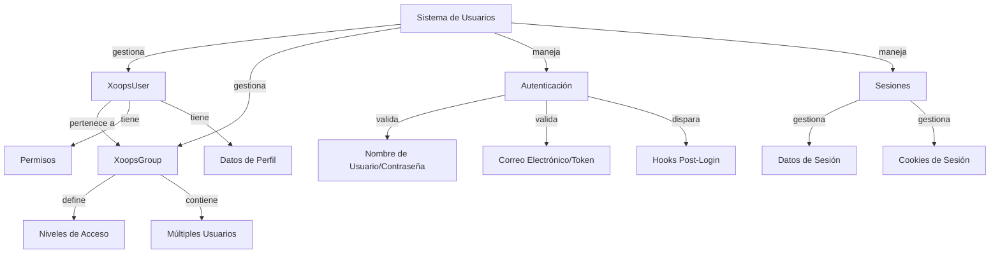

El Sistema de Usuarios XOOPS gestiona cuentas de usuario, autenticación, autorización, membresía de grupo y gestión de sesiones. Proporciona un marco robusto para asegurar su aplicación y controlar el acceso de usuarios.

## Arquitectura del Sistema de Usuarios



## Clase XoopsUser

El objeto de usuario principal que representa una cuenta de usuario.

### Descripción General de la Clase

```php
namespace Xoops\Core\User;

class XoopsUser extends XoopsObject
{
    protected int $uid = 0;
    protected string $uname = '';
    protected string $email = '';
    protected string $pass = '';
    protected int $uregdate = 0;
    protected int $ulevel = 0;
    protected array $groups = [];
    protected array $permissions = [];
}
```

### Constructor

```php
public function __construct(int $uid = null)
```

Crea un nuevo objeto de usuario, cargando opcionalmente de la base de datos por ID.

**Parámetros:**

| Parámetro | Tipo | Descripción |
|-----------|------|-------------|
| `$uid` | int | ID de usuario a cargar (opcional) |

**Ejemplo:**
```php
// Crear nuevo usuario
$user = new XoopsUser();

// Cargar usuario existente
$user = new XoopsUser(123);
```

### Propiedades Principales

| Propiedad | Tipo | Descripción |
|----------|------|-------------|
| `uid` | int | ID de usuario |
| `uname` | string | Nombre de usuario |
| `email` | string | Dirección de correo electrónico |
| `pass` | string | Hash de contraseña |
| `uregdate` | int | Marca de tiempo de registro |
| `ulevel` | int | Nivel de usuario (9=admin, 1=usuario) |
| `groups` | array | IDs de grupo |
| `permissions` | array | Banderas de permiso |

### Métodos Principales

#### getID / getUid

Obtiene el ID del usuario.

```php
public function getID(): int
public function getUid(): int  // Alias
```

**Retorna:** `int` - ID de usuario

**Ejemplo:**
```php
$user = new XoopsUser(1);
echo $user->getID(); // 1
echo $user->getUid(); // 1
```

#### getUnameReal

Obtiene el nombre de visualización del usuario.

```php
public function getUnameReal(): string
```

**Retorna:** `string` - Nombre real del usuario

**Ejemplo:**
```php
$realName = $user->getUnameReal();
echo "Hola, $realName";
```

#### getEmail

Obtiene la dirección de correo electrónico del usuario.

```php
public function getEmail(): string
```

**Retorna:** `string` - Dirección de correo electrónico

**Ejemplo:**
```php
$email = $user->getEmail();
mail($email, 'Bienvenido', 'Bienvenido a XOOPS');
```

#### getVar / setVar

Obtiene o establece una variable de usuario.

```php
public function getVar(string $key, string $format = 's'): mixed
public function setVar(string $key, mixed $value, bool $notGpc = false): bool
```

**Ejemplo:**
```php
// Obtener valores
$username = $user->getVar('uname');
$email = $user->getVar('email', 's'); // Formateado para mostrar

// Establecer valores
$user->setVar('uname', 'nombrenuevo');
$user->setVar('email', 'user@example.com');
```

#### getGroups

Obtiene las membresías de grupo del usuario.

```php
public function getGroups(): array
```

**Retorna:** `array` - Matriz de IDs de grupo

**Ejemplo:**
```php
$groups = $user->getGroups();
echo "Miembro de " . count($groups) . " grupos";
```

#### isInGroup

Verifica si el usuario pertenece a un grupo.

```php
public function isInGroup(int $groupId): bool
```

**Parámetros:**

| Parámetro | Tipo | Descripción |
|-----------|------|-------------|
| `$groupId` | int | ID de grupo a verificar |

**Retorna:** `bool` - Verdadero si está en el grupo

**Ejemplo:**
```php
if ($user->isInGroup(1)) { // 1 = Webmasters
    echo 'El usuario es webmaster';
}
```

#### isAdmin

Verifica si el usuario es administrador.

```php
public function isAdmin(): bool
```

**Retorna:** `bool` - Verdadero si es administrador

**Ejemplo:**
```php
if ($user->isAdmin()) {
    // Mostrar controles de administrador
    echo '<a href="admin/">Panel de Administración</a>';
}
```

#### getProfile

Obtiene información de perfil del usuario.

```php
public function getProfile(): array
```

**Retorna:** `array` - Datos de perfil

**Ejemplo:**
```php
$profile = $user->getProfile();
echo 'Biografía: ' . $profile['bio'];
```

#### isActive

Verifica si la cuenta de usuario está activa.

```php
public function isActive(): bool
```

**Retorna:** `bool` - Verdadero si está activo

**Ejemplo:**
```php
if ($user->isActive()) {
    // Permitir acceso de usuario
} else {
    // Restringir acceso
}
```

#### updateLastLogin

Actualiza la marca de tiempo del último inicio de sesión del usuario.

```php
public function updateLastLogin(): bool
```

**Retorna:** `bool` - Verdadero en caso de éxito

**Ejemplo:**
```php
if ($user->updateLastLogin()) {
    echo 'Inicio de sesión registrado';
}
```

## Clase XoopsGroup

Gestiona grupos de usuarios y permisos.

### Descripción General de la Clase

```php
namespace Xoops\Core\User;

class XoopsGroup extends XoopsObject
{
    protected int $groupid = 0;
    protected string $name = '';
    protected string $description = '';
    protected int $group_type = 0;
    protected array $users = [];
}
```

### Constantes

| Constante | Valor | Descripción |
|----------|-------|-------------|
| `TYPE_NORMAL` | 0 | Grupo de usuario normal |
| `TYPE_ADMIN` | 1 | Grupo administrativo |
| `TYPE_SYSTEM` | 2 | Grupo del sistema |

### Métodos

#### getName

Obtiene el nombre del grupo.

```php
public function getName(): string
```

**Retorna:** `string` - Nombre del grupo

**Ejemplo:**
```php
$group = new XoopsGroup(1);
echo $group->getName(); // "Webmasters"
```

#### getDescription

Obtiene la descripción del grupo.

```php
public function getDescription(): string
```

**Retorna:** `string` - Descripción

**Ejemplo:**
```php
echo $group->getDescription();
```

#### getUsers

Obtiene miembros del grupo.

```php
public function getUsers(): array
```

**Retorna:** `array` - Matriz de IDs de usuario

**Ejemplo:**
```php
$users = $group->getUsers();
echo "El grupo tiene " . count($users) . " miembros";
```

#### addUser

Añade un usuario al grupo.

```php
public function addUser(int $uid): bool
```

**Parámetros:**

| Parámetro | Tipo | Descripción |
|-----------|------|-------------|
| `$uid` | int | ID de usuario |

**Retorna:** `bool` - Verdadero en caso de éxito

**Ejemplo:**
```php
$group = new XoopsGroup(2); // Editores
$group->addUser(123);
$groupHandler->insert($group);
```

#### removeUser

Elimina un usuario del grupo.

```php
public function removeUser(int $uid): bool
```

**Ejemplo:**
```php
$group->removeUser(123);
```

## Autenticación de Usuario

### Proceso de Inicio de Sesión

```php
/**
 * Inicio de sesión de usuario
 */
function xoops_user_login(string $uname, string $pass, bool $rememberMe = false): ?XoopsUser
{
    global $xoopsDB;

    // Sanitizar nombre de usuario
    $uname = trim($uname);

    // Obtener usuario de la base de datos
    $query = $xoopsDB->prepare(
        'SELECT * FROM ' . $xoopsDB->prefix('users') .
        ' WHERE uname = ? AND active = 1'
    );
    $query->bind_param('s', $uname);
    $query->execute();
    $result = $query->get_result();

    if ($result->num_rows === 0) {
        return null; // Usuario no encontrado
    }

    $row = $result->fetch_assoc();

    // Verificar contraseña
    if (!password_verify($pass, $row['pass'])) {
        return null; // Contraseña inválida
    }

    // Cargar objeto de usuario
    $user = new XoopsUser($row['uid']);

    // Actualizar último inicio de sesión
    $user->updateLastLogin();

    // Manejar "Recuérdame"
    if ($rememberMe) {
        // Establecer cookie persistente
        setcookie(
            'xoops_user_remember',
            $user->uid(),
            time() + (30 * 24 * 60 * 60), // 30 días
            '/',
            $_SERVER['HTTP_HOST'] ?? ''
        );
    }

    return $user;
}
```

### Gestión de Contraseña

```php
/**
 * Hash de contraseña de forma segura
 */
function xoops_hash_password(string $password): string
{
    return password_hash($password, PASSWORD_BCRYPT, [
        'cost' => 12
    ]);
}

/**
 * Verificar contraseña
 */
function xoops_verify_password(string $password, string $hash): bool
{
    return password_verify($password, $hash);
}

/**
 * Verificar si la contraseña necesita ser re-hasheada
 */
function xoops_password_needs_rehash(string $hash): bool
{
    return password_needs_rehash($hash, PASSWORD_BCRYPT, [
        'cost' => 12
    ]);
}
```

## Gestión de Sesión

### Clase Gestor de Sesión

```php
namespace Xoops\Core;

class SessionManager
{
    protected array $data = [];
    protected string $sessionId = '';

    public function start(): void {}
    public function get(string $key): mixed {}
    public function set(string $key, mixed $value): void {}
    public function destroy(): void {}
}
```

### Métodos de Sesión

#### Iniciar Sesión

```php
<?php
session_start();

// Regenerar ID de sesión por seguridad
session_regenerate_id(true);

// Establecer tiempo de espera de sesión
ini_set('session.gc_maxlifetime', 3600); // 1 hora

// Almacenar usuario en sesión
if ($user) {
    $_SESSION['xoops_user'] = $user;
    $_SESSION['xoops_uid'] = $user->getID();
    $_SESSION['xoops_uname'] = $user->getVar('uname');
}
```

#### Verificar Sesión

```php
/**
 * Obtener usuario actual de la sesión
 */
function xoops_get_current_user(): ?XoopsUser
{
    if (isset($_SESSION['xoops_user']) && $_SESSION['xoops_user'] instanceof XoopsUser) {
        return $_SESSION['xoops_user'];
    }
    return null;
}

/**
 * Verificar si el usuario ha iniciado sesión
 */
function xoops_is_user_logged_in(): bool
{
    return isset($_SESSION['xoops_uid']) && $_SESSION['xoops_uid'] > 0;
}
```

#### Destruir Sesión

```php
/**
 * Cierre de sesión de usuario
 */
function xoops_user_logout()
{
    global $xoopsUser;

    // Registrar el cierre de sesión
    if ($xoopsUser) {
        error_log('El usuario ' . $xoopsUser->getVar('uname') . ' cerró sesión');
    }

    // Destruir datos de sesión
    $_SESSION = [];

    // Eliminar cookie de sesión
    if (ini_get('session.use_cookies')) {
        $params = session_get_cookie_params();
        setcookie(
            session_name(),
            '',
            time() - 42000,
            $params['path'],
            $params['domain'],
            $params['secure'],
            $params['httponly']
        );
    }

    // Destruir sesión
    session_destroy();
}
```

## Sistema de Permisos

### Constantes de Permisos

| Constante | Valor | Descripción |
|----------|-------|-------------|
| `XOOPS_PERMISSION_NONE` | 0 | Sin permiso |
| `XOOPS_PERMISSION_VIEW` | 1 | Ver contenido |
| `XOOPS_PERMISSION_SUBMIT` | 2 | Enviar contenido |
| `XOOPS_PERMISSION_EDIT` | 4 | Editar contenido |
| `XOOPS_PERMISSION_DELETE` | 8 | Eliminar contenido |
| `XOOPS_PERMISSION_ADMIN` | 16 | Acceso de administración |

### Verificación de Permisos

```php
/**
 * Verificar si el usuario tiene permiso
 */
function xoops_check_permission($user, $resource, $permission)
{
    if (!$user) {
        return false;
    }

    // Los administradores tienen todos los permisos
    if ($user->isAdmin()) {
        return true;
    }

    // Verificar permisos de grupo
    $groups = $user->getGroups();
    foreach ($groups as $groupId) {
        if (xoops_group_has_permission($groupId, $resource, $permission)) {
            return true;
        }
    }

    return false;
}
```

## Gestor de Usuarios

El UserHandler gestiona operaciones de persistencia de usuario.

```php
/**
 * Obtener gestor de usuario
 */
$userHandler = xoops_getHandler('user');

/**
 * Crear nuevo usuario
 */
$user = new XoopsUser();
$user->setVar('uname', 'nuevousuario');
$user->setVar('email', 'user@example.com');
$user->setVar('pass', xoops_hash_password('password123'));
$user->setVar('uregdate', time());
$user->setVar('uactive', 1);

if ($userHandler->insert($user)) {
    echo 'Usuario creado con ID: ' . $user->getID();
}

/**
 * Actualizar usuario
 */
$user = $userHandler->get(123);
$user->setVar('email', 'email_nuevo@example.com');
$userHandler->insert($user);

/**
 * Obtener usuario por nombre
 */
$user = $userHandler->findByUsername('john');

/**
 * Eliminar usuario
 */
$userHandler->delete($user);

/**
 * Buscar usuarios
 */
$criteria = new CriteriaCompo();
$criteria->add(new Criteria('uname', '%admin%', 'LIKE'));
$users = $userHandler->getObjects($criteria);
```

## Ejemplo Completo de Gestión de Usuarios

```php
<?php
/**
 * Ejemplo completo de autenticación y perfil de usuario
 */

require_once XOOPS_ROOT_PATH . '/include/common.inc.php';

$xoopsUser = $GLOBALS['xoopsUser'];

// Verificar si el usuario ha iniciado sesión
if (!$xoopsUser || !$xoopsUser->isActive()) {
    redirect_header(XOOPS_URL, 3, 'Por favor inicie sesión');
}

// Obtener gestor de usuario
$userHandler = xoops_getHandler('user');

// Obtener usuario actual con datos frescos
$currentUser = $userHandler->get($xoopsUser->getID());

// Página de perfil de usuario
echo '<h1>Perfil: ' . htmlspecialchars($currentUser->getVar('uname')) . '</h1>';

echo '<div class="user-profile">';
echo '<p><strong>Nombre de usuario:</strong> ' . htmlspecialchars($currentUser->getVar('uname')) . '</p>';
echo '<p><strong>Correo Electrónico:</strong> ' . htmlspecialchars($currentUser->getVar('email')) . '</p>';
echo '<p><strong>Registrado:</strong> ' . date('Y-m-d H:i:s', $currentUser->getVar('uregdate')) . '</p>';
echo '<p><strong>Grupos:</strong> ';

$groupHandler = xoops_getHandler('group');
$groups = $currentUser->getGroups();
$groupNames = [];
foreach ($groups as $groupId) {
    $group = $groupHandler->get($groupId);
    if ($group) {
        $groupNames[] = htmlspecialchars($group->getName());
    }
}
echo implode(', ', $groupNames);
echo '</p>';

// Estado de administrador
if ($currentUser->isAdmin()) {
    echo '<p><strong>Estado:</strong> Administrador</p>';
}

echo '</div>';

// Formulario de cambio de contraseña
if ($_SERVER['REQUEST_METHOD'] === 'POST' && !empty($_POST['change_password'])) {
    $oldPassword = $_POST['old_password'] ?? '';
    $newPassword = $_POST['new_password'] ?? '';
    $confirmPassword = $_POST['confirm_password'] ?? '';

    // Verificar contraseña antigua
    if (!password_verify($oldPassword, $currentUser->getVar('pass'))) {
        echo '<div class="error">La contraseña actual es incorrecta</div>';
    } elseif ($newPassword !== $confirmPassword) {
        echo '<div class="error">Las contraseñas nuevas no coinciden</div>';
    } elseif (strlen($newPassword) < 6) {
        echo '<div class="error">La contraseña debe tener al menos 6 caracteres</div>';
    } else {
        // Actualizar contraseña
        $currentUser->setVar('pass', xoops_hash_password($newPassword));
        if ($userHandler->insert($currentUser)) {
            echo '<div class="success">Contraseña cambiada correctamente</div>';
        } else {
            echo '<div class="error">Error al actualizar la contraseña</div>';
        }
    }
}

// Formulario de cambio de contraseña
echo '<form method="post">';
echo '<h3>Cambiar Contraseña</h3>';
echo '<div class="form-group">';
echo '<label>Contraseña Actual:</label>';
echo '<input type="password" name="old_password" required>';
echo '</div>';
echo '<div class="form-group">';
echo '<label>Contraseña Nueva:</label>';
echo '<input type="password" name="new_password" required>';
echo '</div>';
echo '<div class="form-group">';
echo '<label>Confirmar Contraseña:</label>';
echo '<input type="password" name="confirm_password" required>';
echo '</div>';
echo '<button type="submit" name="change_password">Cambiar Contraseña</button>';
echo '</form>';
```

## Mejores Prácticas

1. **Hashear Contraseñas** - Usar siempre bcrypt o argon2 para hash de contraseñas
2. **Validar Entrada** - Validar y sanitizar toda entrada de usuario
3. **Verificar Permisos** - Verificar siempre permisos de usuario antes de acciones
4. **Usar Sesiones Seguras** - Regenerar IDs de sesión en el inicio de sesión
5. **Registrar Actividades** - Registrar inicios de sesión, cierres de sesión y acciones críticas
6. **Límite de Velocidad** - Implementar límite de velocidad en intentos de inicio de sesión
7. **Solo HTTPS** - Usar siempre HTTPS para autenticación
8. **Gestión de Grupos** - Usar grupos para organización de permisos

## Documentación Relacionada

- ../Kernel/Kernel-Classes - Servicios de Kernel e inicio
- ../Database/QueryBuilder - Consultas de base de datos para datos de usuario
- ../Core/XoopsObject - Clase de objeto base

---

*Ver también: [API de Usuario XOOPS](https://github.com/XOOPS/XoopsCore27/tree/master/htdocs/class) | [Seguridad de PHP](https://www.php.net/manual/en/book.password.php)*
