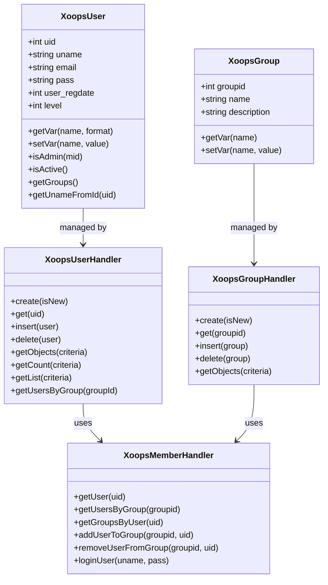
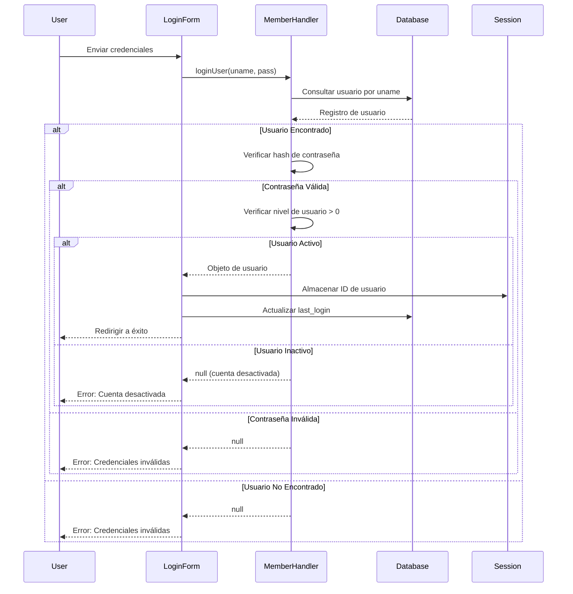
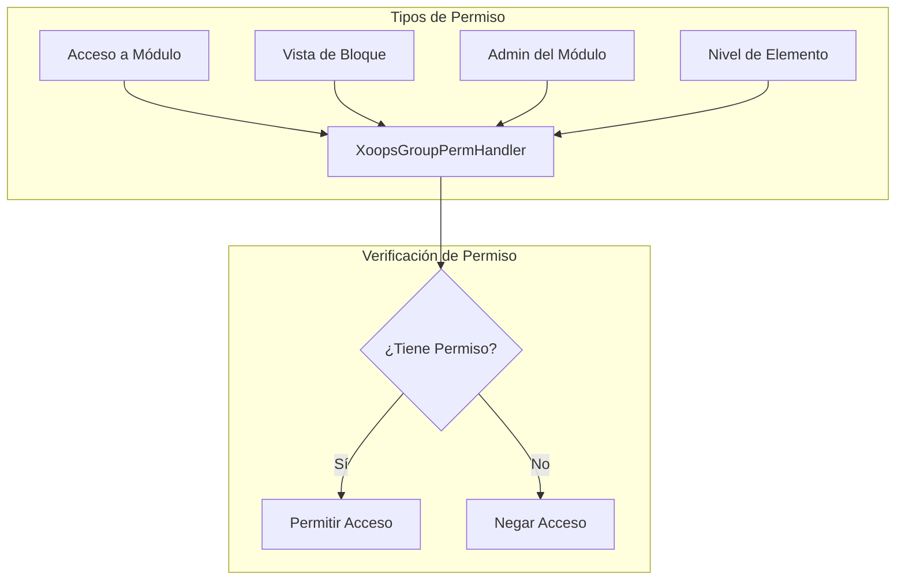
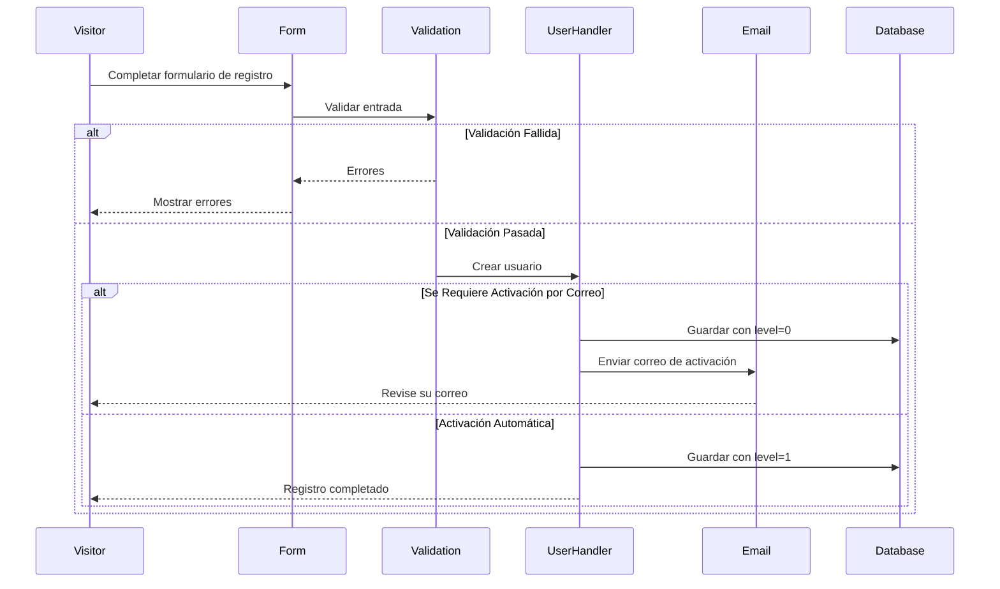

> Documentación completa de la API para el sistema de usuarios de XOOPS.

---

## Arquitectura del Sistema de Usuarios



---

## Clase XoopsUser

### Propiedades

| Propiedad | Tipo | Descripción |
|----------|------|-------------|
| `uid` | int | ID de usuario (clave principal) |
| `uname` | string | Nombre de usuario |
| `name` | string | Nombre real |
| `email` | string | Dirección de correo electrónico |
| `pass` | string | Hash de contraseña |
| `url` | string | URL del sitio web |
| `user_avatar` | string | Nombre de archivo de avatar |
| `user_regdate` | int | Marca de tiempo de registro |
| `user_from` | string | Ubicación |
| `user_sig` | string | Firma |
| `user_occ` | string | Ocupación |
| `user_intrest` | string | Intereses |
| `bio` | string | Biografía |
| `posts` | int | Recuento de publicaciones |
| `rank` | int | Rango de usuario |
| `level` | int | Nivel de usuario (0=inactivo, 1=activo) |
| `theme` | string | Tema preferido |
| `timezone` | float | Desplazamiento de zona horaria |
| `last_login` | int | Marca de tiempo del último inicio de sesión |

### Métodos Principales

```php
// Obtener usuario actual
global $xoopsUser;

// Verificar si ha iniciado sesión
if (is_object($xoopsUser)) {
    // El usuario ha iniciado sesión
    $uid = $xoopsUser->getVar('uid');
    $username = $xoopsUser->getVar('uname');
}

// Obtener valores formateados
$uname = $xoopsUser->getVar('uname');           // Valor sin procesar
$unameDisplay = $xoopsUser->getVar('uname', 's'); // Sanitizado para mostrar
$unameEdit = $xoopsUser->getVar('uname', 'e');    // Para edición de formulario

// Verificar si es administrador
$isAdmin = $xoopsUser->isAdmin();              // Administrador del sitio
$isModuleAdmin = $xoopsUser->isAdmin($mid);    // Administrador del módulo

// Obtener grupos de usuario
$groups = $xoopsUser->getGroups();             // Matriz de IDs de grupo

// Verificar si está activo
$isActive = $xoopsUser->isActive();
```

---

## XoopsUserHandler

### Operaciones CRUD de Usuario

```php
// Obtener gestor
$userHandler = xoops_getHandler('user');

// Crear nuevo usuario
$user = $userHandler->create();
$user->setVar('uname', 'newuser');
$user->setVar('email', 'user@example.com');
$user->setVar('pass', password_hash('password123', PASSWORD_DEFAULT));
$user->setVar('user_regdate', time());
$user->setVar('level', 1);

if ($userHandler->insert($user)) {
    $newUid = $user->getVar('uid');
}

// Obtener usuario por ID
$user = $userHandler->get(123);

// Actualizar usuario
$user->setVar('email', 'newemail@example.com');
$userHandler->insert($user);

// Eliminar usuario
$userHandler->delete($user);
```

### Consultar Usuarios

```php
// Obtener todos los usuarios activos
$criteria = new Criteria('level', 1);
$users = $userHandler->getObjects($criteria);

// Obtener usuarios por criterios
$criteria = new CriteriaCompo();
$criteria->add(new Criteria('level', 1));
$criteria->add(new Criteria('posts', 10, '>='));
$criteria->setSort('posts');
$criteria->setOrder('DESC');
$criteria->setLimit(10);
$activePosters = $userHandler->getObjects($criteria);

// Obtener recuento de usuarios
$count = $userHandler->getCount($criteria);

// Obtener lista de usuarios (uid => uname)
$userList = $userHandler->getList($criteria);

// Buscar usuarios
$criteria = new CriteriaCompo();
$criteria->add(new Criteria('uname', '%john%', 'LIKE'));
$criteria->add(new Criteria('email', '%john%', 'LIKE'), 'OR');
$searchResults = $userHandler->getObjects($criteria);
```

---

## XoopsMemberHandler

### Gestión de Grupos

```php
$memberHandler = xoops_getHandler('member');

// Obtener usuario con grupos
$user = $memberHandler->getUser($uid);
$groups = $memberHandler->getGroupsByUser($uid);

// Obtener usuarios en grupo
$users = $memberHandler->getUsersByGroup($groupId);
$users = $memberHandler->getUsersByGroup($groupId, true); // Objetos
$users = $memberHandler->getUsersByGroup($groupId, false); // Solo UIDs

// Añadir usuario a grupo
$memberHandler->addUserToGroup($groupId, $uid);

// Eliminar usuario de grupo
$memberHandler->removeUserFromGroup($groupId, $uid);
```

### Autenticación

```php
// Iniciar sesión de usuario
$user = $memberHandler->loginUser($username, $password);

if ($user) {
    // Inicio de sesión exitoso
    $_SESSION['xoopsUserId'] = $user->getVar('uid');
    $user->setVar('last_login', time());
    $userHandler->insert($user);
} else {
    // Inicio de sesión fallido
}

// Cerrar sesión
$_SESSION = [];
session_destroy();
redirect_header(XOOPS_URL, 3, 'Se cerró sesión');
```

---

## Flujo de Autenticación



---

## Sistema de Grupos

### Grupos Predeterminados

| ID de Grupo | Nombre | Descripción |
|----------|------|-------------|
| 1 | Webmasters | Acceso administrativo completo |
| 2 | Usuarios Registrados | Usuarios registrados estándar |
| 3 | Anónimo | Visitantes no identificados |

### Permisos de Grupo



### Verificar Permisos

```php
$gpermHandler = xoops_getHandler('groupperm');

// Verificar acceso a módulo
$groups = is_object($xoopsUser) ? $xoopsUser->getGroups() : [XOOPS_GROUP_ANONYMOUS];
$hasAccess = $gpermHandler->checkRight('module_read', $moduleId, $groups);

// Verificar admin de módulo
$isAdmin = $gpermHandler->checkRight('module_admin', $moduleId, $groups);

// Verificar permiso personalizado
$hasPermission = $gpermHandler->checkRight(
    'item_view',      // Nombre de permiso
    $itemId,          // ID de elemento
    $groups,          // IDs de grupo
    $moduleId         // ID de módulo
);

// Obtener elementos a los que el usuario puede acceder
$itemIds = $gpermHandler->getItemIds('item_view', $groups, $moduleId);
```

---

## Flujo de Registro de Usuario



---

## Ejemplo Completo

```php
<?php
require_once __DIR__ . '/mainfile.php';

use Xmf\Request;

$memberHandler = xoops_getHandler('member');
$userHandler = xoops_getHandler('user');

// Manejador de registro
if (Request::hasVar('register', 'POST')) {
    // Verificar CSRF
    if (!$GLOBALS['xoopsSecurity']->check()) {
        redirect_header('register.php', 3, 'Error de seguridad');
    }

    $uname = Request::getString('uname', '', 'POST');
    $email = Request::getEmail('email', '', 'POST');
    $pass = Request::getString('pass', '', 'POST');
    $passConfirm = Request::getString('pass_confirm', '', 'POST');

    $errors = [];

    // Validar nombre de usuario
    if (strlen($uname) < 3 || strlen($uname) > 25) {
        $errors[] = 'El nombre de usuario debe tener 3-25 caracteres';
    }

    // Verificar si el nombre de usuario existe
    $criteria = new Criteria('uname', $uname);
    if ($userHandler->getCount($criteria) > 0) {
        $errors[] = 'El nombre de usuario ya está en uso';
    }

    // Validar correo electrónico
    if (!filter_var($email, FILTER_VALIDATE_EMAIL)) {
        $errors[] = 'Dirección de correo electrónico no válida';
    }

    // Verificar si el correo electrónico existe
    $criteria = new Criteria('email', $email);
    if ($userHandler->getCount($criteria) > 0) {
        $errors[] = 'El correo electrónico ya está registrado';
    }

    // Validar contraseña
    if (strlen($pass) < 8) {
        $errors[] = 'La contraseña debe tener al menos 8 caracteres';
    }

    if ($pass !== $passConfirm) {
        $errors[] = 'Las contraseñas no coinciden';
    }

    if (empty($errors)) {
        // Crear usuario
        $user = $userHandler->create();
        $user->setVar('uname', $uname);
        $user->setVar('email', $email);
        $user->setVar('pass', password_hash($pass, PASSWORD_DEFAULT));
        $user->setVar('user_regdate', time());
        $user->setVar('level', 1); // Auto-activar

        if ($userHandler->insert($user)) {
            // Añadir al grupo Usuarios Registrados
            $memberHandler->addUserToGroup(XOOPS_GROUP_USERS, $user->getVar('uid'));

            redirect_header('index.php', 3, '¡Registro exitoso!');
        } else {
            $errors[] = 'Error al crear cuenta';
        }
    }
}

// Mostrar formulario de registro
require_once XOOPS_ROOT_PATH . '/header.php';

if (!empty($errors)) {
    foreach ($errors as $error) {
        echo "<div class='errorMsg'>$error</div>";
    }
}

// Aquí va el formulario de registro...

require_once XOOPS_ROOT_PATH . '/footer.php';
```

---

## Documentación Relacionada

- Guía de Gestión de Usuarios
- Sistema de Permisos
- Autenticación

---

#xoops #api #user #authentication #reference
