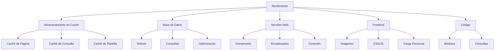

# Optimización del Rendimiento de XOOPS

Guía completa para optimizar XOOPS para máxima velocidad y eficiencia.

## Descripción General de Optimización del Rendimiento



## Configuración del Almacenamiento en Caché

El almacenamiento en caché es la forma más rápida de mejorar el rendimiento.

### Almacenamiento en Caché de Nivel de Página

Habilitar almacenamiento en caché de página completa en XOOPS:

**Panel de Administración > Sistema > Preferencias > Configuración de Caché**

```
Habilitar Almacenamiento en Caché: Sí
Tipo de Caché: Caché de Archivo (o APCu/Memcache)
Tiempo de Vida del Caché: 3600 segundos (1 hora)
Cachear Listas de Módulos: Sí
Cachear Configuración: Sí
Cachear Resultados de Búsqueda: Sí
```

### Almacenamiento en Caché Basado en Archivos

Configurar ubicación de caché de archivo:

```bash
# Crear directorio de caché fuera de la raíz web (más seguro)
mkdir -p /var/cache/xoops
chown www-data:www-data /var/cache/xoops
chmod 755 /var/cache/xoops

# Editar mainfile.php
define('XOOPS_CACHE_PATH', '/var/cache/xoops/');
```

### Almacenamiento en Caché de APCu

APCu proporciona almacenamiento en caché en memoria (muy rápido):

```bash
# Instalar APCu
apt-get install php-apcu

# Verificar instalación
php -m | grep apcu

# Configurar en php.ini
apc.enabled = 1
apc.memory_size = 128M
apc.ttl = 0
apc.user_ttl = 3600
apc.shm_size = 128
```

Habilitar en XOOPS:

**Panel de Administración > Sistema > Preferencias > Configuración de Caché**

```
Tipo de Caché: APCu
```

### Almacenamiento en Caché de Memcache/Redis

Almacenamiento en caché distribuido para sitios de alto tráfico:

**Instalar Memcache:**

```bash
# Instalar servidor Memcache
apt-get install memcached

# Iniciar servicio
systemctl start memcached
systemctl enable memcached

# Verificar funcionamiento
netstat -tlnp | grep memcached
# Debe mostrar escuchando en puerto 11211
```

**Configurar en XOOPS:**

Editar mainfile.php:

```php
// Configuración de Memcache
define('XOOPS_CACHE_TYPE', 'memcache');
define('XOOPS_CACHE_HOST', 'localhost');
define('XOOPS_CACHE_PORT', 11211);
define('XOOPS_CACHE_TIMEOUT', 0);
```

O en el panel de administración:

```
Tipo de Caché: Memcache
Host de Memcache: localhost:11211
```

### Almacenamiento en Caché de Plantilla

Compilar y almacenar en caché las plantillas de XOOPS:

```bash
# Asegurar que templates_c sea escribible
chmod 777 /var/www/html/xoops/templates_c/

# Limpiar plantillas cacheadas antiguas
rm -rf /var/www/html/xoops/templates_c/*
```

Configurar en tema:

```html
<!-- En theme xoops_version.php -->
{smarty.const.XOOPS_VAR_PATH|constant}
<{$xoops_meta}>

<!-- Las plantillas usan almacenamiento en caché -->
{cache}
    [Contenido cacheado aquí]
{/cache}
```

## Optimización de Base de Datos

### Añadir Índices de Base de Datos

Las bases de datos correctamente indexadas consultan mucho más rápido.

```sql
-- Verificar índices actuales
SHOW INDEXES FROM xoops_users;

-- Índices comunes a añadir
ALTER TABLE xoops_users ADD INDEX idx_uname (uname);
ALTER TABLE xoops_users ADD INDEX idx_email (email);
ALTER TABLE xoops_users ADD INDEX idx_uid_active (uid, user_actkey);

-- Añadir índices a tablas de publicaciones/contenido
ALTER TABLE xoops_posts ADD INDEX idx_post_published (post_published);
ALTER TABLE xoops_posts ADD INDEX idx_post_uid (post_uid);
ALTER TABLE xoops_posts ADD INDEX idx_post_created (post_created);

-- Verificar índices creados
SHOW INDEXES FROM xoops_users\G
```

### Optimizar Tablas

La optimización regular de tablas mejora el rendimiento:

```sql
-- Optimizar todas las tablas
OPTIMIZE TABLE xoops_users;
OPTIMIZE TABLE xoops_posts;
OPTIMIZE TABLE xoops_config;
OPTIMIZE TABLE xoops_comments;

-- O optimizar todo a la vez
REPAIR TABLE xoops_users;
OPTIMIZE TABLE xoops_users;
REPAIR TABLE xoops_posts;
OPTIMIZE TABLE xoops_posts;
```

Crear script de optimización automatizado:

```bash
#!/bin/bash
# Script de optimización de base de datos

echo "Optimizando base de datos de XOOPS..."

mysql -u xoops_user -p xoops_db << EOF
-- Optimizar todas las tablas
OPTIMIZE TABLE xoops_users;
OPTIMIZE TABLE xoops_posts;
OPTIMIZE TABLE xoops_config;
OPTIMIZE TABLE xoops_comments;
OPTIMIZE TABLE xoops_users_online;

-- Mostrar tamaño de base de datos
SELECT table_schema,
       ROUND(SUM(data_length + index_length) / 1024 / 1024, 2) as total_mb
FROM information_schema.tables
WHERE table_schema = 'xoops_db'
GROUP BY table_schema;
EOF

echo "¡Optimización de base de datos completada!"
```

Programar con cron:

```bash
# Optimización semanal
crontab -e
# Añadir: 0 3 * * 0 /usr/local/bin/optimize-xoops-db.sh
```

### Optimización de Consultas

Revisar consultas lentas:

```sql
-- Habilitar registro de consultas lentas
SET GLOBAL slow_query_log = 'ON';
SET GLOBAL long_query_time = 2;

-- Ver consultas lentas
SELECT * FROM mysql.slow_log;

-- O verificar archivo de registro lento
tail -100 /var/log/mysql/slow.log
```

Técnicas comunes de optimización:

```php
// LENTO - Evitar consultas innecesarias en bucles
foreach ($users as $user) {
    $profile = getUserProfile($user['uid']);  // ¡Consulta en bucle!
    echo $profile['name'];
}

// RÁPIDO - Obtener todos los datos a la vez
$profiles = getAllUserProfiles($user_ids);
foreach ($users as $user) {
    echo $profiles[$user['uid']]['name'];
}
```

### Aumentar Fondo de Búfer

Configurar MySQL para mejor caché:

Editar `/etc/mysql/mysql.conf.d/mysqld.cnf`:

```ini
# Fondo de Búfer de InnoDB (50-80% de RAM del sistema)
innodb_buffer_pool_size = 1G

# Caché de Consulta (opcional, puede deshabilitarse en MySQL 5.7+)
query_cache_size = 64M
query_cache_type = 1

# Max Conexiones
max_connections = 500

# Paquete Máximo Permitido
max_allowed_packet = 256M

# Tiempo de espera de conexión
connect_timeout = 10
```

Reiniciar MySQL:

```bash
systemctl restart mysql
```

## Optimización del Servidor Web

### Habilitar Compresión Gzip

Comprimir respuestas para reducir ancho de banda:

**Configuración de Apache:**

```apache
<IfModule mod_deflate.c>
    AddOutputFilterByType DEFLATE text/html text/plain text/xml text/css text/javascript application/javascript application/json

    # No comprimir imágenes y archivos ya comprimidos
    SetEnvIfNoCase Request_URI \.(jpg|jpeg|png|gif|zip|gzip)$ no-gzip dont-vary

    # Registrar respuestas comprimidas
    DeflateBufferSize 8096
</IfModule>
```

**Configuración de Nginx:**

```nginx
gzip on;
gzip_types text/html text/plain text/css text/javascript application/javascript application/json;
gzip_min_length 1000;
gzip_vary on;
gzip_comp_level 6;

# No comprimir formatos ya comprimidos
gzip_disable "msie6";
```

Verificar compresión:

```bash
# Verificar si la respuesta está comprimida con gzip
curl -I -H "Accept-Encoding: gzip" http://your-domain.com/xoops/

# Debe mostrar:
# Content-Encoding: gzip
```

### Encabezados de Caché del Navegador

Establecer expiración de caché para activos estáticos:

**Apache:**

```apache
<IfModule mod_expires.c>
    ExpiresActive On

    # Cachear imágenes por 30 días
    ExpiresByType image/jpeg "access plus 30 days"
    ExpiresByType image/gif "access plus 30 days"
    ExpiresByType image/png "access plus 30 days"
    ExpiresByType image/svg+xml "access plus 30 days"

    # Cachear CSS/JS por 30 días
    ExpiresByType text/css "access plus 30 days"
    ExpiresByType application/javascript "access plus 30 days"
    ExpiresByType text/javascript "access plus 30 days"

    # Cachear fuentes por 1 año
    ExpiresByType font/eot "access plus 1 year"
    ExpiresByType font/ttf "access plus 1 year"
    ExpiresByType font/woff "access plus 1 year"
    ExpiresByType font/woff2 "access plus 1 year"

    # No cachear HTML
    ExpiresByType text/html "access plus 1 hour"
</IfModule>
```

**Nginx:**

```nginx
location ~* \.(jpg|jpeg|png|gif|ico|svg|woff|woff2|ttf|eot)$ {
    expires 30d;
    add_header Cache-Control "public, immutable";
}

location ~* \.(css|js)$ {
    expires 30d;
    add_header Cache-Control "public";
}

location ~ \.html$ {
    expires 1h;
    add_header Cache-Control "public";
}
```

### Activar Mantenimiento de Conexión (Keep-Alive)

Habilitar conexiones HTTP persistentes:

**Apache:**

```apache
<IfModule mod_http.c>
    KeepAlive On
    KeepAliveTimeout 15
    MaxKeepAliveRequests 100
</IfModule>
```

**Nginx:**

```nginx
keepalive_timeout 15s;
keepalive_requests 100;
```

## Optimización de Frontend

### Optimizar Imágenes

Reducir tamaños de archivos de imagen:

```bash
# Comprimir imágenes JPEG en lote
for img in *.jpg; do
    convert "$img" -quality 85 "optimized_$img"
done

# Comprimir imágenes PNG en lote
for img in *.png; do
    optipng -o2 "$img"
done

# O usar herramienta imagemin CLI
npm install -g imagemin-cli
imagemin images/ --out-dir=images-optimized
```

### Minificar CSS y JavaScript

Reducir tamaños de archivo CSS/JS:

**Usando herramientas Node.js:**

```bash
# Instalar minificadores
npm install -g uglify-js clean-css-cli

# Minificar JavaScript
uglifyjs script.js -o script.min.js

# Minificar CSS
cleancss style.css -o style.min.css
```

**Usando herramientas en línea:**
- CSS Minifier: https://cssminifier.com/
- JavaScript Minifier: https://www.minifycode.com/javascript-minifier/

### Carga Perezosa de Imágenes

Cargar imágenes solo cuando sea necesario:

```html
<!-- Añadir atributo loading="lazy" -->


<!-- O usar librería JavaScript para navegadores antiguos -->


<script src="https://cdnjs.cloudflare.com/ajax/libs/vanilla-lazyload/17.1.2/lazyload.min.js"></script>
<script>
    var lazyLoad = new LazyLoad({
        elements_selector: ".lazy"
    });
</script>
```

### Reducir Recursos que Bloquean el Renderizado

Cargar CSS/JS estratégicamente:

```html
<!-- Cargar CSS crítico en línea -->
<style>
    /* Estilos críticos para contenido visible */
</style>

<!-- Diferir CSS no crítico -->
<link rel="stylesheet" href="style.css" media="print" onload="this.media='all'">

<!-- Diferir JavaScript -->
<script src="script.js" defer></script>

<!-- O usar async para scripts no críticos -->
<script src="analytics.js" async></script>
```

## Integración de CDN

Usar una Red de Entrega de Contenidos para acceso más rápido globalmente.

### CDNs Populares

| CDN | Costo | Características |
|---|---|---|
| Cloudflare | Gratuito/Pago | DDoS, DNS, Caché, Análisis |
| AWS CloudFront | Pago | Alto rendimiento, global |
| Bunny CDN | Asequible | Almacenamiento, video, caché |
| jsDelivr | Gratuito | Librerías JavaScript |
| cdnjs | Gratuito | Librerías populares |

### Configuración de Cloudflare

1. Registrarse en https://www.cloudflare.com/
2. Añadir su dominio
3. Actualizar servidores de nombres con los de Cloudflare
4. Habilitar opciones de caché:
   - Nivel de Caché: Agresivo
   - Cachear en todo: Activado
   - TTL de Caché del Navegador: 1 mes

5. En XOOPS, actualizar su dominio para usar DNS de Cloudflare

### Configurar CDN en XOOPS

Actualizar URLs de imagen a CDN:

Editar plantilla de tema:

```html
<!-- Original -->


<!-- Con CDN -->

```

O establecer en PHP:

```php
// En mainfile.php o config
define('XOOPS_CDN_URL', 'https://cdn.your-domain.com');

// En plantilla

```

## Monitoreo del Rendimiento

### Prueba de PageSpeed Insights

Probar rendimiento del sitio:

1. Visitar Google PageSpeed Insights: https://pagespeed.web.dev/
2. Ingresar su URL de XOOPS
3. Revisar recomendaciones
4. Implementar mejoras sugeridas

### Monitoreo de Rendimiento del Servidor

Supervisar métricas del servidor en tiempo real:

```bash
# Instalar herramientas de monitoreo
apt-get install htop iotop nethogs

# Supervisar CPU y memoria
htop

# Supervisar I/O de disco
iotop

# Supervisar red
nethogs
```

### Perfilado de Rendimiento de PHP

Identificar código PHP lento:

```php
<?php
// Usar Xdebug para perfilar
xdebug_start_trace('profile');

// Su código aquí
$result = someExpensiveFunction();

xdebug_stop_trace();
?>
```

### Monitoreo de Consultas MySQL

Rastrear consultas lentas:

```bash
# Habilitar registro de consultas
mysql -u root -p

SET GLOBAL general_log = 'ON';
SET GLOBAL log_output = 'FILE';
SET GLOBAL general_log_file = '/var/log/mysql/query.log';

# Revisar consultas lentas
tail -f /var/log/mysql/slow.log

# Analizar consulta con EXPLAIN
EXPLAIN SELECT * FROM xoops_users WHERE uid = 1\G
```

## Lista de Verificación de Optimización del Rendimiento

Implementar estos para obtener el mejor rendimiento:

- [ ] **Almacenamiento en Caché:** Habilitar almacenamiento en caché de archivo/APCu/Memcache
- [ ] **Base de Datos:** Añadir índices, optimizar tablas
- [ ] **Compresión:** Habilitar compresión Gzip
- [ ] **Caché del Navegador:** Establecer encabezados de caché
- [ ] **Imágenes:** Optimizar y comprimir
- [ ] **CSS/JS:** Minificar archivos
- [ ] **Carga Perezosa:** Implementar para imágenes
- [ ] **CDN:** Usar para activos estáticos
- [ ] **Keep-Alive:** Habilitar conexiones persistentes
- [ ] **Módulos:** Desactivar módulos no utilizados
- [ ] **Temas:** Usar temas ligeros y optimizados
- [ ] **Monitoreo:** Rastrear métricas de rendimiento
- [ ] **Mantenimiento Regular:** Limpiar caché, optimizar BD

## Script de Optimización del Rendimiento

Optimización automatizada:

```bash
#!/bin/bash
# Script de optimización del rendimiento

echo "=== Optimización del Rendimiento de XOOPS ==="

# Limpiar caché
echo "Limpiando caché..."
rm -rf /var/www/html/xoops/cache/*
rm -rf /var/www/html/xoops/templates_c/*

# Optimizar base de datos
echo "Optimizando base de datos..."
mysql -u xoops_user -p xoops_db << EOF
OPTIMIZE TABLE xoops_users;
OPTIMIZE TABLE xoops_posts;
OPTIMIZE TABLE xoops_config;
OPTIMIZE TABLE xoops_comments;
EOF

# Verificar permisos de archivo
echo "Verificando permisos de archivo..."
find /var/www/html/xoops -type f -exec chmod 644 {} \;
find /var/www/html/xoops -type d -exec chmod 755 {} \;
chmod 777 /var/www/html/xoops/cache
chmod 777 /var/www/html/xoops/templates_c
chmod 777 /var/www/html/xoops/uploads
chmod 777 /var/www/html/xoops/var

# Generar informe de rendimiento
echo "¡Optimización del Rendimiento Completada!"
echo ""
echo "Próximos pasos:"
echo "1. Probar sitio en https://pagespeed.web.dev/"
echo "2. Supervisar rendimiento en panel de administración"
echo "3. Considerar CDN para activos estáticos"
echo "4. Revisar consultas lentas en MySQL"
```

## Métricas Antes y Después

Rastrear mejoras:

```
Antes de Optimización:
- Tiempo de Carga de Página: 3.5 segundos
- Consultas de Base de Datos: 45
- Tasa de Acierto de Caché: 0%
- Tamaño de Base de Datos: 250MB

Después de Optimización:
- Tiempo de Carga de Página: 0.8 segundos (77% más rápido)
- Consultas de Base de Datos: 8 (en caché)
- Tasa de Acierto de Caché: 85%
- Tamaño de Base de Datos: 120MB (optimizado)
```

## Próximos Pasos

1. Revisar configuración básica
2. Asegurar medidas de seguridad
3. Implementar almacenamiento en caché
4. Supervisar rendimiento con herramientas
5. Ajustar basándose en métricas

---

**Etiquetas:** #performance #optimization #caching #database #cdn

**Artículos Relacionados:**
- ../../06-Publisher-Module/User-Guide/Basic-Configuration
- System-Settings
- Security-Configuration
- ../Installation/Server-Requirements
