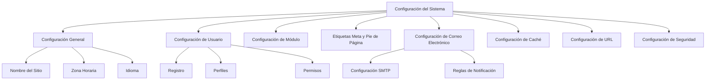

# Configuración del Sistema de XOOPS

Esta guía cubre la configuración completa del sistema disponible en el panel de administración de XOOPS, organizada por categoría.

## Arquitectura de Configuración del Sistema



## Acceder a la Configuración del Sistema

### Ubicación

**Panel de Administración > Sistema > Preferencias**

O navegar directamente:

```
http://your-domain.com/xoops/admin/index.php?fct=preferences
```

### Requisitos de Permiso

- Solo administradores (webmasters) pueden acceder a la configuración del sistema
- Los cambios afectan todo el sitio
- La mayoría de cambios toman efecto inmediatamente

## Configuración General

La configuración fundamental para su instalación de XOOPS.

### Información Básica

```
Nombre del Sitio: [Nombre de Su Sitio]
Descripción Predeterminada: [Breve descripción de su sitio]
Eslogan del Sitio: [Eslogan pegadizo]
Correo Electrónico del Administrador: admin@your-domain.com
Nombre del Webmaster: Nombre del Administrador
Correo Electrónico del Webmaster: admin@your-domain.com
```

### Configuración de Apariencia

```
Tema Predeterminado: [Seleccionar tema]
Idioma Predeterminado: Español (o idioma preferido)
Elementos Por Página: 15 (típicamente 10-25)
Palabras en Resumen: 25 (para resultados de búsqueda)
Permiso de Carga de Tema: Deshabilitado (seguridad)
```

### Configuración Regional

```
Zona Horaria Predeterminada: [Su zona horaria]
Formato de Fecha: %Y-%m-%d (formato AAAA-MM-DD)
Formato de Hora: %H:%M:%S (formato HH:MM:SS)
Horario de Verano: [Auto/Manual/Ninguno]
```

**Tabla de Formato de Zona Horaria:**

| Región | Zona Horaria | Desplazamiento UTC |
|---|---|---|
| US Este | America/New_York | -5 / -4 |
| US Centro | America/Chicago | -6 / -5 |
| US Montaña | America/Denver | -7 / -6 |
| US Pacífico | America/Los_Angeles | -8 / -7 |
| UK/Londres | Europe/London | 0 / +1 |
| Francia/Alemania | Europe/Paris | +1 / +2 |
| Japón | Asia/Tokyo | +9 |
| China | Asia/Shanghai | +8 |
| Australia/Sídney | Australia/Sydney | +10 / +11 |

### Configuración de Búsqueda

```
Habilitar Búsqueda: Sí
Buscar en Páginas de Administración: Sí/No
Buscar en Archivos: Sí
Tipo de Búsqueda Predeterminado: Todo / Solo páginas
Palabras Excluidas de Búsqueda: [Lista separada por comas]
```

**Palabras comúnmente excluidas:** the, a, an, and, or, but, in, on, at, by, to, from

## Configuración de Usuario

Controlar el comportamiento de la cuenta de usuario y el proceso de registro.

### Registro de Usuario

```
Permitir Registro de Usuario: Sí/No
Tipo de Registro:
  ☐ Auto-activar (Acceso instantáneo)
  ☐ Aprobación del administrador (Administrador debe aprobar)
  ☐ Verificación de correo electrónico (Usuario debe verificar correo)

Notificación a Usuarios: Sí/No
Verificación de Correo Electrónico de Usuario: Requerida/Opcional
```

### Configuración de Nuevo Usuario

```
Auto-login de Nuevos Usuarios: Sí/No
Asignar Grupo de Usuario Predeterminado: Sí
Grupo de Usuario Predeterminado: [Seleccionar grupo]
Crear Avatar de Usuario: Sí/No
Avatar de Usuario Inicial: [Seleccionar predeterminado]
```

### Configuración de Perfil de Usuario

```
Permitir Perfiles de Usuario: Sí
Mostrar Lista de Miembros: Sí
Mostrar Estadísticas de Usuario: Sí
Mostrar Hora de Última Conexión: Sí
Permitir Avatar de Usuario: Sí
Tamaño Máximo de Archivo de Avatar: 100KB
Dimensiones del Avatar: 100x100 píxeles
```

### Configuración de Correo Electrónico de Usuario

```
Permitir a Usuarios Ocultar Correo Electrónico: Sí
Mostrar Correo Electrónico en Perfil: Sí
Intervalo de Correo Electrónico de Notificación: Inmediatamente/Diariamente/Semanalmente/Nunca
```

### Seguimiento de Actividad de Usuario

```
Rastrear Actividad de Usuario: Sí
Registrar Inicios de Sesión de Usuario: Sí
Registrar Inicios de Sesión Fallidos: Sí
Rastrear Dirección IP: Sí
Limpiar Registros de Actividad Más Antiguos Que: 90 días
```

### Límites de Cuenta

```
Permitir Correo Electrónico Duplicado: No
Longitud Mínima de Nombre de Usuario: 3 caracteres
Longitud Máxima de Nombre de Usuario: 15 caracteres
Longitud Mínima de Contraseña: 6 caracteres
Requerir Caracteres Especiales: Sí
Requerir Números: Sí
Expiración de Contraseña: 90 días (o Nunca)
Cuentas Inactivas Días para Eliminar: 365 días
```

## Configuración de Módulo

Configurar el comportamiento de módulos individuales.

### Opciones Comunes del Módulo

Para cada módulo instalado, puede configurar:

```
Estado del Módulo: Activo/Inactivo
Mostrar en Menú: Sí/No
Peso del Módulo: [1-999] (más alto = más bajo en visualización)
Página de Inicio Predeterminada: Este módulo se muestra al visitar /
Acceso de Administración: [Grupos de usuario permitidos]
Acceso de Usuario: [Grupos de usuario permitidos]
```

### Configuración de Módulo del Sistema

```
Mostrar Página de Inicio Como: Portal / Módulo / Página Estática
Módulo Predeterminado de Página de Inicio: [Seleccionar módulo]
Mostrar Menú de Pie de Página: Sí
Color del Pie de Página: [Selector de color]
Mostrar Estadísticas del Sistema: Sí
Mostrar Uso de Memoria: Sí
```

### Configuración por Módulo

Cada módulo puede tener configuración específica del módulo:

**Ejemplo - Módulo de Página:**
```
Habilitar Comentarios: Sí/No
Moderar Comentarios: Sí/No
Comentarios Por Página: 10
Habilitar Calificaciones: Sí
Permitir Calificaciones Anónimas: Sí
```

**Ejemplo - Módulo de Usuario:**
```
Carpeta de Carga de Avatar: ./uploads/
Tamaño Máximo de Carga: 100KB
Permitir Carga de Archivo: Sí
Tipos de Archivo Permitidos: jpg, gif, png
```

Acceder a configuración específica del módulo:
- **Admin > Módulos > [Nombre del Módulo] > Preferencias**

## Etiquetas Meta y Configuración SEO

Configurar etiquetas meta para optimización de motor de búsqueda.

### Etiquetas Meta Globales

```
Palabras Clave Meta: xoops, cms, sistema de gestión de contenido
Descripción Meta: Un potente sistema de gestión de contenido para construir sitios web dinámicos
Autor Meta: Su Nombre
Copyright Meta: Copyright 2025, Su Empresa
Robots Meta: index, follow
Revisita Meta: 30 días
```

### Mejores Prácticas de Etiquetas Meta

| Etiqueta | Propósito | Recomendación |
|---|---|---|
| Palabras Clave | Términos de búsqueda | 5-10 palabras clave relevantes, separadas por comas |
| Descripción | Listado de búsqueda | 150-160 caracteres |
| Autor | Creador de página | Su nombre o empresa |
| Copyright | Legal | Su aviso de copyright |
| Robots | Instrucciones del rastreador | index, follow (permitir indexación) |

### Configuración del Pie de Página

```
Mostrar Pie de Página: Sí
Color del Pie de Página: Oscuro/Claro
Fondo del Pie de Página: [Código de color]
Texto del Pie de Página: [HTML permitido]
Enlaces Adicionales del Pie de Página: [Pares de URL y texto]
```

**HTML de Pie de Página Ejemplo:**
```html
<p>Copyright &copy; 2025 Su Empresa. Todos los derechos reservados.</p>
<p><a href="/privacy">Política de Privacidad</a> | <a href="/terms">Términos de Uso</a></p>
```

### Etiquetas Meta Sociales (Open Graph)

```
Habilitar Open Graph: Sí
ID de Aplicación de Facebook: [ID de Aplicación]
Tipo de Tarjeta de Twitter: summary / summary_large_image / player
Imagen de Compartir Predeterminada: [URL de Imagen]
```

## Configuración de Correo Electrónico

Configurar entrega de correo electrónico y sistema de notificación.

### Método de Entrega de Correo Electrónico

```
Usar SMTP: Sí/No

Si SMTP:
  Host SMTP: smtp.gmail.com
  Puerto SMTP: 587 (TLS) o 465 (SSL)
  Seguridad SMTP: TLS / SSL / Ninguna
  Nombre de Usuario SMTP: [email@example.com]
  Contraseña SMTP: [contraseña]
  Autenticación SMTP: Sí/No
  Tiempo de Espera SMTP: 10 segundos

Si correo() de PHP:
  Ruta de Sendmail: /usr/sbin/sendmail -t -i
```

### Configuración de Correo Electrónico

```
Dirección De: noreply@your-domain.com
Nombre De: Nombre de Su Sitio
Dirección de Respuesta: support@your-domain.com
CCO de Correos Electrónicos de Administración: Sí/No
```

### Configuración de Notificación

```
Enviar Correo Electrónico de Bienvenida: Sí/No
Asunto de Correo Electrónico de Bienvenida: Bienvenido a [Nombre del Sitio]
Cuerpo de Correo Electrónico de Bienvenida: [Mensaje personalizado]

Enviar Correo Electrónico de Restablecimiento de Contraseña: Sí/No
Incluir Contraseña Aleatoria: Sí/No
Expiración del Token: 24 horas
```

### Notificaciones de Administración

```
Notificar Administrador al Registro: Sí
Notificar Administrador al Comentario: Sí
Notificar Administrador al Envío: Sí
Notificar Administrador al Error: Sí
```

### Notificaciones de Usuario

```
Notificar Usuario al Registro: Sí
Notificar Usuario al Comentario: Sí
Notificar Usuario en Mensaje Privado: Sí
Permitir a Usuarios Desactivar Notificaciones: Sí
Frecuencia de Notificación Predeterminada: Inmediatamente
```

### Plantillas de Correo Electrónico

Personalizar correos electrónicos de notificación en panel de administración:

**Ruta:** Sistema > Plantillas de Correo Electrónico

Plantillas disponibles:
- Registro de Usuario
- Restablecimiento de Contraseña
- Notificación de Comentario
- Mensaje Privado
- Alertas del Sistema
- Correos electrónicos específicos del módulo

## Configuración de Caché

Optimizar rendimiento a través del almacenamiento en caché.

### Configuración de Caché

```
Habilitar Almacenamiento en Caché: Sí/No
Tipo de Caché:
  ☐ Caché de Archivo
  ☐ APCu (Caché Alternative de PHP)
  ☐ Memcache (Almacenamiento en caché distribuido)
  ☐ Redis (Almacenamiento en caché avanzado)

Tiempo de Vida del Caché: 3600 segundos (1 hora)
```

### Opciones de Caché por Tipo

**Caché de Archivo:**
```
Directorio de Caché: /var/www/html/xoops/cache/
Limpiar Intervalo: Diariamente
Máximo de Archivos de Caché: 1000
```

**Caché de APCu:**
```
Asignación de Memoria: 128MB
Nivel de Fragmentación: Bajo
```

**Memcache/Redis:**
```
Host del Servidor: localhost
Puerto del Servidor: 11211 (Memcache) / 6379 (Redis)
Conexión Persistente: Sí
```

### Qué Se Cachea

```
Cachear Listas de Módulos: Sí
Cachear Datos de Configuración: Sí
Cachear Datos de Plantilla: Sí
Cachear Datos de Sesión de Usuario: Sí
Cachear Resultados de Búsqueda: Sí
Cachear Consultas de Base de Datos: Sí
Cachear Fuentes RSS: Sí
Cachear Imágenes: Sí
```

## Configuración de URL

Configurar reescritura de URL y formato.

### Configuración de URL Amigable

```
Habilitar URLs Amigables: Sí/No
Tipo de URL Amigable:
  ☐ Información de Ruta: /page/about
  ☐ Cadena de Consulta: /index.php?p=about

Barra Diagonal Trailing: Incluir / Omitir
Caso de URL: Minúsculas / Sensible a mayúsculas
```

### Reglas de Reescritura de URL

```
Reglas de .htaccess: [Mostrar actual]
Reglas de Nginx: [Mostrar actual si Nginx]
Reglas de IIS: [Mostrar actual si IIS]
```

## Configuración de Seguridad

Controlar configuración relacionada con seguridad.

### Seguridad de Contraseña

```
Política de Contraseña:
  ☐ Requerir letras mayúsculas
  ☐ Requerir letras minúsculas
  ☐ Requerir números
  ☐ Requerir caracteres especiales

Longitud Mínima de Contraseña: 8 caracteres
Expiración de Contraseña: 90 días
Historial de Contraseña: Recordar últimas 5 contraseñas
Forzar Cambio de Contraseña: En próximo inicio de sesión
```

### Seguridad de Inicio de Sesión

```
Bloquear Cuenta Después de Intentos Fallidos: 5 intentos
Duración del Bloqueo: 15 minutos
Registrar Todos los Intentos de Inicio de Sesión: Sí
Registrar Inicios de Sesión Fallidos: Sí
Alerta de Inicio de Sesión de Administración: Enviar correo al inicio de sesión de admin
Autenticación de Dos Factores: Deshabilitada/Habilitada
```

### Seguridad de Carga de Archivo

```
Permitir Carga de Archivo: Sí/No
Tamaño Máximo de Archivo: 128MB
Tipos de Archivo Permitidos: jpg, gif, png, pdf, zip, doc, docx
Escanear Cargas por Malware: Sí (si está disponible)
Poner en Cuarentena Archivos Sospechosos: Sí
```

### Seguridad de Sesión

```
Gestión de Sesión: Base de Datos/Archivos
Tiempo de Espera de Sesión: 1800 segundos (30 min)
Tiempo de Vida de Cookie de Sesión: 0 (hasta cerrar navegador)
Cookie Segura: Sí (solo HTTPS)
Cookie Solo HTTP: Sí (prevenir acceso JavaScript)
```

### Configuración de CORS

```
Permitir Solicitudes de Origen Cruzado: No
Orígenes Permitidos: [Lista de dominios]
Permitir Credenciales: No
Métodos Permitidos: GET, POST
```

## Configuración Avanzada

Opciones de configuración adicionales para usuarios avanzados.

### Modo de Depuración

```
Modo de Depuración: Deshabilitado/Habilitado
Nivel de Registro: Error / Advertencia / Información / Depuración
Archivo de Registro de Depuración: /var/log/xoops_debug.log
Mostrar Errores: Deshabilitado (producción)
```

### Ajuste del Rendimiento

```
Optimizar Consultas de Base de Datos: Sí
Usar Caché de Consulta: Sí
Comprimir Salida: Sí
Minificar CSS/JavaScript: Sí
Carga Perezosa de Imágenes: Sí
```

### Configuración de Contenido

```
Permitir HTML en Publicaciones: Sí/No
Etiquetas HTML Permitidas: [Configurar]
Eliminar Código Dañino: Sí
Permitir Embed: Sí/No
Moderación de Contenido: Automática/Manual
Detección de Spam: Sí
```

## Exportación/Importación de Configuración

### Copia de Seguridad de Configuración

Exportar configuración actual:

**Panel de Administración > Sistema > Herramientas > Exportar Configuración**

```bash
# Configuración exportada como archivo JSON
# Descargar y almacenar de forma segura
```

### Restaurar Configuración

Importar configuración exportada anteriormente:

**Panel de Administración > Sistema > Herramientas > Importar Configuración**

```bash
# Subir archivo JSON
# Verificar cambios antes de confirmar
```

## Jerarquía de Configuración

Jerarquía de configuración de XOOPS (de arriba a abajo - primer coincidencia gana):

```
1. mainfile.php (Constantes)
2. Configuración específica del módulo
3. Configuración de Sistema de Administración
4. Configuración del tema
5. Preferencias de usuario (para configuración específica del usuario)
```

## Script de Copia de Seguridad de Configuración

Crear copia de seguridad de configuración actual:

```php
<?php
// Script de copia de seguridad: /var/www/html/xoops/backup-settings.php
require_once __DIR__ . '/mainfile.php';

$config_handler = xoops_getHandler('config');
$configs = $config_handler->getConfigs();

$backup = [
    'exported_date' => date('Y-m-d H:i:s'),
    'xoops_version' => XOOPS_VERSION,
    'php_version' => PHP_VERSION,
    'settings' => []
];

foreach ($configs as $config) {
    $backup['settings'][$config->getVar('conf_name')] = [
        'value' => $config->getVar('conf_value'),
        'description' => $config->getVar('conf_desc'),
        'type' => $config->getVar('conf_type'),
    ];
}

// Guardar en archivo JSON
file_put_contents(
    '/backups/xoops_settings_' . date('YmdHis') . '.json',
    json_encode($backup, JSON_PRETTY_PRINT)
);

echo "¡Configuración respaldada correctamente!";
?>
```

## Cambios Comunes de Configuración

### Cambiar Nombre del Sitio

1. Admin > Sistema > Preferencias > Configuración General
2. Modificar "Nombre del Sitio"
3. Hacer clic en "Guardar"

### Habilitar/Deshabilitar Registro

1. Admin > Sistema > Preferencias > Configuración de Usuario
2. Alternar "Permitir Registro de Usuario"
3. Elegir tipo de registro
4. Hacer clic en "Guardar"

### Cambiar Tema Predeterminado

1. Admin > Sistema > Preferencias > Configuración General
2. Seleccionar "Tema Predeterminado"
3. Hacer clic en "Guardar"
4. Limpiar caché para que los cambios tomen efecto

### Actualizar Correo Electrónico de Contacto

1. Admin > Sistema > Preferencias > Configuración General
2. Modificar "Correo Electrónico del Administrador"
3. Modificar "Correo Electrónico del Webmaster"
4. Hacer clic en "Guardar"

## Lista de Verificación de Verificación

Después de configurar la configuración del sistema, verificar:

- [ ] El nombre del sitio se muestra correctamente
- [ ] La zona horaria muestra la hora correcta
- [ ] Las notificaciones de correo electrónico se envían correctamente
- [ ] El registro de usuario funciona según lo configurado
- [ ] La página de inicio muestra el valor predeterminado seleccionado
- [ ] La funcionalidad de búsqueda funciona
- [ ] El caché mejora el tiempo de carga de página
- [ ] Las URLs amigables funcionan (si están habilitadas)
- [ ] Las etiquetas meta aparecen en la fuente de página
- [ ] Se reciben notificaciones de administración
- [ ] Se aplican configuraciones de seguridad

## Solucionar Problemas de Configuración

### La Configuración No Se Guarda

**Solución:**
```bash
# Verificar permisos de archivo en directorio de configuración
chmod 755 /var/www/html/xoops/var/

# Verificar que la base de datos sea escribible
# Intentar guardar nuevamente en panel de administración
```

### Los Cambios No Toman Efecto

**Solución:**
```bash
# Limpiar caché
rm -rf /var/www/html/xoops/cache/*
rm -rf /var/www/html/xoops/templates_c/*

# Si aún no funciona, reiniciar servidor web
systemctl restart apache2
```

### El Correo Electrónico No Se Envía

**Solución:**
1. Verificar credenciales SMTP en configuración de correo electrónico
2. Probar con botón "Enviar Correo Electrónico de Prueba"
3. Verificar registros de error
4. Intentar usar correo() de PHP en lugar de SMTP

## Próximos Pasos

Después de configurar la configuración del sistema:

1. Configurar ajustes de seguridad
2. Optimizar rendimiento
3. Explorar características del panel de administración
4. Configurar gestión de usuarios

---

**Etiquetas:** #system-settings #configuration #preferences #admin-panel

**Artículos Relacionados:**
- ../../06-Publisher-Module/User-Guide/Basic-Configuration
- Security-Configuration
- Performance-Optimization
- ../First-Steps/Admin-Panel-Overview
