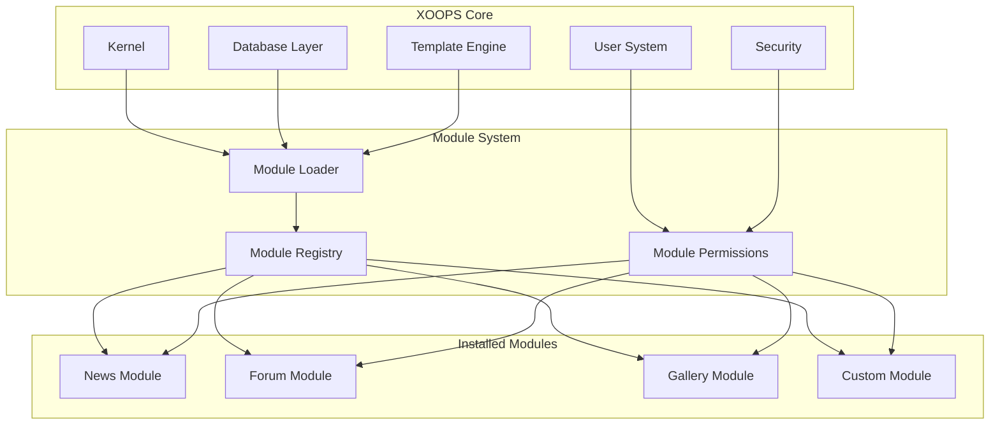
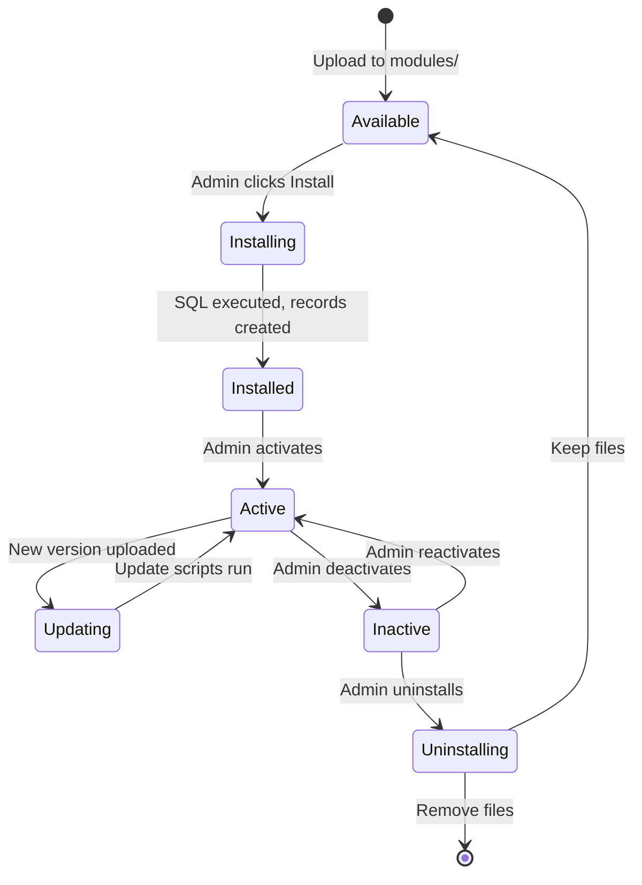

# ADR-001: Arquitectura Modular

> Registro de Decisión Arquitectónica para la filosofía de diseño modular central de XOOPS.

---

## Estado

**Aceptado** - Decisión fundamental desde el inicio de XOOPS

---

## Contexto

XOOPS (Sistema de Portal Orientado a Objetos Extensible) necesitaba una arquitectura que:

1. Permita a desarrolladores de terceros extender la funcionalidad
2. Capacite a los administradores del sitio para personalizar sin codificar
3. Apoye el desarrollo e actualización independientes
4. Proporcione aislamiento entre diferentes características
5. Escale desde blogs simples a portales complejos

El panorama de CMS de principios de los años 2000 ofrecía sistemas monolíticos que eran difíciles de personalizar y extender.

---

## Decision Diagram



---

## Decisión

Implementaremos una **arquitectura modular** donde:

### 1. El Core Proporciona Infraestructura
- Abstracción de base de datos
- Autenticación y permisos de usuario
- Renderizado de plantillas (Smarty)
- Utilidades de seguridad
- Generación de formularios
- Utilidades comunes

### 2. Los Módulos Son Independientes
Cada módulo:
- Tiene su propia estructura de directorios
- Contiene sus propias clases, plantillas, SQL
- Define su propia configuración
- Puede ser instalado/desinstalado independientemente
- Tiene seguimiento de versiones

### 3. Estructura Estándar de Módulo
```
modules/modulename/
├── admin/                  # Admin interface
│   ├── index.php
│   └── menu.php
├── class/                  # PHP classes
├── include/                # Include files
├── language/               # Translations
├── sql/                    # Database schema
├── templates/              # Smarty templates
├── blocks/                 # Block definitions
├── xoops_version.php       # Module manifest
├── index.php               # Entry point
└── header.php              # Module bootstrap
```

### 4. Manifiesto de Módulo (xoops_version.php)
```php
<?php
$modversion['name']        = 'Module Name';
$modversion['version']     = '1.0.0';
$modversion['description'] = 'Module description';
$modversion['dirname']     = basename(__DIR__);
$modversion['hasMain']     = 1;
$modversion['hasAdmin']    = 1;
$modversion['sqlfile']['mysql'] = 'sql/mysql.sql';
$modversion['tables']      = ['modulename_table1'];
$modversion['templates']   = [...];
$modversion['config']      = [...];
$modversion['blocks']      = [...];
```

### 5. Comunicación de Módulos
- A través de APIs del core (handlers, events)
- Relaciones de base de datos
- Hooks de precarga
- Servicios compartidos

---

## Ciclo de Vida del Módulo



---

## Consecuencias

### Positivas

1. **Extensibilidad**: Miles de módulos creados por la comunidad
2. **Independencia**: Los módulos se pueden desarrollar por separado
3. **Flexibilidad**: Los sitios pueden mezclar y combinar funciones
4. **Mantenibilidad**: Las actualizaciones no afectan otros módulos
5. **Mercado**: Surgió un ecosistema de módulos
6. **Curva de aprendizaje**: Los desarrolladores aprenden un patrón

### Negativas

1. **Sobrecarga**: Cada módulo tiene un costo de inicialización
2. **Duplicación**: El código común puede repetirse
3. **Integración**: Las características entre módulos necesitan un diseño cuidadoso
4. **Versionado**: Se necesita gestión de compatibilidad de módulos
5. **Variación de calidad**: La calidad de módulos de terceros varía

### Neutrales

1. **Base de datos**: Cada módulo gestiona sus propias tablas
2. **Plantillas**: El tema debe adaptarse a varios módulos
3. **Actualizaciones**: El core y los módulos se actualizan independientemente

---

## Alternativas Consideradas

### 1. Arquitectura Monolítica
**Rechazada** - Demasiado rígida, difícil de personalizar

### 2. Arquitectura de Plugins (estilo WordPress)
**Parcialmente adoptada** - Los bloques y precargas proporcionan hooks similares a plugins dentro de módulos

### 3. Arquitectura de Componentes (estilo Joomla)
**Rechazada** - Más compleja, menos amigable para desarrolladores

### 4. Microservicios
**No aplicable** - Demasiado complejo para la era del alojamiento compartido

---

## Decisiones Relacionadas

- ADR-002: Acceso a Base de Datos Orientado a Objetos
- ADR-003: Motor de Plantillas Smarty
- ADR-005: Sistema de Permisos

---

## Referencias

- Historial del Proyecto XOOPS
- Patrones de Arquitectura de Aplicaciones PHP
- Estudios de Comparación de CMS (2001-2005)

---

#xoops #architecture #adr #modules #design-decision
