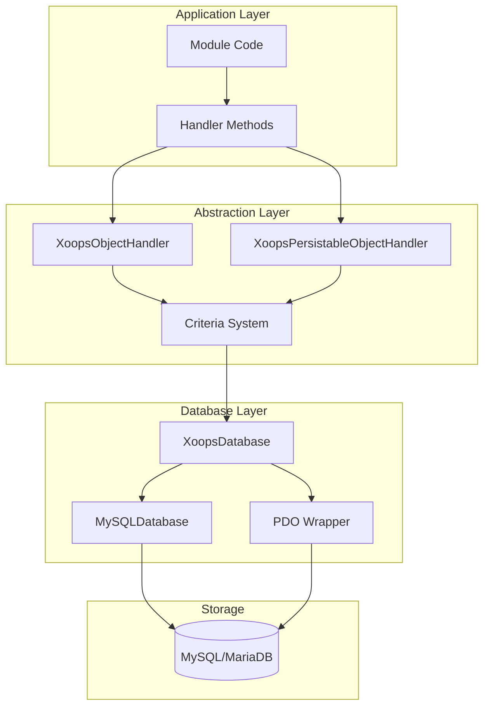
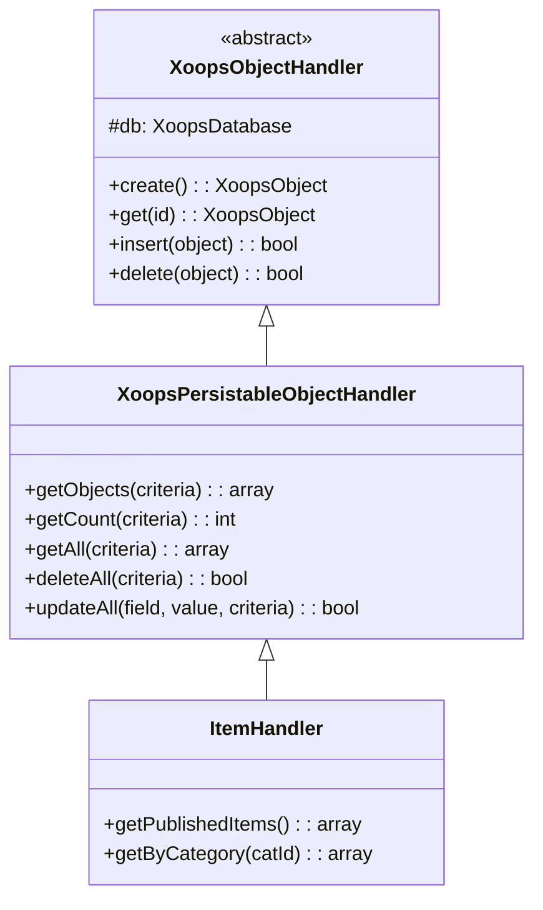
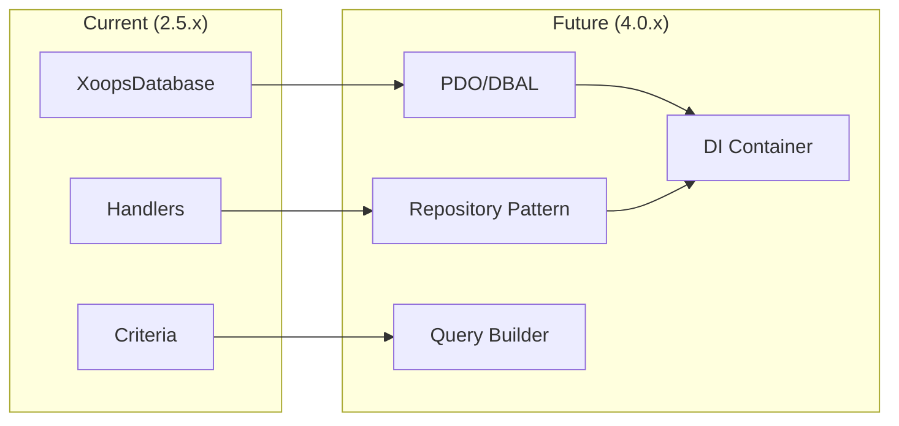

# ADR-002: Abstracción de Base de Datos

> Registro de Decisión Arquitectónica para el patrón de acceso a base de datos orientado a objetos de XOOPS.

---

## Estado

**Aceptado** - Patrón central desde XOOPS 2.0

---

## Contexto

XOOPS necesitaba una estrategia de interacción de base de datos que:

1. Abstraiga la sintaxis SQL específica de la base de datos
2. Proporcione operaciones CRUD consistentes en todos los módulos
3. Permita la desinfección y escape automático de datos
4. Apoye futuros cambios de motor de base de datos
5. Simplifique las operaciones comunes para los desarrolladores

Las alternativas eran:
- SQL sin procesar en todo el código
- ORM completo (Doctrine, Eloquent)
- Abstracción personalizada ligera

---

## Diagrama de Decisión



---

## Decisión

Implementaremos un **Patrón Handler** con:

### 1. XoopsObject - Contenedor de Datos

Cada entidad de datos extiende XoopsObject:

```php
class Item extends XoopsObject
{
    public function __construct()
    {
        $this->initVar('id', XOBJ_DTYPE_INT, null, false);
        $this->initVar('title', XOBJ_DTYPE_TXTBOX, '', true, 255);
        $this->initVar('content', XOBJ_DTYPE_TXTAREA, '', false);
        $this->initVar('status', XOBJ_DTYPE_INT, 0, false);
    }
}
```

### 2. Handler - Gestor de Operaciones

Cada objeto tiene un handler correspondiente:

```php
class ItemHandler extends XoopsPersistableObjectHandler
{
    public function __construct($db)
    {
        parent::__construct($db, 'mymodule_items', Item::class, 'id', 'title');
    }

    // CRUD methods inherited:
    // - create(), get(), insert(), delete()
    // - getObjects(), getCount(), getAll()
}
```

### 3. Criteria - Constructor de Consultas

Condiciones de consultas orientadas a objetos:

```php
$criteria = new CriteriaCompo();
$criteria->add(new Criteria('status', 1));
$criteria->add(new Criteria('created', time() - 86400, '>='));
$criteria->setSort('created');
$criteria->setOrder('DESC');
$criteria->setLimit(10);

$items = $handler->getObjects($criteria);
```

---

## Constantes de Tipo de Dato

```php
// Variable types with automatic sanitization
XOBJ_DTYPE_INT       // Integer
XOBJ_DTYPE_TXTBOX    // Single-line text (escaped)
XOBJ_DTYPE_TXTAREA   // Multi-line text (escaped)
XOBJ_DTYPE_EMAIL     // Email validation
XOBJ_DTYPE_URL       // URL validation
XOBJ_DTYPE_ARRAY     // Serialized array
XOBJ_DTYPE_OTHER     // No processing
XOBJ_DTYPE_FLOAT     // Floating point
```

---

## Herencia de Handler



---

## Consecuencias

### Positivas

1. **Consistencia**: Todos los módulos usan los mismos patrones
2. **Seguridad**: El escape automático previene inyección SQL
3. **Simplicidad**: Las operaciones comunes requieren código mínimo
4. **Mantenibilidad**: Los cambios en la capa de base de datos no afectan los módulos
5. **Testeabilidad**: Los handlers pueden ser simulados para pruebas

### Negativas

1. **Rendimiento**: Sobrecarga de abstracción adicional
2. **Complejidad**: Curva de aprendizaje para nuevos desarrolladores
3. **Limitaciones**: Las consultas complejas pueden necesitar SQL sin procesar
4. **Problema N+1**: Sin carga anticipada incorporada

### Mitigaciones

- **Rendimiento**: Cachea objetos accedidos frecuentemente
- **Consultas complejas**: Permite SQL sin procesar cuando sea necesario
- **N+1**: Usa getAll() con criterios apropiados

---

## Evolución a XOOPS 4.0



Planes XOOPS 4.0:
- Doctrine DBAL para abstracción de base de datos
- Patrón Repository reemplazando handlers
- Constructor de consultas para consultas complejas
- Integración completa del contenedor PSR-11

---

## Ejemplos de Código

### CRUD Básico

```php
$helper = Helper::getInstance();
$handler = $helper->getHandler('Item');

// Create
$item = $handler->create();
$item->setVar('title', 'New Item');
$handler->insert($item);

// Read
$item = $handler->get($id);
$title = $item->getVar('title');

// Update
$item->setVar('title', 'Updated Title');
$handler->insert($item);

// Delete
$handler->delete($item);
```

### Consulta Compleja

```php
$criteria = new CriteriaCompo();
$criteria->add(new Criteria('status', 'published'));
$criteria->add(new Criteria('category_id', '(1,2,3)', 'IN'));
$criteria->add(new Criteria('created', strtotime('-30 days'), '>='));
$criteria->setSort('views');
$criteria->setOrder('DESC');
$criteria->setLimit(10);
$criteria->setStart(0);

$items = $handler->getObjects($criteria);
$total = $handler->getCount($criteria);
```

---

## Decisiones Relacionadas

- ADR-001: Arquitectura Modular
- ADR-003: Motor de Plantillas Smarty

---

## Referencias

- Martin Fowler - Patrones de Arquitectura de Aplicaciones Empresariales
- Conceptos de Domain-Driven Design
- Patrones Active Record vs Data Mapper

---

#xoops #architecture #adr #database #handler #design-decision
