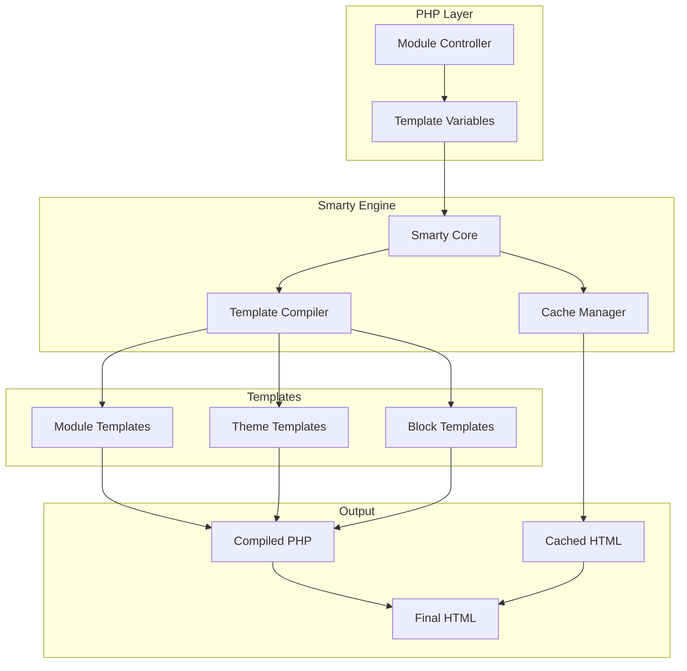
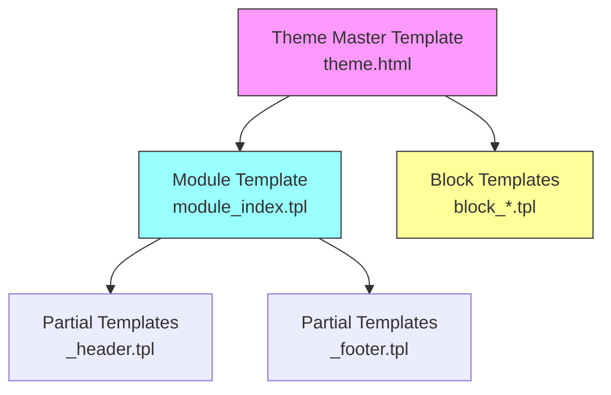
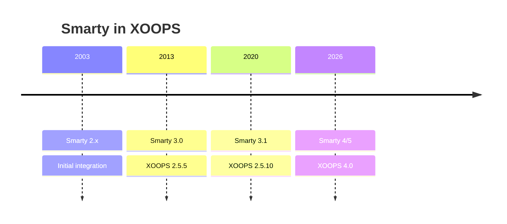

# ADR-003: Motor de Plantillas (Smarty)

> Registro de Decisión Arquitectónica para la adopción del motor de plantillas Smarty de XOOPS.

---

## Estado

**Aceptado** - Decisión central desde XOOPS 2.0

**Evolucionando** - Migración a Smarty 4/5 planeada para XOOPS 4.0

---

## Contexto

XOOPS necesitaba una solución de plantillas que:

1. Separe la presentación de la lógica de negocio
2. Permita a diseñadores de temas trabajar sin conocimiento de PHP
3. Apoye herencia de plantillas e inclusiones
4. Proporcione almacenamiento en caché para rendimiento
5. Permita plantillas personalizables por el usuario
6. Apoye internacionalización

---

## Diagrama de Decisión



---

## Decisión

Usaremos **Smarty** como motor de plantillas porque:

### 1. Separación de Responsabilidades

```php
// PHP (Controller) - Business logic
$items = $itemHandler->getPublishedItems();
$xoopsTpl->assign('items', $items);

// Smarty (View) - Presentation
// templates/items.tpl
```

```smarty
{* Smarty template - No PHP logic *}
<{foreach item=item from=$items}>
    <article>
        <h2><{$item.title}></h2>
        <p><{$item.summary}></p>
    </article>
<{/foreach}>
```

### 2. Delimitadores de XOOPS

XOOPS usa `<{` y `}>` en lugar de estándar `{` `}`:

```smarty
{* Standard Smarty *}
{$variable}

{* XOOPS Smarty - Avoids JavaScript conflicts *}
<{$variable}>
```

### 3. Jerarquía de Plantillas



### 4. Almacenamiento de Plantillas

- **Base de Datos**: Plantillas personalizadas almacenadas para capacidad de reversión
- **Sistema de Archivos**: Plantillas originales en directorios de módulos
- **Caché**: Plantillas compiladas para rendimiento

---

## Configuración de Smarty

```php
// XOOPS Smarty initialization
$xoopsTpl = new XoopsTpl();

// Custom delimiters
$xoopsTpl->left_delim = '<{';
$xoopsTpl->right_delim = '}>';

// Caching
$xoopsTpl->caching = XOOPS_TEMPLATE_CACHE;
$xoopsTpl->cache_lifetime = 3600;

// Security
$xoopsTpl->security_policy = new Smarty_Security($xoopsTpl);
$xoopsTpl->security_policy->php_functions = [];
$xoopsTpl->security_policy->php_modifiers = ['escape', 'count'];
```

---

## Características de Plantillas Usadas

### Variables

```smarty
{* Simple variable *}
<{$title}>

{* Object property *}
<{$item.title}>

{* With modifier *}
<{$content|truncate:200:'...'}>

{* Escaped output *}
<{$userInput|escape:'html'}>
```

### Estructuras de Control

```smarty
{* Conditional *}
<{if $isAdmin}>
    <a href="admin.php">Admin</a>
<{elseif $isUser}>
    <a href="profile.php">Profile</a>
<{else}>
    <a href="login.php">Login</a>
<{/if}>

{* Loop *}
<{foreach item=item from=$items name=itemloop}>
    <{$smarty.foreach.itemloop.index}>: <{$item.title}>
<{/foreach}>
```

### Inclusiones

```smarty
{* Include another template *}
<{include file="db:mymodule_header.tpl"}>

{* Include with variables *}
<{include file="db:mymodule_item.tpl" item=$currentItem}>

{* Include from theme *}
<{include file="file:$theme_path/partials/sidebar.tpl"}>
```

---

## Consecuencias

### Positivas

1. **Amigable para diseñadores**: Sintaxis similar a HTML
2. **Almacenamiento en caché**: Caché de plantillas incorporado
3. **Seguridad**: Aislamiento de código PHP
4. **Flexibilidad**: Modificadores, funciones, complementos
5. **Personalización**: Los usuarios pueden modificar plantillas
6. **Comunidad**: Gran ecosistema de Smarty

### Negativas

1. **Curva de aprendizaje**: Sintaxis específica de Smarty
2. **Sobrecarga**: Se requiere paso de compilación
3. **Depuración**: Los errores de plantilla pueden ser crípticos
4. **Problemas de versión**: Cambios importantes entre versiones

### Mitigaciones

- **Aprendizaje**: Documentación completa
- **Rendimiento**: Caché agresivo
- **Depuración**: Consola de depuración, mensajes de error claros
- **Versiones**: Capa de compatibilidad en XOOPS

---

## Historial de Versiones



---

## Migración: Smarty 3 a 4/5

### Cambios Importantes

```smarty
{* Smarty 3 - Deprecated *}
<{php}>echo date('Y');<{/php}>

{* Smarty 4+ - Use modifiers or assign from PHP *}
<{$current_year}>

{* Smarty 3 - {section} deprecated *}
<{section name=i loop=$items}>
    <{$items[i].title}>
<{/section}>

{* Smarty 4+ - Use {foreach} *}
<{foreach $items as $item}>
    <{$item.title}>
<{/foreach}>
```

### Capa de Compatibilidad

XOOPS proporciona una capa de compatibilidad para transiciones sin problemas:

```php
// XoopsTpl extends Smarty with compatibility methods
class XoopsTpl extends Smarty
{
    public function assign($tpl_var, $value = null)
    {
        // Handles both Smarty 3 and 4 syntax
        return parent::assign($tpl_var, $value);
    }
}
```

---

## Alternativas Consideradas

### 1. Twig
**Pros**: Moderno, ecosistema Symfony
**Cons**: Sintaxis diferente, esfuerzo de migración
**Decisión**: Posible opción futura para XOOPS 3.x

### 2. Blade (Laravel)
**Pros**: Sintaxis limpia, popular
**Cons**: Específico de Laravel
**Decisión**: No adecuado para uso independiente

### 3. Plantillas PHP Nativas
**Pros**: Sin curva de aprendizaje, rápido
**Cons**: Riesgos de seguridad, sin separación
**Decisión**: Rechazado por mantenibilidad

---

## Decisiones Relacionadas

- ADR-001: Arquitectura Modular
- ADR-002: Abstracción de Base de Datos

---

## Referencias

- Documentación de Smarty: https://www.smarty.net/docs/en/
- Guía del Sistema de Plantillas de XOOPS
- Patrón MVC en Aplicaciones Web

---

#xoops #architecture #adr #smarty #templates #design-decision
