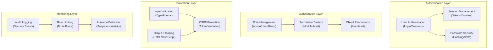

# ADR-004: Arquitectura del Sistema de Seguridad

> Arquitectura de seguridad completa para XOOPS CMS que protege contra amenazas modernas.

---

## Estado

**Aceptado** - Capa de seguridad central desde XOOPS 2.5

---

## Contexto

### Declaración del Problema

XOOPS necesita un sistema de seguridad robusto que:

1. **Proteja contra vulnerabilidades web comunes** (OWASP Top 10)
2. **Proporcione control de permisos granular** entre módulos
3. **Permita autenticación segura de usuario** con estándares modernos
4. **Prevenga violaciones de datos** y acceso no autorizado
5. **Apoye control de acceso multinivel** (admin, moderador, usuario, invitado)
6. **Se integre con todos los módulos** sin inconvenientes

### Amenazas Actuales

Los ataques web modernos incluyen:

- **Inyección SQL** - SQL malicioso en entrada del usuario
- **XSS (Cross-Site Scripting)** - JavaScript inyectado en páginas
- **CSRF (Cross-Site Request Forgery)** - Envíos de formularios no autorizados
- **Bypass de autenticación** - Manejo débil de sesión/contraseña
- **Bypass de autorización** - Escalada de privilegios
- **Exposición de datos** - Datos sensibles en URLs, registros o cachés

### Requisitos de Seguridad de XOOPS

1. Autenticación de usuario y gestión de sesiones
2. Control de acceso basado en roles (RBAC)
3. Sistema de permisos para módulos y objetos
4. Validación de entrada y escape de salida
5. Protección contra ataques comunes
6. Registro de auditoría de eventos de seguridad
7. Manejo seguro de contraseñas
8. Protección de token CSRF

---

## Decisión

### Arquitectura de Seguridad Central



---

## Componentes de Seguridad

### 1. Sistema de Autenticación

**Proceso de Inicio de Sesión de Usuario:**

```php
<?php
// 1. Validate credentials
$user = $userHandler->findByLogin($username);
if (!$user || !password_verify($password, $user->getVar('pass'))) {
    throw new AuthenticationException('Invalid credentials');
}

// 2. Check if account is active
if (!$user->getVar('uactive')) {
    throw new AuthenticationException('Account inactive');
}

// 3. Create secure session
session_regenerate_id(true);
$_SESSION['uid'] = $user->getVar('uid');
$_SESSION['token'] = bin2hex(random_bytes(32));
$_SESSION['created'] = time();

// 4. Log the login
$this->auditLog('USER_LOGIN', $user->getVar('uid'));
```

**Seguridad de Contraseña:**

```php
<?php
// Use password_hash (not MD5 or SHA1)
$hashed = password_hash($password, PASSWORD_BCRYPT, [
    'cost' => 12, // High cost = slow brute force
]);

// Verify password
if (!password_verify($inputPassword, $hashed)) {
    throw new Exception('Invalid password');
}

// Rehash if algorithm or cost changed
if (password_needs_rehash($hashed, PASSWORD_BCRYPT, ['cost' => 12])) {
    $newHash = password_hash($password, PASSWORD_BCRYPT, ['cost' => 12]);
    $user->setVar('pass', $newHash);
    $userHandler->insert($user);
}
```

### 2. Gestión de Sesiones

**Manejo Seguro de Sesiones:**

```php
<?php
// Session configuration
ini_set('session.cookie_httponly', true);  // No JS access
ini_set('session.cookie_secure', true);     // HTTPS only
ini_set('session.cookie_samesite', 'Strict'); // CSRF protection
ini_set('session.gc_maxlifetime', 3600);   // 1 hour timeout
ini_set('session.sid_length', 64);         // 64-char session ID

// Validate session
function validateSession() {
    // Check timeout
    if (time() - $_SESSION['created'] > 3600) {
        session_destroy();
        throw new SessionExpiredException();
    }

    // Validate user agent (prevent session hijacking)
    if ($_SESSION['user_agent'] !== $_SERVER['HTTP_USER_AGENT']) {
        throw new SessionInvalidException();
    }

    // Validate IP (optional, can be too strict)
    if (!in_array($_SERVER['REMOTE_ADDR'], $_SESSION['ips'])) {
        $_SESSION['ips'][] = $_SERVER['REMOTE_ADDR'];
    }
}
```

### 3. Autorización (RBAC)

**Control de Acceso Basado en Roles:**

```php
<?php
class XoopsUser {
    public function hasPermission(string $permissionName): bool
    {
        // Get user groups
        $groups = $this->getGroups();

        // Check if any group has permission
        foreach ($groups as $groupId) {
            if ($this->checkGroupPermission($groupId, $permissionName)) {
                return true;
            }
        }

        return false;
    }

    /**
     * User groups and their permissions
     * Admin: Full access
     * Moderator: Content management
     * User: Create own content
     * Guest: Read-only access
     */
    private function checkGroupPermission(int $groupId, string $permission): bool
    {
        $permissions = [
            1 => ['admin_access'],                 // Admin group
            2 => ['moderate_content', 'edit_own'], // Moderator group
            3 => ['create_content', 'edit_own'],   // User group
            4 => [],                               // Guest group (no permissions)
        ];

        return in_array($permission, $permissions[$groupId] ?? []);
    }
}
```

### 4. Validación de Entrada

**Prevenir Inyección SQL y Errores de Tipo:**

```php
<?php
// Always use prepared statements
$sql = 'SELECT * FROM users WHERE id = ?';
$result = $db->query($sql, [$userId]); // ✅ Safe

// Input validation
function validateUserInput(array $data): array
{
    return [
        'email' => filter_var($data['email'] ?? '', FILTER_VALIDATE_EMAIL),
        'age' => filter_var($data['age'] ?? 0, FILTER_VALIDATE_INT),
        'website' => filter_var($data['website'] ?? '', FILTER_VALIDATE_URL),
        'title' => substr(trim($data['title'] ?? ''), 0, 255),
    ];
}

// XOOPS Safe Input class
$safe = \Xmf\Request::getHtmlRequest('var_name', '');
$int = \Xmf\Request::getInt('page', 1);
```

### 5. Escape de Salida

**Prevenir Ataques XSS:**

```php
<?php
// In PHP templates
echo htmlspecialchars($userInput, ENT_QUOTES, 'UTF-8');

// In Smarty templates (automatic escaping)
<{$user_input}>  {* Escaped by default *}
<{$html|escape:false}>  {* Only when needed *}

// JavaScript context
<script>
var message = "<{$userMessage|escape:'javascript'}>";
</script>

// URL context
<a href="<{$url|escape:'url'}>">Link</a>
```

### 6. Protección CSRF

**Prevención de Cross-Site Request Forgery:**

```php
<?php
// Generate CSRF token
session_start();
if (empty($_SESSION['csrf_token'])) {
    $_SESSION['csrf_token'] = bin2hex(random_bytes(32));
}

// In forms
<form method="POST">
    <input type="hidden" name="csrf_token" value="<{$csrf_token}>">
    <button type="submit">Submit</button>
</form>

// Validate token
if ($_SERVER['REQUEST_METHOD'] === 'POST') {
    if (hash_equals($_SESSION['csrf_token'], $_POST['csrf_token'] ?? '')) {
        // Process form
    } else {
        throw new InvalidTokenException('CSRF token invalid');
    }
}
```

---

## Consecuencias

### Efectos Positivos

1. **Protección Completa** - Cubre clases principales de vulnerabilidades
2. **Seguridad en Capas** - Múltiples capas de defensa
3. **RBAC Flexible** - Control de permisos granular
4. **Rastro de Auditoría** - Seguimiento de eventos de seguridad
5. **Estándar Industrial** - Se alinea con recomendaciones OWASP
6. **Integración de Módulos** - Fácil para módulos usar APIs de seguridad

### Efectos Negativos

1. **Complejidad** - Se requiere más código y configuración
2. **Rendimiento** - El hash y la validación añaden sobrecarga
3. **Experiencia del Usuario** - A veces la seguridad es inconveniente
4. **Mantenimiento** - Requiere actualizaciones de seguridad continuas
5. **Capacitación Requerida** - Los desarrolladores deben seguir prácticas

### Riesgos y Mitigaciones

| Riesgo | Severidad | Mitigación |
|------|----------|-----------|
| El desarrollador ignora seguridad | Alta | Revisión de código, capacitación en seguridad |
| Se descubren nuevas vulnerabilidades | Media | Auditorías de seguridad regulares, actualizaciones |
| Impacto en rendimiento | Baja | Optimizar rutas críticas, almacenamiento en caché |
| Permisos demasiado complejos | Media | Documentación clara, ejemplos |

---

## Mejores Prácticas de Seguridad

### Para Desarrolladores de Módulos

```php
<?php
// ✅ DO: Use prepared statements
$result = $db->prepare('SELECT * FROM table WHERE id = ?')->execute([$id]);

// ❌ DON'T: Concatenate queries
$result = $db->query("SELECT * FROM table WHERE id = $id");

// ✅ DO: Escape output
echo htmlspecialchars($user_input, ENT_QUOTES, 'UTF-8');

// ❌ DON'T: Output raw user data
echo $user_input;

// ✅ DO: Check permissions
if (!$user->hasPermission('edit_content')) {
    throw new PermissionException();
}

// ❌ DON'T: Trust user roles directly
if ($_POST['is_admin']) {
    // Make user admin - SECURITY HOLE!
}

// ✅ DO: Validate input types
$page = (int)$_GET['page'];

// ❌ DON'T: Use untrusted values directly
$sql .= " LIMIT " . $_GET['limit'];
```

---

## Alternativas Consideradas

### OAuth/OpenID Connect

**Por qué no fue elegido inicialmente:** Demasiado complejo para ambiente de alojamiento compartido, pero bueno para integración futura con sistemas de autenticación externos.

### Autenticación de Dos Factores (2FA)

**Estado:** Aceptado como extensión, no requisito central, ver ADR-006

### Cookies de Sesión Solo HTTP

**Estado:** Implementado - Previene acceso JavaScript a datos de sesión

---

## Decisiones Relacionadas

- ADR-001: Arquitectura Modular - Los módulos implementan seguridad
- ADR-005: Sistema de Permisos de Módulos
- ADR-006: Autenticación de Dos Factores (futuro)

---

## Referencias

### Estándares de Seguridad

- [OWASP Top 10](https://owasp.org/www-project-top-ten/)
- [Marco de Ciberseguridad NIST](https://www.nist.gov/cyberframework)
- [CWE Top 25](https://cwe.mitre.org/top25/)

### Seguridad de PHP

- [Manual de Seguridad de PHP](https://www.php.net/manual/en/security.php)
- [Documentación de password_hash()](https://www.php.net/manual/en/function.password-hash.php)
- [Seguridad de Sesión](https://www.php.net/manual/en/session.security.php)

### Herramientas

- [OWASP ZAP](https://www.zaproxy.org/) - Pruebas de seguridad
- [Snyk](https://snyk.io/) - Escaneo de vulnerabilidades
- [SonarQube](https://www.sonarqube.org/) - Calidad de código

---

## Lista de Verificación de Implementación

- [ ] Sistema de autenticación de usuario
- [ ] Gestión de sesiones
- [ ] Hash de contraseña (bcrypt)
- [ ] Control de acceso basado en roles
- [ ] Permisos de módulos
- [ ] Marco de validación de entrada
- [ ] Escape de salida (PHP + Smarty)
- [ ] Protección de token CSRF
- [ ] Registro de auditoría de seguridad
- [ ] Limitación de tasa
- [ ] Encabezados de seguridad

---

## Historial de Versiones

| Versión | Fecha | Cambios |
|---------|------|---------|
| 1.0.0 | 2024-01-28 | Documento inicial |

---

#xoops #adr #security #architecture #authentication #authorization #rbac
