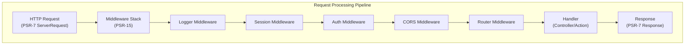

# ADR-005: Patrón de Middleware PSR-15 para XOOPS 4.0

> Adoptar controladores de solicitud del servidor HTTP PSR-15 (middleware) para mejorar la canalización de procesamiento de solicitudes.

:::caution[Propuesta XOOPS 4.0 — No disponible en 2.5.x]
Este ADR describe una **arquitectura propuesta para XOOPS 4.0**. El middleware PSR-15 **no está disponible en XOOPS 2.5.x**. Los módulos actuales de 2.5.x usan el patrón Page Controller con bootstrap `mainfile.php`. Ver Arquitectura XOOPS para el ciclo de vida actual de solicitud.
:::

---

## Estado

**Propuesto** - Bajo evaluación para lanzamiento XOOPS 4.0

---

## Contexto

### Enfoque Actual

XOOPS 2.5 usa un enfoque monolítico de manejo de solicitudes:

```php
// Current: Sequential processing
require_once 'mainfile.php';
// → Kernel initialization
// → User authentication
// → Module loading
// → Page rendering

// All in one flow, mixed concerns
```

### Problemas con el Enfoque Actual

1. **Responsabilidades Mixtas** - Autenticación, registro, enrutamiento todos entrelazados
2. **Difícil de Probar** - Difícil hacer pruebas unitarias de pasos individuales de procesamiento de solicitud
3. **Difícil de Extender** - Los módulos solo pueden enganchar a través de preload/events
4. **Separación Pobre** - Lógica de procesamiento de solicitud dispersa en toda la base de código
5. **No Componible** - No se pueden encadenar o reordenar fácilmente los pasos de procesamiento

### ¿Qué es PSR-15 Middleware?

PSR-15 define una interfaz estándar para middleware HTTP:

```php
<?php
interface RequestHandlerInterface {
    public function handle(ServerRequestInterface $request): ResponseInterface;
}

interface MiddlewareInterface {
    public function process(
        ServerRequestInterface $request,
        RequestHandlerInterface $handler
    ): ResponseInterface;
}
```

**Cadena de Middleware:**

```
Request
  ↓
[Logger] → logs request
  ↓
[Auth] → validates user session
  ↓
[CORS] → checks cross-origin
  ↓
[Router] → dispatches to handler
  ↓
[Handler] → generates response
  ↓
Response
```

---

## Decisión

### Adoptar Pila de Middleware PSR-15 para XOOPS 4.0

Implementar una canalización de procesamiento de solicitud basada en middleware siguiendo el estándar PSR-15.

### Architecture Overview



### Core Middleware Components

#### 1. Application Middleware (Core Layer)

```php
<?php
declare(strict_types=1);

namespace XoopsCore;

use Psr\Http\Message\ResponseInterface;
use Psr\Http\Message\ServerRequestInterface;
use Psr\Http\Server\MiddlewareInterface;
use Psr\Http\Server\RequestHandlerInterface;

class SessionMiddleware implements MiddlewareInterface
{
    public function process(
        ServerRequestInterface $request,
        RequestHandlerInterface $handler
    ): ResponseInterface {
        // 1. Retrieve session (or start new)
        $sessionId = $request->getCookieParams()['PHPSESSID'] ?? null;
        $session = $this->sessionManager->load($sessionId);

        // 2. Attach session to request
        $request = $request->withAttribute('session', $session);

        // 3. Pass to next middleware
        $response = $handler->handle($request);

        // 4. Set session cookie if needed
        if ($session->isModified()) {
            $response = $response->withAddedHeader(
                'Set-Cookie',
                'PHPSESSID=' . $session->getId() . '; HttpOnly; SameSite=Strict'
            );
        }

        return $response;
    }
}
```

#### 2. Authentication Middleware

```php
<?php
class AuthMiddleware implements MiddlewareInterface
{
    public function process(
        ServerRequestInterface $request,
        RequestHandlerInterface $handler
    ): ResponseInterface {
        // Get session from previous middleware
        $session = $request->getAttribute('session');

        // Authenticate user from session
        $user = $this->authenticate($session);

        // Attach user to request
        $request = $request->withAttribute('user', $user);

        return $handler->handle($request);
    }

    private function authenticate(?Session $session): User
    {
        if ($session && $session->has('uid')) {
            return $this->userRepository->findById($session->get('uid'));
        }

        return new AnonymousUser();
    }
}
```

#### 3. Authorization Middleware

```php
<?php
class AuthorizationMiddleware implements MiddlewareInterface
{
    public function __construct(private AuthorizationChecker $checker)
    {
    }

    public function process(
        ServerRequestInterface $request,
        RequestHandlerInterface $handler
    ): ResponseInterface {
        $user = $request->getAttribute('user');
        $route = $request->getAttribute('route');

        // Check if user has permission for this route
        if (!$this->checker->isGranted($user, $route)) {
            return new JsonResponse(
                ['error' => 'Unauthorized'],
                403
            );
        }

        return $handler->handle($request);
    }
}
```

#### 4. Module Middleware

```php
<?php
// Modules can provide their own middleware
class PublisherAccessMiddleware implements MiddlewareInterface
{
    public function process(
        ServerRequestInterface $request,
        RequestHandlerInterface $handler
    ): ResponseInterface {
        $user = $request->getAttribute('user');

        // Module-specific access control
        if (!$user->hasPermission('publisher_view')) {
            return new HtmlResponse('Access denied', 403);
        }

        return $handler->handle($request);
    }
}
```

### Implementation Example

```php
<?php
// bootstrap.php - Application setup

use Psr\Http\Message\ServerRequestInterface;
use Psr\Http\Server\RequestHandlerInterface;
use Xoops\Core\Middleware\{
    LoggerMiddleware,
    SessionMiddleware,
    AuthMiddleware,
    CorsMiddleware,
    ErrorHandlingMiddleware
};

// Create middleware pipeline
$middlewareStack = [
    // 1. Error handling (outermost)
    new ErrorHandlingMiddleware(),

    // 2. Logging
    new LoggerMiddleware($logger),

    // 3. CORS handling
    new CorsMiddleware($corsConfig),

    // 4. Session management
    new SessionMiddleware($sessionManager),

    // 5. Authentication
    new AuthMiddleware($userRepository),

    // 6. Authorization
    new AuthorizationMiddleware($authChecker),

    // 7. Routing and dispatching
    new RoutingMiddleware($router),

    // 8. Module middleware (dynamic)
    ...$this->loadModuleMiddleware(),
];

// Process request through middleware stack
$request = ServerRequestFactory::fromGlobals();
$dispatcher = new MiddlewareDispatcher($middlewareStack);
$response = $dispatcher->dispatch($request);

// Send response
http_response_code($response->getStatusCode());
foreach ($response->getHeaders() as $name => $values) {
    foreach ($values as $value) {
        header("$name: $value", false);
    }
}
echo $response->getBody();
```

### Module Integration

Modules can provide middleware:

```php
<?php
// Publisher module - xoops_version.php

$modversion['middleware'] = [
    'PublisherAccessMiddleware' => true,      // Auto-load
    'PublisherLogMiddleware' => true,
];

// Or custom:
$modversion['middleware_factory'] = function() {
    return [
        new PublisherCacheMiddleware(),
        new PublisherPermissionMiddleware(),
    ];
};
```

---

## Consecuencias

### Efectos Positivos

1. **Separación de Responsabilidades** - Cada middleware maneja una responsabilidad
2. **Testeabilidad** - Fácil hacer pruebas unitarias de componentes individuales de middleware
3. **Componibilidad** - El middleware se puede mezclar y reordenar
4. **Conforme a Estándares** - Usa estándares PSR-15 y PSR-7
5. **Extensibilidad** - Los módulos pueden agregar fácilmente middleware personalizado
6. **Depuración** - Flujo de solicitud claro a través de la canalización
7. **Rendimiento** - Puede optimizar capas de middleware específicas
8. **Interoperabilidad** - Puede usar middleware PSR-15 de terceros

### Efectos Negativos

1. **Curva de Aprendizaje** - Los desarrolladores deben entender PSR-15
2. **Sobrecarga de Rendimiento** - Más llamadas de función en la canalización
3. **Complejidad** - Más partes móviles que el enfoque monolítico
4. **Esfuerzo de Migración** - Requiere refactorizar código existente
5. **Dependencias** - Requiere biblioteca HTTP PSR-7

### Riesgos y Mitigaciones

| Riesgo | Severidad | Mitigación |
|------|----------|-----------|
| Cadenas de middleware complejas | Media | Documentación clara, ejemplos |
| Degradación de rendimiento | Media | Punto de referencia, optimizar rutas críticas |
| Mal uso del desarrollador | Media | Revisión de código, guía de mejores prácticas |
| Cambios importantes de migración | Alta | Período de deprecación, ayudantes |
| Problemas de orden de middleware | Media | Gráfico de dependencia claro |

---

## Plan de Implementación

### Fase 1: Fundación (Q2 2026)

- [ ] Implementar envoltorio de mensaje HTTP PSR-7
- [ ] Crear MiddlewareDispatcher
- [ ] Implementar middleware central (sesión, auth)
- [ ] Actualizar kernel para usar middleware

### Fase 2: Integración (Q3 2026)

- [ ] Migrar funcionalidad existente a middleware
- [ ] Agregar soporte de middleware de módulo
- [ ] Crear utilidades de prueba de middleware
- [ ] Escribir documentación completa

### Fase 3: Migración (Q4 2026)

- [ ] Proporcionar capa de compatibilidad para código antiguo
- [ ] Ayudar a módulos a actualizar a nuevo middleware
- [ ] Optimización de rendimiento
- [ ] Auditoría de seguridad

### Fase 4: Lanzamiento (Q1 2027)

- [ ] Lanzamiento XOOPS 4.0 con middleware
- [ ] Deprecar sistema de preload/hook antiguo
- [ ] Retroalimentación de la comunidad y actualizaciones

---

## Criterios de Éxito

- [ ] Toda funcionalidad central migrada a middleware
- [ ] Cobertura de pruebas 90%+ para middleware
- [ ] Documentación completa con ejemplos
- [ ] Rendimiento dentro del 10% de versión anterior
- [ ] Módulos usan exitosamente nuevo sistema de middleware
- [ ] Tasa de adopción de comunidad >80%

---

## Mejores Prácticas de Middleware

### Hacer

- Mantener middleware enfocado (responsabilidad única)
- Usar inmutabilidad (crear nueva solicitud/respuesta)
- Manejar errores correctamente
- Documentar dependencias
- Agregar type hints
- Escribir pruebas para middleware
- Usar interfaces PSR-15 estándar

### No Hacer

- No modificar objetos de solicitud/respuesta compartidos
- No acceder a globales directamente
- No crear dependencias en orden de middleware
- No captar todas las excepciones
- No mezclar lógica de negocio con middleware
- No hacer que middleware haga demasiado

---

## Ejemplos

### Middleware Personalizado

```php
<?php
// Example: Rate limiting middleware

use Psr\Http\Message\ResponseInterface;
use Psr\Http\Message\ServerRequestInterface;
use Psr\Http\Server\MiddlewareInterface;
use Psr\Http\Server\RequestHandlerInterface;

class RateLimitMiddleware implements MiddlewareInterface
{
    public function __construct(
        private RateLimiter $limiter,
        private int $limit = 100,
        private int $window = 3600
    ) {
    }

    public function process(
        ServerRequestInterface $request,
        RequestHandlerInterface $handler
    ): ResponseInterface {
        $user = $request->getAttribute('user');
        $identifier = $user->getId() ?? $request->getClientIp();

        // Check rate limit
        $remaining = $this->limiter->check($identifier, $this->limit, $this->window);

        if ($remaining < 0) {
            return new JsonResponse(
                ['error' => 'Rate limit exceeded'],
                429
            );
        }

        // Add rate limit headers
        $response = $handler->handle($request);
        return $response
            ->withAddedHeader('X-RateLimit-Limit', (string)$this->limit)
            ->withAddedHeader('X-RateLimit-Remaining', (string)$remaining);
    }
}
```

---

## Decisiones Relacionadas

- ADR-001: Arquitectura Modular - Fundación
- ADR-004: Sistema de Seguridad - Usa middleware para auth
- ADR-006: Autenticación de Dos Factores - Puede ser middleware

---

## Referencias

### Estándares PSR

- [PSR-7: Interfaz de Mensaje HTTP](https://www.php-fig.org/psr/psr-7/)
- [PSR-15: Controladores de Solicitud del Servidor HTTP](https://www.php-fig.org/psr/psr-15/)

### Marcos de Middleware

- [Slim Framework](https://www.slimframework.com/) - Ejemplos de middleware
- [Zend Expressive](https://docs.zendframework.com/zend-expressive/) - Marco PSR-15
- [Guzzle](https://docs.guzzlephp.org/) - Middleware de cliente HTTP

### Herramientas

- [RelayPHP](https://relayphp.com/) - Biblioteca de middleware
- [PSR-15 Middleware](https://github.com/middlewares) - Colección de middlewares

---

## Historial de Versiones

| Versión | Fecha | Cambios |
|---------|------|---------|
| 1.0.0 | 2024-01-28 | Propuesta inicial |

---

#xoops #adr #psr-15 #middleware #architecture #psr-7
