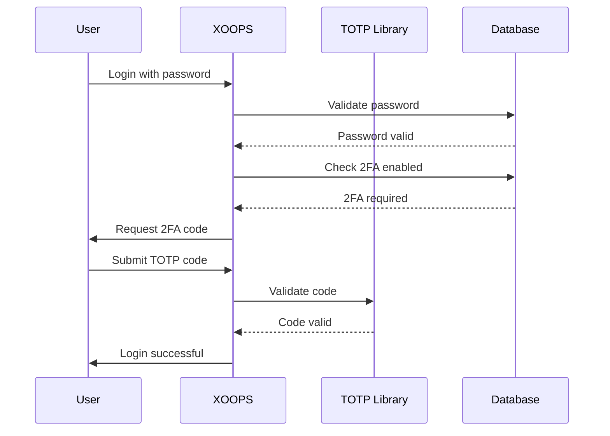

## Estado

Propuesto

## Contexto

XOOPS necesita seguridad mejorada para la autenticación de usuarios. La autenticación de dos factores (2FA) proporciona una capa adicional de seguridad más allá de las contraseñas, protegiendo cuentas incluso si las contraseñas se comprometen.

Consideraciones clave:
- Compatibilidad hacia atrás con autenticación existente
- Soporte para múltiples métodos 2FA
- Experiencia del usuario durante la configuración y el inicio de sesión
- Mecanismos de recuperación para dispositivos perdidos
- Integración con el sistema de permisos existente

## Decisión

Implementaremos TOTP (Contraseña de Un Tiempo Basada en Tiempo) como método 2FA principal con soporte para códigos de respaldo.

### Enfoque de Implementación



### Esquema de Base de Datos

```sql
CREATE TABLE `{PREFIX}_users_2fa` (
    `user_id` INT(11) NOT NULL,
    `secret` VARCHAR(32) NOT NULL,
    `enabled` TINYINT(1) DEFAULT 0,
    `backup_codes` TEXT,
    `last_used` INT(11),
    `created` INT(11) NOT NULL,
    PRIMARY KEY (`user_id`),
    FOREIGN KEY (`user_id`) REFERENCES `{PREFIX}_users`(`uid`)
);
```

### Interfaz de Servicio

```php
interface TwoFactorAuthInterface
{
    public function enable(int $userId): TwoFactorSetup;
    public function disable(int $userId): void;
    public function verify(int $userId, string $code): bool;
    public function generateBackupCodes(int $userId): array;
    public function isEnabled(int $userId): bool;
}
```

### Integración de Middleware

```php
class TwoFactorMiddleware implements MiddlewareInterface
{
    public function process(
        ServerRequestInterface $request,
        RequestHandlerInterface $handler
    ): ResponseInterface {
        $session = $request->getAttribute('session');

        if ($session->has('pending_2fa_user_id')) {
            // User needs to complete 2FA
            if ($this->isVerificationRequest($request)) {
                return $handler->handle($request);
            }
            return new RedirectResponse('/2fa/verify');
        }

        return $handler->handle($request);
    }
}
```

## Consecuencias

### Positivas

- Seguridad de cuenta significativamente mejorada
- Compatibilidad TOTP estándar de la industria (Google Authenticator, Authy, etc.)
- Códigos de respaldo previenen bloqueo de cuenta
- Opcional por usuario - no fuerza adopción
- Middleware PSR-15 permite integración limpia

### Negativas

- Paso de inicio de sesión adicional impacta experiencia del usuario
- Los usuarios deben gestionar aplicaciones de autenticador
- Los dispositivos perdidos requieren proceso de recuperación
- Almacenamiento y consultas de base de datos adicionales
- Requiere dependencia de biblioteca criptográfica

### Ruta de Migración

1. Agregar tabla de base de datos para datos 2FA
2. Implementar servicio TOTP con dependencia de biblioteca
3. Agregar middleware a cadena de autenticación
4. Crear UI de configuración y verificación
5. Opción de administrador para requerir 2FA para grupos específicos

## Alternativas Consideradas

### OTP Basado en SMS

Rechazado debido a:
- Vulnerabilidades de intercambio SIM
- Costo de puerta de enlace SMS
- Complejidad de verificación de número de teléfono
- Preocupaciones de privacidad

### Claves de Seguridad de Hardware (WebAuthn)

Diferido para ADR futuro:
- Implementación más compleja
- Soporte limitado del navegador históricamente
- Costo más alto para el usuario
- Podría agregarse junto con TOTP más adelante

### OTP Basado en Correo Electrónico

Rechazado debido a:
- Compromiso de cuenta de correo electrónico derrota el propósito
- Los retrasos de entrega impactan UX
- Problemas de filtro de correo no deseado

## Referencias

- [RFC 6238 - TOTP](https://tools.ietf.org/html/rfc6238)
- [Formato de Clave de Autenticador de Google](https://github.com/google/google-authenticator/wiki/Key-Uri-Format)
- ../../02-Core-Concepts/Security/Security-Best-Practices - Directrices de seguridad
- ../../02-Core-Concepts/Users-Permissions/Authentication - Documentación del sistema de autenticación
