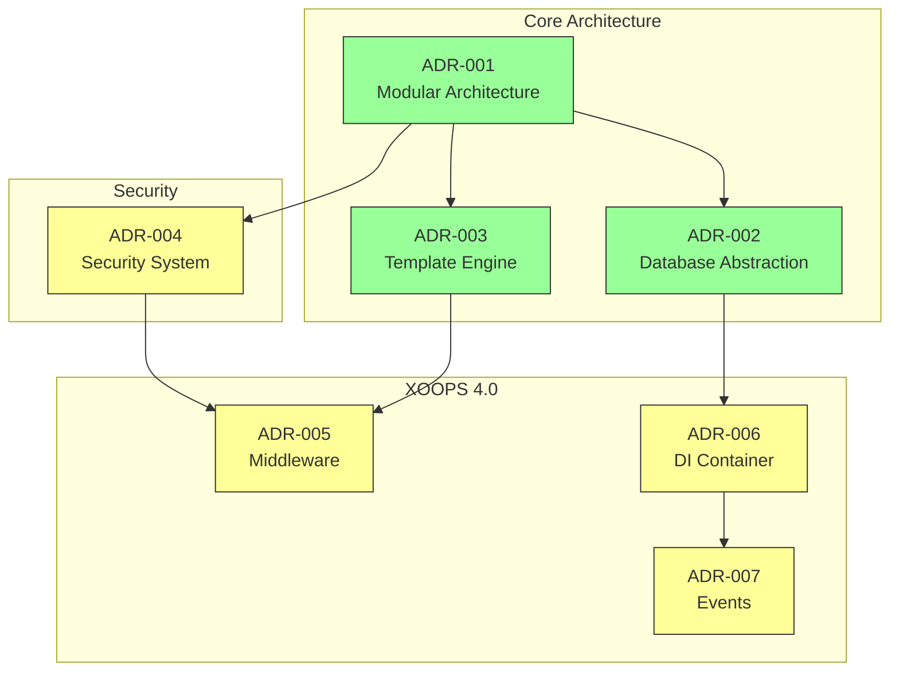
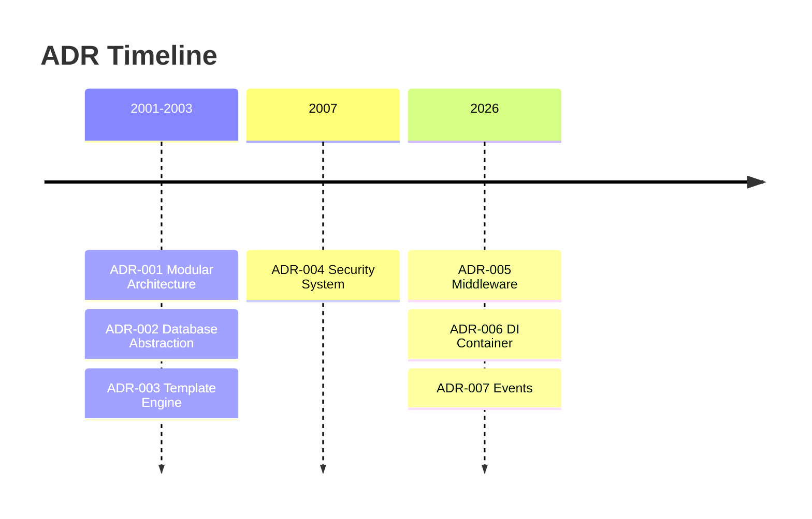

# 📋 Índice de Registros de Decisión Arquitectónica

> Índice completo de decisiones arquitectónicas que dieron forma a XOOPS CMS.

---

## ¿Qué son los ADR?

Los Registros de Decisión Arquitectónica (ADR, por sus siglas en inglés) documentan decisiones arquitectónicas significativas tomadas durante el desarrollo de XOOPS. Capturan el contexto, la decisión y las consecuencias de cada elección, proporcionando un contexto histórico valioso para los mantenedores y colaboradores.

---

## Leyenda de Estado de ADR

| Estado | Significado |
|--------|---------|
| **Propuesto** | Bajo discusión, no aceptado aún |
| **Aceptado** | La decisión ha sido adoptada |
| **Deprecado** | Ya no se recomienda |
| **Superado** | Reemplazado por otro ADR |

---

## ADR Actuales

### Decisiones Fundamentales

| ADR | Título | Estado | Impacto |
|-----|-------|--------|--------|
| ADR-001 | Arquitectura Modular | Aceptado | Core |
| ADR-002 | Acceso a Base de Datos Orientado a Objetos | Aceptado | Core |
| ADR-003 | Motor de Plantillas Smarty | Aceptado | Core |

### ADR Planificados (XOOPS 4.0)

| ADR | Título | Estado | Impacto |
|-----|-------|--------|--------|
| ADR-004 | Diseño del Sistema de Seguridad | Propuesto | Seguridad |
| ADR-005 | Middleware PSR-15 | Propuesto | Arquitectura |
| ADR-006 | Contenedor de Inyección de Dependencias | Propuesto | Arquitectura |
| ADR-007 | Rediseño del Sistema de Eventos | Propuesto | Arquitectura |

---

## Relaciones de ADR



---

## Línea de Tiempo



---

## Creación de Nuevos ADR

Cuando se propone una nueva decisión arquitectónica:

1. Copie la Plantilla de ADR
2. Complete todas las secciones
3. Envíe como Pull Request
4. Discuta en GitHub Issues
5. Actualice el estado después de la decisión

### Estructura de Plantilla de ADR

```markdown
# ADR-XXX: Título

## Estado
Propuesto | Aceptado | Deprecado | Superado

## Contexto
¿Cuál es el problema que motiva esta decisión?

## Decisión
¿Cuál es el cambio que estamos proponiendo?

## Consecuencias
¿Qué se vuelve más fácil o más difícil como resultado?

## Alternativas Consideradas
¿Qué otras opciones fueron evaluadas?
```

---

## 🔗 Documentación Relacionada

- Conceptos Principales
- Directrices de Contribución
- Mapa de Ruta XOOPS 4.0

---

#xoops #adr #architecture #index #decisions
