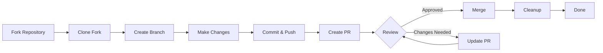

> Esta guía lo acompaña a través del proceso completo de contribuir a XOOPS, desde la configuración inicial hasta la solicitud de cambio fusionada.

---

## Requisitos Previos

Antes de comenzar a contribuir, asegúrese de tener:

- **Git** instalado y configurado
- **Cuenta de GitHub** (gratuita)
- **PHP 7.4+** para desarrollo de XOOPS
- **Composer** para gestión de dependencias
- Conocimiento básico de flujos de trabajo Git
- Familiaridad con el Código de Conducta

---

## Paso 1: Hacer Fork del Repositorio

### En la Interfaz Web de GitHub

1. Navegar al repositorio (por ejemplo, `XOOPS/XoopsCore27`)
2. Hacer clic en el botón **Fork** en la esquina superior derecha
3. Seleccionar dónde hacer fork (su cuenta personal)
4. Esperar a que se complete el fork

### ¿Por Qué Hacer Fork?

- Obtiene su propia copia para trabajar
- Los mantenedores no necesitan gestionar muchas ramas
- Tiene control total de su fork
- Las Solicitudes de Cambio referencian su fork y el repositorio ascendente

---

## Paso 2: Clonar Su Fork Localmente

```bash
# Clonar su fork (reemplazar YOUR_USERNAME)
git clone https://github.com/YOUR_USERNAME/XoopsCore27.git
cd XoopsCore27

# Agregar remote ascendente para rastrear repositorio original
git remote add upstream https://github.com/XOOPS/XoopsCore27.git

# Verificar que los remotes están configurados correctamente
git remote -v
# origin    https://github.com/YOUR_USERNAME/XoopsCore27.git (fetch)
# origin    https://github.com/YOUR_USERNAME/XoopsCore27.git (push)
# upstream  https://github.com/XOOPS/XoopsCore27.git (fetch)
# upstream  https://github.com/XOOPS/XoopsCore27.git (nofetch)
```

---

## Paso 3: Configurar Entorno de Desarrollo

### Instalar Dependencias

```bash
# Instalar dependencias de Composer
composer install

# Instalar dependencias de desarrollo
composer install --dev

# Para desarrollo de módulo
cd modules/mymodule
composer install
```

### Configurar Git

```bash
# Establecer su identidad de Git
git config user.name "Your Name"
git config user.email "your.email@example.com"

# Opcional: Establecer configuración global de Git
git config --global user.name "Your Name"
git config --global user.email "your.email@example.com"
```

### Ejecutar Pruebas

```bash
# Asegurarse de que las pruebas pasen en estado limpio
./vendor/bin/phpunit

# Ejecutar suite de prueba específica
./vendor/bin/phpunit --testsuite unit
```

---

## Paso 4: Crear Rama de Característica

### Convención de Nombres de Rama

Seguir este patrón: `<type>/<description>`

**Tipos:**
- `feature/` - Nueva característica
- `fix/` - Arreglo de error
- `docs/` - Solo documentación
- `refactor/` - Refactorización de código
- `test/` - Adiciones de prueba
- `chore/` - Mantenimiento, herramientas

**Ejemplos:**
```bash
# Rama de característica
git checkout -b feature/add-two-factor-auth

# Rama de arreglo de error
git checkout -b fix/prevent-xss-in-forms

# Rama de documentación
git checkout -b docs/update-api-guide

# Siempre hacer rama desde upstream/main (o develop)
git checkout -b feature/my-feature upstream/main
```

### Mantener Rama Actualizada

```bash
# Antes de comenzar el trabajo, sincronizar con upstream
git fetch upstream
git merge upstream/main

# Más tarde, si upstream ha cambiado
git fetch upstream
git rebase upstream/main
```

---

## Paso 5: Realizar Sus Cambios

### Prácticas de Desarrollo

1. **Escribir código** siguiendo Estándares PHP
2. **Escribir pruebas** para nueva funcionalidad
3. **Actualizar documentación** si es necesario
4. **Ejecutar linters** y formateadores de código

### Verificaciones de Calidad de Código

```bash
# Ejecutar todas las pruebas
./vendor/bin/phpunit

# Ejecutar con cobertura
./vendor/bin/phpunit --coverage-html coverage/

# Ejecutar PHP CS Fixer
./vendor/bin/php-cs-fixer fix --dry-run

# Ejecutar análisis estático PHPStan
./vendor/bin/phpstan analyse class/ src/
```

### Hacer Commit de Cambios Buenos

```bash
# Verificar qué cambió
git status
git diff

# Preparar archivos específicos
git add class/MyClass.php
git add tests/MyClassTest.php

# O preparar todos los cambios
git add .

# Hacer commit con mensaje descriptivo
git commit -m "feat(auth): add two-factor authentication support"
```

---

## Paso 6: Mantener Rama en Sincronización

Mientras trabaja en su característica, la rama main podría avanzar:

```bash
# Obtener los cambios más recientes de upstream
git fetch upstream

# Opción A: Rebase (preferida para historial limpio)
git rebase upstream/main

# Opción B: Fusionar (más simple pero agrega commits de fusión)
git merge upstream/main

# Si ocurren conflictos, resolverlos luego:
git add .
git rebase --continue  # o git merge --continue
```

---

## Paso 7: Enviar a Su Fork

```bash
# Enviar su rama a su fork
git push origin feature/my-feature

# En envíos posteriores
git push

# Si hizo rebase, podría necesitar force push (¡usar con cuidado!)
git push --force-with-lease origin feature/my-feature
```

---

## Paso 8: Crear Solicitud de Cambio

### En la Interfaz Web de GitHub

1. Ir a su fork en GitHub
2. Verá una notificación para crear un PR desde su rama
3. Hacer clic en **"Compare & pull request"**
4. O hacer clic manualmente en **"New pull request"** y seleccionar su rama

### Formato de Título y Descripción de PR

**Formato de Título:**
```
<type>(<scope>): <subject>
```

Ejemplos:
```
feat(auth): add two-factor authentication
fix(forms): prevent XSS in text input
docs: update installation guide
refactor(core): improve performance
```

**Plantilla de Descripción:**

```markdown
## Descripción
Breve explicación de qué hace este PR.

## Cambios
- Cambié X de A a B
- Agregué característica Y
- Arreglé error Z

## Tipo de Cambio
- [ ] Nueva característica (agrega nueva funcionalidad)
- [ ] Arreglo de error (soluciona un problema)
- [ ] Cambio importante (cambio de API/comportamiento)
- [ ] Actualización de documentación

## Pruebas
- [ ] Agregué pruebas para nueva funcionalidad
- [ ] Todas las pruebas existentes pasan
- [ ] Realicé pruebas manuales

## Capturas de Pantalla (si es aplicable)
Incluir capturas antes/después para cambios de interfaz.

## Problemas Relacionados
Closes #123
Related to #456

## Lista de Verificación
- [ ] El código sigue directrices de estilo
- [ ] Revisé mi propio código
- [ ] Comenté código complejo
- [ ] Actualicé documentación
- [ ] Sin nuevas advertencias generadas
- [ ] Las pruebas pasan localmente
```

### Lista de Verificación de Revisión de PR

Antes de enviar, asegúrese de:

- [ ] El código sigue Estándares PHP
- [ ] Las pruebas están incluidas y pasan
- [ ] Documentación actualizada (si es necesario)
- [ ] Sin conflictos de fusión
- [ ] Mensajes de commit claros
- [ ] Problemas relacionados referenciados
- [ ] Descripción de PR detallada
- [ ] Sin código de depuración o console.log

---

## Paso 9: Responder a Retroalimentación

### Durante Revisión de Código

1. **Leer comentarios cuidadosamente** - Entender la retroalimentación
2. **Hacer preguntas** - Si no está claro, pedir aclaración
3. **Discutir alternativas** - Debatir respetuosamente enfoques
4. **Realizar cambios solicitados** - Actualizar su rama
5. **Force-push commits actualizados** - Si reescribir historial

```bash
# Realizar cambios
git add .
git commit --amend  # Modificar último commit
git push --force-with-lease origin feature/my-feature

# O agregar nuevos commits
git commit -m "Address feedback on PR review"
git push origin feature/my-feature
```

### Esperar Iteración

- La mayoría de PRs requieren múltiples rondas de revisión
- Ser paciente y constructivo
- Ver retroalimentación como oportunidad de aprendizaje
- Los mantenedores podrían sugerir refactorizaciones

---

## Paso 10: Fusionar y Limpiar

### Después de Aprobación

Una vez que los mantenedores aprueben y fusionen:

1. **GitHub auto-fusiona** o el mantenedor hace clic en fusionar
2. **Su rama se elimina** (generalmente automático)
3. **Los cambios están en upstream**

### Limpieza Local

```bash
# Cambiar a rama main
git checkout main

# Actualizar main con cambios fusionados
git fetch upstream
git merge upstream/main

# Eliminar rama de característica local
git branch -d feature/my-feature

# Eliminar de su fork (si no se eliminó automáticamente)
git push origin --delete feature/my-feature
```

---

## Diagrama de Flujo de Trabajo



---

## Escenarios Comunes

### Sincronizar Antes de Comenzar

```bash
# Siempre comenzar fresco
git fetch upstream
git checkout -b feature/new-thing upstream/main
```

### Agregar Más Commits

```bash
# Solo enviar de nuevo
git add .
git commit -m "feat: additional changes"
git push origin feature/new-thing
```

### Solucionar Errores

```bash
# El último commit tiene mensaje incorrecto
git commit --amend -m "Correct message"
git push --force-with-lease

# Revertir a estado anterior (¡cuidado!)
git reset --soft HEAD~1  # Mantener cambios
git reset --hard HEAD~1  # Descartar cambios
```

### Manejar Conflictos de Fusión

```bash
# Hacer rebase y resolver conflictos
git fetch upstream
git rebase upstream/main

# Editar archivos con conflictos para resolver
# Luego continuar
git add .
git rebase --continue
git push --force-with-lease
```

---

## Mejores Prácticas

### Si

- Mantener ramas enfocadas en problemas únicos
- Hacer commits pequeños y lógicos
- Escribir mensajes de commit descriptivos
- Actualizar su rama frecuentemente
- Probar antes de enviar
- Documentar cambios
- Ser receptivo a retroalimentación

### No

- Trabajar directamente en rama main/master
- Mezclar cambios no relacionados en un PR
- Hacer commit de archivos generados o node_modules
- Hacer force push después de que PR sea público (usar --force-with-lease)
- Ignorar retroalimentación de revisión de código
- Crear PRs enormes (dividir en más pequeños)
- Hacer commit de datos sensibles (claves API, contraseñas)

---

## Consejos para el Éxito

### Comunicarse

- Hacer preguntas en problemas antes de comenzar el trabajo
- Pedir orientación sobre cambios complejos
- Discutir enfoque en la descripción de PR
- Responder a retroalimentación rápidamente

### Seguir Estándares

- Revisar Estándares PHP
- Consultar directrices de Reporte de Problemas
- Leer Descripción General de Contribución
- Seguir Directrices de Solicitud de Cambio

### Aprender la Base de Código

- Leer patrones de código existentes
- Estudiar implementaciones similares
- Entender la arquitectura
- Verificar Conceptos Principales

---

## Documentación Relacionada

- Código de Conducta
- Directrices de Solicitud de Cambio
- Reporte de Problemas
- Estándares de Codificación PHP
- Descripción General de Contribución

---

#xoops #git #github #contributing #workflow #pull-request
