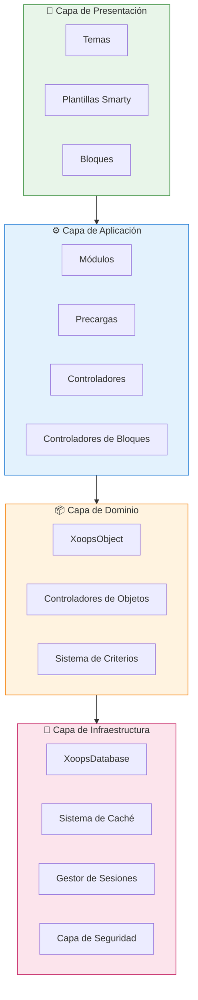
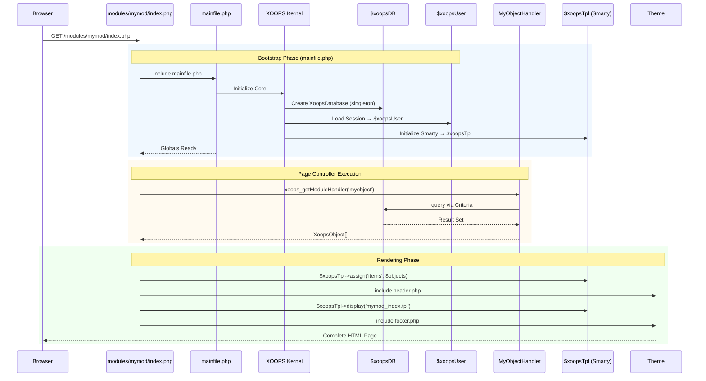

:::note[Acerca de este documento]
Esta página describe la **arquitectura conceptual** de XOOPS que se aplica tanto a las versiones actuales (2.5.x) como a las futuras (4.0.x). Algunos diagramas muestran la visión del diseño por capas.

**Para detalles específicos de la versión:**
- **XOOPS 2.5.x Hoy:** Utiliza `mainfile.php`, variables globales (`$xoopsDB`, `$xoopsUser`), precargas y patrón de controlador
- **XOOPS 4.0 Destino:** Middleware PSR-15, contenedor DI, enrutador - ver [Roadmap](../../07-XOOPS-4.0/XOOPS-4.0-Roadmap.md)
:::

Este documento proporciona una descripción general de la arquitectura del sistema XOOPS, explicando cómo los diversos componentes trabajan juntos para crear un sistema de gestión de contenidos flexible y extensible.

## Descripción General

XOOPS sigue una arquitectura modular que separa las preocupaciones en capas distintas. El sistema está construido alrededor de varios principios fundamentales:

- **Modularidad**: La funcionalidad está organizada en módulos independientes e instalables
- **Extensibilidad**: El sistema se puede extender sin modificar el código central
- **Abstracción**: Las capas de base de datos y presentación están abstraídas de la lógica empresarial
- **Seguridad**: Los mecanismos de seguridad incorporados protegen contra vulnerabilidades comunes

## Capas del Sistema



### 1. Capa de Presentación

La capa de presentación maneja la representación de la interfaz de usuario utilizando el motor de plantillas Smarty.

**Componentes Clave:**
- **Temas**: Estilo visual y diseño
- **Plantillas Smarty**: Representación dinámica de contenido
- **Bloques**: Widgets de contenido reutilizables

### 2. Capa de Aplicación

La capa de aplicación contiene la lógica empresarial, los controladores y la funcionalidad del módulo.

**Componentes Clave:**
- **Módulos**: Paquetes de funcionalidad autónoma
- **Controladores**: Clases de manipulación de datos
- **Precargas**: Escuchadores de eventos y ganchos

### 3. Capa de Dominio

La capa de dominio contiene los objetos empresariales principales y las reglas.

**Componentes Clave:**
- **XoopsObject**: Clase base para todos los objetos de dominio
- **Controladores**: Operaciones CRUD para objetos de dominio

### 4. Capa de Infraestructura

La capa de infraestructura proporciona servicios principales como acceso a base de datos y almacenamiento en caché.

## Ciclo de vida de la solicitud

Entender el ciclo de vida de la solicitud es crucial para un desarrollo efectivo en XOOPS.

### Flujo del controlador de página XOOPS 2.5.x

El XOOPS 2.5.x actual utiliza un patrón de **Controlador de Página** donde cada archivo PHP maneja su propia solicitud. Las variables globales (`$xoopsDB`, `$xoopsUser`, `$xoopsTpl`, etc.) se inicializan durante el bootstrap y están disponibles en toda la ejecución.



### Variables globales clave en 2.5.x

| Variable global | Tipo | Inicializado | Propósito |
|--------|------|-------------|---------|
| `$xoopsDB` | `XoopsDatabase` | Bootstrap | Conexión de base de datos (singleton) |
| `$xoopsUser` | `XoopsUser\|null` | Carga de sesión | Usuario actualmente conectado |
| `$xoopsTpl` | `XoopsTpl` | Inicialización de plantilla | Motor de plantillas Smarty |
| `$xoopsModule` | `XoopsModule` | Carga de módulo | Contexto del módulo actual |
| `$xoopsConfig` | `array` | Carga de configuración | Configuración del sistema |

:::note[Comparación XOOPS 4.0]
En XOOPS 4.0, el patrón del Controlador de Página se reemplaza con un **Pipeline de Middleware PSR-15** y enrutamiento basado en router. Las variables globales se reemplazan con inyección de dependencias. Consulte [Contrato de modo híbrido](../../07-XOOPS-4.0/Specifications/Hybrid-Mode-Contract.md) para garantías de compatibilidad durante la migración.
:::

### 1. Fase de Bootstrap

```php
// mainfile.php es el punto de entrada
include_once XOOPS_ROOT_PATH . '/mainfile.php';

// Inicialización principal
$xoops = Xoops::getInstance();
$xoops->boot();
```

**Pasos:**
1. Cargar configuración (`mainfile.php`)
2. Inicializar cargador automático
3. Configurar manejo de errores
4. Establecer conexión de base de datos
5. Cargar sesión de usuario
6. Inicializar motor de plantillas Smarty

### 2. Fase de enrutamiento

```php
// Enrutamiento de solicitudes al módulo apropiado
$module = $GLOBALS['xoopsModule'];
$controller = $module->getController();
$controller->dispatch($request);
```

**Pasos:**
1. Analizar URL de solicitud
2. Identificar módulo objetivo
3. Cargar configuración del módulo
4. Verificar permisos
5. Enrutar al controlador apropiado

### 3. Fase de ejecución

```php
// Ejecución del controlador
$data = $handler->getObjects($criteria);
$xoopsTpl->assign('items', $data);
```

**Pasos:**
1. Ejecutar lógica del controlador
2. Interactuar con la capa de datos
3. Procesar reglas empresariales
4. Preparar datos de vista

### 4. Fase de representación

```php
// Representación de plantilla
include XOOPS_ROOT_PATH . '/header.php';
$xoopsTpl->display('db:module_template.tpl');
include XOOPS_ROOT_PATH . '/footer.php';
```

**Pasos:**
1. Aplicar diseño de tema
2. Representar plantilla del módulo
3. Procesar bloques
4. Respuesta de salida

## Componentes principales

### XoopsObject

La clase base para todos los objetos de datos en XOOPS.

```php
<?php
class MyModuleItem extends XoopsObject
{
    public function __construct()
    {
        $this->initVar('id', XOBJ_DTYPE_INT, null, false);
        $this->initVar('title', XOBJ_DTYPE_TXTBOX, '', true, 255);
        $this->initVar('content', XOBJ_DTYPE_TXTAREA, '', false);
        $this->initVar('created', XOBJ_DTYPE_INT, time(), false);
    }
}
```

**Métodos clave:**
- `initVar()` - Definir propiedades de objeto
- `getVar()` - Recuperar valores de propiedades
- `setVar()` - Establecer valores de propiedades
- `assignVars()` - Asignación masiva desde matriz

### XoopsPersistableObjectHandler

Maneja operaciones CRUD para instancias de XoopsObject.

```php
<?php
class MyModuleItemHandler extends XoopsPersistableObjectHandler
{
    public function __construct(\XoopsDatabase $db)
    {
        parent::__construct($db, 'mymodule_items', 'MyModuleItem', 'id', 'title');
    }

    public function getActiveItems($limit = 10)
    {
        $criteria = new CriteriaCompo();
        $criteria->add(new Criteria('status', 1));
        $criteria->setSort('created');
        $criteria->setOrder('DESC');
        $criteria->setLimit($limit);

        return $this->getObjects($criteria);
    }
}
```

**Métodos clave:**
- `create()` - Crear instancia de objeto nuevo
- `get()` - Recuperar objeto por ID
- `insert()` - Guardar objeto en la base de datos
- `delete()` - Eliminar objeto de la base de datos
- `getObjects()` - Recuperar múltiples objetos
- `getCount()` - Contar objetos coincidentes

### Estructura del módulo

Cada módulo XOOPS sigue una estructura de directorio estándar:

```
modules/mymodule/
├── class/                  # Clases PHP
│   ├── MyModuleItem.php
│   └── MyModuleItemHandler.php
├── include/                # Archivos de inclusión
│   ├── common.php
│   └── functions.php
├── templates/              # Plantillas Smarty
│   ├── mymodule_index.tpl
│   └── mymodule_item.tpl
├── admin/                  # Área de administración
│   ├── index.php
│   └── menu.php
├── language/               # Traducciones
│   └── english/
│       ├── main.php
│       └── modinfo.php
├── sql/                    # Esquema de base de datos
│   └── mysql.sql
├── xoops_version.php       # Información del módulo
├── index.php               # Entrada del módulo
└── header.php              # Encabezado del módulo
```

## Contenedor de inyección de dependencias

El desarrollo moderno de XOOPS puede aprovechar la inyección de dependencias para una mejor capacidad de prueba.

### Implementación de contenedor básico

```php
<?php
class XoopsDependencyContainer
{
    private array $services = [];

    public function register(string $name, callable $factory): void
    {
        $this->services[$name] = $factory;
    }

    public function resolve(string $name): mixed
    {
        if (!isset($this->services[$name])) {
            throw new \InvalidArgumentException("Service not found: $name");
        }

        $factory = $this->services[$name];

        if (is_callable($factory)) {
            return $factory($this);
        }

        return $factory;
    }

    public function has(string $name): bool
    {
        return isset($this->services[$name]);
    }
}
```

### Contenedor compatible con PSR-11

```php
<?php
namespace Xmf\Di;

use Psr\Container\ContainerInterface;

class BasicContainer implements ContainerInterface
{
    protected array $definitions = [];

    public function set(string $id, mixed $value): void
    {
        $this->definitions[$id] = $value;
    }

    public function get(string $id): mixed
    {
        if (!$this->has($id)) {
            throw new \InvalidArgumentException("Service not found: $id");
        }

        $entry = $this->definitions[$id];

        if (is_callable($entry)) {
            return $entry($this);
        }

        return $entry;
    }

    public function has(string $id): bool
    {
        return isset($this->definitions[$id]);
    }
}
```

### Ejemplo de uso

```php
<?php
// Registro de servicio
$container = new XoopsDependencyContainer();

$container->register('database', function () {
    return XoopsDatabaseFactory::getDatabaseConnection();
});

$container->register('userHandler', function ($c) {
    return new XoopsUserHandler($c->resolve('database'));
});

// Resolución de servicio
$userHandler = $container->resolve('userHandler');
$user = $userHandler->get($userId);
```

## Puntos de extensión

XOOPS proporciona varios mecanismos de extensión:

### 1. Precargas

Las precargas permiten a los módulos conectarse a eventos principales.

```php
<?php
// modules/mymodule/preloads/core.php
class MymoduleCorePreload extends XoopsPreloadItem
{
    public static function eventCoreHeaderEnd($args)
    {
        // Ejecutar cuando finaliza el procesamiento del encabezado
    }

    public static function eventCoreFooterStart($args)
    {
        // Ejecutar cuando comienza el procesamiento del pie de página
    }
}
```

### 2. Complementos

Los complementos extienden funcionalidades específicas dentro de los módulos.

```php
<?php
// modules/mymodule/plugins/notify.php
class MymoduleNotifyPlugin
{
    public function onItemCreate($item)
    {
        // Enviar notificación cuando se crea un elemento
    }
}
```

### 3. Filtros

Los filtros modifican los datos a medida que pasan por el sistema.

```php
<?php
// Ejemplo de filtro de contenido
$myts = MyTextSanitizer::getInstance();
$content = $myts->displayTarea($rawContent, 1, 1, 1);
```

## Mejores prácticas

### Organización del código

1. **Utilizar espacios de nombres** para código nuevo:
   ```php
   namespace XoopsModules\MyModule;

   class Item extends \XoopsObject
   {
       // Implementación
   }
   ```

2. **Seguir carga automática PSR-4**:
   ```json
   {
       "autoload": {
           "psr-4": {
               "XoopsModules\\MyModule\\": "class/"
           }
       }
   }
   ```

3. **Separar preocupaciones**:
   - Lógica de dominio en `class/`
   - Presentación en `templates/`
   - Controladores en raíz del módulo

### Rendimiento

1. **Utilizar almacenamiento en caché** para operaciones costosas
2. **Carga lenta** de recursos cuando sea posible
3. **Minimizar consultas de base de datos** utilizando lotes de criterios
4. **Optimizar plantillas** evitando lógica compleja

### Seguridad

1. **Validar toda entrada** usando `Xmf\Request`
2. **Escapar salida** en plantillas
3. **Utilizar sentencias preparadas** para consultas de base de datos
4. **Verificar permisos** antes de operaciones sensibles

## Documentación relacionada

- [Patrones de diseño](Design-Patterns.md) - Patrones de diseño utilizados en XOOPS
- [Capa de base de datos](../Database/Database-Layer.md) - Detalles de abstracción de base de datos
- [Conceptos básicos de Smarty](../Templates/Smarty-Basics.md) - Documentación del sistema de plantillas
- [Mejores prácticas de seguridad](../Security/Security-Best-Practices.md) - Directrices de seguridad

---

#xoops #arquitectura #principal #diseño #diseño-del-sistema
