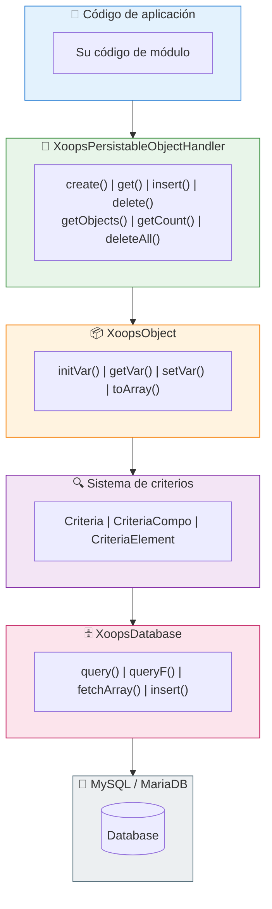

# 🗄️ Capa de base de datos

<span class="version-badge version-25x">2.5.x ✅</span> <span class="version-badge version-40x">4.0.x ✅</span>

> Entendiendo la abstracción de base de datos de XOOPS, persistencia de objetos y construcción de consultas.

:::tip[Asegure su acceso a datos para el futuro]
El patrón controlador/Criterios funciona en ambas versiones. Para prepararse para XOOPS 4.0, considere envolver controladores en [clases del patrón de repositorio](../../03-Module-Development/Patterns/Repository-Pattern.md) para mejor capacidad de prueba. Consulte [Elegir un patrón de acceso a datos](../../03-Module-Development/Choosing-Data-Access-Pattern.md).
:::

---

## Descripción general

La capa de base de datos de XOOPS proporciona una abstracción robusta sobre MySQL/MariaDB, con características como:

- **Patrón de fábrica** - Gestión centralizada de conexión de base de datos
- **Mapeo Objeto-Relacional** - XoopsObject y controladores
- **Construcción de consultas** - Sistema de criterios para consultas complejas
- **Reutilización de conexión** - Conexión única mediante fábrica singleton (no agrupación)

---

## 🏗️ Arquitectura



---

## 🔌 Conexión de base de datos

### Obtener la conexión

```php
// Recomendado: Utilizar instancia de base de datos global
$db = \XoopsDatabaseFactory::getDatabaseConnection();

// Heredado: Variable global (sigue funcionando)
global $xoopsDB;
```

### XoopsDatabaseFactory

El patrón de fábrica asegura que se reutilice una única conexión de base de datos:

```php
<?php

class XoopsDatabaseFactory
{
    private static ?XoopsDatabase $instance = null;

    public static function getDatabaseConnection(): XoopsDatabase
    {
        if (self::$instance === null) {
            self::$instance = new XoopsMySQLDatabase();
        }
        return self::$instance;
    }
}
```

---

## 📦 XoopsObject

La clase base para todos los objetos de datos en XOOPS.

### Definir un objeto

```php
<?php

namespace XoopsModules\MyModule;

class Article extends \XoopsObject
{
    public function __construct()
    {
        $this->initVar('article_id', \XOBJ_DTYPE_INT, null, false);
        $this->initVar('category_id', \XOBJ_DTYPE_INT, 0, true);
        $this->initVar('title', \XOBJ_DTYPE_TXTBOX, '', true, 255);
        $this->initVar('content', \XOBJ_DTYPE_TXTAREA, '', false);
        $this->initVar('author_id', \XOBJ_DTYPE_INT, 0, true);
        $this->initVar('status', \XOBJ_DTYPE_TXTBOX, 'draft', true, 20);
        $this->initVar('views', \XOBJ_DTYPE_INT, 0, false);
        $this->initVar('created', \XOBJ_DTYPE_INT, time(), false);
        $this->initVar('updated', \XOBJ_DTYPE_INT, 0, false);
    }
}
```

### Tipos de datos

| Constante | Tipo | Descripción |
|----------|------|-------------|
| `XOBJ_DTYPE_INT` | Integer | Valores numéricos |
| `XOBJ_DTYPE_TXTBOX` | String | Texto corto (< 255 caracteres) |
| `XOBJ_DTYPE_TXTAREA` | Text | Contenido de texto largo |
| `XOBJ_DTYPE_EMAIL` | Email | Direcciones de correo electrónico |
| `XOBJ_DTYPE_URL` | URL | Direcciones web |
| `XOBJ_DTYPE_FLOAT` | Float | Números decimales |
| `XOBJ_DTYPE_ARRAY` | Array | Matrices serializadas |
| `XOBJ_DTYPE_OTHER` | Mixed | Datos sin procesar |

### Trabajar con objetos

```php
// Crear nuevo objeto
$article = new Article();

// Establecer valores
$article->setVar('title', 'My Article');
$article->setVar('content', 'Article content here...');
$article->setVar('category_id', 5);
$article->setVar('author_id', $xoopsUser->getVar('uid'));

// Obtener valores
$title = $article->getVar('title');           // Valor sin procesar
$titleDisplay = $article->getVar('title', 'e'); // Para editar (entidades HTML)
$titleShow = $article->getVar('title', 's');    // Para mostrar (saneado)

// Asignación masiva desde matriz
$article->assignVars([
    'title' => 'New Title',
    'status' => 'published'
]);

// Convertir a matriz
$data = $article->toArray();
```

---

## 🔧 Controladores de objetos

### XoopsPersistableObjectHandler

La clase controlador administra operaciones CRUD para instancias de XoopsObject.

```php
<?php

namespace XoopsModules\MyModule;

class ArticleHandler extends \XoopsPersistableObjectHandler
{
    public function __construct(\XoopsDatabase $db = null)
    {
        parent::__construct(
            $db,
            'mymodule_articles',  // Nombre de la tabla
            Article::class,       // Clase de objeto
            'article_id',         // Clave primaria
            'title'               // Campo de identificador
        );
    }
}
```

### Métodos del controlador

```php
// Obtener instancia del controlador
$articleHandler = xoops_getModuleHandler('article', 'mymodule');

// Crear nuevo objeto
$article = $articleHandler->create();

// Obtener por ID
$article = $articleHandler->get(123);

// Insertar (crear o actualizar)
$success = $articleHandler->insert($article);

// Eliminar
$success = $articleHandler->delete($article);

// Obtener múltiples objetos
$articles = $articleHandler->getObjects($criteria);

// Obtener recuento
$count = $articleHandler->getCount($criteria);

// Obtener como matriz (clave => valor)
$list = $articleHandler->getList($criteria);

// Eliminar múltiples
$deleted = $articleHandler->deleteAll($criteria);
```

### Métodos de controlador personalizados

```php
<?php

namespace XoopsModules\MyModule;

class ArticleHandler extends \XoopsPersistableObjectHandler
{
    // ... constructor

    /**
     * Obtener artículos publicados
     */
    public function getPublished(int $limit = 10, int $start = 0): array
    {
        $criteria = new \CriteriaCompo();
        $criteria->add(new \Criteria('status', 'published'));
        $criteria->setSort('created');
        $criteria->setOrder('DESC');
        $criteria->setLimit($limit);
        $criteria->setStart($start);

        return $this->getObjects($criteria);
    }

    /**
     * Obtener artículos por categoría
     */
    public function getByCategory(int $categoryId, int $limit = 10): array
    {
        $criteria = new \CriteriaCompo();
        $criteria->add(new \Criteria('category_id', $categoryId));
        $criteria->add(new \Criteria('status', 'published'));
        $criteria->setSort('created');
        $criteria->setOrder('DESC');
        $criteria->setLimit($limit);

        return $this->getObjects($criteria);
    }

    /**
     * Obtener artículos por autor
     */
    public function getByAuthor(int $authorId): array
    {
        $criteria = new \Criteria('author_id', $authorId);
        return $this->getObjects($criteria);
    }

    /**
     * Incrementar recuento de vistas
     */
    public function incrementViews(int $articleId): bool
    {
        $sql = sprintf(
            'UPDATE %s SET views = views + 1 WHERE article_id = %d',
            $this->table,
            $articleId
        );
        return $this->db->queryF($sql) !== false;
    }

    /**
     * Obtener artículos populares
     */
    public function getPopular(int $limit = 5): array
    {
        $criteria = new \CriteriaCompo();
        $criteria->add(new \Criteria('status', 'published'));
        $criteria->setSort('views');
        $criteria->setOrder('DESC');
        $criteria->setLimit($limit);

        return $this->getObjects($criteria);
    }
}
```

---

## 🔍 Sistema de criterios

El sistema de criterios proporciona una forma poderosa y orientada a objetos para construir cláusulas SQL WHERE.

### Criterios básicos

```php
// Igualdad simple
$criteria = new \Criteria('status', 'published');

// Con operador
$criteria = new \Criteria('views', 100, '>=');

// Comparación de columnas
$criteria = new \Criteria('updated', 'created', '>');
```

### CriteriaCompo (Combinación de criterios)

```php
$criteria = new \CriteriaCompo();

// Condiciones AND (predeterminado)
$criteria->add(new \Criteria('status', 'published'));
$criteria->add(new \Criteria('category_id', 5));

// Condiciones OR
$criteria->add(new \Criteria('featured', 1), 'OR');

// Condiciones anidadas
$subCriteria = new \CriteriaCompo();
$subCriteria->add(new \Criteria('author_id', 1));
$subCriteria->add(new \Criteria('author_id', 2), 'OR');
$criteria->add($subCriteria);
```

### Ordenamiento y paginación

```php
$criteria = new \CriteriaCompo();
$criteria->add(new \Criteria('status', 'published'));

// Ordenamiento
$criteria->setSort('created');
$criteria->setOrder('DESC');

// Múltiples campos de ordenamiento
$criteria->setSort('category_id, created');
$criteria->setOrder('ASC, DESC');

// Paginación
$criteria->setLimit(10);    // Elementos por página
$criteria->setStart(20);    // Desplazamiento

// Agrupar por
$criteria->setGroupby('category_id');
```

### Operadores

| Operador | Ejemplo | Salida SQL |
|----------|---------|------------|
| `=` | `new Criteria('status', 'published')` | `status = 'published'` |
| `!=` | `new Criteria('status', 'draft', '!=')` | `status != 'draft'` |
| `>` | `new Criteria('views', 100, '>')` | `views > 100` |
| `>=` | `new Criteria('views', 100, '>=')` | `views >= 100` |
| `<` | `new Criteria('views', 100, '<')` | `views < 100` |
| `<=` | `new Criteria('views', 100, '<=')` | `views <= 100` |
| `LIKE` | `new Criteria('title', '%php%', 'LIKE')` | `title LIKE '%php%'` |
| `NOT LIKE` | `new Criteria('title', '%test%', 'NOT LIKE')` | `title NOT LIKE '%test%'` |
| `IN` | `new Criteria('id', '(1,2,3)', 'IN')` | `id IN (1,2,3)` |
| `NOT IN` | `new Criteria('id', '(1,2,3)', 'NOT IN')` | `id NOT IN (1,2,3)` |

### Ejemplo complejo

```php
// Buscar artículos publicados en categorías específicas,
// con término de búsqueda en el título, ordenados por vistas
$criteria = new \CriteriaCompo();

// El estado debe ser publicado
$criteria->add(new \Criteria('status', 'published'));

// En las categorías 1, 2 o 3
$criteria->add(new \Criteria('category_id', '(1, 2, 3)', 'IN'));

// El título contiene el término de búsqueda
$searchTerm = '%' . $db->escape($searchQuery) . '%';
$criteria->add(new \Criteria('title', $searchTerm, 'LIKE'));

// Creado en los últimos 30 días
$thirtyDaysAgo = time() - (30 * 24 * 60 * 60);
$criteria->add(new \Criteria('created', $thirtyDaysAgo, '>='));

// Ordenar por vistas descendentes
$criteria->setSort('views');
$criteria->setOrder('DESC');

// Paginar
$criteria->setLimit(10);
$criteria->setStart($page * 10);

$articles = $articleHandler->getObjects($criteria);
$totalCount = $articleHandler->getCount($criteria);
```

---

## 📝 Consultas directas

Para consultas complejas que no son posibles con Criterios, utilice SQL directo.

### Consultas seguras (lectura)

```php
$db = \XoopsDatabaseFactory::getDatabaseConnection();

$sql = sprintf(
    'SELECT a.*, c.category_name
     FROM %s a
     LEFT JOIN %s c ON a.category_id = c.category_id
     WHERE a.status = %s
     ORDER BY a.created DESC
     LIMIT %d',
    $db->prefix('mymodule_articles'),
    $db->prefix('mymodule_categories'),
    $db->quoteString('published'),
    10
);

$result = $db->query($sql);

while ($row = $db->fetchArray($result)) {
    // Procesar fila
    echo $row['title'];
}
```

### Consultas de escritura

```php
// Insertar
$sql = sprintf(
    "INSERT INTO %s (title, content, created) VALUES (%s, %s, %d)",
    $db->prefix('mymodule_articles'),
    $db->quoteString($title),
    $db->quoteString($content),
    time()
);
$db->queryF($sql);
$newId = $db->getInsertId();

// Actualizar
$sql = sprintf(
    "UPDATE %s SET views = views + 1 WHERE article_id = %d",
    $db->prefix('mymodule_articles'),
    $articleId
);
$db->queryF($sql);
$affectedRows = $db->getAffectedRows();

// Eliminar
$sql = sprintf(
    "DELETE FROM %s WHERE article_id = %d",
    $db->prefix('mymodule_articles'),
    $articleId
);
$db->queryF($sql);
```

### Escapar valores

```php
// Escape de cadena
$safeString = $db->quoteString($userInput);
// o
$safeString = $db->escape($userInput);

// Entero (sin escape necesario, solo convertir)
$safeInt = (int) $userInput;
```

---

## ⚠️ Mejores prácticas de seguridad

### Siempre escapar entrada del usuario

```php
// NUNCA hagas esto
$sql = "SELECT * FROM articles WHERE title = '$_GET[title]'"; // ¡Inyección SQL!

// HACER esto
$title = $db->escape($_GET['title']);
$sql = "SELECT * FROM articles WHERE title = '$title'";

// O mejor, utilizar Criterios
$criteria = new \Criteria('title', $db->escape($_GET['title']));
```

### Utilizar consultas parametrizadas (XMF)

```php
use Xmf\Database\TableLoad;

// Inserción masiva segura
$tableLoad = new TableLoad('mymodule_articles');
$tableLoad->insert([
    ['title' => 'Article 1', 'content' => 'Content 1'],
    ['title' => 'Article 2', 'content' => 'Content 2'],
]);
```

### Validar tipos de entrada

```php
use Xmf\Request;

$id = Request::getInt('id', 0, 'GET');
$title = Request::getString('title', '', 'POST');
```

---

## 📊 Ejemplo de esquema de base de datos

```sql
-- sql/mysql.sql

CREATE TABLE `{PREFIX}_mymodule_articles` (
    `article_id` INT(11) UNSIGNED NOT NULL AUTO_INCREMENT,
    `category_id` INT(11) UNSIGNED NOT NULL DEFAULT 0,
    `title` VARCHAR(255) NOT NULL DEFAULT '',
    `content` TEXT,
    `author_id` INT(11) UNSIGNED NOT NULL DEFAULT 0,
    `status` VARCHAR(20) NOT NULL DEFAULT 'draft',
    `views` INT(11) UNSIGNED NOT NULL DEFAULT 0,
    `created` INT(11) UNSIGNED NOT NULL DEFAULT 0,
    `updated` INT(11) UNSIGNED NOT NULL DEFAULT 0,
    PRIMARY KEY (`article_id`),
    KEY `category_id` (`category_id`),
    KEY `author_id` (`author_id`),
    KEY `status` (`status`),
    KEY `created` (`created`)
) ENGINE=InnoDB DEFAULT CHARSET=utf8mb4;
```

---

## 🔗 Documentación relacionada

- [Análisis profundo del sistema de criterios](../../04-API-Reference/Kernel/Criteria.md)
- [Patrones de diseño - Fábrica](../Architecture/Design-Patterns.md)
- [Prevención de inyección SQL](../Security/SQL-Injection-Prevention.md)
- [Referencia de API de XoopsDatabase](../../04-API-Reference/Database/XoopsDatabase.md)

---

#xoops #base de datos #orm #criterios #controladores #mysql
