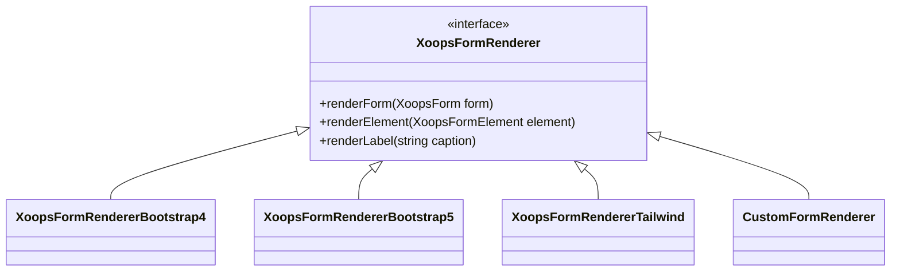

## Descripción General

XOOPS permite la personalización de la renderización de formularios mediante renderizadores personalizados. Esto habilita estilos específicos de tema, mejoras de accesibilidad e integración con marcos de trabajo frontend como Bootstrap o Tailwind CSS.

## Renderización Predeterminada

De manera predeterminada, los formularios XOOPS utilizan la clase `XoopsFormRenderer` que genera HTML básico:

```php
// Renderización predeterminada
$form = new XoopsThemeForm('My Form', 'myform', 'submit.php');
$form->addElement(new XoopsFormText('Name', 'name', 50, 255));
echo $form->render();
```

## Arquitectura de Renderizador Personalizado



## Creación de un Renderizador Personalizado

### Clase Renderizadora Básica

```php
namespace Xoops\Modules\MyModule\Form;

use XoopsFormRenderer;
use XoopsForm;
use XoopsFormElement;

class BootstrapRenderer extends XoopsFormRenderer
{
    public function renderFormStart(XoopsForm $form): string
    {
        $class = $form->getExtra() ?: 'needs-validation';
        return sprintf(
            '<form name="%s" id="%s" action="%s" method="%s" class="%s" %s>',
            $form->getName(),
            $form->getName(),
            $form->getAction(),
            $form->getMethod(),
            $class,
            $form->getExtra()
        );
    }

    public function renderFormEnd(): string
    {
        return '</form>';
    }

    public function renderElement(XoopsFormElement $element): string
    {
        $output = '<div class="mb-3">';

        // Etiqueta
        if ($element->getCaption()) {
            $output .= sprintf(
                '<label for="%s" class="form-label">%s</label>',
                $element->getName(),
                $element->getCaption()
            );
        }

        // Elemento con clases Bootstrap
        $element->setExtra($element->getExtra() . ' class="form-control"');
        $output .= $element->render();

        // Descripción
        if ($element->getDescription()) {
            $output .= sprintf(
                '<div class="form-text">%s</div>',
                $element->getDescription()
            );
        }

        $output .= '</div>';

        return $output;
    }

    public function renderButton(XoopsFormElement $button): string
    {
        $type = $button->getType() === 'submit' ? 'btn-primary' : 'btn-secondary';
        return sprintf(
            '<button type="%s" name="%s" class="btn %s">%s</button>',
            $button->getType(),
            $button->getName(),
            $type,
            $button->getValue()
        );
    }
}
```

### Registro del Renderizador

```php
// En xoops_version.php o bootstrap del módulo
$GLOBALS['xoopsOption']['form_renderer'] = new BootstrapRenderer();

// O establecerlo por formulario
$form = new XoopsThemeForm('My Form', 'myform', 'submit.php');
$form->setRenderer(new BootstrapRenderer());
```

## Renderizadores Incorporados

### Renderizador Bootstrap 4

```php
use Xoops\Form\Renderer\Bootstrap4Renderer;

$form->setRenderer(new Bootstrap4Renderer());
```

### Renderizador Bootstrap 5

```php
use Xoops\Form\Renderer\Bootstrap5Renderer;

$form->setRenderer(new Bootstrap5Renderer([
    'floating_labels' => true,
    'validation_style' => 'tooltip'
]));
```

## Renderización de Elementos Específicos

### Renderizador de Select Personalizado

```php
public function renderSelect(XoopsFormSelect $select): string
{
    $multiple = $select->isMultiple() ? 'multiple' : '';
    $size = $select->getSize();

    $output = sprintf(
        '<select name="%s%s" id="%s" class="form-select" %s size="%d">',
        $select->getName(),
        $multiple ? '[]' : '',
        $select->getName(),
        $multiple,
        $size
    );

    foreach ($select->getOptions() as $value => $label) {
        $selected = in_array($value, (array)$select->getValue()) ? 'selected' : '';
        $output .= sprintf(
            '<option value="%s" %s>%s</option>',
            htmlspecialchars($value),
            $selected,
            htmlspecialchars($label)
        );
    }

    $output .= '</select>';

    return $output;
}
```

### Renderizador de Entrada de Archivo Personalizado

```php
public function renderFile(XoopsFormFile $file): string
{
    return sprintf(
        '<div class="mb-3">
            <label for="%s" class="form-label">%s</label>
            <input type="file" class="form-control" id="%s" name="%s" %s>
        </div>',
        $file->getName(),
        $file->getCaption(),
        $file->getName(),
        $file->getName(),
        $file->getExtra()
    );
}
```

## Integración de Tema

### En Plantilla de Tema

```smarty
{* En form.tpl del tema *}
{foreach $form.elements as $element}
    <div class="form-group {$element.class}">
        {if $element.caption}
            <label class="control-label">{$element.caption}</label>
        {/if}
        {$element.body}
        {if $element.description}
            <span class="help-block">{$element.description}</span>
        {/if}
    </div>
{/foreach}
```

## Mejores Prácticas

1. **Heredar del renderizador base** - Extender `XoopsFormRenderer` para consistencia
2. **Soportar todos los tipos de elemento** - Manejar texto, select, checkbox, radio, etc.
3. **Accesibilidad** - Incluir etiquetas adecuadas, atributos ARIA
4. **Estilos de validación** - Mostrar estados de error apropiadamente
5. **Diseño responsivo** - Asegurar que los formularios funcionen en dispositivos móviles

## Documentación Relacionada

- Descripción General de Formularios
- Referencia de Elementos de Formulario
- Validación de Formularios
- Desarrollo de Temas
